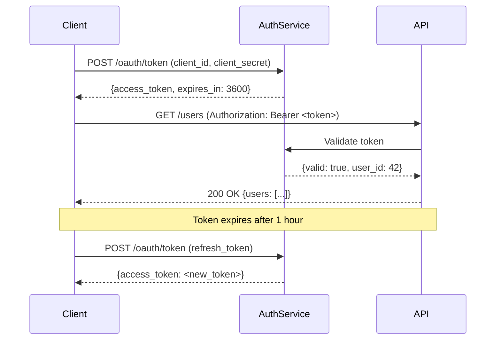
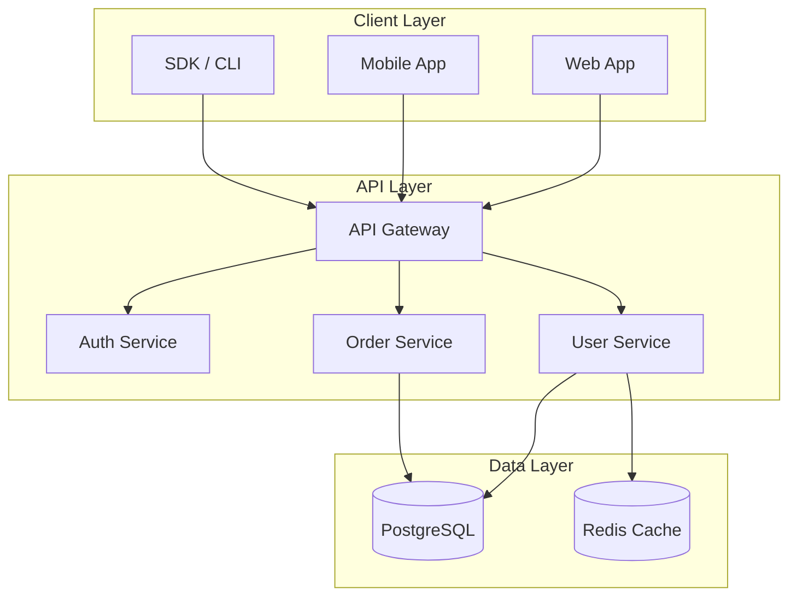

# Documentation as Code

Documentation that lives outside version control is documentation that rots. Docs-as-code applies software engineering practices — version control, code review, automated testing, and CI/CD — to documentation. The goal is documentation that is always accurate, always current, and always discoverable.

## Core Principles

| Principle | Docs-as-code practice |
|-----------|----------------------|
| Version control | Docs live in the same repo as the code they describe |
| Code review | Doc PRs go through the same review process as code PRs |
| Automated testing | Link checkers, spell checkers, and schema validators run in CI |
| Single source of truth | API references generated from code, not written by hand |
| Continuous delivery | Merging to main auto-publishes to the docs site |

## Process

1. **Choose a docs framework** — MkDocs, Docusaurus, Sphinx, or Astro Starlight.
2. **Co-locate docs with code** — `docs/` folder in the repo; README.md at every package level.
3. **Generate API reference automatically** — from docstrings (Python), JSDoc (JS), or OpenAPI (REST).
4. **Use diagram-as-code** — Mermaid or PlantUML in Markdown; diagrams version-control cleanly.
5. **Add a CI docs pipeline** — build, link-check, spell-check on every PR.
6. **Auto-publish on merge** — GitHub Actions → GitHub Pages, Netlify, or Vercel.
7. **Enforce doc standards** — PR template with documentation checklist; no merge without doc update for new features.
8. **Track coverage** — which public APIs have no docstring? Which features have no how-to guide?
9. **Gather feedback** — page ratings, broken-link reports, search analytics.
10. **Archive, don't delete** — deprecated docs get a banner and move to an archive; broken links erode trust.

## Output Format

### MkDocs Site Setup

```yaml
# mkdocs.yml
site_name: "My Project Docs"
site_url:  "https://docs.example.com"
repo_url:  "https://github.com/myorg/myproject"
edit_uri:  "edit/main/docs/"

theme:
  name: material
  palette:
    - scheme: default
      primary: indigo
  features:
    - navigation.tabs
    - navigation.sections
    - search.suggest
    - content.code.copy
    - content.action.edit    # "Edit this page" link

plugins:
  - search
  - mkdocstrings:            # auto-generate API docs from docstrings
      handlers:
        python:
          paths: [src]
          options:
            docstring_style: google
            show_source: true
  - git-revision-date-localized   # show "last updated" on every page

nav:
  - Home: index.md
  - Getting Started:
      - Installation: getting-started/installation.md
      - Quickstart:   getting-started/quickstart.md
  - Guides:
      - guides/authentication.md
      - guides/pagination.md
  - API Reference:
      - api/client.md
      - api/models.md
  - Changelog: changelog.md

markdown_extensions:
  - admonition
  - pymdownx.superfences:
      custom_fences:
        - name: mermaid
          class: mermaid
          format: !!python/name:pymdownx.superfences.fence_code_format
  - pymdownx.tabbed:
      alternate_style: true
```

### Auto-generated API Reference (Python docstrings → mkdocstrings)

```python
# src/myproject/client.py

class APIClient:
    """HTTP client for the MyProject REST API.

    Args:
        base_url: Base URL of the API endpoint.
        api_key:  API key for authentication.
        timeout:  Request timeout in seconds. Defaults to 30.

    Example:
        >>> client = APIClient(
        ...     base_url="https://api.example.com",
        ...     api_key="sk-...",
        ... )
        >>> user = client.users.get(user_id=42)
        >>> print(user.name)
        'Alice'
    """

    def __init__(self, base_url: str, api_key: str, timeout: int = 30) -> None:
        self.base_url = base_url.rstrip("/")
        self._session = requests.Session()
        self._session.headers["Authorization"] = f"Bearer {api_key}"
        self._timeout = timeout

    def get(self, path: str, **params) -> dict:
        """Make a GET request to the API.

        Args:
            path:   URL path relative to base_url (e.g. '/users/42').
            **params: Query parameters appended to the URL.

        Returns:
            Parsed JSON response body as a dict.

        Raises:
            APIError: If the response status is 4xx or 5xx.
            TimeoutError: If the request exceeds the configured timeout.

        Example:
            >>> data = client.get('/users', page=1, per_page=20)
        """
        resp = self._session.get(
            f"{self.base_url}{path}",
            params=params,
            timeout=self._timeout,
        )
        resp.raise_for_status()
        return resp.json()
```

```markdown
<!-- docs/api/client.md -->
# API Client

::: myproject.client.APIClient
    options:
      show_root_heading: true
      show_source: true
      members:
        - __init__
        - get
        - post
        - patch
        - delete
```

### Diagram-as-Code with Mermaid

```markdown
<!-- docs/guides/authentication.md -->

## Authentication Flow

The following sequence shows how a client obtains and uses an access token:



## System Architecture


```

### CI Pipeline for Docs

```yaml
# .github/workflows/docs.yml
name: Docs

on:
  push:
    branches: [main]
  pull_request:
    paths: ['docs/**', 'mkdocs.yml', 'src/**/*.py']

jobs:
  build-and-check:
    runs-on: ubuntu-latest
    steps:
      - uses: actions/checkout@v4
        with: { fetch-depth: 0 }   # needed for git-revision-date plugin

      - uses: actions/setup-python@v5
        with: { python-version: '3.12' }

      - name: Install deps
        run: pip install mkdocs-material mkdocstrings[python] mkdocs-git-revision-date-localized

      - name: Build docs
        run: mkdocs build --strict   # fail on warnings

      - name: Check links
        uses: lycheeverse/lychee-action@v1
        with:
          args: --verbose --no-progress 'site/**/*.html'
          fail: true

      - name: Spell check
        uses: streetsidesoftware/cspell-action@v6
        with:
          files: "docs/**/*.md"
          config: .cspell.json

  deploy:
    needs: build-and-check
    if: github.ref == 'refs/heads/main'
    runs-on: ubuntu-latest
    permissions:
      pages: write
      id-token: write
    steps:
      - uses: actions/checkout@v4
        with: { fetch-depth: 0 }
      - run: pip install mkdocs-material mkdocstrings[python] && mkdocs build
      - uses: actions/deploy-pages@v4
```

### PR Template with Docs Checklist

```markdown
<!-- .github/pull_request_template.md -->

## Documentation

- [ ] New public APIs have docstrings with Args, Returns, and an Example
- [ ] New features have a how-to guide in `docs/guides/`
- [ ] Changed behaviour is reflected in the relevant guide
- [ ] New configuration options are added to the reference docs
- [ ] Architecture changes include an updated diagram

## For docs-only PRs

- [ ] Ran `mkdocs serve` locally and verified rendering
- [ ] All internal links resolve correctly
- [ ] Code examples are tested and runnable
```

### OpenAPI → Docs Auto-generation

```bash
# Generate static HTML docs from OpenAPI spec
npx @redocly/cli build-docs openapi.yaml --output docs/api-reference.html

# Or serve interactively
npx @redocly/cli preview-docs openapi.yaml

# Validate the spec first
npx @redocly/cli lint openapi.yaml

# Generate SDK docs from OpenAPI
npx @openapitools/openapi-generator-cli generate \
  -i openapi.yaml -g python -o sdk/ \
  --additional-properties=packageName=myproject

# Auto-check that code matches the spec (in CI)
schemathesis run openapi.yaml --base-url http://localhost:8000 --checks all
```

### Docs Coverage Check

```python
#!/usr/bin/env python3
"""Check that all public functions and classes have docstrings."""
import ast, sys
from pathlib import Path

def check_docstring_coverage(src_dir: str) -> list[str]:
    missing = []
    for path in Path(src_dir).rglob("*.py"):
        if "_test" in path.name or path.name.startswith("_"):
            continue
        tree = ast.parse(path.read_text())
        for node in ast.walk(tree):
            if isinstance(node, (ast.FunctionDef, ast.AsyncFunctionDef, ast.ClassDef)):
                if not node.name.startswith("_"):   # public only
                    if not (node.body and isinstance(node.body[0], ast.Expr)
                            and isinstance(node.body[0].value, ast.Constant)):
                        missing.append(f"{path}:{node.lineno} {node.name}")
    return missing

missing = check_docstring_coverage("src/")
if missing:
    print(f"Missing docstrings ({len(missing)}):")
    for m in missing[:20]:
        print(f"  {m}")
    sys.exit(1)
print(f"All public APIs have docstrings.")
```

## Anti-Patterns to Avoid

| Anti-pattern | Problem | Fix |
|-------------|---------|-----|
| Docs in a separate repo | Docs drift from code; PRs miss doc updates | Co-locate docs and code in the same repo |
| Hand-written API reference | Always stale; wrong parameters | Generate from docstrings or OpenAPI; never write by hand |
| No CI for docs | Broken links and build errors go unnoticed | Run `mkdocs build --strict` and link checker in CI |
| Deleting old docs | Users following old tutorials hit 404s | Archive with deprecation banner; redirect old URLs |
| No "Edit this page" link | Friction to contribute fixes | Enable edit links pointing to the source file |
| Screenshots of code | Cannot be copied; gets stale fast | Always use code blocks, never screenshots |

## Rules

- **Docs live in the repo** — documentation that is not version-controlled with the code it describes will drift.
- **Generate, don't hand-write API reference** — if the source of truth is code, generate from it.
- **CI must build and link-check docs** — a docs build failure is as bad as a test failure.
- **Every public API needs a docstring with an example** — enforce this in CI with a coverage check.
- **Diagrams-as-code only** — Mermaid or PlantUML in Markdown; no binary image files for architecture diagrams.
- **New feature = new guide** — no feature ships without a how-to guide; add to the PR checklist.
- **No broken links** — lychee or htmltest in CI; broken links destroy trust faster than any other issue.
- **Auto-publish on merge** — docs CI deploys to production on every merge to main; no manual steps.
- **Archive, never delete** — deprecated content gets a banner and redirect; never return 404 for old URLs.
- **Measure docs health** — track coverage (APIs with docstrings %), freshness (last updated dates), and search-no-result rate.
