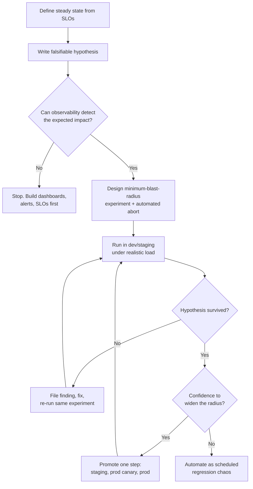

# Chaos Testing Infra

Chaos engineering is the discipline of running controlled failure experiments to learn how a system actually behaves under stress — before an incident teaches you the expensive way. It is not "breaking things in prod for fun": every experiment is a falsifiable hypothesis about steady-state behaviour, run with the smallest blast radius that can disprove it, guarded by automated abort conditions, and concluded with either a documented pass or a filed reliability fix.

The payoff is asymmetric. A pod-kill experiment that surfaces a missing PodDisruptionBudget costs twenty minutes in staging; discovering the same gap during a node-pool upgrade at peak traffic costs an incident, an RCA, and customer trust. Mature teams treat chaos findings as the cheapest incident reports they will ever get.

## When NOT to Use This

Chaos engineering has hard prerequisites. Running it without them is malpractice, not rigour:

- **No observability baseline.** If you lack dashboards, alerts, and SLOs that would detect the fault's impact, you are injecting failures you cannot see. Build monitoring first — an experiment you cannot measure produces risk and zero learning.
- **Known-fragile systems.** If the team already has a backlog of unresolved reliability tickets, you do not need experiments to find weaknesses — fix the known ones first.
- **No redundancy to test.** Killing the only replica of a single-instance service proves nothing you did not already know. Chaos validates resilience mechanisms; it cannot substitute for them.
- **During incidents, freezes, or peak events.** Never run experiments while an incident is open, during change freezes, or on Black Friday. Scheduled chaos must auto-pause when an incident is declared.
- **Without organisational cover.** The first production experiment needs explicit sign-off from service owners and leadership. Surprise chaos destroys the trust the practice depends on.

## Decision Framework

### Choice 1 — Tooling

| Tool | Runs against | Strengths | Honest trade-offs |
|---|---|---|---|
| **Chaos Mesh** (CNCF) | Kubernetes | Richest K8s fault set as plain CRDs (PodChaos, NetworkChaos, StressChaos, IOChaos, DNSChaos, HTTPChaos); `Schedule`/`Workflow` for automation; free | K8s-only; cannot fault managed cloud services (no RDS failover); steady-state checks live in your monitoring, not the tool |
| **LitmusChaos** (CNCF) | Kubernetes | Built-in probes (Prometheus/HTTP/cmd/k8s) validate steady state *inside* the run and fail the experiment automatically; ChaosHub experiment library; resilience scoring | Heavier control plane than Chaos Mesh; network faults less granular |
| **AWS FIS** | AWS services | The only way to fault the cloud itself: EC2 stop, AZ network disruption, RDS reboot/failover, EKS/ECS faults, API error/throttle injection; IAM-scoped; CloudWatch-alarm stop conditions | AWS-only; billed per action-minute; weak at fine-grained app-level faults |
| **Gremlin** | Hosts, containers, K8s (SaaS) | Cross-platform agents, org-wide RBAC, one-click halt-all, built-in game-day tooling and support | Commercial licence; agent footprint; closed source |
| **tc / stress-ng / Toxiproxy** | Single host, dev | Zero-install fault primitives for local reproduction of a finding | No safety rails, no scoping, no audit trail — dev machines only |

**Default:** Chaos Mesh for Kubernetes workloads, AWS FIS layered on top for cloud-infrastructure faults (AZ loss, managed-database failover). Pick LitmusChaos over Chaos Mesh when you want the tool itself to enforce steady-state probes rather than trusting operators to watch dashboards. Pick Gremlin when you need one platform across VMs and clusters plus vendor support for a large organisation.

### Choice 2 — Where to run

| Environment | What it proves | What it cannot prove | Precondition |
|---|---|---|---|
| **Dev / kind cluster** | The experiment spec itself works; abort path works | Anything about real behaviour — no realistic load or data | None |
| **Staging + synthetic load** | Failure-handling logic: retries, timeouts, failover paths | Real traffic patterns, real data volume, real dependency behaviour | Load generator producing production-shaped traffic |
| **Production canary** (one pod, small % of traffic) | Real behaviour at minimal exposure | Capacity-level effects (does the fleet absorb 33% loss?) | Staging pass + automated abort + service-owner sign-off |
| **Production** | The truth | — | Canary pass + game-day protocol the first time |

Staging-only chaos is rehearsal, not proof — staging never has production's traffic, data skew, or config drift. The progression exists to earn production, not to avoid it.

### Choice 3 — Cadence and automation

| Mode | When to choose | Trade-off |
|---|---|---|
| **Game day** (manual, scheduled, whole team) | First experiments on a system; cross-team faults (AZ loss); training on-call | High cost per run — a few per quarter at most |
| **Scheduled chaos** (Chaos Mesh `Schedule`, FIS + EventBridge) | Regression-testing resilience that already passed a game day | Requires trustworthy automated abort; must auto-pause during incidents |
| **CI-integrated chaos** (experiment as a pipeline gate) | Guarding a specific fixed weakness against re-introduction | Only viable for fast, deterministic experiments in ephemeral envs |

Sequence, not menu: game day first, then automate what passed, then gate what regressed once.

## Experiment Lifecycle



## Process

1. **Pick the target and the fear.** Choose one service and the specific failure the team is most uncertain about ("what happens when the DB replica dies?"). Uncertainty, not convenience, selects experiments.
2. **Define steady state from SLOs.** Pin 2–4 measurable signals — p99 latency, error rate, a business metric (orders/min). Record current baseline values and the dashboard that shows them.
3. **Write the hypothesis.** One sentence, falsifiable, with numbers: "If we kill 1 of 6 checkout-api pods, p99 stays under 800 ms and error rate under 1% for the full 2-minute window."
4. **Design the minimum experiment.** Smallest scope that can falsify the hypothesis: one pod, one dependency edge, one AZ. Fix duration (minutes, not hours).
5. **Define abort conditions before injection.** Automated (alert-triggered halt), manual (any on-call page, any customer report), and a written rollback ("delete the CR, confirm rollout"). Test the abort path itself in dev.
6. **Generate realistic load.** Chaos on an idle system proves nothing — drive staging with production-shaped traffic at realistic RPS before injecting anything.
7. **Run and observe.** One experiment at a time. Watch steady-state signals live; capture timestamps of injection, impact, detection, and recovery.
8. **Compare against the hypothesis.** Held → record the pass with evidence. Falsified → you found a weakness; that is the win condition, not a failure.
9. **File the finding as reliability work.** Ticket with severity, owner, and the experiment ID that will verify the fix. Re-run after the fix lands; a finding is closed only when the same experiment passes.
10. **Promote or automate.** Passing experiments graduate one environment step, or become scheduled regression chaos once they pass in production.

## Steady-State Hypothesis Template

```text
Experiment:    checkout-pod-kill-001
Steady state:  p99 checkout latency < 800 ms AND HTTP 5xx rate < 0.5 %
               AND order events >= 100/min  (Grafana: dash/checkout-slo)
Fault:         pod-kill, 1 of 6 replicas, app=checkout-api, ns=checkout
Hypothesis:    steady state holds for the full window; capacity restored < 60 s
Blast radius:  mode=one, duration=2m, staging, synthetic load 300 RPS
Abort:         AUTO  5xx > 2 % for 60 s  (Alertmanager -> halt webhook)
               MANUAL any on-call page, any customer-visible impact
Rollback:      kubectl delete podchaos checkout-pod-kill-001 -n chaos
               kubectl rollout status deploy/checkout-api -n checkout
Owner / date:  payments-platform / 2026-07-28 14:00 UTC
```

A hypothesis without numbers is a guess. A hypothesis without a dashboard link is unverifiable. Write both before touching any tool.

## Blast-Radius Controls

- **Scope by selector, never cluster-wide:** namespace + label selectors; `mode: one` or `mode: fixed-percent` with a low value — never `mode: all` outside dev.
- **Cap duration** in the spec itself (`duration: "2m"`) so an orphaned controller cannot leave a fault running.
- **Platform guardrails:** install Chaos Mesh with `controllerManager.enableFilterNamespace=true` so only namespaces annotated `chaos-mesh.org/inject=enabled` can be targeted — production namespaces stay untargetable until deliberately opted in. In AWS FIS, scope the experiment role's IAM policy to resource tags so the template physically cannot touch untagged resources.
- **Stop conditions wired to alarms:** FIS `stopConditions` on CloudWatch alarms; Litmus probes with `stopOnFailure: true`; Alertmanager webhook that deletes chaos CRs for Chaos Mesh.
- **Exclusion first, inclusion later:** start with an explicit allowlist of chaos-eligible services; everything else is out of bounds by default.

## Fault Catalogue

| Fault | Simulates | Tool / action | Typical weakness found |
|---|---|---|---|
| Pod kill | Crash, eviction, node drain, deploys | Chaos Mesh `PodChaos: pod-kill`; Litmus `pod-delete` | Missing PDB; cold-start traffic before warm-up; no graceful shutdown |
| Network latency | Slow dependency, cross-region hop | Chaos Mesh `NetworkChaos: delay`; Gremlin latency | Missing timeouts; thread/connection-pool exhaustion; retry storms |
| Network partition | Split brain, AZ isolation | Chaos Mesh `NetworkChaos: partition`; FIS `aws:network:disrupt-connectivity` | Quorum misconfiguration; clients that hang instead of failing fast |
| Resource exhaustion | Noisy neighbour, leak, traffic spike | Chaos Mesh `StressChaos`; stress-ng | Missing limits/requests; HPA scaling too late; OOM-kill loops |
| AZ failure | Zone outage | AWS FIS subnet disruption + EC2 stop | Single-AZ NAT/gateway; cross-AZ data loss; failover slower than believed |
| Dependency failure | Third-party or internal API down | Chaos Mesh `HTTPChaos`; Toxiproxy; FIS API error injection | No circuit breaker; no fallback; cascading failure |
| DNS failure | Resolver outage, bad record | Chaos Mesh `DNSChaos` | No DNS caching; hard-coded resolver assumptions |
| Disk pressure / IO faults | Full disk, degraded EBS | Chaos Mesh `IOChaos`; fallocate | Logs fill root volume; DB behaviour on write failure unknown |

## Tooling in Practice

### Chaos Mesh — weekly pod-kill regression (Schedule wrapping PodChaos)

```yaml
apiVersion: chaos-mesh.org/v1alpha1
kind: Schedule
metadata:
  name: checkout-pod-kill-weekly
  namespace: chaos
spec:
  schedule: "0 14 * * 2"          # Tuesdays 14:00 UTC — business hours, on purpose
  concurrencyPolicy: Forbid
  historyLimit: 5
  type: PodChaos
  podChaos:
    action: pod-kill
    mode: one                      # exactly one pod — smallest falsifying radius
    selector:
      namespaces: [checkout]
      labelSelectors:
        app: checkout-api
    duration: "2m"
```

### Chaos Mesh — inject 300 ms latency on one dependency edge

```yaml
apiVersion: chaos-mesh.org/v1alpha1
kind: NetworkChaos
metadata:
  name: payments-db-latency
  namespace: chaos
spec:
  action: delay
  mode: all
  selector:
    namespaces: [payments]
    labelSelectors:
      app: payments-api
  direction: to
  target:                          # only traffic toward postgres is delayed
    mode: all
    selector:
      namespaces: [payments]
      labelSelectors:
        app: postgres
  delay:
    latency: "300ms"
    jitter: "50ms"
    correlation: "25"
  duration: "10m"
```

### LitmusChaos — pod-delete with an in-run steady-state probe

```yaml
apiVersion: litmuschaos.io/v1alpha1
kind: ChaosEngine
metadata:
  name: checkout-pod-delete
  namespace: checkout
spec:
  engineState: active
  appinfo:
    appns: checkout
    applabel: app=checkout-api
    appkind: deployment
  chaosServiceAccount: litmus-admin
  experiments:
    - name: pod-delete
      spec:
        components:
          env:
            - name: TOTAL_CHAOS_DURATION
              value: "120"
            - name: CHAOS_INTERVAL
              value: "20"
            - name: PODS_AFFECTED_PERC
              value: "16"          # 1 of 6 replicas
            - name: FORCE
              value: "false"       # graceful delete — tests shutdown handling
        probes:
          - name: checkout-p99-slo
            type: promProbe
            mode: Continuous
            promProbe/inputs:
              endpoint: http://prometheus.monitoring.svc:9090
              query: histogram_quantile(0.99, sum(rate(http_request_duration_seconds_bucket{service="checkout-api"}[1m])) by (le))
              comparator:
                criteria: "<"
                value: "0.8"       # steady state: p99 < 800 ms, checked during chaos
            runProperties:
              probeTimeout: 10s
              interval: 15s
              retry: 1
              stopOnFailure: true  # probe failure aborts the experiment
```

### AWS FIS — AZ connectivity loss with an alarm-backed stop condition

```json
{
  "description": "payments staging: full connectivity loss for us-east-1a subnets",
  "targets": {
    "az-a-subnets": {
      "resourceType": "aws:ec2:subnet",
      "resourceTags": { "chaos-eligible": "true", "env": "staging" },
      "filters": [
        { "path": "AvailabilityZone", "values": ["us-east-1a"] }
      ],
      "selectionMode": "ALL"
    }
  },
  "actions": {
    "disrupt-az-a": {
      "actionId": "aws:network:disrupt-connectivity",
      "parameters": { "duration": "PT10M", "scope": "all" },
      "targets": { "Subnets": "az-a-subnets" }
    }
  },
  "stopConditions": [
    {
      "source": "aws:cloudwatch:alarm",
      "value": "arn:aws:cloudwatch:us-east-1:123456789012:alarm:payments-canary-failure"
    }
  ],
  "roleArn": "arn:aws:iam::123456789012:role/fis-payments-experiments",
  "tags": { "Name": "payments-az-failure" }
}
```

```bash
aws fis create-experiment-template --cli-input-json file://az-failure.json
aws fis start-experiment --experiment-template-id EXT123456789abcdef
```

## Worked Example 1 — Checkout Pod-Kill Graduation

**System:** checkout-api, 6 replicas on EKS, ~450 RPS peak, SLO 99.9% of requests under 800 ms.

**Hypothesis:** killing 1 of 6 pods keeps p99 < 800 ms and 5xx < 1% throughout a 2-minute window; capacity restored within 60 s.

**Design decisions and rationale:**
- `mode: one`, not `fixed-percent: 33` — the first run needs the smallest radius that can still falsify the hypothesis; if one pod hurts, a third of the fleet certainly will.
- Staging with 300 RPS synthetic load, not idle staging — at 4 RPS idle traffic the surviving pods absorb anything; the experiment would "pass" while proving nothing.
- `FORCE: "false"` (graceful delete) first — it tests the shutdown path deploys actually use; SIGKILL comes later as a separate experiment.

**Run 1 (staging):** hypothesis falsified. 5xx spiked to 4.1% for ~40 s. Timeline showed the replacement pod passed readiness at t+12 s but returned errors until t+20 s. Two root causes: the readiness probe hit `/healthz` (process-up) rather than a check that the DB connection pool was warm, and there was no PodDisruptionBudget, so a simultaneous node drain could have taken multiple replicas.

**Fixes filed:** readiness endpoint now validates a pooled DB connection; `preStop` sleep of 5 s to drain in-flight requests during endpoint propagation; `PodDisruptionBudget` with `minAvailable: 5`.

**Run 2 (staging):** 5xx peaked at 0.3%, p99 at 610 ms. Pass.

**Run 3 (prod canary):** one pod, Tuesday 14:00 UTC with the team watching, Alertmanager-wired auto-abort armed. Pass — 5xx 0.2%. Promoted to the weekly Chaos Mesh `Schedule` above. Total cost: three 20-minute sessions; value: a class of deploy-time and node-drain incidents removed.

## Worked Example 2 — Payments AZ Failure on AWS

**System:** payments platform, ASG across 3 AZs behind an ALB, RDS PostgreSQL Multi-AZ, SLO 99.95% monthly.

**Hypothesis:** losing us-east-1a removes ~33% of compute; the ALB reroutes within 60 s, RDS fails over within 120 s, and total error-budget burn stays under 2% of the monthly budget.

**Design decisions and rationale:**
- Ran in a staging clone with production-shaped load first — an AZ experiment touches every service in the VPC, so the blast radius is inherently wide and must be earned.
- Duration `PT10M` because the hypothesis includes RDS failover plus application recovery; a 2-minute window would end before the interesting part.
- Stop condition on a **synthetic-canary alarm** (end-to-end payment success), not on CPU or host counts — customer-visible failure is the only abort signal that matters, and infra metrics look "healthy" while customers fail.
- Targeted subnets via both a `chaos-eligible: "true"` tag and an AZ filter, so the template physically cannot select untagged subnets even if someone edits the filter.

**Run 1 (staging):** hypothesis falsified twice over.
1. Error rate hit ~40% cluster-wide, not the expected ~33% blip: all three AZs egressed through a single NAT gateway in us-east-1a, so instances in 1b/1c lost third-party payment-gateway connectivity too.
2. RDS failed over in 95 s (within hypothesis), but the application error rate stayed elevated for ~5 minutes afterwards — the connection pool held dead connections to the old primary until they aged out.

**Fixes filed:** one NAT gateway per AZ with AZ-local route tables (finding severity: sev-2, would have been a full outage of payments during a real AZ event); pool `maxLifetime` lowered to 60 s and TCP keepalives enabled so failover is detected in seconds.

**Run 2 (staging):** peak error rate 6% for 80 s during failover, recovery inside the window. Pass. Production run scheduled as a quarterly game day — AZ-level faults stay manual; the cost of a wrong assumption is too high for unattended automation.

## Game Days

A game day is a scheduled session where the team runs experiments live, together. Roles, all assigned in advance:

| Role | Responsibility |
|---|---|
| Conductor | Owns the runbook, calls go/no-go and abort |
| Operator | The only person who touches injection tooling |
| Observer/scribe | Watches dashboards, timestamps everything (injection, first alert, detection, mitigation, recovery) |
| Comms | Posts status to the incident channel; interfaces with on-call if pages fire |

Agenda: 30 min brief (hypotheses, abort criteria, roles) → 60–90 min of experiments, one at a time with recovery confirmed between each → 30 min immediate debrief while memory is fresh. The scribe's timeline becomes the findings report. Measure the team, not just the system: time-to-detect and time-to-diagnose are game-day outputs as much as system behaviour is.

## Turning Findings into Reliability Work

An experiment that surfaces a weakness and files nothing is entertainment. Keep a findings ledger:

| ID | Experiment | Finding | Severity | Fix ticket | Verified by re-run |
|---|---|---|---|---|---|
| CH-014 | checkout-pod-kill-001 | Readiness passes before pool warm-up | sev-3 | PAY-2211 | 2026-07-30 pass |
| CH-015 | checkout-pod-kill-001 | No PDB on checkout-api | sev-3 | PAY-2212 | 2026-07-30 pass |
| CH-021 | payments-az-failure | Single-AZ NAT gateway | sev-2 | INFRA-891 | 2026-08-14 pass |
| CH-022 | payments-az-failure | Pool holds dead conns 5 min post-failover | sev-2 | PAY-2240 | 2026-08-14 pass |

Rules for the ledger: severity uses the same scale as incidents (a sev-2 finding is a sev-2 incident you got for free); fixes enter the normal backlog with that priority, not a side list; a finding closes only when the *same experiment* re-runs and passes; recurring findings across services (missing PDBs, missing timeouts) become platform-level fixes — admission policies, paved-road defaults — not per-team tickets.

## Anti-Patterns

| Symptom | Why it fails | Do instead |
|---|---|---|
| Chaos before observability | Faults injected that nobody can see or measure; pure risk, zero learning | Dashboards, alerts, and SLOs first; the mermaid gate is real |
| First experiment in production | Real customer impact before any learning | Graduate dev → staging → canary → prod, one step per pass |
| No steady-state definition | "It seemed fine" — unfalsifiable, so nothing was tested | Numeric steady state with a dashboard link, written before the run |
| Abort criteria in someone's head | Runaway experiment becomes a real incident | Automated halt wired to alarms; test the abort path in dev first |
| Chaos on an idle system | Surviving capacity absorbs everything; false confidence | Production-shaped synthetic load before injection |
| Multiple simultaneous faults early | Attribution impossible; findings are guesses | One variable per experiment; compound scenarios only after singles pass |
| Running at 3 a.m. to "reduce risk" | Nobody observes, nobody learns, detection times are fake | Business hours with the team watching; the safety comes from abort automation |
| Findings discussed, never filed | Same weakness resurfaces as a real incident | Ledger + tickets at incident severity + verification re-run |
| Chaos as a one-off audit | Regressions reappear within quarters | Passed experiments become scheduled regression chaos |
| Blaming the on-call for a slow response | Team learns to fear game days and hide problems | Blameless framing; time-to-detect is a system property being measured |

## Checklist

```text
BEFORE
[ ] Steady state defined numerically, baseline recorded, dashboard linked
[ ] Hypothesis written and falsifiable (numbers, duration, recovery target)
[ ] Observability confirmed to detect the expected impact
[ ] Blast radius minimised: selectors, mode, duration cap in the spec
[ ] Automated abort wired to an alarm and TESTED in dev
[ ] Manual abort + written rollback steps; owner named
[ ] Environment step earned (previous stage passed)
[ ] Service owner informed; no open incident, no change freeze
[ ] Realistic load running (staging) or traffic window chosen (prod)

DURING
[ ] One experiment at a time; operator role assigned
[ ] Timestamps captured: injection, impact, first alert, detection, recovery
[ ] Steady-state signals watched live for the full window

AFTER
[ ] Result vs hypothesis recorded with evidence (graphs, timeline)
[ ] Findings filed in the ledger with incident-scale severity + owner
[ ] Fix tickets in the normal backlog
[ ] Re-run scheduled to verify each fix
[ ] Pass promoted: next environment step, or scheduled as regression chaos
```

## 10 Rules

1. **No chaos without observability.** If your monitoring cannot see the failure, the experiment produces risk and nothing else. This rule has no exceptions.
2. **Steady state is a number from an SLO, not a vibe.** "The system was fine" is not a result; "p99 held at 610 ms against an 800 ms bound" is.
3. **Smallest blast radius that can falsify the hypothesis.** One pod before a percentage, one edge before a mesh, one AZ never before staging.
4. **Abort is automated, alarm-driven, and tested before injection.** An untested abort path is a second hypothesis you did not mean to run.
5. **Staging-only chaos is rehearsal, not proof.** The progression exists to earn production, not to avoid it — a programme that never reaches prod validates nothing about prod.
6. **Run during business hours with the team watching.** Safety comes from automation and small radius, not from darkness. 3 a.m. chaos just means nobody learns.
7. **One variable at a time.** Compound failure scenarios are legitimate — after every component fault has passed alone.
8. **Every experiment ends in an artifact.** A documented pass with evidence, or a ledger finding with a ticket. Verbal findings are lost findings.
9. **A finding is closed by a re-run, not a merge.** The fix ships, then the same experiment passes — only then does confidence actually increase.
10. **Chaos measures systems and processes, never people.** Time-to-detect is a property of your alerting, not of whoever was on call. The moment chaos becomes punishment, people hide weaknesses — and the practice dies.
