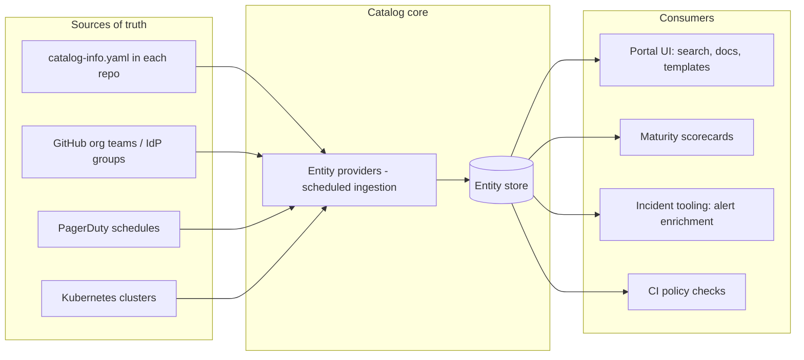

# Service Catalog & Internal Developer Portal

A service catalog is the machine-readable answer to four questions that come up constantly and matter most at 3am: what services exist, who owns each one, what does it depend on, and where are its runbook, dashboards, and on-call rotation. An internal developer portal (IDP) is the product built on top of that data — search, scaffolding templates, docs, and scorecards. The catalog is the database; the portal is the UI. Most efforts fail because teams build the UI and neglect the database: a beautiful portal over stale data is worse than a spreadsheet, because people trust it and it lies.

The economics are simple. During an incident, every minute spent asking "who owns payments-reconciler?" in Slack is added MTTR. During planning, every unmapped dependency is an unpriced risk. During audits, every orphaned service is a finding. A catalog that is accurate and enforced converts those recurring costs into a one-time build plus a CI check.

**When NOT to use this:**

- **Under ~15 services and one or two teams.** A `SERVICES.md` table in your monorepo beats any portal. You know who owns what; the catalog is ceremony.
- **When nobody will own the catalog itself.** A catalog with no owning team rots in about two quarters. If you cannot name the platform engineer (or the fraction of one) responsible for ingestion, enforcement, and orphan triage, do not start.
- **When the org chart is mid-reorg.** Ownership metadata written during a reorg is stale on arrival. Wait for teams to settle, or catalog only the stable core.
- **As a substitute for fixing ownership.** The catalog records ownership; it cannot create it. If half your services genuinely have no owner, run the ownership assignment exercise first — the catalog then makes the result durable.

## Decision Framework

Four decisions determine whether your catalog lives or rots. Make them explicitly, in this order.

### 1. Build (Backstage) vs. buy (commercial IDP) vs. stay lightweight

| Option | Best when | Honest trade-offs |
|---|---|---|
| **Backstage** (open source, CNCF, created at Spotify) | 50+ services, existing platform team, need deep customization (custom plugins, internal integrations) | Free license, expensive ownership: realistically 0.5–2 platform engineers *forever* for upgrades, plugin maintenance, and TypeScript/React work. Time-to-value measured in months. Roadie offers hosted Backstage if you want the model without the ops. |
| **Commercial IDP** — Cortex, OpsLevel, Port (also Atlassian Compass) | No platform headcount to spare, scorecards/maturity programs are the primary goal, need value in days | Per-seat pricing that scales with org size; less customizable than owning the code; your catalog schema lives in a vendor. Cortex and OpsLevel are strongest on scorecards; Port is strongest on flexible data modeling (blueprints) and self-service actions. |
| **Git-native lightweight** — YAML files in repos + a generated static page | 15–50 services, one platform-curious engineer, portal features not yet needed | Cheapest and most durable data model (the YAML is the product); no search/scaffolding/scorecards UI. Fine as a stepping stone — the per-repo YAML migrates cleanly into Backstage or Port later. |

### 2. Where does the truth live?

| Model | How it works | Trade-off |
|---|---|---|
| **YAML in each service repo** (recommended default) | `catalog-info.yaml` beside the code; catalog ingests from git | Updates ride the same PR as the change that made them necessary; CI can enforce. Slightly more friction for teams. |
| **API-pushed from systems of record** | Terraform/CD/HR systems push entities via the catalog API | Great for derived facts (deploys, clusters, teams); terrible as the *only* source — nobody reviews pushed data. |
| **Hand-edited in a portal UI** | Admins type entries into the vendor UI | Fastest day one, dead by month six. Never make this the primary write path. |

The winning pattern is hybrid: **declared facts** (owner, tier, description, runbook) in repo YAML; **observed facts** (deploys, on-call schedule, k8s workloads, vulnerability counts) ingested automatically from the systems that already know them. Never ask humans to maintain data a machine already has.

### 3. Enforcement: blocking, scorecard, or voluntary?

| Model | Effect | When |
|---|---|---|
| **CI-blocking** | Merge fails without valid metadata | For the non-negotiable minimum only: file exists, schema valid, owner resolves, on-call annotation present. Block more than ~5 fields and teams route around you. |
| **Scorecard pressure** | Public per-team maturity scores, quarterly targets | For everything aspirational: SLOs, docs freshness, dependency completeness. Social pressure plus a director who reads the dashboard beats CI gates for these. |
| **Voluntary** | Hope | Guarantees rot. Acceptable only during the first 30-day seeding window. |

### 4. Granularity: what is an "entity"?

Catalog deployable services, the systems that group them, the APIs they expose, and the datastores they depend on. Do **not** catalog every library, lambda, and cron job on day one — a 900-entity catalog where 700 entries are noise buries the 200 that matter. Start with `kind: Component, type: service`, add `API` and `Resource` entities as dependency mapping matures.

## The Data Flow



The consumers on the right are what keep the catalog alive: a catalog that only feeds a search page rots; a catalog that feeds incident enrichment and scorecards gets fixed the same day it drifts, because someone is *reading* it.

## Process

1. **Baseline the mess.** Script a repo inventory: count repos, find which have identifiable owners (CODEOWNERS, README, tribal knowledge), list services nobody claims. This number is your adoption metric and your executive pitch.
2. **Pick the platform** using decision 1 above. Write the choice and its revisit date into a one-page decision record.
3. **Define the required schema** — the fields CI will block on. Keep it to: name, description, owner (a team, never a person), lifecycle, tier, on-call annotation, runbook URL. Everything else is optional or auto-ingested.
4. **Model ownership as Groups synced from a system of record.** Ingest GitHub Teams or your IdP into `Group`/`User` entities. Never hand-maintain the org chart in the catalog — it is the fastest-drifting data you have.
5. **Seed mechanically, not by ticket.** Generate `catalog-info.yaml` PRs for every repo from CODEOWNERS + repo metadata + deploy history. Teams review and merge a pre-filled file; they do not write one from scratch. Expect 60–80% auto-merge.
6. **Wire the observed-fact ingesters:** org provider for teams, PagerDuty for on-call, Kubernetes for workloads, CI/CD for deploy events. Each ingester is one less field humans can get wrong.
7. **Turn on CI enforcement** — warning mode for 30 days, then blocking. Announce the date twice.
8. **Put the catalog on the incident path.** Enrich every page/alert with catalog links (owner, runbook, dashboard, recent deploys); have incident tooling resolve ownership from the catalog. This is the single highest-leverage integration.
9. **Ship one scorecard** (production readiness) with 6–8 checks and a named quarterly target. Ship golden-path templates (scaffolder) so every *new* service is born cataloged and compliant.
10. **Run the loop:** monthly orphan triage (assign or schedule decommission), quarterly scorecard review with engineering leadership, and a standing rule that reorgs include a catalog-ownership migration PR.

## Reference Implementation (Backstage)

### catalog-info.yaml — the enforced schema

```yaml
# catalog-info.yaml — lives in the service repo root, changes via PR
apiVersion: backstage.io/v1alpha1
kind: Component
metadata:
  name: orders-api
  description: "Order lifecycle from cart checkout to fulfillment handoff. Consumed by web, mobile, and the warehouse system."
  tags: [python, fastapi, tier-1]
  annotations:
    github.com/project-slug: acme/orders-api
    backstage.io/techdocs-ref: dir:.            # TechDocs builds from this repo
    pagerduty.com/service-id: P7XK2LQ           # surfaces live on-call in the portal
    datadoghq.com/dashboard-url: https://app.datadoghq.com/dashboard/abc-123
    acme.com/runbook: https://runbooks.acme.internal/orders-api
    acme.com/tier: "1"
  links:
    - url: https://runbooks.acme.internal/orders-api
      title: Runbook
      icon: docs
spec:
  type: service
  lifecycle: production          # experimental | production | deprecated
  owner: group:default/checkout-team
  system: order-management
  providesApis: [orders-v1]
  dependsOn:
    - resource:orders-postgres
    - component:payments-api
    - component:inventory-api
---
apiVersion: backstage.io/v1alpha1
kind: API
metadata:
  name: orders-v1
  description: "REST API for order management"
spec:
  type: openapi
  lifecycle: production
  owner: group:default/checkout-team
  definition:
    $text: ./openapi.yaml
```

### Auto-discovery — app-config.yaml

Scan the GitHub org on a schedule so new repos appear (and deleted ones disappear) without manual registration:

```yaml
# app-config.yaml (excerpt) — requires @backstage/plugin-catalog-backend-module-github
catalog:
  rules:
    - allow: [Component, API, Resource, System, Domain, Group, User, Template, Location]
  providers:
    github:
      acmeOrg:
        organization: acme
        catalogPath: /catalog-info.yaml
        filters:
          branch: main
        schedule:
          frequency: { minutes: 30 }
          timeout: { minutes: 3 }
```

### CI enforcement — the check that stops the rot

```yaml
# .github/workflows/catalog-check.yml — org-wide required check for service repos
name: catalog-check
on: [pull_request]
jobs:
  validate:
    runs-on: ubuntu-latest
    steps:
      - uses: actions/checkout@v4
      - name: catalog-info.yaml must exist
        run: |
          test -f catalog-info.yaml || {
            echo "::error::Missing catalog-info.yaml — see go/catalog-onboarding"; exit 1; }
      - name: Validate entity schema
        run: npx @roadiehq/backstage-entity-validator validate catalog-info.yaml
      - name: Enforce required fields
        run: python3 .github/scripts/catalog_required.py catalog-info.yaml
```

```python
# .github/scripts/catalog_required.py — the blocking minimum, nothing more
import sys, yaml

REQUIRED_ANNOTATIONS = ["pagerduty.com/service-id", "acme.com/runbook", "acme.com/tier"]

def main(path: str) -> int:
    errors = []
    for doc in yaml.safe_load_all(open(path)):
        if not doc or doc.get("kind") != "Component":
            continue
        meta, spec = doc.get("metadata", {}), doc.get("spec", {})
        if len(meta.get("description", "")) < 20:
            errors.append("description: one real sentence minimum (what it does, who consumes it)")
        if not str(spec.get("owner", "")).startswith("group:"):
            errors.append("spec.owner: must be a group — individuals change teams and leave")
        if spec.get("lifecycle") not in ("experimental", "production", "deprecated"):
            errors.append("spec.lifecycle: must be experimental|production|deprecated")
        for ann in REQUIRED_ANNOTATIONS:
            if ann not in meta.get("annotations", {}):
                errors.append(f"metadata.annotations: missing {ann}")
    for e in errors:
        print(f"::error::catalog-info.yaml — {e}")
    return 1 if errors else 0

if __name__ == "__main__":
    sys.exit(main(sys.argv[1]))
```

### Golden path — a software template that births compliant services

```yaml
# templates/python-service/template.yaml (abridged)
apiVersion: scaffolder.backstage.io/v1beta3
kind: Template
metadata:
  name: python-service
  title: Python FastAPI Service
  description: "Repo with CI, Dockerfile, TechDocs, and a complete catalog-info.yaml"
spec:
  owner: group:default/platform-team
  type: service
  parameters:
    - title: Service details
      required: [name, description, owner, tier]
      properties:
        name: { title: Name, type: string, pattern: "^[a-z0-9-]+$" }
        description: { title: Description, type: string }
        owner: { title: Owning team, type: string, ui:field: OwnerPicker }
        tier: { title: Tier, type: string, enum: ["1", "2", "3"] }
        repoUrl: { title: Repository, type: string, ui:field: RepoUrlPicker }
  steps:
    - id: fetch
      name: Render skeleton
      action: fetch:template
      input:
        url: ./skeleton
        values:
          name: ${{ parameters.name }}
          description: ${{ parameters.description }}
          owner: ${{ parameters.owner }}
          tier: ${{ parameters.tier }}
    - id: publish
      name: Create repository
      action: publish:github
      input:
        repoUrl: ${{ parameters.repoUrl }}
        defaultBranch: main
    - id: register
      name: Register in catalog
      action: catalog:register
      input:
        repoContentsUrl: ${{ steps['publish'].output.repoContentsUrl }}
        catalogInfoPath: /catalog-info.yaml
```

TechDocs closes the docs loop: the `backstage.io/techdocs-ref: dir:.` annotation plus an `mkdocs.yml` (`plugins: [techdocs-core]`) in the repo renders docs into the portal on every merge — docs live with code, publish is automatic.

### Scorecard definition

Define scorecards as reviewable config, not dashboard clicks. House schema below, evaluated nightly by a runner against catalog + integration APIs; Cortex expresses the same checks as CQL rules, OpsLevel as rubric checks, Port as scorecard rules on blueprints — the shape ports directly:

```yaml
# scorecards/production-readiness.yaml
scorecard: production-readiness
applies_to: { kind: Component, type: service, lifecycle: [production] }
levels:
  bronze:   # the floor — mirrors the CI-blocking set
    - { id: owner-resolves,   check: "spec.owner is a Group that exists in the catalog" }
    - { id: oncall-active,    check: "pagerduty.com/service-id resolves to an escalation policy with >=2 responders" }
    - { id: runbook-alive,    check: "acme.com/runbook URL returns HTTP 200" }
  silver:   # quarterly target for tier-1 and tier-2
    - { id: slo-defined,      check: "SLO config present and reporting to the SLO dashboard" }
    - { id: pipeline-deploys, check: "last 10 production deploys came from the standard CD pipeline" }
    - { id: docs-fresh,       check: "TechDocs build succeeded in the last 30 days" }
  gold:     # aspirational; earns change-freeze exemptions
    - { id: deps-complete,    check: "spec.dependsOn covers every datastore and internal API called in the last 7 days of traces" }
    - { id: budget-green,     check: "SLO error budget not exhausted in the last 90 days" }
```

Attach a carrot to gold (freeze exemptions, priority platform support) — scorecards with only sticks plateau at silver.

## Worked Example 1: Meridian Retail — Backstage at 140 Services

**Inputs:** 140 microservices, 18 teams, ~210 engineers, a 3-person platform team, Kubernetes everywhere. Baseline audit: only 61 of 140 repos had an identifiable owner; during the last quarter's fourteen SEV2 incidents, responders averaged **11 minutes** just locating the owning team and runbook.

**Decision — Backstage, self-hosted.** *Because:* they had platform headcount to fund the ~0.5 engineer of permanent ownership, they needed custom plugins for two internal systems no vendor integrates with, and per-seat commercial pricing across 210 engineers recurred annually against a one-time build. *Trade accepted:* three months to first value instead of days.

**Seeding — generated PRs, not tickets.** A script cross-referenced CODEOWNERS, GitHub Teams, and deploy-pipeline history to draft a `catalog-info.yaml` PR for all 140 repos. 96 merged within two weeks with edits only to descriptions. *Because:* asking 18 teams to author YAML from a wiki page had failed at their previous company — reviewing a pre-filled file is a 5-minute task; authoring one is a backlog item that never gets scheduled.

**Enforcement — warning for 30 days, then blocking on five fields only** (file exists, schema valid, group owner, PagerDuty ID, runbook URL). *Because:* the platform team predicted — correctly — that blocking on SLOs and dependency maps on day one would trigger an exemption stampede; those moved to the scorecard instead.

**Outputs after 8 weeks:** coverage 43% → 94% (131/140). Orphan triage on the remaining 21 unclaimed services: 9 confirmed dead and scheduled for decommission (two were still costing ~$3,100/month in idle infrastructure), 12 assigned owners at a one-hour directors' meeting — the first time anyone had forced the question. After wiring PagerDuty alert enrichment with catalog links, owner-plus-runbook lookup during incidents dropped from ~11 minutes to under 1 minute across the next quarter's SEV2s.

## Worked Example 2: Brightfin — Commercial IDP and a Scorecard Program at 45 Services

**Inputs:** payments fintech, 45 services, 7 teams, 60 engineers, **zero** platform headcount, SOC 2 audit in nine months requiring demonstrable service ownership. Baseline: 12 of 16 tier-1 services had no linked on-call rotation; runbook coverage 38%.

**Decision — commercial IDP (they chose Cortex; OpsLevel and Port made the shortlist).** *Because:* with no one to run Backstage, an unstaffed self-host would itself become the orphaned service, and scorecards — their primary need for the audit — are the commercial tools' strongest native feature. *Trade accepted:* per-seat cost and vendor lock-in on portal features; mitigated by keeping declared facts in per-repo YAML ingested by the vendor, so the data model survives any future migration.

**Enforcement split.** CI blocks on exactly two things: catalog file present and owner resolves to a real team. Everything else — on-call, runbooks, SLOs, deploy hygiene — went into a bronze/silver/gold production-readiness scorecard (the config above) with a named executive sponsor reviewing the team leaderboard monthly. *Because:* at 60 engineers, blocking merges over runbook freshness would burn political capital they needed for the audit push; a public scorecard the VP reads created the same pressure without a single blocked PR.

**Campaign — "all tier-1 services at silver by quarter end."** Week 0: 0/16 tier-1 at silver, median service bronze. Week 13: **14/16 at silver**, on-call coverage 16/16 (the two active checks CI *did* eventually gate on for tier-1), runbook coverage 38% → 87%. The two stragglers were both owned by one overloaded team — which the scorecard made visible as a staffing problem, not a compliance one, and headcount followed. The SOC 2 ownership evidence was a catalog export instead of a two-week spreadsheet archaeology project.

## Keeping Metadata Fresh with Claude

Descriptions are the field humans write worst and update least. A weekly job can draft description updates from each repo's README and open a PR for the owning team to approve — humans stay the reviewers, not the authors:

```python
import anthropic

client = anthropic.Anthropic()  # reads ANTHROPIC_API_KEY from the environment

def draft_description(readme: str) -> str | None:
    response = client.messages.create(
        model="claude-fable-5",
        max_tokens=1024,
        system=(
            "You write one-sentence service descriptions for an internal catalog. "
            "State what the service does and who consumes it. No marketing language."
        ),
        messages=[{"role": "user", "content": readme[:20000]}],
    )
    if response.stop_reason != "end_turn":   # e.g. a safety refusal — keep the human-written text
        return None
    return response.content[0].text.strip()
```

The output lands in a PR touching `catalog-info.yaml`, so the same CI checks and owner review apply — never write model output into the catalog directly.

## Anti-Patterns

| Symptom | Why it fails | Do instead |
|---|---|---|
| Catalog data edited in the portal UI | No review, no history, no PR-time enforcement; drifts silently | `catalog-info.yaml` in each repo; UI is read-only for declared facts |
| Owner is a person's name | People change teams and leave; entry rots the day they do | Owner is always a Group, synced from GitHub Teams / IdP |
| Humans maintain data machines already have | On-call schedules, deploy history, and k8s workloads typed by hand are wrong within a week | Auto-ingest observed facts; humans declare only intent (owner, tier, runbook) |
| Big-bang: catalog every repo, block on 15 fields, day one | Teams file exemptions or fork the check; the catalog becomes the enemy | Seed with generated PRs, block on ≤5 fields, push the rest through scorecards |
| Catalog nobody consumes | Write-only databases rot; nobody notices drift | Wire incident enrichment and scorecards first — consumers create the correction pressure |
| No decommission path | Dead services accumulate; `deprecated` becomes a permanent state | `deprecated` requires a removal date; monthly orphan triage with a decommission queue |
| Scorecard with 40 checks at launch | Score is noise; teams ignore what they cannot finish | 6–8 checks, leveled bronze/silver/gold, one named quarterly target |
| Choosing Backstage without staffing it | The portal itself becomes your best-documented orphaned service | Commit ≥0.5 platform engineer permanently, or buy (Cortex/OpsLevel/Port) or use hosted (Roadie) |

## Checklist

```
Foundations
[ ] Baseline measured: repo count, % with identifiable owner, time-to-find-owner in recent incidents
[ ] Platform decision recorded (Backstage / commercial / lightweight) with revisit date
[ ] Catalog itself has a named owning team

Schema & ownership
[ ] Required fields defined: name, description, group owner, lifecycle, tier, on-call, runbook
[ ] Groups/Users synced from GitHub Teams or IdP — org chart never hand-maintained
[ ] Every owner field references a Group; zero individuals

Data pipeline
[ ] catalog-info.yaml in every service repo; auto-discovery scanning the org on a schedule
[ ] Observed facts auto-ingested: on-call (PagerDuty), deploys (CD), workloads (k8s)
[ ] Seeding done via generated PRs; auto-merge rate tracked

Enforcement & consumption
[ ] CI check live: warning period announced, blocking date announced, ≤5 blocking fields
[ ] Alerts/pages enriched with catalog links (owner, runbook, dashboard)
[ ] Production-readiness scorecard live with 6–8 checks and a quarterly target
[ ] Golden-path template creates new services pre-cataloged and compliant

Operations
[ ] Monthly orphan triage: every unowned service assigned or queued for decommission
[ ] deprecated lifecycle entries all carry removal dates
[ ] Quarterly scorecard review with engineering leadership on the calendar
[ ] Reorg runbook includes a catalog ownership-migration step
```

## 10 Rules

1. **The catalog is a database with a UI, not a UI with a database.** Invest in ingestion and enforcement before themes and plugins.
2. **Declared facts in git, observed facts from machines.** Any field a system of record already knows must never be typed by a human.
3. **Ownership is a team, never a person** — and teams come from your IdP, not from the catalog.
4. **Block on five fields, scorecard the rest.** CI gates buy compliance and spend goodwill; spend it only on the floor.
5. **Seed by generated PR.** Reviewing a pre-filled file is a 5-minute favor; authoring one is a ticket that dies in the backlog.
6. **Put the catalog on the incident path before you polish anything else.** Data that gets read at 3am gets fixed at 9am.
7. **A catalog with no consumers is already dead** — it just hasn't started smelling yet.
8. **`deprecated` without a removal date is a lie.** Dead services either get a decommission date or get an owner.
9. **Don't self-host Backstage without permanent headcount.** An unstaffed portal is the most ironic orphaned service you will ever own.
10. **Measure time-to-find-owner, not entity count.** 140 accurate entries beat 900 stale ones; the metric that matters is how fast a stranger finds the runbook.
