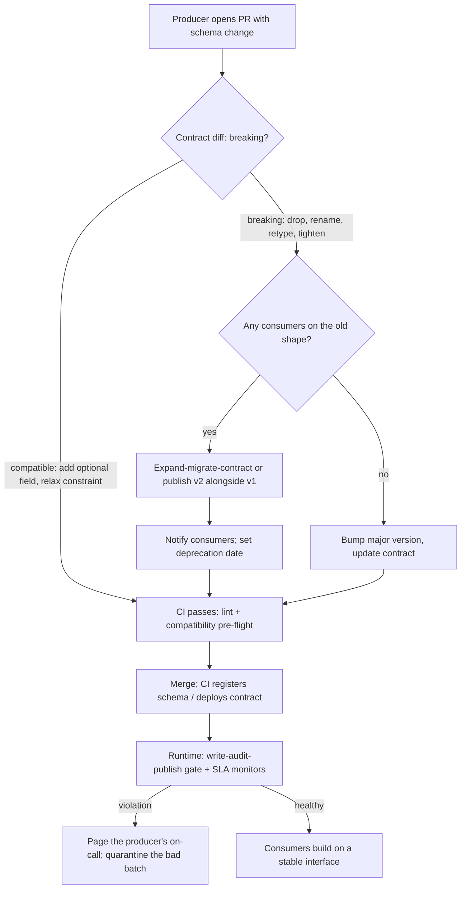

# Data Contracts

A data contract is an explicit, machine-checkable agreement between a data producer and its consumers: the schema (names, types, nullability, semantics), the service levels (freshness, availability, volume), the terms of use, and the change process. It turns "the checkout team renamed a column and broke six dashboards" from a recurring incident into a CI failure on the producer's pull request.

The practice matters because data breaks silently. An API change throws a 500 the moment it ships; a schema change in a table or event stream flows downstream for hours before a stakeholder notices a dashboard reading zero. The cost lands on the consumer, who has the least context to fix it and no leverage to prevent it. Contracts move detection to the cheapest possible point — the producer's pull request — and move accountability to the only party who can actually prevent the break.

A contract is three things at once: a **specification** (a YAML/Avro/dbt artifact in version control), an **enforcement mechanism** (CI checks and runtime validation that make the spec binding), and a **social agreement** (a named owner, a change process, a deprecation policy). Teams that ship only the first get documentation that drifts; teams that ship all three get interfaces they can trust.

## When NOT to Use This

- **Producer and consumer are the same team.** A contract between you and yourself is process overhead; use ordinary tests and code review.
- **Exploratory and prototype data.** Contracting a table that exists for one analysis kills iteration speed. Contract interfaces at the moment a second team takes a dependency, not before.
- **You cannot fund enforcement.** A contract spec with no CI check and no runtime validation is worse than nothing — it creates false confidence that the schema is stable. If you can only afford the YAML file, don't start yet.
- **Everything, everywhere.** Contracting every intermediate model in a dbt DAG makes internal refactoring impossible. Contract the *published* interfaces — the marts, topics, and exports other teams consume — and leave internals free to change.

## Decision Framework

Four decisions shape every data-contract rollout. Make them explicitly, per interface, and write them down.

### 1. Where does the contract live? (specification format)

| Format | Best for | Strengths | Honest trade-offs |
|---|---|---|---|
| **Data Contract Specification** (datacontract.com, YAML) or **ODCS** (bitol.io) | Cross-tool contracts: warehouse tables, files, mixed stacks | Tool-agnostic; captures SLAs, terms, and ownership, not just schema; `datacontract-cli` lints, diffs, and tests it | Another artifact to keep in sync; enforcement is yours to wire up |
| **dbt model contracts + versions** | Warehouse marts built in dbt | Enforced at build time (`contract: enforced: true` fails the run on drift); versioning and deprecation built in | Schema and constraints only — no freshness/availability SLAs; dbt-only |
| **Schema registry** (Confluent/Karapace, Avro/Protobuf/JSON Schema) | Kafka topics, event streams | Compatibility checked at registration and at serialize time — enforcement is structural, not optional | Streaming only; knows nothing about SLAs or table semantics |
| **Protobuf + `buf breaking`** | gRPC/event payloads owned by service teams | Breaking-change detection in CI against the main branch; strong codegen | Engineering-centric; analytics consumers rarely live in proto land |

**Default:** dbt contracts for warehouse marts, schema registry for streams, and a Data Contract Specification YAML on top of either when you need SLAs and terms in the same artifact.

### 2. Where is the contract enforced?

| Enforcement point | Catches | Trade-off |
|---|---|---|
| **Producer CI** (lint + breaking diff on the PR) | Breaking changes before they ship | Cheapest fix point; catches structure, not runtime data quality |
| **Pipeline runtime** (write-audit-publish, serializer validation) | Bad data in flight — nulls, drift, late loads | Adds latency and compute; needs severity tiers so soft checks don't halt everything |
| **Consumer-side tests** | Everything, but only after the damage landed | Necessary as a backstop, insufficient as the strategy — the consumer pays for the producer's mistake |

Use all three, but weight investment in that order. Shift left: a breaking change caught in producer CI costs minutes; caught in a consumer dashboard it costs days.

### 3. What compatibility policy applies?

| Policy (registry term) | Guarantee | Allowed changes (Avro) | Choose when |
|---|---|---|---|
| `BACKWARD` / `BACKWARD_TRANSITIVE` | New readers can read old data | Delete fields; add fields with defaults | Consumers replay history or upgrade lazily (most analytics) |
| `FORWARD` / `FORWARD_TRANSITIVE` | Old readers can read new data | Add fields; delete fields with defaults | Producers ship faster than consumers upgrade |
| `FULL` / `FULL_TRANSITIVE` | Both directions | Add/delete fields **with defaults** only | Long-lived topics, unknown consumer set — safest, most restrictive |
| `NONE` | Nothing | Anything | Never in production. "We coordinate on Slack" is not a policy |

Prefer the `_TRANSITIVE` variants when consumers read retained history: non-transitive only checks against the latest version, and a topic with 7-day retention holds data written under several.

### 4. How do breaking changes ship?

| Strategy | Mechanics | Trade-off |
|---|---|---|
| **In-place evolution** | Only compatible changes allowed, ever | Simple; but forces awkward schemas over time (`total_v2_final`) |
| **Parallel versions** | v1 and v2 side by side, migration window, deprecation date | Consumers migrate on their schedule; producer pays double compute until v1 dies |
| **Expand–migrate–contract** | Add new field, dual-write, migrate consumers, delete old field | The workhorse. Every step is individually compatible; requires tracking who still reads the old field |

**Default:** expand–migrate–contract for field-level changes; parallel versions for structural rewrites.

## The Enforcement Flow



## Anatomy of a Contract

A contract answers five questions: *what* (schema and semantics), *how good* (quality rules), *how fresh and reliable* (SLAs), *under what terms* (usage, limits, notice period), and *who* (owner and contact). Using the Data Contract Specification:

```yaml
# contracts/orders.datacontract.yaml
dataContractSpecification: 1.1.0
id: urn:datacontract:checkout:orders
info:
  title: Checkout Orders
  version: 2.1.0
  owner: checkout-team
  contact:
    name: Checkout Team
    url: https://nimbus.example.com/teams/checkout

terms:
  usage: Analytical reporting and fraud-model features.
  limitations: >
    Not for real-time inventory decisions. PII fields must not be
    copied outside the EU region.
  noticePeriod: P3M          # 3 months notice before breaking changes

models:
  orders:
    type: table
    description: One row per confirmed order. Immutable after placement.
    fields:
      order_id:
        type: string
        required: true
        unique: true
      order_total_cents:
        type: long
        required: true
        minimum: 0
        description: Order total in minor currency units. Never a float.
      currency:
        type: string
        required: true
        enum: [EUR, USD, GBP]
      placed_at:
        type: timestamp
        required: true
    quality:
      - type: sql
        description: Refund share of daily orders stays under 8 percent
        query: |
          SELECT COUNT(*) FILTER (WHERE status = 'refunded') * 100.0
                 / GREATEST(COUNT(*), 1)
          FROM orders
          WHERE placed_at >= CURRENT_DATE - 1
        mustBeLessThan: 8

servicelevels:
  availability:
    percentage: 99.5%
  freshness:
    threshold: 6h
    timestampField: orders.placed_at
  frequency:
    type: batch
    cron: "0 4 * * *"
  retention:
    period: P2Y
```

Lint, diff, and test it with the `datacontract-cli`:

```bash
pip install 'datacontract-cli[all]'

datacontract lint contracts/orders.datacontract.yaml
datacontract breaking contracts/orders.v1.yaml contracts/orders.datacontract.yaml
datacontract test contracts/orders.datacontract.yaml   # runs schema + quality checks against the live server
```

## Process

1. **Inventory the interfaces.** List every table, topic, and export consumed across a team boundary. For each: producer, consumers, and what broke in the last six months.
2. **Classify.** Mark interfaces *published* (contract required) or *internal* (free to change). Publish the list — ambiguity here is where incidents breed.
3. **Draft the contract with both parties.** The producer proposes the schema and SLAs it can honour; consumers state what they actually need (fields, freshness, notice period). Resolve the gap now, in a document, not later, in an incident channel.
4. **Encode semantics, not just types.** `order_total_cents: long, minimum: 0` beats `total: double`. Enums for status fields. Timezone and grain in field descriptions. Most "schema" incidents are really semantics incidents.
5. **Pick the compatibility policy per interface** (framework table 3) and record it in the contract.
6. **Wire CI enforcement.** On every producer PR touching the schema: lint the contract, diff against main for breaking changes, pre-flight against the registry. Merge is blocked on green.
7. **Wire runtime enforcement.** Streams: validate at serialize time via the registry. Batch: write-audit-publish — build into a staging schema, validate, swap only on pass. Tier the checks: schema violations halt, statistical drift alerts.
8. **Monitor the SLAs.** Freshness, volume, and availability monitors alert the *producer's* on-call, with the consumer channel CC'd. A contract whose violations page the consumer has the accountability backwards.
9. **Run the change process.** Compatible changes ship on green CI. Breaking changes require an RFC, consumer notice per the contract's `noticePeriod`, an expand–migrate–contract plan or parallel version, and a deprecation date.
10. **Audit quarterly.** Retire contracts nobody consumes, tighten checks that never fire, and delete deprecated versions whose usage has hit zero.

## Worked Example 1 — Kafka Events: Checkout → 12 Consumers

**Scenario.** Nimbus Commerce's checkout service publishes `checkout.orders` events (~40M/day, 7-day topic retention) consumed by 12 teams: fraud scoring, email, finance, analytics. Last quarter a field rename broke three consumers mid-day and cost roughly 11 engineer-days to clean up.

**Decisions and rationale:**

- **Contract format: Avro in Confluent Schema Registry.** We chose the registry over a standalone YAML because enforcement is structural — the producer's serializer physically cannot publish an incompatible record. A YAML spec would document intent; the registry *enforces* it.
- **Compatibility: `BACKWARD_TRANSITIVE`.** Backward, because consumers upgrade lazily and must be able to read whatever is in the topic with their newest schema. Transitive, because 7-day retention means the topic simultaneously holds records written under several schema versions — checking only against `latest` would pass changes that break replay.

```bash
# Set the policy once per subject (CI does this, not humans)
curl -sS -X PUT \
  -H "Content-Type: application/json" \
  --data '{"compatibility": "BACKWARD_TRANSITIVE"}' \
  "$SCHEMA_REGISTRY_URL/config/checkout.orders-value"

# PR pre-flight: candidate schema vs all registered versions
# candidate.json = {"schema": "<json-escaped Avro schema>"}
curl -sS -X POST \
  -H "Content-Type: application/vnd.schemaregistry.v1+json" \
  --data @candidate.json \
  "$SCHEMA_REGISTRY_URL/compatibility/subjects/checkout.orders-value/versions"
```

**The change request.** Finance wants order totals in integer cents; `total` is currently a `double` in dollars, and float rounding has already produced reconciliation gaps of a few cents per 10k orders.

**What we did NOT do:** retype `total` in place (breaking, blocked by CI) or rename it (a rename is a delete plus an add — same thing).

**What we did — expand–migrate–contract:**

```json
{
  "type": "record",
  "name": "Order",
  "namespace": "com.nimbus.checkout",
  "fields": [
    {"name": "order_id", "type": "string"},
    {"name": "total", "type": "double",
     "doc": "DEPRECATED 2026-07-24: use total_cents. Removal earliest 2026-10-24."},
    {"name": "total_cents", "type": "long", "default": 0,
     "doc": "Order total in minor currency units."},
    {"name": "currency", "type": "string", "default": "EUR"},
    {"name": "placed_at", "type": {"type": "long", "logicalType": "timestamp-millis"}}
  ]
}
```

Adding `total_cents` **with a default** is backward-compatible (a new reader fills the default when reading old records), so it merged on green. The producer dual-writes both fields for the 90-day window; the `doc` string carries the deprecation date because docs travel with the schema, not with a wiki.

**The subtle part.** Under `BACKWARD`, *deleting* `total` later will also pass the registry check — deletion is backward-compatible. But registry compatibility is reader-schema mechanics, not consumer-code reality: a consumer whose code still reads `total` breaks the moment the field disappears, with CI fully green. So the contract adds a human gate the registry cannot provide: before any field deletion, the producer confirms zero consumers reference it (consumer sign-off in the RFC, plus a grep of the consumer repos monorepo-wide).

**Outcome.** Cutover completed in 6 weeks; all 12 consumers migrated inside the 90-day window; zero incidents, versus 11 engineer-days for the previous uncontracted rename. `total` was deleted in week 14 after sign-off.

## Worked Example 2 — Warehouse Mart: dbt `fct_claims` for Finance and ML

**Scenario.** Halcyon Health's analytics engineering team builds `fct_claims` (~2.3M rows/day) in dbt on Snowflake. Consumers: finance reporting (needs the daily load complete by 07:00 UTC) and an ML feature pipeline (reads `paid_amount`). SLAs agreed: freshness 6h after the 01:00 UTC source close, availability 99.5%, `member_id` null rate < 0.1%.

**Decisions and rationale:**

- **dbt model contract, not tests alone.** `contract: enforced: true` makes dbt validate the model's columns and data types against the YAML *before building* — schema drift fails the producer's CI run, not the consumer's Monday. Generic `not_null` tests run after build; the contract's constraints are enforced at DDL level. We use both: contracts for structure, tests and expectations for data.
- **dbt model versions for the breaking change.** The ML team needs `paid_amount` (float dollars) replaced with `paid_amount_cents` (bigint) — the same float-money lesson as Example 1. In-place retyping would break finance's existing queries, so we ship v2 alongside v1 with a deprecation date instead of forcing a synchronized cutover across two teams with different release cadences.

```yaml
# models/marts/claims/_fct_claims.yml
models:
  - name: fct_claims
    description: One row per adjudicated claim.
    latest_version: 2
    config:
      contract:
        enforced: true
    columns:
      - name: claim_id
        data_type: varchar
        constraints:
          - type: not_null
      - name: member_id
        data_type: varchar
        constraints:
          - type: not_null
      - name: paid_amount_cents
        data_type: bigint
        constraints:
          - type: not_null
      - name: adjudicated_at
        data_type: timestamp_ntz
    versions:
      - v: 2
      - v: 1
        deprecation_date: 2026-10-24
        columns:
          - include: all
            exclude: [paid_amount_cents]
          - name: paid_amount
            data_type: float
```

Consumers pin explicitly during the window — `{{ ref('fct_claims', v=1) }}` — and unpinned refs resolve to `latest_version`. After `deprecation_date`, dbt warns on every run that still references v1; that warning is the migration nag we never have to send by hand.

- **Runtime gate: write-audit-publish with Great Expectations.** dbt contracts check structure; they cannot check that today's load is complete, fresh, or sane. The Airflow DAG builds into a staging schema, validates, and swaps into the mart schema only on pass:

```python
import great_expectations as gx

context = gx.get_context()

suite = context.suites.add(gx.ExpectationSuite(name="fct_claims_contract"))
suite.add_expectation(gx.expectations.ExpectColumnValuesToNotBeNull(column="claim_id"))
suite.add_expectation(gx.expectations.ExpectColumnValuesToBeUnique(column="claim_id"))
suite.add_expectation(
    gx.expectations.ExpectColumnValuesToNotBeNull(column="member_id", mostly=0.999)
)
suite.add_expectation(
    gx.expectations.ExpectColumnValuesToBeBetween(column="paid_amount_cents", min_value=0)
)
suite.add_expectation(
    gx.expectations.ExpectTableRowCountToBeBetween(min_value=1_800_000, max_value=3_000_000)
)
```

`mostly=0.999` encodes the contracted 0.1% null tolerance directly — the check *is* the SLA clause. Row-count bounds (±~20% around the 2.3M baseline) are a **warn-tier** check: a volume anomaly alerts the producer channel but does not halt the swap, because a legitimate enrollment spike must not take down finance reporting. Null `claim_id` is **fatal-tier**: the swap is skipped, yesterday's data stays live, and the producer is paged. Serving stale-but-correct beats serving fresh-but-broken.

**Outcome.** In the first quarter under contract: two fatal-tier catches (an upstream dedupe bug that would have doubled claim rows) never reached consumers; finance's 07:00 SLA was met 98.9% of days, and the two misses paged analytics engineering — not finance — within 4 minutes.

## CI Wiring

The contract check that is not in CI does not exist. A minimal producer-side gate:

```yaml
# .github/workflows/data-contracts.yml
name: data-contract-checks
on:
  pull_request:
    paths:
      - "contracts/**"
      - "models/**"

jobs:
  contract-gate:
    runs-on: ubuntu-latest
    steps:
      - uses: actions/checkout@v4
        with:
          fetch-depth: 0
      - uses: actions/setup-python@v5
        with:
          python-version: "3.12"
      - name: Install datacontract-cli
        run: pip install 'datacontract-cli[all]'
      - name: Lint contract
        run: datacontract lint contracts/orders.datacontract.yaml
      - name: Block breaking changes vs main
        run: |
          git show origin/main:contracts/orders.datacontract.yaml > /tmp/main.yaml
          datacontract breaking /tmp/main.yaml contracts/orders.datacontract.yaml
```

For dbt marts, the equivalent gate is `dbt build` in CI with contracts enforced — a contracted model whose SQL no longer matches its YAML fails compilation. For Protobuf interfaces, `buf breaking --against '.git#branch=main'` plays the same role.

## Anti-Patterns

| Symptom | Why it fails | Do instead |
|---|---|---|
| The "contract" is a wiki page | Nothing checks it; it drifts within a sprint and becomes disinformation | Contract as versioned artifact + CI gate; docs generated from it |
| Validation only on the consumer side | The bad data already landed; the team with least context pays | Producer CI + write-audit-publish; consumer tests as backstop only |
| Registry compatibility set to `NONE` | Every change is a coin flip across every consumer | `BACKWARD_TRANSITIVE` minimum; `FULL_TRANSITIVE` for long-lived topics |
| Renaming a column in place | A rename is a delete plus an add — it breaks every reader at once | Expand–migrate–contract with a dual-write window |
| Contracting every model in the DAG | Internal refactors now need cross-team RFCs; velocity dies | Contract published interfaces only; internals stay free |
| Every check hard-fails the pipeline | One row-count blip halts finance reporting for a day | Severity tiers: schema/keys fatal, statistical drift warn |
| Versions without deprecation dates | v1 lives forever; producer pays double compute indefinitely | Deprecation date at v2 launch; auto-warn, then delete at zero usage |
| Schemas registered by hand in prod | Registry and repo drift; nobody knows which is truth | Registration happens only via CI from the merged artifact |
| SLA breaches page the consumer | Accountability inverted; producer never feels the cost | Freshness/volume monitors page the producer's on-call |
| "Compatibility check passed, so we deleted the field" | Registry checks reader mechanics, not consumer code usage | Usage audit + consumer sign-off before any deletion |

## Checklist

Copy into the PR or RFC that establishes each contract:

```markdown
## Data Contract Checklist — <interface name>

### Specification
- [ ] Producer team and named owner recorded
- [ ] All consumer teams identified and consulted
- [ ] Schema: names, types, nullability, uniqueness for every field
- [ ] Semantics: units (money in minor units), timezone, grain, enums documented
- [ ] SLAs: freshness threshold, availability %, expected volume range
- [ ] Terms: permitted usage, limitations, notice period for breaking changes
- [ ] Compatibility policy chosen and recorded (default BACKWARD_TRANSITIVE)

### Enforcement
- [ ] Contract artifact lives in the producer's repo, in version control
- [ ] CI: lint + breaking-change diff blocks merge on producer PRs
- [ ] CI: registry/warehouse registration automated (no manual pushes)
- [ ] Runtime: write-audit-publish or serializer validation in place
- [ ] Checks tiered: fatal (halt) vs warn (alert) explicitly assigned
- [ ] SLA monitors alert the PRODUCER's on-call, consumers CC'd

### Change management
- [ ] Breaking-change process documented (RFC + notice period + migration plan)
- [ ] Deprecation policy: every deprecated field/version has a removal date
- [ ] Field-deletion gate: usage audit + consumer sign-off required
- [ ] Quarterly review scheduled: retire dead contracts, tune flaky checks
```

## 10 Rules

1. **No enforcement, no contract.** A spec that nothing checks is documentation cosplaying as a guarantee — it will drift, and drifted contracts are worse than none.
2. **The producer owns the contract; the consumers own the requirements.** Contracts written unilaterally by either side fail: producer-only contracts document whatever is convenient, consumer-only contracts demand whatever is imaginable.
3. **A rename is a delete plus an add.** Treat it as two changes with a migration window between them, never as one atomic edit.
4. **Registry-compatible is not consumer-compatible.** Deleting a field passes `BACKWARD` and still breaks the dashboard that reads it. Audit usage before every deletion — the machine check is necessary, not sufficient.
5. **Encode semantics in types.** Money as integer minor units, statuses as enums, timestamps with explicit timezone. Most "schema breaks" are semantic drift the type system was never asked to catch.
6. **A schema check without an SLA is half a contract.** Consumers are broken just as badly by a table that is 14 hours late as by one with a renamed column. Freshness, volume, and availability belong in the artifact.
7. **Violations page the producer.** If the consumer's on-call feels the pain first, the incentive structure guarantees repeat incidents.
8. **Tier your checks.** Broken keys and types halt the pipeline; statistical drift alerts a human. Stale-but-correct beats fresh-but-broken, and hard-failing everything trains people to bypass the gate.
9. **Deprecation dates are commitments, not aspirations.** Set the date when v2 ships, warn automatically as it approaches, and delete at zero usage — or v1 will outlive everyone who remembers why it exists.
10. **Contract the boundary, free the interior.** Published interfaces get contracts and change control; internal models get refactored at will. Blur that line in either direction and you get either chaos or concrete.

## References

- Data Contract Specification — https://datacontract.com
- Open Data Contract Standard (Bitol, LF AI & Data) — https://bitol.io
- `datacontract-cli` — https://github.com/datacontract/datacontract-cli
- dbt model contracts and versions — https://docs.getdbt.com/docs/collaborate/govern/model-contracts
- Confluent Schema Registry: schema evolution and compatibility — https://docs.confluent.io/platform/current/schema-registry/fundamentals/schema-evolution.html
- Great Expectations — https://docs.greatexpectations.io
