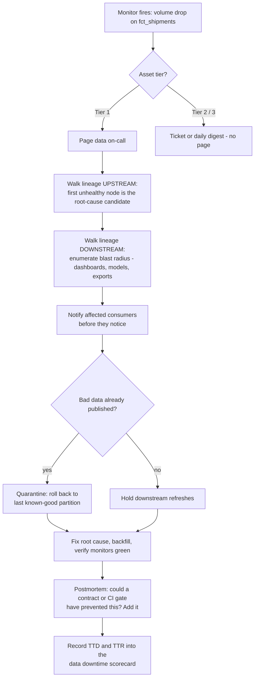

# Data Observability

Data observability is the practice of continuously measuring the health of data systems from the outside — did the table land on time, with the expected number of rows, the expected shape, and values inside their historical distribution — so that the data team learns about an incident from a monitor, not from a VP asking why the dashboard reads zero. It borrows its premise from software observability: you cannot write a test for every failure mode you haven't imagined, so alongside declared assertions you need *learned baselines* that flag anything anomalous, whether or not anyone predicted it.

It is the detection half of a pair. **Data contracts** (see `03-data-analytics/data-contracts`) are prevention: they catch the schema change the producer *proposes*, in CI, before it ships. Observability is detection: it catches what contracts structurally cannot — the upstream API that silently started paginating, the backfill that doubled row counts, the null rate that crept from 0.1% to 12% without any schema change at all. Mature teams run both and they meet in the middle: every observability postmortem asks "could a contract have prevented this?", and every contract's SLAs are enforced by observability monitors.

The economic argument is **data downtime** — the periods when data is missing, wrong, or stale. It is the metric this whole practice exists to shrink:

```
data downtime = number of incidents × (time to detection + time to resolution)
```

Detection is where the leverage is. Resolution time is bounded by engineering reality, but detection time is a choice: a team whose incidents are user-reported has a TTD measured in hours or days; a team with monitors has a TTD measured in minutes. Cutting TTD from 9 hours to 20 minutes shrinks downtime more than any heroic on-call rotation ever will.

## When NOT to Use This

- **You have no consumers who notice.** If nobody depends on the data being right by a certain time, there is no downtime to reduce. Instrument the moment a dashboard, model, or export gains a stakeholder — not before.
- **The pipeline is a prototype.** Anomaly monitors need 2–4 weeks of history to learn a baseline; a table that gets rebuilt and renamed weekly just generates noise. Observe stable assets.
- **The problem is a known, preventable failure mode.** "The producer keeps renaming columns" is a contracts problem — fix it in the producer's CI, don't build a smoke detector for a fire you can prevent. Reach for `data-contracts` first.
- **You cannot staff a response.** Monitors without an owner who triages them are worse than nothing: they train everyone that data alerts are ignorable, which is precisely the reflex that lets the real incident through. If you can't commit triage time, don't turn on the pager.

## The Five Pillars

| Pillar | Question it answers | Typical monitor | Classic incident it catches |
|---|---|---|---|
| **Freshness** | Did the data arrive when expected? | Max event/load timestamp vs. expected cadence | Orchestrator silently skipped the 02:00 run; dashboard shows yesterday |
| **Volume** | Did the expected amount arrive? | Row count vs. learned baseline (with seasonality) | Upstream API added pagination; you now ingest page 1 of 40 |
| **Schema** | Did the structure change? | Column add/drop/retype detection | Producer shipped `total` → `total_v2`; six models now select a missing column |
| **Distribution** | Are the values plausible? | Null %, zero %, uniqueness, mean/range vs. baseline | A deploy started writing `country = 'unknown'` for 40% of rows |
| **Lineage** | What broke it, and what does it break? | Column/table-level dependency graph, auto-derived | Turns "orders looks weird" into "root cause is `stg_payments`; 14 downstream assets affected" |

The first four detect; lineage is what makes detection *actionable*. Without lineage, every alert starts a manual archaeology session. With it, triage is two graph walks: upstream to the root cause, downstream to the blast radius.

## Decision Framework

### 1. Tooling: what actually does the watching?

| Option | Best for | Strengths | Honest trade-offs |
|---|---|---|---|
| **Monte Carlo** (or comparable SaaS: Bigeye, Metaplane, Sifflet) | Large warehouse estates, mixed tooling, dedicated budget | ML monitors auto-deployed from query logs and metadata; strong lineage and incident UI; near-zero config to get broad coverage | Cost scales with warehouse size; another vendor with warehouse read access; auto-monitors still need tuning or they page on noise |
| **Elementary** (dbt-native, OSS + cloud) | dbt-centric stacks | Monitors are dbt tests (`elementary.volume_anomalies` etc.) living in the repo, code-reviewed like everything else; lineage from dbt artifacts; `edr` CLI sends Slack alerts and builds a report UI | Sees only what dbt builds — blind to ingestion upstream of your sources; anomaly models simpler than SaaS ML |
| **Soda** (SodaCL + Soda Cloud) | Teams wanting declared checks-as-code across warehouses, dbt or not | Human-readable YAML checks (`freshness(col) < 4h`); runs in any orchestrator; anomaly detection and dashboards via Soda Cloud | Anomaly detection and incident workflow need the paid Cloud; lineage weaker than the SaaS leaders |
| **Great Expectations** | Pipeline *gates*, not observability | Rich assertion library; ideal for write-audit-publish gates | **It is a testing tool, not an observability tool**: it verifies what you declared, learns no baselines, watches nothing you didn't think of. Use it inside pipelines; don't mistake a GE suite for coverage |
| **Hand-rolled SQL + orchestrator alerts** | Tiny scope (< ~20 assets), zero budget | Full control, no vendor | You will rebuild baselines, seasonality, alert routing, and lineage badly, one incident at a time. Acceptable as a bridge, not a destination |

**Default:** Elementary if your transformation layer is dbt; a SaaS platform when the estate spans many tools or nobody can maintain monitor code; Soda when you want checks-as-code without dbt coupling. Keep Great Expectations for gating, whatever else you pick.

If you're on the hand-rolled bridge, the minimum viable monitor is one query per asset — freshness and volume in a single pass, scheduled by the orchestrator you already have (Snowflake dialect shown):

```sql
SELECT
  DATEDIFF('minute', MAX(_loaded_at), CURRENT_TIMESTAMP()) AS minutes_stale,
  COUNT_IF(_loaded_at::DATE = CURRENT_DATE - 1)            AS rows_yesterday
FROM analytics.fct_orders;
-- Orchestrator alert rule:
--   minutes_stale > 360  OR  rows_yesterday < 0.5 * trailing_28d_median
```

It works, and its limits are the point: the trailing-median baseline, the seasonality handling, the alert routing, and the lineage are all still on you — which is exactly the maintenance bill the tools in the table above exist to pay.

### 2. Declared thresholds vs. learned baselines

| Approach | Catches | Fails when | Use for |
|---|---|---|---|
| **Declared** (`row_count > 100000`, `null_percent < 0.5`) | Violations of rules a human wrote down | The failure mode nobody predicted; thresholds go stale as the business grows | Contractual SLAs, invariants that must never break (keys non-null, money non-negative) |
| **Learned** (anomaly detection on metrics vs. history) | Deviations from normal — including failure modes nobody predicted | Cold start (needs weeks of history); "normal" drift gets learned as normal; genuine spikes (Black Friday) flagged unless seasonality is modeled | Volume, freshness cadence, distribution metrics on everything you can't enumerate rules for |

Use both, deliberately: declared checks encode your *commitments*, learned baselines cover your *ignorance*. A stack with only declared checks catches ~the incidents you already had; a stack with only learned baselines pages you for every marketing campaign.

### 3. Coverage: what to monitor vs. deliberately ignore

Monitoring everything at full depth is how you get 2,000 alerts a month and zero attention. Tier the estate:

| Tier | Definition | Monitor depth | Alert route |
|---|---|---|---|
| **1 — Critical** | Feeds revenue, exec reporting, ML in production, regulatory output | All five pillars: freshness + volume + schema + distribution on key columns; SLA-backed | Page on-call, minutes matter |
| **2 — Important** | Team dashboards, internal tools | Freshness + volume + schema | Ticket / channel alert, same business day |
| **3 — Everything else** | Intermediate models, exploration, staging | Automated broad-and-shallow only (freshness + volume if the tool gives it for free) | Daily digest — or nothing |

The deliberate part is tier 3: you are *choosing* not to be alerted, so that tier-1 alerts retain meaning. An untiered estate makes every alert equally loud and therefore equally ignorable.

### 4. Alert routing: page, ticket, or digest?

Route by **consumer impact and urgency**, never by monitor type. A freshness miss on the billing mart is a page; the same miss on a scratch model is at most a digest line. Three rules that keep the pager trustworthy:

- **A page must be actionable now.** If the response to an alert is "we'll look Monday", it was a ticket.
- **Every page has an owner and a runbook link.** An alert that requires archaeology to interpret gets snoozed forever.
- **Track alert precision monthly** (actionable ÷ fired). Below ~40%, delete or demote monitors until it recovers — a noisy monitor costs more than the incidents it might catch, because it burns the credibility of every other monitor.

## Incident Flow: Detection to Resolution



Two habits in this flow do most of the work. First, **root cause is upstream, symptoms are downstream** — always walk up the lineage before touching the table that alerted; patching a symptom table guarantees a repeat. Second, **stale-but-correct beats fresh-but-wrong**: quarantining to yesterday's good partition is almost always better than serving today's broken one.

## Process

1. **Inventory and tier the estate.** List every table, mart, and export with a consumer. Assign tiers (framework §3) with the consumers in the room — they know what actually matters. Write the tier into the asset's metadata (dbt `meta`/`tags`) so tooling can route on it.
2. **Define the SLA per tier-1 asset.** "Fresh by 07:00 UTC daily, ±20% of baseline volume, key columns < 0.1% null." An SLA nobody wrote down is an SLA nobody is meeting.
3. **Deploy freshness and volume first.** They are the cheapest monitors and catch the majority of incidents (pipelines mostly fail by not running or half-running). Broad-and-shallow across tiers 1–2 before anything deep.
4. **Add schema-change detection** on every tier-1/2 asset and on the *sources* feeding them — schema breaks almost always originate at the ingestion boundary.
5. **Add distribution monitors on tier-1 key columns only.** Null %, uniqueness, and range/mean anomalies on the columns that carry the business meaning (amounts, IDs, statuses). Resist monitoring every column; that is where alert fatigue is born.
6. **Wire lineage.** From dbt artifacts, warehouse query logs, or the vendor's parser — but auto-derived, never hand-drawn. Verify you can answer, for any asset, "what feeds this?" and "what does this feed?" in under a minute.
7. **Route alerts by tier** (framework §4). Every page gets an owner and a runbook; everything else goes to tickets or digests.
8. **Write the triage runbook** as the mermaid flow above, concretized: where the lineage UI is, how to quarantine, who the consumer contacts are, where postmortems live.
9. **Measure data downtime.** Log TTD and TTR per incident from day one. Report incidents, median TTD, median TTR, and total downtime hours monthly — this is the number that justifies the tooling budget.
10. **Tune monthly.** Review alert precision per monitor: delete monitors nobody acts on, tighten ones that missed, demote noisy tier assignments. Coverage is a garden, not a monument.

## Data SLAs and the Downtime Scorecard

Borrow the SRE ladder, translated for data:

| Term | For data, it means | Example |
|---|---|---|
| **SLI** (indicator) | A measured health signal, one or more per pillar | Minutes since last successful load; daily row count; null % on `carrier_id` |
| **SLO** (objective) | The internal target the team operates against | Fresh by 07:00 UTC on ≥ 99% of weekdays; volume within ±20% of seasonal baseline |
| **SLA** (agreement) | The commitment made to consumers, with comms attached | "Billing mart fresh by 07:00; misses page us and you hear from us within 30 minutes" |

Monitors are how SLIs get measured; alerts fire when an SLO is at risk; the SLA decides who gets told and what happens next. Roll it up into a monthly scorecard per domain:

```markdown
## Data downtime — logistics domain, 2026-06
- Incidents: 4                     (prev: 7)
- Median TTD: 18 min               (prev: 3.1 h)
- Median TTR: 3.9 h                (prev: 5.4 h)
- Downtime: 4 x (0.3 + 3.9) = 16.8 h    (prev: 59.5 h)
- SLO attainment: fct_billing 99.1% | fct_shipments 96.8%  <- below 99% target
- Alert precision: 44% (61 fired, 27 actionable)
```

This scorecard is what turns observability from a cost center into a defensible investment: downtime hours trending down is the graph the tooling budget stands on — and alert precision on the same page keeps the team honest about the cost side.

## Worked Example 1 — dbt Stack: Elementary at Meridian Home

**Scenario.** Meridian Home (e-commerce, dbt + Snowflake, Airflow) has 340 dbt models and a two-person data platform team. Last quarter's lowlight: a marketing-attribution feed silently dropped to ~10% volume for five days before an analyst noticed; the CMO had already re-allocated spend on the broken numbers. TTD: 5 days.

**Decisions and rationale:**

- **Tooling: Elementary, not a SaaS platform.** The entire consumer-facing estate is built in dbt, so dbt-native monitors cover it; the team is two people who cannot own another vendor relationship; and monitors-as-dbt-tests means every monitor is code-reviewed in the same PR as the model it watches. We accepted the known blind spot — ingestion upstream of dbt sources — and covered it with dbt source freshness checks at the boundary.
- **Coverage: 28 marts are tier 1, everything else is tier 2/3.** Full-pillar monitoring on 28 assets, freshness + volume on ~90 tier-2 models, nothing on 200+ intermediate models. Monitoring all 340 was rejected explicitly: the team can triage perhaps 3 alerts a day, and monitors that outnumber attention become noise.
- **Volume anomalies use `anomaly_direction: drop` with `day_of_week` seasonality.** Drop-only, because volume *spikes* at Meridian are almost always legitimate (campaigns, holidays) and paging on them trained people to ignore the channel. Weekend order volume is ~45% of weekday volume, so without `seasonality: day_of_week` every Saturday looked like an incident and every Monday looked like a spike.

Source freshness at the ingestion boundary (dbt-native):

```yaml
# models/staging/_sources.yml
sources:
  - name: attribution
    database: raw
    tables:
      - name: ad_touchpoints
        loaded_at_field: _loaded_at
        freshness:
          warn_after: {count: 3, period: hour}
          error_after: {count: 12, period: hour}
```

Monitors on the tier-1 mart, as Elementary dbt tests (dbt ≥ 1.8 `data_tests` syntax):

```yaml
# models/marts/_fct_attributed_orders.yml
models:
  - name: fct_attributed_orders
    config:
      tags: ["tier-1"]
    data_tests:
      - elementary.volume_anomalies:
          timestamp_column: ordered_at
          anomaly_direction: drop
          anomaly_sensitivity: 3        # standard deviations from baseline
          training_period:
            period: day
            count: 30
          time_bucket:
            period: day
            count: 1
          seasonality: day_of_week
      - elementary.freshness_anomalies:
          timestamp_column: ordered_at
      - elementary.schema_changes
    columns:
      - name: attributed_channel
        data_tests:
          - elementary.column_anomalies:
              column_anomalies: [null_percent]
      - name: order_total_cents
        data_tests:
          - not_null
          - elementary.column_anomalies:
              column_anomalies: [zero_percent, average]
```

Note the split: `not_null` on `order_total_cents` is a *declared* invariant (framework §2 — a commitment that must never break), while `zero_percent`/`average` anomalies are *learned* — they exist to catch the failure nobody predicted, like a currency bug writing zeros. Alerting runs from Airflow after the dbt build:

```bash
pip install elementary-data
edr monitor --slack-token "$SLACK_TOKEN" --slack-channel-name data-alerts-tier1
```

**The incident, replayed.** Three weeks after rollout, the attribution vendor changed its API pagination. The 02:00 load "succeeded" with one page of data. At 07:40 the `volume_anomalies` test on the staging model failed its drop check (day-bucket volume 8,100 rows vs. a Tuesday baseline of ~61,000, far past 3σ); the Slack alert linked the Elementary lineage view showing `fct_attributed_orders` and 11 dashboards downstream. On-call held the mart refresh (yesterday's partition stayed live — stale-but-correct), notified the marketing channel at 08:05, and the fixed backfill landed by 13:00.

**Outcome:** TTD 5 days → under 6 hours (bounded by the daily bucket; the team later moved this one model to hourly buckets and got TTD to ~40 minutes). Consumers were told *before* they noticed — the difference between "incident" and "credibility loss." The postmortem added a row-count assertion to the ingestion job itself (prevention), keeping the anomaly monitor as the backstop.

## Worked Example 2 — Alert Fatigue and Data Downtime at Voyager Freight

**Scenario.** Voyager Freight (logistics, Snowflake + Fivetran + Airflow, no dbt) *has* observability — a hand-rolled system pushing every failed check to one Slack channel — and it is actively harmful: **1,900 alerts/month, ~3% actionable**. The channel is muted by everyone, so when `fct_shipments` went stale for 31 hours in March, the first detection was a customer emailing about a wrong invoice. Quarterly baseline: 14 incidents, median TTD 9h, median TTR 7h → **data downtime = 14 × (9 + 7) = 224 hours**.

**Decisions and rationale:**

- **Tooling: Soda (SodaCL + Soda Cloud), not Elementary.** No dbt to be native to, and the team wanted checks-as-code reviewable in Git rather than a fully auto-deployed SaaS — they had just been burned by exactly the noise auto-everything produces. Checks run from Airflow after each load; Soda Cloud supplies the anomaly models and incident tracking.
- **The rebuild started with deletion.** Every existing check was re-justified against the tier model or deleted; ~70% died. This felt reckless and was the single highest-value step: alert precision is a *product feature* of the observability system, and you cannot tune your way out of a channel everyone has muted.
- **Severity became routing, not vocabulary.** Old system: every failure was "CRITICAL" in the same channel. New system: 9 tier-1 tables page PagerDuty via Soda Cloud notification rules; tier-2 files tickets; tier-3 is a daily digest. `fail` conditions page; `warn` conditions never do.

Tier-1 checks for the table that caused the March incident:

```yaml
# soda/checks/fct_shipments.yml
checks for fct_shipments:
  - freshness(event_loaded_at) < 4h:
      name: Shipments fresh within 4h of load
  - row_count:
      fail: when < 100000        # declared floor: contractual daily minimum
  - missing_percent(carrier_id) < 0.5%
  - anomaly detection for row_count   # learned baseline via Soda Cloud
  - schema:
      warn:
        when schema changes: any
      fail:
        when required column missing: [shipment_id, carrier_id, delivered_at]
```

Rationale for the mixed style: the `row_count` floor is declared because 100k/day is a *contractual* minimum with the invoicing consumer (framework §2 — commitments get declared checks), while `anomaly detection for row_count` layers the learned baseline on top to catch partial loads that stay above the floor. Schema *changes* only warn — additive columns are routine — but a *missing required column* fails and pages, because that is the one schema event that breaks invoicing immediately.

**Triage automation with lineage.** Voyager's runbook requires notifying affected consumers within 30 minutes of a page. To make that achievable at 03:00, the on-call tooling drafts the consumer notice automatically from the monitor payload and the blast radius pulled from their lineage store; the human edits and sends. The draft comes from the Claude API:

```python
import os
from anthropic import Anthropic

client = Anthropic()  # reads ANTHROPIC_API_KEY from the environment — never hardcode keys

def draft_incident_notice(monitor: dict, blast_radius: list[str]) -> str | None:
    response = client.messages.create(
        model="claude-fable-5",
        max_tokens=1024,
        messages=[{
            "role": "user",
            "content": (
                "Draft a short data-incident notice for business stakeholders.\n"
                f"Failed monitor: {monitor['name']} on table {monitor['table']}\n"
                f"Observation: {monitor['observation']}\n"
                f"Downstream assets affected (from lineage): {', '.join(blast_radius)}\n"
                "State plainly: what is affected, since when, what still works, "
                "and that the team is investigating. Do not speculate on root cause."
            ),
        }],
    )
    if response.stop_reason == "refusal":
        return None  # fall back to the manual template
    return response.content[0].text
```

The prompt feeds the model *facts from the monitor and lineage* and forbids root-cause speculation — the draft's job is fast, accurate consumer communication, not diagnosis. Diagnosis stays with the human walking the lineage upstream.

**Outcome (two quarters later):** 120 alerts/month at 41% actionable precision — the channel is unmuted and read. Quarterly: 11 incidents, median TTD 25 minutes, median TTR 4.5h → **data downtime = 11 × (0.4 + 4.5) ≈ 54 hours**, a 76% reduction, with most of the gain from TTD. Incident *count* barely moved — detection doesn't prevent failures, it shrinks their cost. Prevention work (contracts on the two noisiest source boundaries) is the next quarter's project.

## Anti-Patterns

| Symptom | Why it fails | Do instead |
|---|---|---|
| Issues are found by dashboard users | TTD measured in days; trust erodes with every "the numbers look off" Slack message | Freshness + volume monitors on every consumer-facing asset; monitors find it first |
| Monitor everything, one channel, all "critical" | 2,000 undifferentiated alerts/month → channel muted → real incident missed | Tier assets; page only tier 1; ticket/digest the rest; track alert precision |
| Only final marts are monitored | Root cause is upstream; by mart-level detection the bad data has propagated everywhere | Monitor the ingestion boundary and staging too — catch it before it fans out |
| A Great Expectations suite is called "observability" | Assertions verify only what you declared; the unknown-unknowns walk straight past | GE for pipeline gates; learned-baseline monitors for detection coverage |
| Hard thresholds everywhere (`rows > 50000`) | Stale within a quarter as the business grows; either false alarms or silent misses | Learned baselines with seasonality for metrics; declared checks only for true invariants |
| Anomaly monitors on day one, trusted on day two | 2–4 weeks of training data needed; early alerts are noise that poisons trust | Run new monitors in warn/silent mode until the baseline stabilizes, then promote |
| Hand-maintained lineage diagram | Out of date the week after it's drawn; wrong lineage is worse than none in triage | Auto-derive from dbt artifacts / query logs; regenerate on every deploy |
| Patching the table that alerted | The alerting table is usually a symptom; the break re-arrives on the next run | Walk lineage upstream to the first unhealthy node; fix there, backfill down |
| Serving fresh-but-broken data during an incident | Consumers act on wrong numbers — far costlier than acting on yesterday's | Quarantine: hold refreshes or roll back to the last known-good partition |
| Alerts with no owner or runbook | Interpreting the alert requires archaeology, so it gets snoozed | Every paging monitor names an owner and links a runbook; else it doesn't page |
| No postmortems, no downtime metric | Same incident recurs; nobody can show the system is improving | Postmortem every tier-1 incident; log TTD/TTR; report downtime monthly |

## Checklist

Copy into the rollout ticket or quarterly review:

```markdown
## Data Observability Checklist — <team / domain>

### Coverage
- [ ] Asset inventory complete; every asset assigned a tier (1/2/3)
- [ ] Tier recorded in metadata (dbt meta/tags) so tooling can route on it
- [ ] Freshness + volume monitors on all tier-1 and tier-2 assets
- [ ] Schema-change detection on tier-1/2 assets AND their ingestion sources
- [ ] Distribution monitors on tier-1 key columns only (not every column)
- [ ] Declared checks for invariants/SLAs; learned baselines for the rest
- [ ] New anomaly monitors ran in warn/silent mode until baselines stabilized

### Lineage & triage
- [ ] Lineage auto-derived (dbt artifacts / query logs), never hand-drawn
- [ ] "What feeds X / what does X feed" answerable in under a minute
- [ ] Triage runbook exists: upstream walk, blast radius, quarantine steps
- [ ] Consumer contact list per tier-1 asset; notify-before-they-notice is policy
- [ ] Quarantine/rollback procedure tested, not just documented

### Alerting
- [ ] Routing by tier: page (tier 1) / ticket (tier 2) / digest (tier 3)
- [ ] Every paging monitor has a named owner and a runbook link
- [ ] Alert precision (actionable / fired) reviewed monthly; floor agreed (~40%)
- [ ] Monitors nobody acted on in 90 days deleted or demoted

### Measurement
- [ ] TTD and TTR logged for every incident
- [ ] Data downtime (= incidents × (TTD + TTR)) reported monthly
- [ ] Postmortem for every tier-1 incident, with a prevention follow-up
- [ ] Each postmortem asks: could a data contract have prevented this?
```

## 10 Rules

1. **Data downtime is the metric; everything else is instrumentation.** If a monitor, dashboard, or process doesn't ultimately shrink incidents × (TTD + TTR), it's decoration.
2. **Detection is bought with TTD, and TTD is a choice.** User-reported incidents mean hours-to-days; monitored incidents mean minutes. No other investment in this practice pays back faster than closing that gap.
3. **Contracts prevent, observability detects — run both, confuse neither.** A team with only monitors fights the same preventable fires forever; a team with only contracts is blind to everything contracts can't express.
4. **Coverage is a budget, not a virtue.** Every monitor spends attention. Tier the estate and deliberately leave tier 3 unwatched, or your tier-1 alerts will drown in the noise you couldn't say no to.
5. **Alert precision below ~40% is an outage of the alerting system itself.** Delete monitors until people trust the channel again — a muted channel detects nothing, no matter how many monitors feed it.
6. **Testing tells you what you feared; observability tells you what you didn't.** Declared checks for commitments and invariants, learned baselines for everything you couldn't enumerate. One without the other is half-coverage.
7. **Lineage is the difference between an alert and a diagnosis.** Root cause is upstream, blast radius is downstream, and both must be machine-derived — hand-drawn lineage lies within a sprint.
8. **Stale-but-correct beats fresh-but-wrong, every time.** Quarantine and serve yesterday's good partition; never let a pipeline "push through" data a monitor has flagged just to hit the SLA clock.
9. **An anomaly monitor is an apprentice, not an oracle.** Give it weeks of history, model the seasonality, run it in warn mode first — and expect to keep tuning it as "normal" evolves.
10. **Every postmortem must move a failure leftward.** Detection caught it this time; the follow-up asks whether a contract, CI gate, or ingestion assertion could catch it earlier — or prevent it outright. Observability that never shrinks its own workload is a treadmill.

## References

- Elementary — dbt-native data observability: https://docs.elementary-data.com
- dbt source freshness: https://docs.getdbt.com/docs/build/sources#source-data-freshness
- Soda / SodaCL reference: https://docs.soda.io
- Monte Carlo — data observability platform and the data downtime framing: https://www.montecarlodata.com
- Great Expectations (pipeline testing, distinct from observability): https://docs.greatexpectations.io
- Sibling skill — prevention side: `03-data-analytics/data-contracts/SKILL.md`
