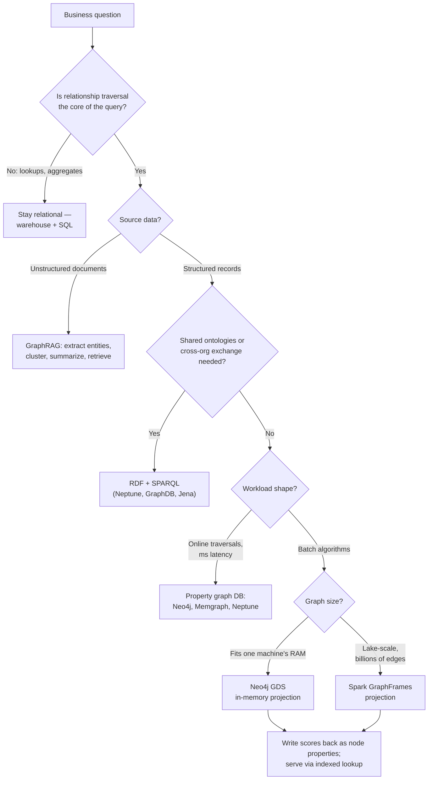

# Graph Analytics

Graph analytics models entities as nodes and relationships as first-class edges, then answers questions that relational databases handle poorly: "who is connected to whom, through what, and how far?" Fraud rings, dependency blast radius, influence ranking, recommendations, knowledge graphs — in each case the relationships *are* the data, and traversing them in SQL means recursive CTEs of unknown depth or a wall of self-joins.

The craft is not "put data in Neo4j." It is four decisions made in the right order: whether a graph is justified at all, which data model (property graph or RDF), which engine for your scale and latency, and which algorithm actually answers the business question. Most failed graph projects got decision one or four wrong and never noticed.

## When NOT to Use This

- **Lookups and aggregates dominate.** "Revenue by region by month" is a warehouse query. A graph database used as a lookup store is pure overhead.
- **Fixed, shallow joins.** Two or three joins of known depth are what relational engines are optimized for. A recursive CTE handles a 3-level org chart fine.
- **You cannot name the traversal.** If no core query starts at a node and walks edges of variable or unknown depth, you do not have a graph problem yet.
- **The graph would be tiny and static.** A few thousand nodes queried occasionally fits in NetworkX in-process; standing up a database is ceremony.
- **Single-hop semantic search.** "Find docs similar to this question" is vector RAG. Reach for GraphRAG only when questions are multi-hop or corpus-global (see Worked Example 2).

## Decision Framework

### Choice 1 — Graph vs relational

| Signal | Relational wins | Graph wins |
|---|---|---|
| Query shape | Aggregations, filters, reports | Variable-depth traversal, path finding, pattern matching |
| Join depth | Fixed, 1–3 joins | 4+ self-joins or unknown depth ("friends of friends of...") |
| Performance profile | Degrades with row count | Degrades with edges *touched*, not total size (index-free adjacency) |
| Consistency needs | Cross-table transactions, strict reporting | Relationship-local reads; graph is often a secondary index synced from a source of truth |
| Team and tooling | Everyone knows SQL; BI stack exists | Cypher/Gremlin learning curve; thinner tooling |

Honest trade-off: a graph is usually an *additional* system, not a replacement. You pay sync, schema-versioning, and operational cost. The three-join heuristic: if your defining query needs more than three self-joins or a recursive CTE with unbounded depth, the graph pays for itself; below that, it rarely does.

### Choice 2 — Property graph vs RDF

| Dimension | Property graph (default) | RDF / triple store |
|---|---|---|
| Model | Nodes and relationships, both with key-value properties | Subject–predicate–object triples, IRIs as global identifiers |
| Query language | Cypher / openCypher, Gremlin | SPARQL 1.1 |
| Strengths | Intuitive modeling, fast deep traversals, rich algorithm libraries | W3C standards, cross-org data exchange, federation (`SERVICE`), OWL/RDFS inference |
| Weaknesses | Proprietary-ish dialects, weak standardization across vendors | Modeling ceremony (reification for edge properties), generally slower deep traversals |
| Choose when | Internal analytics, fraud, recommendations, GraphRAG | Publishing/consuming linked data, regulated ontology-driven domains (life sciences, government), reasoning over class hierarchies |

Default to property graphs. RDF earns its keep only when interoperability or formal inference is the actual requirement — not because "knowledge graph" sounds like it needs an ontology. When it does apply, the payoff is queries over a *shared* vocabulary with inference doing the joins:

```sparql
# "Which of our drugs interact with anything approved in the EU?"
# rdfs:subClassOf inference lets ?drug match every subclass of ex:Drug
PREFIX ex: <https://example.org/pharma#>
SELECT ?drug ?interacting
WHERE {
  ?drug        a ex:Drug ;
               ex:interactsWith ?interacting .
  ?interacting ex:approvedIn "EU" .
}
```

### Choice 3 — Engine

| Engine | Sweet spot | Trade-offs |
|---|---|---|
| **Neo4j** + Graph Data Science (GDS) | General-purpose OLTP traversals plus in-memory batch algorithms on one machine | Mature Cypher and algorithm library; single-instance memory ceiling for GDS projections; licensing costs at enterprise tier |
| **Memgraph** | Real-time, high-write streaming graphs; ms-latency traversals | In-memory-first (RAM budget = graph size); Cypher-compatible; MAGE algorithm library is younger than GDS |
| **Amazon Neptune** | Managed AWS-native; serves both openCypher/Gremlin *and* SPARQL | No in-database algorithms — batch analytics needs the separate Neptune Analytics engine; less control, AWS lock-in |
| **Spark GraphFrames** | Lake-scale batch algorithms over data already in Parquet/Delta; no graph DB required | Not a database — no online traversals; job latency in minutes; joins under the hood, so iterative algorithms are slower per-edge than native engines |
| **SQL recursive CTE** | Shallow, bounded hierarchies inside an existing warehouse | Free — no new system; collapses on deep/unbounded traversal or graph-global algorithms |

### Choice 4 — Algorithm to business question

| Business question | Algorithm | Notes |
|---|---|---|
| "Which accounts belong to the same ring?" | Weakly Connected Components (WCC) | Near-linear; always the cheap first pass |
| "What are the natural clusters?" | Louvain / Leiden community detection | Leiden fixes Louvain's badly-connected communities; both need undirected projections |
| "Who is most influential / highest-risk by association?" | PageRank (personalized with seed nodes) | Global influence weighted by neighbors' influence, not raw edge count |
| "Who has the most direct connections?" | Degree centrality | Also your super-node detector |
| "Who brokers between groups? Where is the bottleneck?" | Betweenness centrality | Expensive — run on subgraphs, not the full graph |
| "How do I get from A to B? How close are these entities?" | Dijkstra / A* shortest path, Yen's k-shortest | Weighted edges make it routing/cost analysis |
| "What should this user buy next?" | Node similarity (Jaccard/overlap) or personalized PageRank on bipartite graph | Batch-compute, serve as precomputed lists |
| "What does the corpus say about X across documents?" | GraphRAG: entity extraction, Leiden communities, community summaries | An indexing pattern, not a single algorithm |



## Process

1. **List the top 10 questions first.** Write them as sentences ("find accounts within 3 hops of a flagged device"). The schema falls out of the questions, never out of the ER diagram.
2. **Apply the three-join test** (Choice 1). If no question survives it, stop — deliver SQL and save the client a system.
3. **Pick the model** (Choice 2) and **the engine** (Choice 3). Record both decisions and their rejected alternatives in an ADR — graph migrations are as painful as relational ones.
4. **Design the schema from query patterns.** Nodes for things you start traversals from or land on; relationships for anything you traverse; properties for anything you only filter or return. Promote a property to a node the moment you need to traverse *through* it.
5. **Create constraints and indexes before loading.** Uniqueness constraints make `MERGE` idempotent and fast; without them, bulk loads silently create duplicates.
6. **Load: bulk tool for cold start, idempotent MERGE for increments.** Neo4j: `neo4j-admin database import full` for the initial load, parameterized `UNWIND ... MERGE` batches for ongoing sync.
7. **Profile the top queries** with `PROFILE`/`EXPLAIN` against production-scale data. Check the degree distribution — real graphs are power-law, and your synthetic test data is not.
8. **Run algorithms in batch over projections** (GDS or GraphFrames), write results back as node properties, and serve them through indexed lookups — never compute PageRank inside a request.
9. **Operationalize.** Schedule the batch jobs, version the schema, monitor p95 traversal latency and projection memory, and re-run algorithms on a cadence matched to how fast the graph changes.

## Schema and Query Patterns (Neo4j 5 / Cypher)

```cypher
// 1. Constraints before load — they back MERGE with an index and enforce identity
CREATE CONSTRAINT account_id IF NOT EXISTS
FOR (a:Account) REQUIRE a.id IS UNIQUE;

CREATE CONSTRAINT device_fp IF NOT EXISTS
FOR (d:Device) REQUIRE d.fingerprint IS UNIQUE;

CREATE INDEX used_device_seen IF NOT EXISTS
FOR ()-[r:USED_DEVICE]-() ON (r.last_seen);

// 2. Idempotent incremental load (cold loads: neo4j-admin database import full)
UNWIND $rows AS row
MERGE (a:Account {id: row.account_id})
MERGE (d:Device  {fingerprint: row.device_fp})
MERGE (a)-[r:USED_DEVICE]->(d)
  ON CREATE SET r.first_seen = datetime(row.ts)
SET r.last_seen = datetime(row.ts);

// 3. Bounded traversal — always cap depth and constrain relationship types
MATCH (a:Account {id: $id})-[:USED_DEVICE|USED_IP*1..4]-(other:Account)
WHERE other.is_flagged
RETURN DISTINCT other.id AS flagged_neighbor
LIMIT 25;

// 4. Recommendation on a bipartite purchase graph
MATCH (u:User {id: $id})-[:PURCHASED]->(p:Product)<-[:PURCHASED]-(peer:User)
MATCH (peer)-[:PURCHASED]->(rec:Product)
WHERE NOT (u)-[:PURCHASED]->(rec)
RETURN rec.id, count(DISTINCT peer) AS strength
ORDER BY strength DESC LIMIT 10;
```

Batch algorithms run on an in-memory **projection** (GDS 2.x):

```cypher
// Project only the subgraph the algorithm needs — never "everything"
CALL gds.graph.project(
  'rings',
  ['Account', 'Device', 'IpAddress'],
  {
    USED_DEVICE: {orientation: 'UNDIRECTED'},
    USED_IP:     {orientation: 'UNDIRECTED'}
  }
);

// Cheap first pass: connected components, persisted as a property
CALL gds.wcc.write('rings', {writeProperty: 'component_id'})
YIELD componentCount;

// Community detection inside candidate components
CALL gds.louvain.stream('rings')
YIELD nodeId, communityId
RETURN gds.util.asNode(nodeId).id AS entity, communityId;

// Influence / risk propagation
CALL gds.pageRank.write('rings', {
  maxIterations: 20,
  dampingFactor: 0.85,
  writeProperty: 'rank'
});

// Projections hold RAM — drop when the batch is done
CALL gds.graph.drop('rings');
```

Pathfinding is the one algorithm family that *does* run online — a single weighted shortest path touches few edges and returns in milliseconds:

```cypher
// Cheapest route between two logistics hubs on a weighted projection
MATCH (a:Hub {code: 'ORD'}), (b:Hub {code: 'AMS'})
CALL gds.shortestPath.dijkstra.stream('logistics', {
  sourceNode: a,
  targetNode: b,
  relationshipWeightProperty: 'transit_hours'
})
YIELD totalCost, nodeIds
RETURN totalCost AS hours,
       [id IN nodeIds | gds.util.asNode(id).code] AS route;
```

## Graph at Scale — Spark GraphFrames

When the edges already live in the lake and exceed one machine's RAM, project them into GraphFrames instead of forcing them through a graph database.

```python
# spark-submit --packages graphframes:graphframes:<version matching your Spark/Scala>
from pyspark.sql import SparkSession
from graphframes import GraphFrame

spark = SparkSession.builder.appName("ring-detection").getOrCreate()
# connectedComponents requires a checkpoint dir
spark.sparkContext.setCheckpointDir("s3://analytics-bucket/checkpoints/")

vertices = (spark.read.parquet("s3://lake/accounts/")
            .selectExpr("account_id AS id", "risk_tier"))
edges = (spark.read.parquet("s3://lake/identity_links/")
         .selectExpr("src_account AS src", "dst_account AS dst", "link_type"))

g = GraphFrame(vertices, edges)

components = g.connectedComponents()               # near-linear candidate pass
ranks      = g.pageRank(resetProbability=0.15, tol=0.01)
communities = g.labelPropagation(maxIter=5)        # cheap communities at lake scale

(components.groupBy("component").count()
 .filter("count BETWEEN 5 AND 500")
 .join(components, "component")
 .write.mode("overwrite").parquet("s3://lake/ring_candidates/"))
```

Trade-off to state out loud: GraphFrames implements algorithms as DataFrame joins, so per-iteration cost is higher than a native engine — but it scales horizontally and skips the export-to-graph-DB step entirely. Use it for periodic batch scoring, never for online traversal.

## Worked Example 1 — Fraud Rings at a Payments Fintech

**Scenario.** "Lumapay" has 8M accounts. Rule-based flags on shared attributes catch rings at 31% review precision — analysts drown in false positives. Data: accounts, 3.1M device fingerprints, 5.4M IPs; edges `USED_DEVICE` (19M), `USED_IP` (52M), `PAYS` (140M).

**Decisions and rationale.**

- **Engine: Neo4j + GDS, not Spark** — the ring projection is ~16.5M nodes / 71M relationships, which fit in a 42 GB projection on a single 128 GB machine. We chose the single-node path because a 3-person team should not operate a Spark cluster for a graph that fits in RAM.
- **Excluded `PAYS` from the projection** — payment edges connect unrelated legitimate customers through shared merchants, which welds separate rings into one meaningless blob. Identity-sharing edges (device, IP) are what *define* a ring, so only they go in.
- **Degree cap before algorithms** — 0.02% of IP nodes (corporate NAT, airport wifi) had degree > 1,000 and merged 60% of accounts into one component. We dropped edges through IPs above degree 1,000 at projection time; the largest component fell from 4.9M accounts to 12k. Super-nodes are found by profiling degree distribution, not by intuition.
- **WCC first, Louvain second, betweenness last** — WCC is near-linear, so it runs on everything and prunes the graph to candidates; components sized 5–500 go to Louvain (2–4 shared devices is a household, > 500 is infrastructure artifact); betweenness runs only inside flagged communities to surface broker/mule accounts, because betweenness on the full graph would take hours for answers nobody asked for.
- **Personalized PageRank seeded from 14k confirmed-fraud accounts** writes `fraud_proximity` onto every account nightly. The risk API reads it as an indexed property in ~2 ms — the request path never traverses.

**Inputs → outputs.** Nightly batch: 41 minutes end-to-end. 3,860 candidate rings surfaced; review precision rose from 31% to 74%; $2.3M in fraudulent volume blocked in the first quarter. The decisive changes were the degree cap and dropping `PAYS` — the algorithms were stock.

## Worked Example 2 — GraphRAG over Engineering Docs

**Scenario.** "Northstar" has 12,400 internal docs (ADRs, runbooks, service READMEs). Vector RAG answers "what does service X do" but fails multi-hop questions like "what breaks downstream if we deprecate ledger-api v2?" — no embedding connects the deprecation notice to a runbook three dependency hops away.

**Pipeline.** Chunk (12,400 docs → 88,700 chunks of ~800 tokens) → extract entities/relations per chunk with Claude → `MERGE` into Neo4j on canonical names → Leiden communities → one Claude summary per community → query-time retrieval: *local* search (match entities, expand 2-hop neighborhood) for specific questions, *global* search (map-reduce over community summaries) for corpus-wide ones.

```python
import json
import anthropic

client = anthropic.Anthropic()  # reads ANTHROPIC_API_KEY from the environment

SCHEMA = {
    "type": "object",
    "additionalProperties": False,
    "required": ["entities", "relations"],
    "properties": {
        "entities": {"type": "array", "items": {
            "type": "object", "additionalProperties": False,
            "required": ["name", "type"],
            "properties": {
                "name": {"type": "string"},
                "type": {"type": "string",
                         "enum": ["service", "team", "database", "api", "concept"]}}}},
        "relations": {"type": "array", "items": {
            "type": "object", "additionalProperties": False,
            "required": ["source", "target", "type"],
            "properties": {
                "source": {"type": "string"},
                "target": {"type": "string"},
                "type": {"type": "string",
                         "enum": ["depends_on", "owns", "reads_from",
                                  "writes_to", "documents"]}}}},
    },
}

def extract(chunk: str) -> dict | None:
    response = client.beta.messages.create(
        model="claude-fable-5",
        max_tokens=4096,
        betas=["server-side-fallback-2026-07-01"],
        fallbacks="default",  # server-side reroute for rare classifier declines
        output_config={"format": {"type": "json_schema", "schema": SCHEMA}},
        messages=[{
            "role": "user",
            "content": ("Extract every entity and relation from this engineering "
                        "document chunk. Use canonical service names.\n\n"
                        f"<chunk>\n{chunk}\n</chunk>"),
        }],
    )
    if response.stop_reason == "refusal":
        return None  # log and skip the chunk; do not retry the same prompt
    text = next(b.text for b in response.content if b.type == "text")
    return json.loads(text)
```

**Decisions and rationale.**

- **Graph extraction over vector-only** because the failing questions were dependency traversals — retrieval had to follow `depends_on` edges, not similarity scores. We kept the vector index for single-hop questions and put a router in front: hybrid beats either alone.
- **Strict structured outputs over free-form JSON prompting** because an 89k-call corpus pass cannot tolerate a 2% parse-failure rate. The `json_schema` format made parse failures effectively zero and deleted the retry scaffolding.
- **Enum-locked relation types (5 predicates)** because the pilot with open-ended extraction produced 900+ near-duplicate predicates ("depends on", "depends-on", "requires"). A closed vocabulary is a schema decision, not a prompt tweak.
- **Message Batches API for the corpus pass** because extraction is not latency-sensitive and batch pricing halves the largest cost in the whole system. Deltas (~300 changed docs/week) re-extract incrementally, so the corpus pass is paid once.

**Inputs → outputs.** 88,700 chunks → 41k entities, 118k relations after canonical `MERGE`; Leiden produced 1,850 communities, each summarized once. On a 100-question multi-hop eval, correct-and-complete answers rose from 38% (vector RAG) to 81% (hybrid GraphRAG). Global questions ("summarize our single points of failure") went from unanswerable to answerable via community summaries.

## Anti-Patterns

| Symptom | Why it fails | Do instead |
|---|---|---|
| Graph DB used for key-value lookups | No traversal means no benefit — you bought operational cost for nothing | Relational or document store; graph only where relationships are the query |
| Unbounded expansion `[*]` in queries | Exponential path explosion; query never returns on real data | Cap depth (`*1..4`), constrain relationship types, `LIMIT` results |
| Super-nodes left in projections | One million-edge node welds the graph together; components and communities become meaningless | Profile degree distribution; cap or drop high-degree nodes at projection time |
| Running algorithms in the request path | PageRank takes seconds and hogs projection memory; APIs need milliseconds | Batch-compute nightly, write scores as properties, serve via indexed lookup |
| Community detection on directed projections | Modularity assumes undirected edges — Leiden errors, Louvain gives skewed communities | Project with `orientation: 'UNDIRECTED'` |
| Traversable data stored as properties | You cannot walk through a property ("category" string on a product) | Promote shared, traversed attributes to nodes |
| Testing on small synthetic graphs | Real graphs are power-law; uniform test data hides super-node and depth blowups | Test with production-scale, production-shaped data before launch |
| GraphRAG for every RAG problem | Per-chunk extraction is the dominant cost; single-hop questions don't need it | Vector RAG for single-hop; GraphRAG for multi-hop and corpus-global questions |

## Checklist

```
Graph analytics readiness
[ ] Top 10 business questions written as traversal sentences
[ ] Three-join test applied — graph justified over SQL/recursive CTE
[ ] Model chosen (property graph default; RDF only for interop/inference) and recorded in an ADR
[ ] Engine chosen against scale, latency, and team constraints
[ ] Schema derived from query patterns; traversed attributes are nodes, not properties
[ ] Uniqueness constraints and indexes created BEFORE first load
[ ] Bulk load path (admin import) and incremental path (idempotent MERGE) both defined
[ ] Degree distribution profiled; super-node policy (cap/drop/split) decided
[ ] Every variable-length query has a depth cap and a LIMIT
[ ] Algorithms mapped to questions (WCC/Louvain/PageRank/betweenness/paths) with cheap passes first
[ ] Batch jobs write results back as properties; request path is index-lookup only
[ ] Projections dropped after batch runs; projection memory monitored
[ ] Schema versioned; sync from source-of-truth system defined and monitored
[ ] Queries profiled (PROFILE/EXPLAIN) at production scale
[ ] GraphRAG only: extraction schema enum-locked, corpus pass batched, delta re-extraction defined
```

## 10 Rules

1. **Model from the queries, not the domain.** Write the top 10 questions before the first node label; an ER diagram translated 1:1 into a graph is almost always wrong.
2. **If you cannot name the traversal, you do not need a graph.** "It feels connected" is not a query pattern.
3. **Constraints before load, always.** Idempotent `MERGE` without a uniqueness constraint is slow and silently duplicative.
4. **Cap every variable-length expansion.** An unbounded `[*]` is an outage on a power-law graph, and all real graphs are power-law.
5. **Hunt super-nodes at load time, not incident time.** Profile the degree distribution on day one and write the cap policy down.
6. **Batch computes, properties serve.** No algorithm ever runs inside an API request; the request path reads precomputed, indexed properties.
7. **Property graphs by default; RDF only when interoperability is the requirement.** An ontology you invented for yourself is a property graph with extra ceremony.
8. **Undirected projections for communities, direction for traversal.** Mixing these up produces confident, wrong clusters.
9. **A graph under ~100M edges does not need a cluster.** One well-sized machine with GDS beats a Spark job on cost, latency, and simplicity; go to GraphFrames when the lake is the source and RAM runs out.
10. **The graph is usually a secondary index — treat it like one.** Sync it from the system of record, version its schema, and be able to rebuild it from scratch; a graph you cannot rebuild is a liability.

## References

- Neo4j Graph Data Science Manual — neo4j.com/docs/graph-data-science
- GraphFrames user guide — graphframes.github.io/graphframes
- Edge et al., "From Local to Global: A Graph RAG Approach to Query-Focused Summarization" (arXiv:2404.16130)
- Robinson, Webber, Eifrem, *Graph Databases*, 2nd ed. (O'Reilly)
- W3C SPARQL 1.1 Query Language — w3.org/TR/sparql11-query
