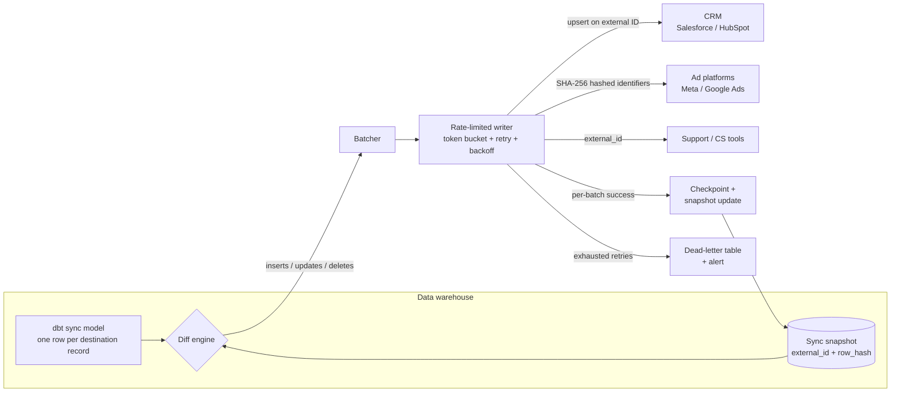

# Reverse ETL

Reverse ETL is the practice of pushing modeled data *out* of the warehouse and *into* the operational tools where business teams actually work: lead scores into Salesforce, predicted LTV into Meta and Google Ads audiences, churn risk into the support desk. The warehouse holds the richest, most-joined view of every customer — but a sales rep never queries Snowflake. Activation means putting one clean number in the field a rep already looks at.

Technically, reverse ETL is the mirror image of ingestion, and harder in one specific way: destinations are third-party SaaS APIs with rate limits, batch-size caps, partial-failure semantics, and their own identity models. A pipeline that is 99.9% reliable per row still corrupts thousands of CRM records per million synced if the remaining 0.1% is handled wrong. The whole discipline is: **compute the minimal change set, write it idempotently, and prove what state the destination is in.**

**When NOT to use this:**

- **Sub-second personalization** (in-session recommendations, live paywalls) — reverse ETL is minutes-fresh at best. Use event streaming or an in-app feature store.
- **App-to-app plumbing with no modeling** ("new Shopify order → Slack message") — that's iPaaS/native-integration territory; routing it through the warehouse adds latency and a failure domain for nothing.
- **Reporting** — if the consumer is a human reading numbers, that's BI. Reverse ETL is for fields other *software* acts on.
- **Data the destination must not hold** — regulated attributes (health, precise location, protected-class inference) copied into a CRM inherit the CRM's weaker access controls and retention. Model the decision in the warehouse; sync only the verdict (`eligible: true`), not the inputs.
- **One-off backfills** — a CSV import through the destination's admin UI is cheaper and leaves an audit trail the ops team already understands.

## Decision Framework

Four decisions determine the architecture. Make them in this order.

### 1. Build vs buy

| Option | Strengths | Honest costs |
|---|---|---|
| **Managed tool** (Hightouch; Census, acquired by Fivetran in 2025; Twilio Segment Reverse ETL; RudderStack) | Diff engine, retries, rate-limit handling, observability, and 100+ destination connectors out of the box; live in days | Priced on destinations/fields/rows — cost scales with success; connector behavior is a black box when a sync corrupts data; exotic or internal destinations may not exist |
| **Custom (warehouse SQL + worker)** | Full control of diff logic, batching, and error semantics; flat infra cost at scale; works for internal/on-prem APIs no vendor supports | You own every rate-limit change, API deprecation, and 3 a.m. dead-letter page; realistic build is 4–8 engineer-weeks *per destination class*, forever maintained |
| **Open source** | Appears free | The flagship OSS reverse ETL tool (Grouparoo) shut down in 2022 after its team joined Airbyte — the category has no healthy standalone OSS option. Budget as "custom with a head start," not as "buy" |

Default: **buy for standard SaaS destinations, build only for destinations vendors don't cover or when row volume makes per-row pricing absurd.** The diff/idempotency/identity design below is required either way — buying a tool outsources the plumbing, not the decisions.

### 2. Sync mode

| Mode | How it works | Choose when | Trade-off |
|---|---|---|---|
| **Full sync** | Rewrite every row every run | < ~10k rows, or destination has no stable keys | Simple and self-healing, but burns API quota, spams destination automations (every record "modified" every run), and hides real changes in noise |
| **Incremental diff** (default) | Compare model output to a snapshot of last-synced state; write only adds/changes/deletes | Almost always | Requires snapshot state and a hash discipline; a lost snapshot forces one full resync |
| **Streaming / CDC** | Emit changes from a stream or warehouse change feed as they land | Freshness SLA under ~5 minutes | Most moving parts; per-event API calls forfeit batch endpoints, colliding with rate limits at exactly the volumes where streaming seemed attractive |

### 3. Write behavior per destination

| Behavior | Semantics | Use for |
|---|---|---|
| **Upsert** (default) | Insert if absent, update if present, keyed on external ID | CRM fields, user attributes |
| **Update-only** | Never create; skip unmatched rows | Enriching records another system owns — prevents the classic bug of flooding the CRM with skeleton contacts |
| **Append** | Insert only, never mutate | Event/activity streams (e.g. Braze events) |
| **Mirror** | Upsert + delete/remove rows that left the model | Ad audiences and static lists — membership must *shrink* when users no longer qualify |

### 4. Trigger

Schedule-based syncs silently ship yesterday's model if dbt runs late. Prefer **pipeline-triggered**: fire the sync as the final step after the transform job succeeds (dbt Cloud job-completion webhook, or the last task in the Airflow/Dagster DAG). Use a fixed schedule only when the upstream model's own cadence is contractual.

## Architecture



The load-bearing detail: the snapshot is updated **only after the destination confirms the write**. If the worker dies mid-run, unconfirmed rows still differ from the snapshot and are re-emitted next run — and because writes are idempotent upserts, the replay is harmless. At-least-once delivery + idempotent writes = effectively-once outcome.

## Process

1. **Start from the operational question, not the table.** "Which field, on which object, does which team act on, and what happens if it's wrong?" A sync nobody acts on is cost with no revenue.
2. **Build a sync model per destination object.** One warehouse view per destination object (`salesforce_account_sync`), one row per destination record, stable external ID first column. The sync reads *only* this model — never raw tables.
3. **Resolve identity before writing code.** Pick the matching key per destination (table below), measure match rate in SQL first. Under ~90% match, fix identity — a sync that writes 60% of rows is worse than none, because it looks done.
4. **Choose sync mode and write behavior** per the framework above; document both in the model's YAML description.
5. **Implement the diff.** Hash the payload columns per row; compare against the snapshot; emit `insert` / `update` / `delete` ops.
6. **Implement the idempotent writer.** Batch to the destination's documented cap, upsert on the external ID, token-bucket under the rate limit, honor `Retry-After` on 429, exponential backoff on 5xx, checkpoint per batch.
7. **Add a dead-letter table.** Rows that fail all retries land in `ops.sync_dead_letter` with the payload, error body, and timestamp. Alert on rows > 0; never silently drop.
8. **Wire observability.** Per run, record rows scanned / changed / written / failed and run duration. Alert on: zero changes for N runs (upstream froze), change ratio > 20% (schema or logic change), failure ratio > 1%.
9. **Rehearse the resync.** Deliberately drop the snapshot in staging and confirm a full rebuild completes inside rate limits. You will need this after every backfill.
10. **Write the runbook**: how to pause the sync, how to replay dead letters, who owns the destination field mapping.

## Identity Resolution

The warehouse joins on `user_id`; destinations do not. Per-destination matching keys:

| Destination | Preferred key | Notes |
|---|---|---|
| Salesforce | Custom External ID field (e.g. `Warehouse_Id__c`) | Upsert against the external ID endpoint — never match on name/email, which are neither unique nor immutable in Salesforce |
| HubSpot | `email` via batch upsert `idProperty` | HubSpot dedupes contacts on email natively; normalize (trim, lowercase) before matching |
| Meta Custom Audiences | SHA-256 of normalized email/phone | Meta requires trim + lowercase *before* hashing; a stray space produces a valid-looking hash that never matches |
| Google Ads Customer Match | SHA-256 of normalized email/phone | Same normalization rules; uploads process asynchronously via offline user data jobs |
| Support/CS tools (Zendesk, etc.) | `external_id` field | Set it at user creation from your app; retrofitting via email match is lossy |

```python
import hashlib

def hash_identifier(raw_email: str) -> str:
    """Normalize exactly as Meta and Google Ads require: trim, lowercase, then SHA-256."""
    return hashlib.sha256(raw_email.strip().lower().encode("utf-8")).hexdigest()
```

Rules: normalize in one shared function used by both the match-rate query and the writer; never fuzzy-match into a system of record (a wrong-but-plausible CRM update is far costlier than a skipped row); log unmatched rows to the dead-letter table so match rate is a monitored metric, not a launch-day guess.

## The Diff Engine

The sync model (dbt, Snowflake syntax):

```sql
-- models/reverse_etl/salesforce_account_sync.sql
-- One row per destination record. Stable key first. Only columns being synced.
select
    account_id                          as external_id,
    round(pql_score)                    as pql_score,       -- integer band: float jitter must not count as a change
    pql_tier,
    seats_active_30d,
    last_product_activity_at::date      as last_activity_date
from {{ ref('fct_account_health') }}
where is_deleted = false
```

The diff against the last-synced snapshot:

```sql
-- Emits only rows that must be written this run.
with current_state as (
    select
        *,
        md5(concat_ws('|',
            coalesce(cast(pql_score as varchar), ''),
            coalesce(pql_tier, ''),
            coalesce(cast(seats_active_30d as varchar), ''),
            coalesce(cast(last_activity_date as varchar), '')
        )) as row_hash
    from analytics.salesforce_account_sync
),
last_synced as (
    select external_id, row_hash
    from ops.sync_snapshot__salesforce_account
)
select c.*,
       case when l.external_id is null then 'insert' else 'update' end as op
from current_state c
left join last_synced l using (external_id)
where l.external_id is null or l.row_hash <> c.row_hash

union all

-- Deletes: rows that left the model (mirror mode only)
select l.external_id, null, null, null, null, l.row_hash, 'delete'
from last_synced l
left join current_state c using (external_id)
where c.external_id is null
```

Hash only the synced payload columns. Hashing `updated_at` or any always-moving column turns every run into a full sync.

## The Idempotent Writer

Production-shaped worker (HubSpot batch upsert; the same skeleton fits any batch API):

```python
"""Rate-limited, idempotent writer: warehouse diff rows -> HubSpot contacts."""
import os
import time
import requests

HUBSPOT_TOKEN = os.environ["HUBSPOT_PRIVATE_APP_TOKEN"]
BATCH_SIZE = 100          # HubSpot batch endpoints accept at most 100 inputs
REQUESTS_PER_10S = 150    # headroom under the 190-requests/10s private-app limit


class TokenBucket:
    def __init__(self, rate: int, per_seconds: float):
        self.capacity = rate
        self.tokens = float(rate)
        self.rate = rate / per_seconds
        self.updated = time.monotonic()

    def take(self) -> None:
        while True:
            now = time.monotonic()
            self.tokens = min(self.capacity, self.tokens + (now - self.updated) * self.rate)
            self.updated = now
            if self.tokens >= 1:
                self.tokens -= 1
                return
            time.sleep((1 - self.tokens) / self.rate)


bucket = TokenBucket(REQUESTS_PER_10S, 10.0)


def upsert_batch(rows: list[dict]) -> None:
    """Upsert one batch keyed on email. Retries 429/5xx; raises after exhaustion."""
    payload = {
        "inputs": [
            {
                "id": r["email"],          # stable key -> replaying this batch is harmless
                "idProperty": "email",
                "properties": {
                    "churn_risk_score": r["churn_risk_score"],
                    "ltv_decile": r["ltv_decile"],
                },
            }
            for r in rows
        ]
    }
    for attempt in range(5):
        bucket.take()
        resp = requests.post(
            "https://api.hubapi.com/crm/v3/objects/contacts/batch/upsert",
            json=payload,
            headers={"Authorization": f"Bearer {HUBSPOT_TOKEN}"},
            timeout=30,
        )
        if resp.status_code == 429:
            time.sleep(float(resp.headers.get("Retry-After", 2 ** attempt)))
            continue
        if resp.status_code >= 500:
            time.sleep(2 ** attempt)
            continue
        resp.raise_for_status()
        return
    raise RuntimeError(f"batch failed after retries: {resp.status_code} {resp.text[:200]}")


def run_sync(diff_rows: list[dict], checkpoint) -> None:
    for i in range(0, len(diff_rows), BATCH_SIZE):
        batch = diff_rows[i : i + BATCH_SIZE]
        try:
            upsert_batch(batch)
            checkpoint.mark_synced(batch)   # advance snapshot ONLY after confirmed write
        except RuntimeError:
            checkpoint.mark_failed(batch)   # dead-letter; snapshot untouched -> retried next run
```

### Rate-limit and batch-size cheat sheet

Verify against current docs at build time — vendors change these — but as of mid-2026:

| Destination | Batch cap | Rate limit | Strategy |
|---|---|---|---|
| Salesforce REST (sObject Collections) | 200 records/request | Daily org-wide API allocation (edition + license based) | Small diffs; watch the *daily* budget, not per-second |
| Salesforce Bulk API 2.0 | 150 MB per ingest job upload | 150M records / rolling 24 h | Anything over ~10k rows per run |
| HubSpot (private app, Pro/Enterprise) | 100 inputs per batch call | 190 requests / 10 s + daily cap | Token bucket at ~150/10 s |
| Braze `/users/track` | 75 attribute objects/request | 50,000 requests / min | High ceiling; batch anyway |
| Meta Custom Audiences | 10,000 users/request | Dynamic (business-use-case throttling) | Back off on throttle errors; don't hardcode a rate |
| Google Ads Customer Match | 100,000 identifiers per add-operations request | Job-based, asynchronous | Poll job status; don't assume synchronous success |

## Worked Example 1: PQL Scores from Snowflake to Salesforce

**Scenario.** Meridian, a B2B SaaS with 240,000 accounts in Salesforce, scores product-qualified leads nightly-plus-hourly in Snowflake (`pql_score` 0–100, `pql_tier`, `seats_active_30d`). Sales wants scores on the Account page, at most one hour stale.

**Naive plan and why it dies.** Full hourly sync = 240,000 upserts/hour. Via sObject Collections (200 records/call) that is 1,200 calls/hour → 28,800 calls/day — inside a typical Enterprise org's daily allocation, but it consumes a fifth of the shared org budget and, worse, *touches every account 24 times a day*: every field-history entry, every "account updated" Flow, every last-modified timestamp churns even when nothing changed. The admin team vetoes it in the first review. Rightly.

**Decisions and rationale.**

- **Incremental diff**, because measurement showed only ~1.8% of accounts change score materially per day (~4,300 rows/day, ~180 rows in an average hour). We chose diff over full sync because it cuts API usage ~1,300× and stops automation churn — the vetoed problem.
- **`round(pql_score)` in the sync model**, because the ML pipeline emits floats with run-to-run jitter (`61.02` → `61.07`). Without banding, hashing marks ~100% of rows changed every run and the diff engine silently degrades into a full sync. We chose an integer band because no rep acts on 0.05 points.
- **Upsert on `Warehouse_Id__c` external ID**, because Salesforce IDs aren't in the warehouse for accounts created via other channels, and name/email matching mis-writes. External-ID upsert is also what makes replays after a crash safe.
- **Route by diff size: REST under 10k rows, Bulk API 2.0 above.** The normal hour is 1 REST call. But when the model retrains, recalibration touches 100% of accounts — 240,000 rows in one run. That run becomes a single Bulk 2.0 ingest job (well under the 150 MB and 150M-record limits) instead of 1,200 REST calls fighting the org's daily budget.
- **Trigger = dbt job completion webhook**, not a cron, because a 40-minute warehouse delay under cron means syncing stale scores while claiming freshness.

**Outcome.** Typical hour: 180 rows, 1 API call, < 30 s end-to-end. Retrain day: one Bulk job, ~9 minutes. Salesforce API consumption from this sync: < 0.2% of the org's daily allocation.

## Worked Example 2: Predicted-LTV Audience to Meta Ads

**Scenario.** Loft & Larder, an e-commerce brand with 1.9M customers, predicts 90-day LTV in BigQuery. Growth wants the top decile (~190,000 customers) as a Meta Custom Audience to seed lookalikes, refreshed daily.

**Decisions and rationale.**

- **Mirror mode, not append.** An append-only audience only grows: customers who drop out of the top decile stay targeted, and within a quarter the "top decile" audience contains 40%+ stale members quietly degrading lookalike quality and wasting spend. Mirror computes removes from the snapshot: yesterday's members minus today's = the removal batch. This is the single highest-leverage decision in any audience sync.
- **Consent filter inside the sync model** (`where marketing_consent and not erasure_requested`), not in the worker, because putting policy in SQL makes it visible in the dbt DAG, testable, and reviewed with the model — and guarantees an erasure request also produces a *remove* on the next run via mirror mode.
- **Hash with the shared normalizer** (trim → lowercase → SHA-256), because Meta matches on the hash of the *normalized* identifier. During dry-run, 6% of emails had trailing whitespace from a legacy import; without normalization those rows hash validly and match nothing — an invisible 6% audience shrink no error message would ever surface.
- **Sync only the hashed identifier and audience membership — no LTV values.** Meta needs to know *who* is in the audience, not *why*. Minimizing synced attributes shrinks both the privacy surface and the blast radius of a wrong prediction.
- **Batches of 10,000** (Meta's per-request user cap): initial load = 19 requests; steady state, with ~2.4% daily decile churn, ≈ 4,600 adds + 4,600 removes ≈ 2 requests/day.

**Outcome.** Initial load in under a minute of API time; daily refresh is 2 requests; audience match rate 71% (typical for email-only matching — adding hashed phone numbers as a second identifier was the follow-up that raised it to 79%).

## Anti-Patterns

| Symptom | Why it fails | Do instead |
|---|---|---|
| Syncing raw tables straight to the CRM | No stable schema contract; every upstream refactor rewrites CRM fields | Dedicated sync model per destination object |
| Full sync "because it's simpler" | Burns API quota, fires destination automations on unchanged rows, hides real changes | Incremental diff with a snapshot |
| Hashing `updated_at` into the row hash | Every row "changes" every run — the diff *is* a full sync, you just can't tell | Hash only synced payload columns |
| Retry without idempotent keys | Timeout-then-retry duplicates records; ops team finds 3 copies of every account | Upsert on external ID; replays become no-ops |
| Advancing the snapshot before writes confirm | Crash mid-run silently drops the unwritten tail forever | Checkpoint per batch, after destination confirms |
| Fire-and-forget on failures | Two dead rows in a 500k sync go unnoticed for months in the CRM | Dead-letter table + alert on count > 0 |
| Append-mode audience syncs | Audiences only grow; stale members waste spend and poison lookalikes | Mirror mode with computed removes |
| Fuzzy identity matching into a system of record | Wrong-but-plausible CRM writes cost more than skipped rows | Exact keys; dead-letter the unmatched |
| Hardcoding today's rate limit with no backoff | Vendor tightens the limit; sync hard-fails at 2 a.m. | Token bucket + honor `Retry-After` + backoff |
| Syncing every "maybe useful" column | Each field is a contract to maintain and a privacy liability | Sync fields with a named consumer; delete the rest |

## Checklist

```
Design
[ ] Operational question documented: which field, which team, what action
[ ] Sync model per destination object; stable external ID; only needed columns
[ ] Identity key chosen per destination; match rate measured (>90%) before build
[ ] Sync mode chosen (diff by default) and write behavior per destination
[ ] Mirror mode for any audience/list destination
[ ] Consent and erasure filters live in the sync model SQL

Build
[ ] Row hash covers payload columns only (no timestamps, floats banded)
[ ] Upserts keyed on external ID — replay-safe
[ ] Batch size at the destination's documented cap
[ ] Token bucket below the rate limit; Retry-After honored; backoff on 5xx
[ ] Snapshot advanced only after confirmed writes; per-batch checkpoints
[ ] Dead-letter table with payload + error body
[ ] Shared normalization/hashing function for ad-platform identifiers
[ ] Secrets from env/secret manager — never in code or dbt vars

Operate
[ ] Trigger chained to transform completion, not wall clock
[ ] Metrics per run: scanned / changed / written / failed / duration
[ ] Alerts: failures > 1%, zero-change streak, change ratio > 20%
[ ] Full-resync rehearsed in staging within rate limits
[ ] Runbook: pause, replay dead letters, field-mapping owner
[ ] Quarterly field audit: every synced field still has a consumer
```

## 10 Rules

1. **Sync decisions, not data.** The destination needs the score and the tier, not the 14 features that produced them. Every extra column is liability without leverage.
2. **The diff is the product.** Anyone can loop over rows and call an API. The snapshot-compare engine is what makes a sync cheap, quiet, and trustworthy — build or buy it first.
3. **Idempotency is non-negotiable.** If replaying yesterday's entire run would corrupt the destination, the pipeline is broken today — you just haven't crashed yet.
4. **Never advance the checkpoint on hope.** Snapshot updates follow confirmed writes. Everything else is a data-loss bug with a delay timer.
5. **Treat destination rate limits as shared infrastructure.** Your sync competes with every other integration in the org for the same Salesforce daily allocation. Budget it like money.
6. **Mirror mode for anything membership-shaped.** Audiences, static lists, segments: if it can't shrink, it's rotting.
7. **Exact identity or no write.** A skipped row is a metric; a mis-matched write is an incident.
8. **Fail loudly, in a table.** Dead-lettered rows with error bodies turn "the CRM looks weird" into a five-minute diagnosis.
9. **Chain the trigger to the transform.** A sync on a wall-clock schedule is a machine for shipping stale data punctually.
10. **Buy the plumbing, own the decisions.** A vendor can run your retries; it cannot decide your matching keys, your consent filters, or which fields deserve to exist. Those are yours either way — write them down.

## References & Further Reading

- **Salesforce Bulk API 2.0** — developer.salesforce.com → API Guides → Bulk API 2.0: ingest job limits (150 MB upload, 150M records/24 h) and external-ID upsert semantics.
- **Salesforce Composite sObject Collections** — the 200-records-per-request endpoint for small diffs.
- **HubSpot API usage guidelines & CRM batch endpoints** — developers.hubspot.com: private-app rate limits and the `batch/upsert` endpoint with `idProperty`.
- **Meta Marketing API — Custom Audiences** — developers.facebook.com/docs/marketing-api/audiences: identifier normalization + SHA-256 hashing rules, 10,000-user batch cap.
- **Google Ads API — Customer Match** — developers.google.com/google-ads/api: offline user data jobs, hashing requirements, asynchronous job processing.
- **Braze `/users/track`** — braze.com/docs: per-request object caps and endpoint rate limits for attribute/event syncs.
- **dbt exposures** — docs.getdbt.com: declare each reverse ETL sync as an exposure so downstream impact shows up in the DAG before someone renames a column your CRM depends on.
- **Hightouch and Fivetran (Census) documentation** — even when building custom, their public docs on sync modes and diffing are the best map of the managed-tool feature bar you are choosing to rebuild.
