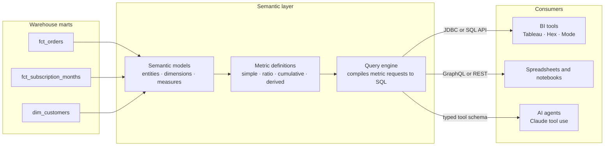

# Semantic Layer

A semantic layer is a metrics compiler: it sits between the warehouse and every consumer, holds the canonical definition of each metric (measure, grain, dimensions, filters), and generates the SQL at query time. Without one, "revenue" is defined independently in Looker, in a Tableau calculated field, in three notebooks, and in the CFO's spreadsheet — and they disagree. Not because anyone is wrong, but because each definition quietly made different calls on refunds, tax, currency timing, and cancellation status. Metric drift is not a tooling failure; it is the default outcome of letting every consumer re-derive business logic. The semantic layer replaces N private definitions with one governed contract that consumers *read* but never *redefine*.

The stakes rose with AI. A text-to-SQL agent pointed at raw tables reproduces metric drift at machine speed — it invents joins, guesses filter conventions, and answers confidently. A semantic layer is the guardrail that turns "generate SQL" into "select from a catalog of governed metrics," which is the difference between an AI analyst you can ship and one you have to apologize for.

**When NOT to use this:**

- **One tool, few consumers.** If a five-person team lives in a single BI tool, well-tested dbt marts plus written definitions in the model docs are cheaper than a new layer. Adopt the layer when the *second* consumer surface appears.
- **Unstable marts.** If the underlying models are mid-refactor or the grain keeps changing, you would be building on quicksand — every upstream change breaks the layer and every consumer behind it. Stabilize entity grain first.
- **Operational lookups and streaming.** "Show me order #4812" and sub-second event-stream processing are not metric queries. Serve those from the application database or a stream processor, not the semantic layer.
- **As a substitute for transformation.** The layer defines *aggregation semantics*, not cleansing, deduplication, or entity modeling. If the data is dirty, fix it in dbt models; a metric on a dirty table is a precisely defined wrong number.

## Decision Framework

### Choice 1 — Where does the metrics layer live?

| Option | Best when | Strengths | Honest trade-offs |
|---|---|---|---|
| **dbt Semantic Layer (MetricFlow)** | dbt is already the transform layer; consumers are internal BI + notebooks | Metrics live in the same repo, PRs, and CI as the models they depend on; JDBC + GraphQL APIs; rich metric types (ratio, cumulative, derived) | Hosted query serving requires dbt Cloud; queries pass through to the warehouse — no built-in caching tier, so latency and cost are the warehouse's |
| **Cube** | Embedded/customer-facing analytics; latency and concurrency SLAs; multi-tenant serving | Pre-aggregations and caching give sub-second p95; SQL API speaks the Postgres wire protocol so BI tools connect as if to a database; REST/GraphQL for product frontends; security context for row-level multi-tenancy | A second modeling layer outside the dbt repo — draw a hard line on which logic lives where, or definitions fork again |
| **LookML (Looker)** | The organization is committed to Looker as its primary BI surface | Mature governed modeling, Explores, access grants | Definitions are coupled to one vendor's BI tool; other consumers reach them only through Looker's API — it is a semantic layer for Looker, not for your company |
| **Metrics-in-marts (no layer)** | Small team, one tool, low metric count | Zero new infrastructure; a `fct_revenue_monthly` table *is* a frozen definition | Every new cut (new dimension, new grain) is a new table; consumers still hand-write the last-mile SQL, which is exactly where drift starts |

### Choice 2 — The remaining key decisions

| Decision | Options | Guidance |
|---|---|---|
| Serving pattern | Warehouse passthrough vs pre-aggregation/cache | Passthrough for internal BI (freshness beats latency); pre-aggregations when p95 < 1s or high concurrency is required (embedded analytics) — hot paths only, TTLs matched to data freshness |
| Governance model | Central data team owns all metrics vs federated domain owners | Central below ~50 metrics; federated with a central review gate beyond that. Either way: exactly one named owner per metric, enforced via CODEOWNERS |
| AI consumption | Free text-to-SQL on raw schema vs constrained tool calls on the metric catalog | Always the catalog. Free-form SQL generation re-creates drift; a typed tool whose enums are the governed metric and dimension names cannot invent a join |
| Change policy | Edit in place vs versioned deprecation | Live metric definitions are append-only: additive changes (a new dimension) are fine; semantic changes ship as a new metric name with a dated deprecation of the old one |

## Architecture



## Metric Spec Anatomy

Whatever the platform, every governed metric decomposes into the same four parts. Get these right and the YAML is transcription; get them wrong and no tool saves you.

| Part | Question it answers | Example |
|---|---|---|
| **Entity** | What thing is being counted, and what are its keys? | `subscription_month` (primary key), `customer` (foreign key) |
| **Grain** | One row per what, as of when? | One row per subscription per calendar month, state as of month end |
| **Measure** | Which column, aggregated how? | `sum(mrr_amount_cents)`, `count_distinct(customer_id)` |
| **Dimensions & filters** | How may it be sliced, and what is included/excluded? | by `plan_tier`, `region`; only `is_active_at_month_end = true` |

The single highest-leverage artifact is the **description as contract**: a metric's description must state inclusions, exclusions, grain, and units ("gross of discounts, net of refunds, excludes tax, integer USD cents, normalized monthly"). If the description can't be written, the definition isn't settled — and the layer would only freeze the ambiguity.

## Process

1. **Audit the drift.** Take the top ~20 metrics. For each, record every place it is computed (BI tool, spreadsheet, notebook), the value each produced last month, and the definitional deltas causing disagreement. This document is the business case and the requirements spec in one.
2. **Settle canonical definitions.** For each metric, get the business owner (Finance for revenue, Growth for activation) to sign one written definition: inclusions, exclusions, grain, units, timezone. This is a meeting problem, not a YAML problem — do it before writing code.
3. **Pick the platform** with the Choice 1 table, and write a one-page decision record stating what you optimized for and what you gave up.
4. **Stabilize entities and grain.** Ensure each metric has a mart at the right grain with stable keys (e.g. `fct_subscription_months`, one row per subscription per month). The layer aggregates; it must not repair.
5. **Define semantic models**: entities (primary/foreign keys), dimensions (time and categorical), measures (column + aggregation). Keep money in integer cents; formatting belongs to consumers.
6. **Define metrics** on top of measures: simple first, then ratio, cumulative, and derived metrics. Every metric gets a contract-grade description and an owner in its metadata.
7. **Wire in CI.** Config validation (`dbt parse`, `mf validate-configs`) on every PR, plus a value-diff job that queries key metrics before/after the change and fails on unexplained movement.
8. **Cut consumers over.** Point BI tools at the layer's JDBC/SQL API, rebuild the top dashboards on governed metrics, and record which legacy definitions each one replaces.
9. **Point AI agents at the catalog**, not the schema — expose metrics and dimensions as a typed tool (see the Claude example below).
10. **Kill the bypasses.** Revoke direct warehouse credentials from BI service accounts where feasible, deprecate duplicate definitions on a dated schedule, and audit query logs quarterly for consumers still going around the layer.

## Worked Example 1 — Meridian Software: three MRRs, one truth (dbt Semantic Layer)

**Scenario.** Meridian, a B2B SaaS at ~$1.3M MRR, reports March MRR three ways: Finance's billing export says **$1,312,400**, the Looker dashboard says **$1,241,900**, the growth team's sheet says **$1,187,300**. The audit (Process step 1) finds the deltas: Finance normalizes annual prepay to /12 at booking; Looker excludes subscriptions with a pending cancellation even when still paid through month end (-$42k); the sheet excludes mid-month trial conversions and nets out refunds against MRR (a further -$55k). Nobody is lying — there are three defensible definitions and zero governed ones.

**Decisions and rationale.**
- **Grain: one row per subscription per month, state as of month end** — because MRR is a point-in-time snapshot metric, and month-end state is the only grain Finance and Growth could both sign (Process step 2). Pending-cancel subscriptions count while paid; refunds are a separate metric, not an MRR adjustment.
- **Annual contracts normalized to /12** — because MRR's purpose is run-rate comparability; recognizing prepay at booking is a cash view that belongs in a different metric.
- **Integer cents** — because float currency math drifts at exactly the moment three teams are reconciling to the dollar.
- **dbt Semantic Layer over Cube** — because all consumers are internal BI and notebooks (no latency SLA), and Meridian's marts are already in dbt: metrics review in the same PRs as the models they depend on.

```yaml
# models/marts/subscriptions/_sem_subscription_months.yml
semantic_models:
  - name: subscription_months
    description: One row per subscription per calendar month, state as of month end.
    model: ref('fct_subscription_months')
    defaults:
      agg_time_dimension: month_start
    entities:
      - name: subscription_month
        type: primary
        expr: subscription_month_id
      - name: customer
        type: foreign
        expr: customer_id
    dimensions:
      - name: month_start
        type: time
        type_params:
          time_granularity: month
      - name: plan_tier
        type: categorical
      - name: is_active_at_month_end
        type: categorical
    measures:
      - name: mrr
        description: Normalized monthly recurring amount in integer USD cents. Annual prepay divided by 12.
        agg: sum
        expr: mrr_amount_cents
      - name: churned_mrr
        description: MRR in cents lost to subscriptions that ended this month.
        agg: sum
        expr: churned_mrr_amount_cents
      - name: active_customers
        agg: count_distinct
        expr: customer_id

metrics:
  - name: mrr
    label: MRR
    description: >
      Monthly recurring revenue, USD cents. Includes subscriptions active at month end
      (pending cancellations count while paid). Excludes one-time fees, tax, and refunds.
      Annual contracts normalized to 1/12 per month. Owner: finance-analytics.
    type: simple
    type_params:
      measure: mrr
    filter: |
      {{ Dimension('subscription_month__is_active_at_month_end') }} = true
    config:
      meta:
        owner: finance-analytics
        tier: gold
  - name: net_new_mrr
    label: Net New MRR
    description: MRR added minus MRR churned in the month. Owner: finance-analytics.
    type: derived
    type_params:
      expr: mrr - mrr_churned
      metrics:
        - name: mrr
        - name: mrr_churned
  - name: mrr_churned
    label: Churned MRR
    type: simple
    type_params:
      measure: churned_mrr
  - name: arpa
    label: Average Revenue per Account
    description: MRR divided by active customers, cents per account.
    type: ratio
    type_params:
      numerator: mrr
      denominator: active_customers
```

**Query it** (MetricFlow CLI locally; the same request serves BI via the Semantic Layer's JDBC/GraphQL APIs):

```bash
mf validate-configs
mf query --metrics mrr,net_new_mrr --group-by metric_time__month,plan_tier --order metric_time__month
```

**Outcome.** One number — $1,258,700 for March under the signed definition — with the Finance and Growth views recreated as *explicitly different metrics* (`bookings_run_rate`, `mrr_net_of_refunds`) instead of silent variants of the same name. The Looker dashboard and the sheet both read from the layer; the reconciliation meeting stopped existing.

## Worked Example 2 — Karvi Goods: embedded seller analytics (Cube)

**Scenario.** Karvi, an e-commerce marketplace, ships a revenue dashboard to 1,800 seller accounts inside its web app. Built on direct Snowflake queries, the dashboard's p95 is **4.2s**, concurrency spikes at 9am queue the warehouse, and dashboard traffic alone costs **~$3,100/month** in compute. Sellers must also never see each other's rows.

**Decisions and rationale.**
- **Cube over dbt Semantic Layer** — because the requirements are sub-second p95, high concurrency, and row-level multi-tenancy in a customer-facing product. dbt SL's passthrough model would send all 1,800 tenants' queries to Snowflake; Cube's pre-aggregations serve them from its cache store.
- **Transformations stay in dbt; only aggregation semantics live in Cube** — because two overlapping modeling layers is how drift restarts. The rule: if it changes a row, it's dbt; if it aggregates rows, it's Cube.
- **Pre-aggregate only the dashboard's hot path** (daily revenue/orders by status) with an hourly refresh — because pre-aggregating everything trades one cost problem for another; the long tail stays passthrough.
- **Expose a view, not the cube** — because views are the public contract; cubes can be refactored behind them without breaking the app.

```yaml
# model/cubes/orders.yml
cubes:
  - name: orders
    sql_table: analytics.fct_orders

    dimensions:
      - name: order_id
        sql: order_id
        type: number
        primary_key: true
      - name: seller_id
        sql: seller_id
        type: number
      - name: status
        sql: status
        type: string
      - name: created_at
        sql: created_at
        type: time

    measures:
      - name: order_count
        type: count
      - name: revenue
        description: Gross merchandise value in integer USD cents, excluding tax.
        sql: amount_cents
        type: sum
        format: currency

    pre_aggregations:
      - name: revenue_daily
        measures:
          - CUBE.revenue
          - CUBE.order_count
        dimensions:
          - CUBE.seller_id
          - CUBE.status
        time_dimension: CUBE.created_at
        granularity: day
        partition_granularity: month
        refresh_key:
          every: 1 hour
```

```yaml
# model/views/seller_revenue.yml
views:
  - name: seller_revenue
    description: Public contract for the seller dashboard. Query this, not the orders cube.
    cubes:
      - join_path: orders
        includes:
          - revenue
          - order_count
          - status
          - created_at
```

Tenant isolation uses Cube's security context: the app's JWT carries `seller_id`, and a `query_rewrite` rule appends a mandatory `orders.seller_id` filter to every query, so isolation is enforced in the layer rather than trusted to frontend code.

**Outcome.** Dashboard p95 dropped from 4.2s to **~150ms** (served from pre-aggregations); Snowflake spend attributable to dashboard traffic fell ~90% because 1,800 tenants now hit hourly-refreshed rollups instead of raw fact scans. The same `seller_revenue` view serves the product frontend over REST and the internal ops team over the SQL API — one definition, two transports.

## Serving Metrics to AI Agents

Free-form text-to-SQL fails for the same reason dashboards drift: the model re-derives business logic per query. The fix is structural, not prompt-based — give the agent a tool whose schema *is* the metric catalog. With enums for metrics and dimensions and `strict: true`, the model cannot reference a table, invent a join, or redefine revenue; the worst case is a refused parameter, not a wrong number.

```python
import anthropic

client = anthropic.Anthropic()

# Generate this tool schema from the semantic layer's catalog (mf list metrics /
# Cube meta API) at deploy time, so the enums never drift from the layer.
QUERY_METRICS_TOOL = {
    "name": "query_metrics",
    "description": (
        "Answer analytics questions by querying governed metrics from the "
        "semantic layer. Call this whenever the user asks about business "
        "numbers. Only listed metrics and dimensions exist; never write raw SQL."
    ),
    "strict": True,
    "input_schema": {
        "type": "object",
        "properties": {
            "metrics": {
                "type": "array",
                "items": {"type": "string", "enum": ["mrr", "net_new_mrr", "arpa"]},
            },
            "group_by": {
                "type": "array",
                "items": {
                    "type": "string",
                    "enum": ["metric_time__month", "plan_tier", "customer__region"],
                },
            },
            "where": {
                "type": ["string", "null"],
                "description": "Optional MetricFlow filter, e.g. {{ Dimension('plan_tier') }} = 'enterprise'",
            },
        },
        "required": ["metrics", "group_by", "where"],
        "additionalProperties": False,
    },
}

response = client.messages.create(
    model="claude-fable-5",
    max_tokens=2048,
    system="You are an analytics assistant. Metric descriptions are the contract; cite them when definitions matter.",
    tools=[QUERY_METRICS_TOOL],
    messages=[{"role": "user", "content": "How is enterprise MRR trending this year?"}],
)

if response.stop_reason == "tool_use":
    call = next(b for b in response.content if b.type == "tool_use")
    # strict=True guarantees call.input validates against the schema, e.g.:
    # {"metrics": ["mrr"], "group_by": ["metric_time__month"],
    #  "where": "{{ Dimension('plan_tier') }} = 'enterprise'"}
    # Execute via the Semantic Layer API / Cube SQL API, return a tool_result,
    # and continue the conversation with the data.
elif response.stop_reason == "refusal":
    pass  # handle before reading content — never index content[0] unconditionally
```

Two rules make this production-grade: **generate the enums from the layer** (a hand-maintained list is one more definition to drift), and **return metric descriptions in tool results** so the agent can tell the user *which* revenue it is quoting.

## Governance and Ownership

- **One owner per metric**, named in metadata (`config.meta.owner`) and enforced by CODEOWNERS on the metric spec paths. Owners approve changes; the data team reviews mechanics.
- **Change management is append-only for semantics.** Additive changes (new dimension, new metric) merge normally. A semantic change — altering what an existing name means — ships as a new metric plus a deprecation entry on the old one with a removal date, announced to consumers found via query logs.
- **CI gates:** `dbt parse` + `mf validate-configs` (or the platform equivalent) on every PR; a value-diff job that runs the top metrics against production data on the PR branch and fails on unexplained movement; spec-lint that rejects any metric missing a description or an owner.
- **Tiering:** mark metrics `gold` (exec/board reporting — owner sign-off required to change), `silver` (team-level), `experimental` (may change without notice). Consumers can see the tier; agents can be restricted to gold and silver.
- **Usage audit quarterly:** metrics unqueried in 90 days get deprecated, not maintained. A shrinking catalog is a healthy catalog.

## Anti-Patterns

| Symptom | Why it fails | Do instead |
|---|---|---|
| Same metric defined separately in each BI tool | Definitions drift independently; reconciliation becomes a standing meeting | Define once in the layer; every tool connects through it |
| Business logic in dashboard calculated fields / LOD expressions | Invisible to review, untested, unversioned — drift's native habitat | Push the logic into the layer; dashboards only select and display |
| "Revenue" with no written inclusion/exclusion contract | Every consumer guesses on tax, refunds, currency, timing — all differently | Description states inclusions, exclusions, grain, and units before the metric ships |
| Text-to-SQL agent on the raw schema | Reproduces metric drift at machine speed, with confidence | Constrain the agent to the metric catalog via a strict typed tool |
| Re-aggregating ratio metrics downstream (averaging averages) | A mean of monthly ARPAs is not annual ARPA; the error is silent | Define ratios in the layer from numerator and denominator measures; consumers never re-aggregate them |
| Silently editing a live metric's definition | Historical dashboards change under people's feet; trust in the layer dies once | New metric name + dated deprecation of the old; migrate consumers explicitly |
| Building the layer while marts are still churning | Every grain change breaks the layer and all consumers behind it | Stabilize entity grain first; the layer aggregates, it does not repair |
| Pre-aggregating everything "for performance" | Cache sprawl: stale numbers, refresh cost exceeding the queries saved | Pre-aggregate measured hot paths only, TTL matched to freshness needs |
| No owner on metrics | Definitional disputes have no resolver; changes have no approver | Exactly one named owner per metric, enforced in CODEOWNERS |

## Checklist

```markdown
- [ ] Top metrics audited across every tool; per-tool values and drift causes documented
- [ ] Canonical definition per metric written and signed by the business owner
- [ ] Platform chosen via the decision table; one-page decision record written
- [ ] Marts stable at the right grain with tested keys before the layer references them
- [ ] Semantic models define entities, dimensions, measures; money in integer cents
- [ ] Every metric has a contract-grade description (inclusions, exclusions, grain, units)
- [ ] Every metric has one named owner in metadata; CODEOWNERS covers spec paths
- [ ] CI validates configs and value-diffs key metrics on every PR
- [ ] BI tools connect through the layer's API; direct warehouse credentials revoked where feasible
- [ ] Ratio metrics defined from numerator/denominator in the layer; no downstream re-aggregation
- [ ] AI agents query via a strict typed tool generated from the catalog, not raw SQL
- [ ] Deprecation process documented: new name, dated sunset, consumer migration via query logs
- [ ] Quarterly usage audit scheduled; unqueried metrics deprecated
```

## 10 Rules

1. **One metric, one definition, one owner.** Consumers read; they never redefine. Two teams needing different "revenue" means two explicitly named metrics, not one contested name.
2. **The description is the contract.** Inclusions, exclusions, grain, units, timezone — written into the spec or the metric does not ship.
3. **If Finance won't sign the revenue definition, you don't have one yet.** Canonicalization is an agreement problem; YAML only freezes what was agreed.
4. **Money is integer cents in the layer; formatting is the consumer's job.** Float currency drifts at precisely the moment teams are reconciling to the dollar.
5. **Never silently change what a live metric name means.** Additive changes merge; semantic changes are a new metric plus a dated deprecation.
6. **Ratios expose their numerator and denominator.** Anyone averaging averages downstream is producing a wrong number with your layer's name on it.
7. **Every dashboard connection goes through the layer.** A BI service account with direct warehouse credentials is a bypass waiting to become a drift incident.
8. **AI agents get the catalog, not the schema.** Strict tool enums generated from the layer; a model that cannot name a table cannot invent a join.
9. **The layer aggregates; dbt transforms.** If it changes a row it belongs in the transform layer — two overlapping modeling layers is how drift restarts.
10. **Audit usage quarterly and deprecate ruthlessly.** A 40-metric catalog people trust beats a 400-metric catalog nobody can navigate.
