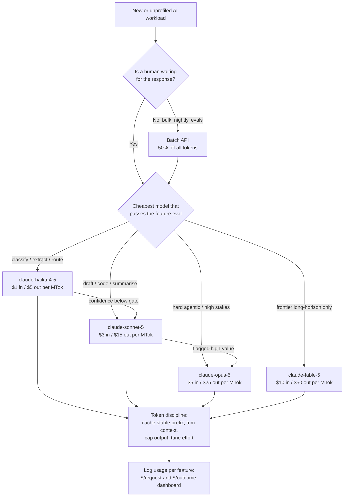

# AI Cost Optimisation

Every LLM bill is the same three-term equation: **which model** ran, **how many tokens** went in and came out, and **which rate** you paid for them. On the current Claude API the model term alone spans a 10× range — Claude Haiku 4.5 output costs $5/MTok while Claude Fable 5 output costs $50/MTok — and the rate term adds another 2× (Batch API) to 10× (prompt-cache reads) on top. A team that treats model choice the way infrastructure teams treat instance sizing, and token counts the way they treat egress, routinely cuts 50–80% of spend with zero quality loss. A team that puts its biggest model on every request because "quality matters" is paying frontier prices to classify password-reset emails.

The discipline is not "use cheaper models." It is: **baseline spend per feature, gate every change behind an eval, then work the levers in ROI order** — move async work to the Batch API, right-size the model per task, enforce context and output discipline, tune reasoning effort, and cache what repeats. And measure the result in the only unit the business understands: not cost per token, but **cost per resolved ticket, per enriched document, per qualified lead**. Cost per token is an input; cost per outcome is the KPI. Sometimes the right answer to that KPI is to spend *more* per request.

**When NOT to use this:**

- **Spend below the cost of the exercise.** Under roughly $500/month, a week of engineering on routing infrastructure never pays back. Set `max_tokens` sensibly, pick a sane default model, ship features instead.
- **Before you have an eval set.** Downgrading models without a quality gate is not optimisation — it is silent degradation with a delay. Every technique below assumes you can measure quality per feature; build that first.
- **On quality-constrained revenue paths.** If a feature's answer quality drives conversion or retention (sales copilots, medical intake, code that ships), unit economics may say the frontier model *earns* its 10× premium. Optimise the surrounding plumbing (caching, context, output length), not the model.
- **On hard-latency paths, for cascades and batching specifically.** A cascade adds a full round-trip on escalation; the Batch API can take up to 24 hours. Neither belongs in front of a user staring at a spinner with a P95 budget.

## Decision Framework

### Choice 1 — Which model tier per task

Claude API pricing, July 2026 (per million tokens):

| Model | ID | Input / Output | Right-sized for | Wrong for |
|---|---|---|---|---|
| Claude Haiku 4.5 | `claude-haiku-4-5` | $1.00 / $5.00 | Classification, extraction, routing, guardrail checks, tagging | Multi-step reasoning, long-horizon agents; 200K context (others are 1M) |
| Claude Sonnet 5 | `claude-sonnet-5` | $3.00 / $15.00¹ | Most drafting, coding, summarisation, standard agentic work | Tasks a Haiku eval already passes (5× overpay) |
| Claude Opus 5 | `claude-opus-5` | $5.00 / $25.00 | Hard agentic coding, enterprise deliverables, high-stakes reasoning | Bulk classification (25× Haiku on input, 5× on output) |
| Claude Fable 5 | `claude-fable-5` | $10.00 / $50.00 | Frontier long-horizon work where measured lift justifies 2× Opus | Anything a cheaper tier's eval passes |

¹ Introductory rate of $2.00 / $10.00 applies through 2026-08-31; do capacity planning at the sticker price.

The honest trade-off: the cheap tier is not "worse at everything" — it is worse at *some things*, and only your eval set knows which. Haiku 4.5 routinely matches larger models on enum-constrained classification; it reliably loses on multi-document synthesis. Route by measured task performance, never by vibes about model prestige.

### Choice 2 — Routing pattern: single model, static routes, or cascade

| Pattern | How it works | Cost profile | Honest downside |
|---|---|---|---|
| **Single model** | One default for everything | Simple; overpays on every simple request | The default everyone starts with and the biggest source of waste |
| **Static routing** | Each feature/route pinned to a tier at design time | Predictable; captures most of the savings | Needs a per-feature eval; misroutes edge cases inside a feature |
| **Cascade** | Cheap model first; escalate to a bigger one when a confidence gate fails | Cheapest at low escalation rates | **Escalated requests pay twice** (cheap attempt + big retry) and take two round-trips; a drifting gate silently converts savings into surcharge |

Cascade arithmetic: it beats always-running-the-big-model whenever `cheap_cost + escalation_rate × big_cost < big_cost`. That break-even is generous (often 60–80% escalation), but latency and calibration drift bite far earlier — treat a sustained escalation rate above ~10% as an incident, and calibrate the confidence gate against measured eval precision, not the number's face value.

### Choice 3 — Synchronous calls vs the Batch API

| | Synchronous Messages API | Message Batches API |
|---|---|---|
| Price | Standard rates | **50% off all token usage** (input, output, cache) |
| Turnaround | Seconds | Most batches < 1 hour; guaranteed ≤ 24 hours |
| Limits | Rate-limit tiers | ≤ 100,000 requests or 256 MB per batch; results kept 29 days |
| Result ordering | N/A | **Any order — key by `custom_id`, never by position** |
| Feature support | Everything | All Messages API features (vision, tools, caching, structured outputs) |
| Availability | Claude API + partners | Claude API (not Amazon Bedrock / Vertex AI / Foundry) |
| Use when | A human is waiting | Nightly pipelines, backfills, evals, embeddings-adjacent enrichment, report generation |

The 50% is unconditional — no quality trade-off, no prompt changes. Any workload that can tolerate "done within the hour, worst case tomorrow" and stays synchronous is a standing 2× overpay.

### Choice 4 — Reasoning effort and output length

Two separate levers that get conflated:

| Lever | What it controls | Mechanics | Trap |
|---|---|---|---|
| `output_config: {effort: ...}` | How hard the model thinks and how much it does per turn | `low`/`medium`/`high`/`xhigh`/`max`; default `high`. Supported on Sonnet 5, Opus 5, Fable 5 (errors on Haiku 4.5). On Opus 5, `low`/`medium` punch far above their weight — sweep downward per route | Effort does **not** reliably shorten user-visible text on Opus 5 — prompting does |
| Output-length control | Billed output tokens | Brevity instructions + structured outputs (`output_config.format`) shrink what you *pay for*; `max_tokens` is only a circuit breaker — you are billed for actual tokens, not the cap | On Sonnet 5 / Opus 5 / Fable 5, thinking is on by default and **`max_tokens` caps thinking + answer together** — a tight cap truncates answers mid-sentence |

Rule of thumb: schema-constrain everything you parse (a JSON label can't ramble), instruct length on everything a human reads, set `max_tokens` as a worst-case bound, and sweep `effort` per route at every model release — defaults carried over from a prior model are usually wrong.



## Process

1. **Build the baseline.** Tag every request with a feature ID and log the full `usage` object — `input_tokens`, `output_tokens`, `cache_read_input_tokens`, `cache_creation_input_tokens`. One week of real traffic. Compute $/request per feature and rank features by total spend. You will optimise the top three; ignore the tail.
2. **Attach a business denominator.** For each top feature, define the outcome it serves (resolved ticket, enriched document, generated report) and compute **$/outcome**. This is the number you defend in the budget review, and the number that decides whether "spend more" is ever the right answer.
3. **Stand up the quality gate.** Per feature: a labeled eval set (200+ cases), an automated scorer, and a written acceptance threshold. No routing or model change ships without a green run. A cheaper wrong answer is the most expensive kind — it costs the tokens *and* the outcome.
4. **Move async work to the Batch API.** Sweep for any request path where no human waits (overnight jobs, backfills, eval runs, digest generation). Migrate them: build requests with `custom_id`s, poll `processing_status` until `"ended"`, key results by `custom_id`, retry `errored` server failures. Instant 50%.
5. **Right-size models per feature.** For each feature, run the eval on the next tier down. Passes → downgrade. Fails → try a cascade: cheap model with a confidence gate, escalate on failure. Log the escalation rate from day one.
6. **Enforce context discipline.** Budget input tokens per route: retrieve the relevant slice instead of dumping whole documents, drop few-shot examples the eval says you no longer need, truncate user input at a measured ceiling. Re-baseline with `count_tokens` against the actual model (never tiktoken — it undercounts Claude tokens 15–20%+).
7. **Control output and effort.** Add brevity instructions and structured outputs on parsed routes; sweep `effort` per route on models that support it; set `max_tokens` as a circuit breaker with thinking headroom.
8. **Cache the stable prefix.** Prompt caching turns repeated prefixes into ~0.1× reads — often the single largest multiplier on chat and agentic traffic. Summary below; full discipline in the `llm-prompt-caching` skill.
9. **Wire observability and alerts.** Per-feature dashboard ($/request, $/outcome, escalation rate, cache-hit rate), budget alerts at 80% and 100%, weekly review. Re-run steps 4–8 at every model release — prices, tokenizers, and capability floors all move under you.

## Cost Observability & Unit Economics

You cannot optimise what you attribute to a single line item called "Anthropic." Attribution is a ten-line wrapper:

```python
PRICES = {  # $ per MTok (input, output) — Claude API, July 2026; re-verify at model releases
    "claude-fable-5":   (10.00, 50.00),
    "claude-opus-5":    (5.00,  25.00),
    "claude-sonnet-5":  (3.00,  15.00),   # intro $2/$10 through 2026-08-31
    "claude-haiku-4-5": (1.00,   5.00),
}
CACHE_READ_MULT, CACHE_WRITE_5M_MULT, BATCH_MULT = 0.10, 1.25, 0.50

def request_cost(model: str, usage, batch: bool = False) -> float:
    inp, out = PRICES[model]
    dollars = (
        usage.input_tokens * inp                                          # uncached remainder
        + (usage.cache_read_input_tokens or 0) * inp * CACHE_READ_MULT
        + (usage.cache_creation_input_tokens or 0) * inp * CACHE_WRITE_5M_MULT
        + usage.output_tokens * out
    ) / 1_000_000
    return dollars * BATCH_MULT if batch else dollars

def log_cost(feature: str, model: str, usage, batch: bool = False) -> None:
    metrics.emit(  # your metrics pipeline: Datadog, Prometheus, a plain table
        "llm.request",
        cost_usd=request_cost(model, usage, batch),
        tags={"feature": feature, "model": model, "batch": batch},
    )
```

Two attribution rules that separate real dashboards from decorative ones:

- **Sum all four usage fields.** `input_tokens` is the *uncached remainder only* — a dashboard that reads it alone under-reports cached traffic massively. Total prompt size = `input_tokens + cache_read_input_tokens + cache_creation_input_tokens`.
- **Divide by outcomes, not requests, in the executive view.** "Triage costs $87/day" invites a cut; "AI triage costs 0.2¢ per ticket versus $4.10 for a human first-touch" ends the meeting. Per-feature panels: requests/day, $/request, **$/outcome**, escalation rate, cache-hit rate, week-over-week trend. Alert on budget (80%/100%), on escalation-rate spikes, and on cache-hit-rate drops — each is a silent cost multiplier with a deploy behind it.

## Prompt Caching (Summary)

Prompt caching is its own discipline with its own skill — see **`04-ai-ml/llm-prompt-caching/SKILL.md`** for breakpoint placement, TTL break-even math, silent-invalidator hunting, and the verification harness. What belongs in the cost plan here:

- Cache reads bill at **~0.1× the input rate**; writes at 1.25× (5-minute TTL) or 2× (1-hour TTL). On a chat product with a 30K-token stable prefix this is the largest single lever you have.
- It only works if the prefix is **byte-stable**: frozen system prompt, deterministic tool serialization, volatile content (dates, user state) after the last breakpoint.
- The discounts **stack**: a cached read inside a Batch API request pays 0.1× × 0.5 = 0.05× the base input rate.
- Verify with `cache_read_input_tokens` > 0 — sub-minimum prefixes and broken prefixes fail silently, not loudly.

## Worked Example 1: Relay Desk — Support Copilot Tiering

**Scenario.** A B2B SaaS support copilot handles **50,000 tickets/day**: every ticket gets triaged (intent + priority; ~1,200 input tokens, ~50 output), and 30% (15,000/day) get an AI reply draft (~2,500 input, ~400 output). The launch team put everything on `claude-opus-5` "to be safe."

**Baseline (all Opus 5, $5/$25):**

| Route | Per-request | Volume | Daily |
|---|---|---|---|
| Triage | 1,200 × $5/M + 50 × $25/M = $0.00725 | 50,000 | $362.50 |
| Drafts | 2,500 × $5/M + 400 × $25/M = $0.0225 | 15,000 | $337.50 |
| **Total** | | | **$700.00/day ≈ $21,000/mo** |

Cost per ticket touched: **1.40¢**.

**Decisions and rationale:**

- **Triage → Haiku 4.5 cascade** — because a 2,000-case eval showed Haiku matching Opus on the enum-constrained intent/priority task 96% of the time, and the failures clustered in ambiguous multi-issue tickets a confidence gate can catch. Structured outputs make the label machine-parseable and un-rambling.
- **Escalation to Sonnet 5, not Opus 5** — because the eval showed Sonnet resolving the ambiguous residue as well as Opus did; escalating to the most expensive tier "just in case" would pay 67% more for zero measured lift.
- **Drafts → Sonnet 5 at `effort: "low"`, with 10% routed to Opus 5** — because draft quality on Sonnet passed the CSAT-calibrated rubric for standard-plan tickets; enterprise-flagged tickets (10%, contractual response quality) stay on Opus. Low effort because routine drafting showed no eval gain from deeper reasoning, only more billed thinking tokens.
- **Output-length control on drafts** — a "reply in under 150 words, no preamble or sign-off boilerplate" instruction cut average billed output from 400 to ~250 tokens with *higher* CSAT (customers prefer shorter answers). The cheapest tokens are the ones nobody wanted.

```python
import json
from anthropic import Anthropic

client = Anthropic()  # reads ANTHROPIC_API_KEY / ant auth profile from env

TRIAGE_SCHEMA = {
    "type": "object",
    "properties": {
        "intent":     {"type": "string", "enum": ["billing", "bug", "how_to", "account", "other"]},
        "priority":   {"type": "string", "enum": ["p1", "p2", "p3"]},
        "confidence": {"type": "number", "description": "0-1; calibrate the gate on evals, not this number's face value"},
    },
    "required": ["intent", "priority", "confidence"],
    "additionalProperties": False,
}

#           (model,             stop-gate, max_tokens)
CASCADE = [("claude-haiku-4-5", 0.85,      256),
           ("claude-sonnet-5",  0.0,       1500)]  # Sonnet 5 thinks by default; cap covers thinking + answer

def triage(ticket_text: str) -> dict:
    for model, gate, cap in CASCADE:
        response = client.messages.create(
            model=model,
            max_tokens=cap,
            system=TRIAGE_SYSTEM,  # frozen module-level constant — cacheable prefix
            output_config={"format": {"type": "json_schema", "schema": TRIAGE_SCHEMA}},
            messages=[{"role": "user", "content": ticket_text[:6000]}],  # context budget, enforced
        )
        log_cost(feature="ticket-triage", model=model, usage=response.usage)
        text = next(b.text for b in response.content if b.type == "text")
        result = json.loads(text)
        if result["confidence"] >= gate:
            return result
    return result  # Sonnet leg is unconditional
```

**After (measured over two weeks, 4% escalation rate):**

| Route | Math | Daily |
|---|---|---|
| Triage, Haiku leg (all 50,000 attempts) | 50,000 × (1,200 × $1/M + 50 × $5/M) = 50,000 × $0.00145 | $72.50 |
| Triage, Sonnet escalations (2,000; ~250 billed output incl. thinking) | 2,000 × (1,200 × $3/M + 250 × $15/M) = 2,000 × $0.00735 | $14.70 |
| Drafts, Sonnet (13,500 @ ~250 out) | 13,500 × (2,500 × $3/M + 250 × $15/M) = 13,500 × $0.01125 | $151.88 |
| Drafts, Opus enterprise (1,500 @ 400 out) | 1,500 × $0.0225 | $33.75 |
| **Total** | | **$272.83/day ≈ $8,185/mo** |

**Result: $700 → $273/day (−61%)**; cost per ticket touched **1.40¢ → 0.55¢**; eval scores and CSAT flat. Note the cascade's honest cost: each escalated ticket pays both legs ($0.00145 + $0.00735 = $0.0088) — still ahead of the Opus baseline, but only because escalation stays at 4%. The escalation-rate alert is set at 10%.

## Worked Example 2: Northgate Media — Nightly Enrichment via Batch

**Scenario.** A publisher enriches **120,000 articles/night** — taxonomy tagging plus a reader-facing summary — in one combined synchronous `claude-sonnet-5` call per article (~3,000 input, ~300 output tokens), running during the day alongside interactive traffic. The pipeline's real SLA: enrichment must land by 06:00 for the morning editions. Nobody is waiting on any individual request.

**Baseline (sync Sonnet 5, $3/$15):** 120,000 × (3,000 × $3/M + 300 × $15/M) = 120,000 × $0.0135 = **$1,620/night ≈ $48,600/mo**. Cost per enriched article: **1.35¢**.

**Decisions and rationale:**

- **Batch API, submitted at 01:00** — because a 5-hour window comfortably absorbs the typical sub-hour turnaround, and no human waits. The 50% discount applies to every token with zero prompt or quality changes. 120K articles exceed the 100K-per-batch limit, so the job ships as two 60K batches.
- **Deadline fallback, budgeted** — because the 24-hour worst case is real: any batch not `"ended"` by 05:00 has its unprocessed `custom_id`s replayed through synchronous Haiku at full price. Bounded downside, engineered in advance instead of discovered at 05:55.
- **Split the combined call; tagging → Haiku 4.5** — because per-feature cost attribution showed tagging and summarisation had wildly different quality floors. On a 2,000-article labeled set, Haiku hit 98.9% taxonomy agreement versus Sonnet's 99.2% — a delta below the inter-editor noise floor. Summaries stayed on Sonnet: Haiku's failed the editorial rubric.
- **Scope cut from the dashboard** — the per-feature panel revealed half of all summaries were generated for sub-800-word stubs with near-zero reader open-rate. Summaries now run only for the 60,000 longer articles; stubs reuse their lede. **The cheapest request is the one you never send** — this single deletion outsaved every rate trick.

```python
import time
from anthropic import Anthropic

client = Anthropic()

requests = [
    {
        "custom_id": f"tag-{article.id}",           # your join key — results arrive in ANY order
        "params": {
            "model": "claude-haiku-4-5",
            "max_tokens": 256,
            "system": TAGGING_PROMPT,               # frozen, shared across all requests
            "output_config": {"format": {"type": "json_schema", "schema": TAG_SCHEMA}},
            "messages": [{"role": "user", "content": article.text[:12000]}],
        },
    }
    for article in tonight_articles                 # chunked upstream: ≤100,000 requests / 256 MB per batch
]

batch = client.messages.batches.create(requests=requests)

while True:
    batch = client.messages.batches.retrieve(batch.id)
    if batch.processing_status == "ended":
        break
    time.sleep(60)

done, retry = {}, []
for entry in client.messages.batches.results(batch.id):
    if entry.result.type == "succeeded":
        done[entry.custom_id] = entry.result.message        # key by custom_id, never by position
        log_cost("article-tagging", "claude-haiku-4-5", entry.result.message.usage, batch=True)
    elif entry.result.type == "errored":
        retry.append(entry.custom_id)                       # server errors: safe to resubmit
    else:                                                   # "expired" / "canceled"
        retry.append(entry.custom_id)
```

**After (batch rates = 50% of standard):**

| Job | Math | Nightly |
|---|---|---|
| Tagging, Haiku batch (120,000 @ 40 out) | 120,000 × (3,000 × $0.50/M + 40 × $2.50/M) = 120,000 × $0.0016 | $192.00 |
| Summaries, Sonnet batch (60,000 @ 200 out) | 60,000 × (3,000 × $1.50/M + 200 × $7.50/M) = 60,000 × $0.0060 | $360.00 |
| **Total** | | **$552/night ≈ $16,560/mo** |

**Result: $1,620 → $552/night (−66%)**; cost per enriched article **1.35¢ → 0.46¢**; taxonomy quality within noise, summary quality unchanged, and the interactive traffic no longer shares daytime rate limits with a bulk pipeline. The three levers stacked multiplicatively: batch (×0.5) × right-sizing (Haiku where the eval allowed) × scope cut (half the summaries deleted).

## Anti-Patterns

| Symptom | Why it fails | Do instead |
|---|---|---|
| Frontier model on every request "to be safe" | Pays up to 10× Haiku rates for tasks a small model passes; "safe" is unmeasured, the overpay is precise | Per-feature evals; cheapest model that passes; escalate by evidence |
| Model downgrades shipped without an eval | Quality degrades silently; discovered via churn or an angry customer, weeks later | No routing change without a green eval run against a written threshold |
| Dashboard shows $/token or one blended total | Nobody can act on it; the expensive feature hides behind the cheap one | Per-feature tags, $/request, and $/business-outcome; rank and attack the top three |
| Cascade with an unmonitored confidence gate | Escalations pay both legs; calibration drift turns a 4% escalation rate into 30% and the "saving" into a surcharge | Log escalation rate per route; alert above ~10%; recalibrate against evals |
| Synchronous calls in overnight/bulk pipelines | A standing 2× overpay for latency nobody consumes, plus daytime rate-limit contention | Batch API with `custom_id` joins and a deadline fallback path |
| Uncontrolled output length on human-read routes | Output is the expensive token (5× input on every tier); verbose answers bill you and bore users | Brevity instructions + schemas on parsed routes; `max_tokens` as circuit breaker |
| Context dumping (whole docs, stale few-shot blocks) | Input tokens scale linearly with hoarding; most of it never influences the answer | Retrieval slices, context budgets per route, prune examples the eval says are dead weight |
| Tight `max_tokens` carried onto Sonnet 5 / Opus 5 / Fable 5 | Thinking is on by default and counts against the cap — answers truncate mid-sentence | Give thinking headroom; control cost with `effort` and prompting, not the cap |
| Cost model reads `input_tokens` only | Field excludes cached tokens; cached routes look nearly free while spend accrues | Price all four usage fields (see `request_cost` above) |
| Estimating Claude costs with tiktoken | OpenAI's tokenizer undercounts Claude tokens by 15–20%+; budgets built on it are fiction | `count_tokens` against the exact model; re-baseline per model family (Sonnet 5's tokenizer yields ~30% more tokens than Sonnet 4.6's for the same text) |
| No budget alerts | The first signal is the invoice | Alerts at 80% and 100% of per-feature monthly budgets, wired before launch |

## Checklist

```
Baseline & quality gates
[ ] Every request tagged with a feature ID; all four usage fields logged
[ ] $/request AND $/business-outcome computed per feature, trending weekly
[ ] Labeled eval set + automated scorer + written acceptance threshold per feature
[ ] No model/routing change ships without a green eval run

Model tiering & routing
[ ] Each feature mapped to the cheapest model that passes its eval
[ ] Cascade escalation rate logged per route; alert above ~10%
[ ] Confidence gates calibrated against eval precision, not self-reported scores
[ ] Escalation double-pay (cheap attempt + big retry) included in cascade math

Rate discounts
[ ] Every no-human-waiting workload on the Batch API (50% off), keyed by custom_id
[ ] Batch pipeline tolerates the 24h worst case; deadline fallback path budgeted
[ ] Stable prefixes cached (see llm-prompt-caching); cache reads verified > 0
[ ] Batch x cache x tiering stacking computed, not guessed

Token discipline
[ ] Context budget enforced per route; retrieval slices instead of document dumps
[ ] Output length instructed on human-read routes; schemas on parsed routes
[ ] max_tokens set as circuit breaker with thinking headroom on 5-series models
[ ] effort swept per route (low/medium often suffice); re-swept at model releases

Governance
[ ] Budget alerts at 80% and 100% per feature
[ ] Weekly cost review owns the dashboard; monthly $/outcome report to the business
[ ] Every model release triggers a re-run: prices, tokenizers, eval passes all move
```

## 10 Rules

1. **Measure cost per outcome, not per token.** A CFO can act on "0.5¢ per resolved ticket"; nobody can act on a token count. If you can't name the denominator, you aren't ready to optimise the numerator.
2. **No downgrade without an eval.** A cheaper wrong answer is the most expensive answer you can buy — it costs the tokens, the outcome, and the trust. The eval set is the price of admission to every other technique here.
3. **Batch by default; synchronous is the exception you justify with a waiting human.** The Batch API's 50% is the only lever with zero quality trade-off and zero prompt changes. Every sync bulk job is a self-inflicted 2×.
4. **The cheapest token is the one you never send — and the cheapest request is the one you delete.** Context discipline and scope cuts beat rate negotiation every time; audit what the dashboard says nobody reads.
5. **Route by task, escalate by evidence.** Static routes from evals for the 95%; cascades with monitored gates for the ambiguous residue; frontier models only where measured lift pays their premium.
6. **Output is the expensive direction.** Every Claude tier bills output at 5× input — instruct brevity for humans, schemas for parsers, and treat `max_tokens` as a circuit breaker, never as the length control.
7. **Effort is a dial, not a fixture.** Sweep `low`→`max` per route and per model release; on current models `low` and `medium` routinely match last generation's best, and defaults inherited from an old model are usually wrong in both directions.
8. **Cache before you haggle.** A 0.1× cache read on a stable 30K prefix outsaves any model swap — and it stacks with batch (0.05× combined). Prefix discipline first; see the prompt-caching skill.
9. **Alert on rates, not just totals.** Escalation-rate spikes, cache-hit drops, and output-length creep are deploys wearing cost disguises. Catch them in hours via dashboards, not in weeks via invoices.
10. **Re-run the whole exercise at every model release.** Prices, tokenizers, capability floors, and effort curves all shift. Yesterday's optimal routing table is today's quiet overpay — the process is a loop, not a project.

## References

- Claude API pricing: https://platform.claude.com/docs/en/pricing
- Message Batches API: https://platform.claude.com/docs/en/build-with-claude/batch-processing
- Effort parameter (reasoning-depth tuning): https://platform.claude.com/docs/en/build-with-claude/effort
- Models overview (current IDs, context windows): https://platform.claude.com/docs/en/about-claude/models/overview
- Token counting API (never tiktoken): https://platform.claude.com/docs/en/build-with-claude/token-counting
- Sibling skill — provider/response/semantic caching in depth: `04-ai-ml/llm-prompt-caching/SKILL.md`
