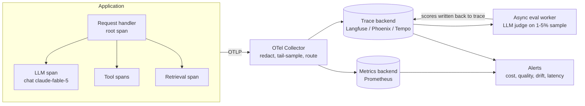

# AI Observability

Traditional observability answers "is it up, is it fast, is it erroring?" LLM observability adds three questions those tools cannot answer: **what did it cost**, **was the answer any good**, and **is behavior drifting** — because the same deployment, same prompt, same code can degrade when a model version, a retrieval index, or the input distribution shifts underneath you. A stack trace tells you nothing about a confidently wrong answer that returned HTTP 200 in 800ms.

The unit of debugging in an LLM system is the **trace**, not the log line: one user request fans out into model calls, tool executions, and retrieval lookups, and the failure is usually visible only when you see them together — the retrieval span returned the wrong chunks, so the model span answered from thin air. Instrument for that shape from day one; retrofitting tracing after an incident means debugging the incident blind.

**When NOT to use this.** Skip the full apparatus when:

- **You are prototyping** (< ~1k requests/day, no paying users). Log request/response pairs to a file or table and move on; premature dashboards slow iteration.
- **You have no offline eval suite yet.** Observability tells you something *changed*; evals tell you whether it got *worse*. Drift alerts without an eval baseline are unfalsifiable noise — build [llm-evaluation] first.
- **The output is cheaply verifiable by code** (exact extraction with ground truth, compilable code with tests). Deterministic validators beat sampled LLM judges — you still want cost/latency/trace instrumentation, but not the quality-judging half.
- **You are monitoring model training**, not a deployed application. Loss curves and gradient norms are ML training monitoring — a different practice.

## Decision Framework

Four decisions determine the whole design. Make them explicitly, in this order.

### 1. Instrumentation layer: OTel GenAI conventions vs vendor SDK

| Approach | Pros | Cons | Choose when |
|---|---|---|---|
| **OpenTelemetry GenAI semantic conventions** (`gen_ai.*` spans/metrics, OTLP export) | Vendor-neutral; reuses existing collector/backends; one instrumentation serves ops and LLM analysis | Conventions are still in *Development* status — attribute names have already been renamed once (`gen_ai.system` → `gen_ai.provider.name`); you build the LLM-specific UI views yourself | You already run an OTel stack, or you refuse app-code lock-in |
| **LLM-observability platform SDK** (Langfuse, LangSmith, Braintrust, Arize Phoenix) | Purpose-built UI: prompt playgrounds, trace-to-eval linking, score annotations out of the box | App code couples to the vendor; a second telemetry path beside your existing APM | Small team, no OTel investment, want answers this week |
| **Both: OTel in code, OTLP into the platform** | One neutral instrumentation; Langfuse/Phoenix/Datadog all accept OTLP ingestion | Slightly more collector configuration; attribute-mapping quirks between semconv versions | The default for production teams — this is the recommended shape |

### 2. Content capture policy

Prompts and completions are user data. Capturing them is a privacy decision, not a technical one.

| Policy | What's stored | Trade-off | Choose when |
|---|---|---|---|
| **Metadata-only** | Tokens, cost, latency, model, stop reason — never text | Cannot debug *why* an answer was bad | Regulated data, no legal review yet |
| **Sampled + redacted** | Metadata 100%; content on N% of traces, PII-scrubbed in the collector | Debugging depends on the sample catching the failure | The production default (pair with tail sampling below) |
| **Full capture** | Everything | Storage cost, breach blast radius, retention obligations | Internal tools, synthetic traffic, short retention |

Whatever you choose, add **tail-based sampling**: capture content at 100% for traces that *error, refuse, or truncate* — those are the ones you will actually open. Official OTel GenAI instrumentations gate content capture behind `OTEL_INSTRUMENTATION_GENAI_CAPTURE_MESSAGE_CONTENT=true` — leave it unset in production and attach content selectively instead.

### 3. Quality signal: feedback vs judge vs validators

| Signal | Coverage | Cost | Failure mode |
|---|---|---|---|
| **User feedback** (thumbs, edits, regeneration rate) | Whatever users volunteer — typically < 1% of sessions | Free | Sparse and biased toward the angry |
| **Deterministic validators** (schema-valid, tests pass, totals reconcile) | 100% of matching outputs | Near zero | Only works when correctness is checkable by code |
| **LLM-as-judge on a sample** | Your sample rate (1–5% typical) | Judge tokens per sampled trace | Judge drift; grades correlate with, not equal, quality |

Use all three where they apply, in that priority order: validators where outputs are verifiable, feedback as a free lagging signal, a sampled judge for the subjective remainder. Never run a judge on 100% of traffic — that is an eval budget fire with no added statistical power.

### 4. Drift reference: fixed baseline vs rolling window

| Reference | Detects | Misses | Choose when |
|---|---|---|---|
| **Fixed golden baseline** (metrics frozen at a known-good release) | Slow degradation over months | Legitimate seasonal shifts trigger false alarms | Stable domain, infrequent releases |
| **Rolling window** (e.g. 7-day trailing) | Sudden breaks: model swap, index rebuild, upstream format change | A slow leak re-baselines itself into invisibility | Fast-moving product; pair with a quarterly fixed-baseline re-check |

Use a rolling window for alerting and re-run the fixed offline eval suite on a schedule to catch the slow leak the window absorbs.

## The Span Taxonomy

Emit one root span per user request and one child span per meaningful operation. Follow the GenAI conventions: span name is `{operation} {model}` (e.g. `chat claude-fable-5`).

| Span | Key attributes | Why it earns its keep |
|---|---|---|
| Root request | `app.session_id`, `app.prompt_version`, user tier, feature flag | Slicing every metric by prompt version is how you catch a bad prompt deploy |
| LLM call | `gen_ai.operation.name`, `gen_ai.provider.name`, `gen_ai.request.model`, `gen_ai.response.model`, `gen_ai.usage.input_tokens`, `gen_ai.usage.output_tokens`, `gen_ai.response.finish_reasons`, cache read/write tokens, computed cost | The cost and truncation record |
| Tool execution | tool name, duration, `is_error`, result size | Agent loops die in tools far more often than in the model |
| Retrieval | query, top-k, index/version, chunk IDs, scores | Groundedness failures are usually retrieval failures |
| Guardrail / validator | rule name, pass/fail, action taken | Proves the guardrail fires; measures its false-positive rate |

Prefix application-specific attributes with your own namespace (`app.*`); keep `gen_ai.*` for the standard set, and pin the semconv version you emit — the conventions are not yet stable.

## Reference Architecture



The eval worker is deliberately **asynchronous and off the request path**: judging adds seconds and dollars, and a judge outage must never take down serving.

## Process

1. **Map the request path.** List every model call, tool, retrieval, and guardrail one user request can trigger. This list is your span taxonomy.
2. **Instrument spans and usage.** Wrap every model call so tokens, cost, stop reason, and cache fields are recorded on the span — no exceptions, including background jobs.
3. **Compute cost at write time.** Convert `usage` to dollars using a versioned price table in code. Never estimate from character counts.
4. **Set the content-capture policy** (Decision 2), with tail-based full capture on error/refusal/truncation traces. Get sign-off from whoever owns privacy.
5. **Wire quality signals** (Decision 3): validators first, then feedback capture *with the trace ID attached*, then a sampled judge for the rest.
6. **Baseline for two weeks.** Record p50/p95 for latency, tokens, cost/request, cache-hit ratio, validator pass rate, judge score. No alerts yet — you don't know normal.
7. **Add drift detection** against the baseline (Decision 4): input-side (request length, topic mix, retrieval score distribution) and output-side (validator/judge metrics, refusal and truncation rates).
8. **Write alert rules** from the table below — alert on *deltas from baseline*, not gut-feel absolutes.
9. **Build two dashboards**: an ops view (latency, errors, cost burn, cache-hit ratio) and a quality view (scores by prompt version, drift panels, worst-trace drill-down).
10. **Close the loop.** Weekly: read the 10 worst-scored traces end to end, promote real failures into the offline eval suite, and delete alerts nobody acted on.

## Instrumented Model Call (Python, OTel + Claude API)

```python
import time

from anthropic import Anthropic
from opentelemetry import metrics, trace

tracer = trace.get_tracer("app.llm")
meter = metrics.get_meter("app.llm")

token_usage = meter.create_histogram(
    "gen_ai.client.token.usage", unit="{token}",
    description="Tokens per model call",
)
op_duration = meter.create_histogram(
    "gen_ai.client.operation.duration", unit="s",
    description="Model call duration",
)

# Versioned price table, USD per million tokens. Cache reads bill at ~0.1x
# input price; 5-minute-TTL cache writes at 1.25x. Update on every price change.
PRICES = {
    "claude-fable-5": {"input": 10.00, "output": 50.00,
                       "cache_read": 1.00, "cache_write": 12.50},
}

client = Anthropic()  # reads ANTHROPIC_API_KEY / ambient credentials


def traced_chat(messages, *, model="claude-fable-5", max_tokens=16000,
                prompt_version="v1", **kwargs):
    with tracer.start_as_current_span(f"chat {model}") as span:
        span.set_attribute("gen_ai.operation.name", "chat")
        span.set_attribute("gen_ai.provider.name", "anthropic")
        span.set_attribute("gen_ai.request.model", model)
        span.set_attribute("app.prompt_version", prompt_version)

        start = time.monotonic()
        response = client.messages.create(
            model=model, max_tokens=max_tokens, messages=messages, **kwargs
        )
        elapsed = time.monotonic() - start

        u = response.usage
        cache_read = u.cache_read_input_tokens or 0
        cache_write = u.cache_creation_input_tokens or 0
        p = PRICES[model]
        cost = (u.input_tokens * p["input"] + cache_read * p["cache_read"]
                + cache_write * p["cache_write"]
                + u.output_tokens * p["output"]) / 1_000_000

        span.set_attribute("gen_ai.response.model", response.model)
        span.set_attribute("gen_ai.response.finish_reasons", [response.stop_reason])
        span.set_attribute("gen_ai.usage.input_tokens", u.input_tokens)
        span.set_attribute("gen_ai.usage.output_tokens", u.output_tokens)
        span.set_attribute("app.usage.cache_read_input_tokens", cache_read)
        span.set_attribute("app.usage.cache_creation_input_tokens", cache_write)
        span.set_attribute("app.llm.cost_usd", round(cost, 6))

        dims = {"gen_ai.request.model": model, "gen_ai.operation.name": "chat"}
        token_usage.record(u.input_tokens, {**dims, "gen_ai.token.type": "input"})
        token_usage.record(u.output_tokens, {**dims, "gen_ai.token.type": "output"})
        op_duration.record(elapsed, dims)

        # Refusals and truncations are product metrics, not exceptions.
        # Check stop_reason BEFORE reading content — a refusal has empty content.
        if response.stop_reason == "refusal":
            span.add_event("gen_ai.refusal")
        elif response.stop_reason == "max_tokens":
            span.add_event("gen_ai.truncated")
        return response
```

Notes: on `claude-fable-5`, thinking is always on — omit the `thinking` parameter entirely, and remember `max_tokens` caps thinking plus visible text. Total prompt size is `input_tokens + cache_read + cache_write`; `input_tokens` alone is only the uncached remainder — sum them for context-growth dashboards.

## Online Quality: Sampled LLM Judge

Runs in a worker, off the request path, on 1–5% of completed traces. Scores are written back onto the original trace so quality is queryable alongside cost and latency.

```python
import json
import random

from anthropic import Anthropic

client = Anthropic()
SAMPLE_RATE = 0.02  # 2% — size so judge spend stays < ~3% of serving spend

JUDGE_SCHEMA = {
    "type": "object",
    "properties": {
        "grounded": {"type": "boolean"},
        "score": {"type": "integer", "enum": [1, 2, 3, 4, 5]},
        "reason": {"type": "string"},
    },
    "required": ["grounded", "score", "reason"],
    "additionalProperties": False,
}

JUDGE_PROMPT = """Grade this assistant answer against the retrieved context.
grounded: every factual claim is supported by the context.
score: 5 = fully correct and grounded ... 1 = wrong or fabricated.

<context>{context}</context>
<question>{question}</question>
<answer>{answer}</answer>"""


def maybe_judge(trace_id: str, question: str, context: str, answer: str,
                backend) -> None:
    if random.random() >= SAMPLE_RATE:
        return
    response = client.messages.create(
        model="claude-fable-5",
        max_tokens=16000,
        output_config={"format": {"type": "json_schema", "schema": JUDGE_SCHEMA}},
        messages=[{"role": "user", "content": JUDGE_PROMPT.format(
            context=context, question=question, answer=answer)}],
    )
    if response.stop_reason == "refusal":
        backend.add_score(trace_id, name="judge_error", value=1)
        return
    verdict = json.loads(response.content[0].text)
    backend.add_score(trace_id, name="groundedness", value=verdict["score"],
                      comment=verdict["reason"])
```

Version the judge prompt like any other prompt, and re-validate it against a hand-labeled set whenever you change it or the judge model — an uncalibrated judge is a drift source of its own.

## Alerting

Alert on deltas from your own baseline. Absolute thresholds copied from a blog post fire constantly or never.

| Signal | Rule of thumb | Severity | First response |
|---|---|---|---|
| Error rate (429/5xx per model) | > 2% over 5 min | Page | Check provider status; verify SDK backoff is engaging |
| p95 latency | > 1.5× 7-day baseline for 15 min | Page | Look for output-length growth or provider slowdown |
| Cost per request (p95) | > 2× 7-day baseline for 1 h | Warn | Diff prompt versions; check context growth per turn |
| Cache-hit ratio (`cache_read / total input`) | Drops > 20 points below baseline | Warn | Hunt the silent invalidator (timestamp, unsorted JSON, tool-list change) |
| Truncation rate (`max_tokens` stops) | > 1% of responses | Warn | Raise `max_tokens` or stream; check thinking headroom |
| Refusal rate | > 0.5% of responses | Warn | Inspect refused traces; category shift = upstream change |
| Judge score (24 h mean) | > 15% below 7-day baseline | Warn | Read worst traces; check retrieval span quality first |
| Validator pass rate | Any field > 3× baseline failure for 2 windows | Warn | Diff failing inputs against baseline inputs |

```yaml
# prometheus rules (excerpt)
groups:
  - name: llm-observability
    rules:
      - alert: LLMCacheHitCollapse
        expr: |
          sum(rate(app_llm_cache_read_tokens_total[1h]))
            / sum(rate(app_llm_input_tokens_total[1h])) < 0.40
        for: 1h
        labels: {severity: warning}
        annotations:
          summary: "Prompt-cache hit ratio below 40% — check for prefix invalidators"
```

## Worked Example 1: Support Copilot at Meridian Insurance

**Setup.** RAG support assistant on `claude-fable-5`: 40,000 requests/day, three tools (policy lookup, claims status, document search), existing Grafana/Tempo/Prometheus stack. Averages 3,200 input tokens (system prompt + retrieved chunks) and 450 output tokens per request.

**Baseline cost math** (Fable 5: $10/M input, $50/M output):

| Item | Calculation | Per request | Per day |
|---|---|---|---|
| Input | 3,200 × $10/1M | $0.0320 | $1,280 |
| Output | 450 × $50/1M | $0.0225 | $900 |
| **Total** | | **$0.0545** | **$2,180** (~$65k/mo) |

**Decisions and rationale:**

- **OTel-native instrumentation, OTLP routed to both Tempo and Langfuse.** *Because* the ops team already lived in Grafana and refused a second agent in app code; Langfuse ingests OTLP, so one instrumentation feeds both the on-call view and the LLM-analysis view.
- **Metadata at 100%, content sampled at 5% with collector-side PII redaction, plus tail-sampled full capture on error/refusal/truncation traces.** *Because* insurance conversations carry names, policy numbers, and health details — legal approved sampled-and-scrubbed, not full capture. Tail sampling preserved debuggability exactly where it matters.
- **LLM judge at 2% (~800 traces/day) scoring groundedness against the retrieved chunks, not user thumbs as primary signal.** *Because* only 0.7% of sessions ever clicked a rating — too sparse to detect anything inside a week. Judge cost: ~4,000 input + 150 output tokens ≈ $0.0475 per judged trace → ~$38/day, 1.7% of serving spend. 2% sampling detects a 0.5-point mean shift within a day at this volume; judging 100% would cost ~$1,900/day for no faster detection.

**What the instrumentation caught.** Week one, the cache panel showed `cache_read_input_tokens` at zero despite a 2,400-token stable prefix. The trace diff exposed a `datetime.now()` interpolated into the system prompt — every request had a unique prefix. Moving the timestamp into the final user turn took cache reads from 0% to 75% of input: 2,400 tokens now billed at $1/M instead of $10/M, saving ~$0.0216/request ≈ **$864/day (~$26k/mo)** — the observability stack paid for itself in its first month. Later, a retrieval re-embedding dropped mean groundedness 4.4 → 3.1 overnight; the judge alert fired the next morning, and the retrieval spans (chunk scores visibly degraded) localized the fault before users escalated.

## Worked Example 2: Invoice Extraction at Corvid Logistics

**Setup.** Nightly batch: 12,000 supplier invoice PDFs extracted to structured JSON. Averages 5,800 input tokens and 900 output tokens per document. Latency is irrelevant; correctness and cost are everything.

**Decisions and rationale:**

- **Batch API instead of live calls.** *Because* the job is overnight and the Batches API bills at 50% of standard prices: $0.0515/doc instead of $0.103 → **$618/night (~$18.5k/mo)** instead of ~$37k/mo. Half the bill for changing an API call shape.
- **Deterministic validators as the primary quality signal — no routine LLM judge.** *Because* extraction output is verifiable by code: JSON schema validity (via structured outputs plus a hard validator), per-field null rates, and a reconciliation check that line items sum to the invoice total within $0.01. Validators cover 100% of documents at near-zero cost; a judge would sample, cost real money, and be *less* precise than arithmetic. A judge is used only to triage the failure queue.
- **Per-record outcome table in the warehouse instead of a live trace backend; spans emitted but sampled at 10%.** *Because* for a batch pipeline the natural analysis unit is a row per document (doc ID, batch ID, tokens, cost, validator results), and SQL over that table answers every question a trace waterfall would — traces are kept only for debugging individual failures. Honest trade-off: less pretty, dramatically cheaper.
- **Rolling 7-day per-field drift baseline; alert when any field's null-rate exceeds 3× baseline for 2 consecutive nights.** *Because* the realistic failure mode is a *supplier* changing an invoice template, which breaks one field, not the whole schema. The 2-night persistence rule suppresses single-batch noise; the "any field" fan-out catches a break global metrics would average away.

**What the instrumentation caught.** Overall schema-valid rate sat at 99.2% and never alarmed. But `tax_id` null-rate rose 1.1% → 9.4% over three nights when a top-five supplier redesigned its template — the field-level drift alert fired on night two. Fix: one few-shot example of the new layout added to the prompt (prompt version bumped, visible in the dashboards); null-rate returned to 1.3% the next night. A document-level judge would likely have scored these extractions "plausible" — only the field-level validator saw the hole.

## Anti-Patterns

| Symptom | Why it fails | Do instead |
|---|---|---|
| Logging prompts/completions as unstructured app logs | No parent-child structure, no usage fields, unqueryable | Spans with `gen_ai.*` attributes; logs only for supplementary detail |
| Estimating cost from `len(text) / 4` | Tokenizers differ per model; errors compound at scale | Bill from the API's `usage` object with a versioned price table |
| Judging 100% of traffic | Pays full eval cost for no extra statistical power | Sample 1–5%; spend the savings on a better offline suite |
| Alerting on absolute thresholds from a blog post | Your baseline isn't theirs; alerts flap or never fire | Baseline two weeks, alert on deltas |
| Feedback collected without trace IDs | A thumbs-down you can't join to a trace is a vibe, not a signal | Propagate trace ID into the feedback event |
| One aggregate quality score for the whole product | A broken segment (one supplier, one intent) averages into invisibility | Slice by prompt version, segment, and field |
| Treating refusals/truncations as errors and retrying blindly | They're model outcomes carrying signal; blind retries burn tokens | Count them as product metrics; branch on `stop_reason` |
| Eval scores in a separate database from traces | Can't ask "show me slow AND bad" — the most useful query | Write scores back onto the trace as annotations |
| Dashboards nobody reads until an incident | Unexercised observability rots — broken panels, stale baselines | Weekly worst-10-traces review; delete unused alerts |

## Checklist

```text
AI OBSERVABILITY CHECKLIST

Tracing
[ ] Root span per request; child spans for every LLM call, tool, retrieval, guardrail
[ ] gen_ai.* attributes on every model span (model, tokens, finish reasons)
[ ] Prompt version, model ID, and app namespace attributes on every trace
[ ] Trace context propagated into async workers and batch jobs

Cost
[ ] Cost computed from usage fields at write time, versioned price table
[ ] Cache read/write tokens recorded separately; cache-hit ratio on a dashboard
[ ] Per-day spend and cost-per-request panels, sliced by model and prompt version

Content & privacy
[ ] Explicit capture policy (metadata / sampled+redacted / full) signed off
[ ] Tail-based full capture on error, refusal, and truncation traces
[ ] Redaction happens in the collector, before storage; retention window set

Quality
[ ] Deterministic validators on every verifiable output, at 100%
[ ] User feedback captured WITH trace IDs
[ ] LLM judge sampled (1-5%), async, scores written back to traces
[ ] Judge prompt versioned and periodically re-validated against labeled data

Drift & alerting
[ ] Two-week baseline recorded before any alert is enabled
[ ] Rolling-window drift alerts on input and output distributions
[ ] Alerts on: error rate, p95 latency, cost/request, cache-hit ratio,
    truncation rate, refusal rate, judge score, per-field validator rates
[ ] Weekly review: worst 10 traces read, failures promoted to offline evals
```

## 10 Rules

1. **The trace is the unit of debugging, not the log line.** If you can't see the retrieval, the tools, and the model call in one view, you can't explain the answer.
2. **Cost comes from `usage`, never from string length.** The API tells you exactly what you were billed for; anything else is fiction that diverges by model.
3. **The cache-hit panel is the highest-ROI dashboard in the stack.** A zero `cache_read_input_tokens` line is usually a five-figure monthly bug with a one-line fix.
4. **Metadata at 100%, content by policy.** You can always answer "how much, how slow, how often" — whether you may answer "what exactly was said" is a privacy decision.
5. **Validators before judges, judges before vibes.** Code-checkable correctness at full coverage beats a sampled LLM opinion; a sampled LLM opinion beats sparse thumbs.
6. **Never judge everything.** Sampling at 2% detects the shifts that matter; judging 100% multiplies cost by 50 and detection speed by roughly nothing.
7. **Baseline before you alert.** Two weeks of "what is normal" turns alerting from folklore into arithmetic — and alert on deltas, not absolutes.
8. **Refusals and truncations are product metrics.** They carry information about your prompts, your users, and upstream model changes; a retry loop just launders the signal into cost.
9. **A drift alarm without an offline eval suite is noise.** Observability says "changed"; only evals can say "worse." Build the suite first, feed it from production failures forever.
10. **Observability that isn't reviewed weekly is decorative.** The worst-10-traces ritual is the whole feedback loop — it finds real failures, hardens the eval suite, and keeps the dashboards honest.

## References

- OpenTelemetry GenAI semantic conventions — opentelemetry.io/docs/specs/semconv/gen-ai/ (status: Development; pin your semconv version)
- Anthropic API: usage fields, prompt caching, batch pricing — platform.claude.com/docs
- Langfuse (OTLP ingestion, score annotations) — langfuse.com/docs
- Arize Phoenix (open-source traces + evals) — docs.arize.com/phoenix
- OpenLLMetry: OTel-based LLM instrumentation — github.com/traceloop/openllmetry
- Related skills: [llm-evaluation], [llm-prompt-caching], [rag-architecture]
