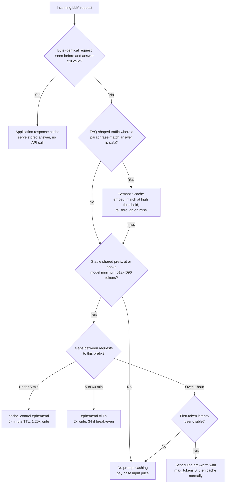

# LLM Prompt Caching

Most production LLM requests re-send the same tokens over and over: the system prompt, the tool definitions, the reference documents, the conversation so far. Prompt caching lets the provider store the processed state of that repeated prefix so subsequent requests pay a fraction of the input price and skip the prefill latency. On the Claude API, cached reads cost ~10% of the base input rate — for a chat product with a 30K-token system context, that is the difference between input costs that scale linearly with traffic and input costs that barely move.

Caching is not a flag you flip; it is a *prompt architecture discipline*. The provider cache is an exact prefix match: one volatile byte near the top of the prompt — a timestamp, an unsorted JSON key, a per-user ID — silently zeroes your hit rate while you keep paying a write premium. This skill covers how to structure prompts so they cache, when to use each of the three caching layers (provider prompt cache, application response cache, semantic cache), and how to verify with numbers instead of vibes.

**When NOT to use this:**

- **One-shot or unique-prefix workloads.** If every request's first 1K tokens differ (fully dynamic prompts, per-document extraction with no shared instructions), there is no reusable prefix. Adding `cache_control` pays the 1.25–2× write premium and never reads — caching makes it *more* expensive.
- **Prefixes below the model minimum.** Claude silently declines to cache prefixes under the model's floor (512 tokens on Claude Fable 5 / Opus 5; up to 4096 on some models). A 300-token system prompt is not a caching problem; leave it alone.
- **Traffic sparser than the longest TTL.** With more than an hour between requests to the same prefix, every request is a cold write. Either pre-warm on a schedule (only if first-token latency is user-visible) or accept uncached pricing.
- **As a correctness mechanism.** Semantic caching in particular trades accuracy for cost. Never put it in front of requests where a near-miss answer is a liability (legal, medical, financial advice, anything user-specific).

## Decision Framework

### Choice 1 — Which caching layer (they stack; pick all that apply)

| Layer | What is cached | Saves | Serving cost | Staleness risk | Use when |
|---|---|---|---|---|---|
| **Provider prompt cache** (Claude `cache_control`) | Processed prompt *prefix* | ~90% of input cost on cached tokens + prefill latency | Cache read ≈ 0.1× input price; output still full price | None — model still generates fresh output | Any repeated prefix ≥ model minimum. The default; do this first |
| **Application response cache** | The *entire answer*, keyed on exact input hash | 100% of the call (input + output + latency) | ~Free (Redis/DB lookup) | High — answer frozen until invalidated | Identical, idempotent queries: FAQ endpoints, classification of duplicate inputs, retried jobs |
| **Semantic cache** | Answers keyed on *embedding similarity* | 100% of the call on a hit | Embedding call + vector lookup (fractions of a cent) | Highest — a near-miss serves a wrong answer confidently | High-volume FAQ-shaped traffic where paraphrases dominate and a slightly-off answer is tolerable |

Honest trade-off: layers 2 and 3 eliminate the whole call but can serve stale or wrong answers; layer 1 never affects correctness but only discounts input tokens. Ship layer 1 everywhere it applies; add 2 and 3 only where the traffic shape justifies the invalidation machinery.

### Choice 2 — TTL: 5 minutes vs 1 hour (Claude `ephemeral` cache)

| | `{"type": "ephemeral"}` (5-min TTL) | `{"type": "ephemeral", "ttl": "1h"}` |
|---|---|---|
| Write premium | 1.25× base input price | 2× base input price |
| Read price | 0.1× | 0.1× |
| Break-even | 2 requests (1.25 + 0.1 = 1.35× vs 2× uncached) | 3 requests (2 + 0.2 = 2.2× vs 3× uncached) |
| TTL refresh | Each cache hit refreshes the clock | Each cache hit refreshes the clock |
| Pick when | Inter-arrival gaps < 5 min (continuous traffic) | Gaps of 5–60 min (bursty, interactive-with-pauses) |
| Wrong choice costs | Gaps > 5 min → every request is a cold 1.25× write: *worse than no caching* | Continuous traffic → double the write premium for nothing |

### Choice 3 — Breakpoint placement (max 4 per request)

Claude renders `tools` → `system` → `messages` and caches everything up to each `cache_control` breakpoint. Place breakpoints at **stability boundaries**, most stable first:

1. **End of the last system block** — caches tools + system together (one breakpoint covers both, because tools render before system).
2. **End of shared context** (retrieved docs, few-shot examples) when the suffix varies per request. Never on the varying suffix itself — that writes a unique entry per request and reads nothing.
3. **Last content block of the newest turn** in multi-turn conversations — each request then reuses the entire prior transcript, and hits accrue incrementally as the conversation grows.

Simplest option when you don't need fine placement: top-level `cache_control: {"type": "ephemeral"}` on `messages.create()` auto-marks the last cacheable block.

### Choice 4 — Pre-warm or not

Pre-warming (a `max_tokens: 0` request at startup or on a schedule) trades a cache write *now* for low first-token latency on the *next* real request. Do it only when all three hold: latency is user-visible (chat/voice), the prefix is large enough that a cold write is noticeably slow, and there is a quiet moment to fire it. Skip it for continuous traffic (real requests keep the cache warm for free), small prefixes, or many distinct per-user prefixes (speculative writes cost more than they save).



## Claude Cache Mechanics — The Facts That Matter

**The one invariant:** the cache key is the exact bytes of the rendered prompt up to each breakpoint. A single byte change at position N invalidates every breakpoint at position ≥ N. Caches are scoped to your organization and to the exact model ID — switching models is a full cache rebuild.

**Pricing (multipliers apply to every model; dollar figures shown for Claude Fable 5 at $10/MTok input):**

| Operation | Multiplier | Fable 5 per MTok | Usage field |
|---|---|---|---|
| Uncached input | 1× | $10.00 | `input_tokens` |
| Cache write, 5-min TTL | 1.25× | $12.50 | `cache_creation_input_tokens` |
| Cache write, 1-hour TTL | 2× | $20.00 | `cache_creation_input_tokens` |
| Cache read | ~0.1× | $1.00 | `cache_read_input_tokens` |

Total prompt size = `input_tokens + cache_creation_input_tokens + cache_read_input_tokens`. `input_tokens` is the *uncached remainder only* — judging spend by it alone under-counts massively.

**Minimum cacheable prefix (below it, caching silently no-ops — no error, just `cache_creation_input_tokens: 0`):**

| Models | Minimum |
|---|---:|
| Claude Fable 5, Opus 5 | 512 tokens |
| Opus 4.8, Sonnet 5, Sonnet 4.6, Sonnet 4.5 | 1024 tokens |
| Opus 4.7 | 2048 tokens |
| Opus 4.6, Opus 4.5, Haiku 4.5 | 4096 tokens |

Note the floor is *not* monotonic across generations — a 3K-token prompt caches on Fable 5 and Sonnet 5 but silently doesn't on Opus 4.6 or Haiku 4.5.

**Invalidation hierarchy** — not every change kills everything. Three tiers; a change invalidates its tier and below:

| Change | Tools cache | System cache | Messages cache |
|---|:---:|:---:|:---:|
| Tool definitions (add/remove/reorder), model switch | ✗ | ✗ | ✗ |
| System prompt content | ✓ | ✗ | ✗ |
| `tool_choice`, images, thinking toggle, message content | ✓ | ✓ | ✗ |

Implication: you may vary `tool_choice` per request without losing the tools+system cache. But editing the tool list or system prompt mid-conversation rebuilds from the top — on models that support it (Opus 5, Opus 4.8, Fable 5), append a `{"role": "system", ...}` message to `messages[]` instead of editing top-level `system`.

**Two operational gotchas:** (1) each breakpoint looks back at most **20 content blocks** for a prior cache entry — agent turns that add more than 20 tool_use/tool_result blocks need an intermediate breakpoint every ~15 blocks; (2) a cache entry becomes readable only once the writing response **starts streaming** — N parallel cold requests all pay full price, so on fan-out send one request, await the first streamed token, then fire the rest.

## Process

1. **Measure the baseline.** Log `usage` from real traffic for a day: total input tokens, requests per prefix, inter-arrival gaps. Identify the largest repeated prefix and its share of spend.
2. **Order the prompt by stability.** Rearrange so content descends from never-changes (tool definitions, core system prompt) → per-deployment (docs, few-shot examples) → per-session (history) → per-request (the question). Stable content must physically precede volatile content.
3. **Freeze the prefix.** Hunt silent invalidators: `datetime.now()` in the system prompt, unsorted `json.dumps`, per-user IDs interpolated early, conditional system sections, tools built per-user. Move each after the last breakpoint, make it deterministic (sort keys, sort tools by name), or delete it.
4. **Place breakpoints** at the stability boundaries from Choice 3 — at most 4, and only where the content above them is ≥ the model minimum.
5. **Choose the TTL** from measured inter-arrival gaps (Choice 2). Default to 5-minute; upgrade to `1h` only where gaps of 5–60 minutes are the norm.
6. **Verify with usage fields.** Run two identical requests back-to-back: request 1 must show `cache_creation_input_tokens > 0`, request 2 must show `cache_read_input_tokens` ≈ the prefix size. Zero reads on identical prefixes means an invalidator survived — diff the rendered prompt bytes between the two requests to find it.
7. **Layer application caching on top** where the traffic shape allows (exact-match first, semantic only for FAQ-shaped volume), with explicit invalidation: TTL plus a version key that bumps whenever the prompt or model changes.
8. **Monitor in production.** Dashboard three numbers per route: cache hit rate (`cache_read / (input + cache_read + cache_creation)`), write:read ratio, and effective $/request. Alert when hit rate drops — a deploy that touched the system prompt is the usual suspect.

### Verification harness

Run this after any change to prompt assembly. It answers the only question that matters — *did the second identical request read the cache?* — and prints the diagnosis when it didn't:

```python
def verify_caching(build_request_fn) -> None:
    """Fire two identical requests; assert write-then-read behavior."""
    first = client.messages.create(**build_request_fn())
    second = client.messages.create(**build_request_fn())
    w, r = first.usage.cache_creation_input_tokens, second.usage.cache_read_input_tokens

    if w == 0:
        raise AssertionError(
            "Request 1 wrote nothing. Either no cache_control marker survived "
            "prompt assembly, or the prefix is below the model minimum "
            "(512 tokens on claude-fable-5)."
        )
    if r == 0:
        raise AssertionError(
            f"Request 1 wrote {w} tokens but request 2 read none — the prefix "
            "bytes differ between calls. Serialize both rendered requests to "
            "disk and diff them: the first differing byte is your invalidator."
        )
    print(f"OK: wrote {w} tokens, re-read {r} tokens "
          f"(uncached remainder on request 2: {second.usage.input_tokens})")
```

Wire it into CI against a staging key. A prompt-assembly refactor that breaks caching passes every functional test and costs 10× in production — this is the only test that catches it.

## Worked Example 1: Meridian Bank Support Copilot (5-minute TTL)

**Scenario.** A banking support copilot on `claude-fable-5`: 6 tool definitions (3,100 tokens), a 2,400-token system prompt, and 27,500 tokens of product and policy documentation — a **33,000-token stable prefix** — plus a short per-conversation history. Traffic: **12,000 requests/day**, arriving seconds apart during business hours.

**Baseline.** Every request paid full price for the prefix: 33K × $10/MTok = **$0.33/request** → **$3,960/day** on prefix input alone. Worse, `cache_read_input_tokens` was 0 even after a naive `cache_control` was added, because the system prompt opened with `f"Today is {datetime.now()}"` — a new prefix every request.

**Decisions and rationale:**

- **Moved the date into the final user turn** — because anything volatile before a breakpoint invalidates everything after it, and the model does not need the date 33K tokens early.
- **5-minute TTL, not 1h** — because requests arrive seconds apart, each hit refreshes the clock, and the 1h option would double the write premium for zero extra coverage.
- **Breakpoint 1 on the last documentation block** — because tools render before system and system before messages, one marker caches all 33K tokens; separate markers on tools and system would burn breakpoints for nothing.
- **Breakpoint 2 on the last block of the newest user turn** — because multi-turn conversations then reuse the full transcript; turn 5 reads turns 1–4 from cache instead of re-paying for them.
- **Sorted the tool array by name and froze serialization** — because a `set`-ordered tool list rendered differently across processes, splitting the cache.

```python
from anthropic import Anthropic

client = Anthropic()  # reads ANTHROPIC_API_KEY / ant auth profile from env

def build_request(history: list, user_msg: str, today: str) -> dict:
    messages = [
        *history,
        {
            "role": "user",
            "content": [
                # Volatile content lives here, AFTER every breakpoint.
                {"type": "text", "text": f"(Today is {today}.)\n\n{user_msg}"},
            ],
        },
    ]
    # Breakpoint 2: cache the conversation tail incrementally.
    messages[-1]["content"][-1]["cache_control"] = {"type": "ephemeral"}
    return {
        "model": "claude-fable-5",
        "max_tokens": 16000,  # Fable 5 thinking is always on; cap covers thinking + answer
        "tools": TOOLS,  # frozen module-level constant, sorted by name
        "system": [
            {"type": "text", "text": SYSTEM_PROMPT},   # frozen — no interpolation
            {
                "type": "text",
                "text": POLICY_DOCS,
                # Breakpoint 1: caches tools + system + docs (33K tokens).
                "cache_control": {"type": "ephemeral"},
            },
        ],
        "messages": messages,
    }

response = client.messages.create(**build_request(history, msg, today))
u = response.usage
assert u.cache_read_input_tokens + u.cache_creation_input_tokens > 0, "cache dead"
```

**Result.** ~5 cold writes/day (morning start plus post-lull restarts): 5 × 33K × $12.50/MTok ≈ $2.06. ~11,995 cached reads: 11,995 × 33K × $1/MTok ≈ $395.84. Prefix spend fell **$3,960 → ~$398/day (−90%)**, and time-to-first-token on warm requests dropped by roughly the prefill time of 33K tokens. The two remaining breakpoint slots stay in reserve.

## Worked Example 2: Hartwell LLP Contract Review (1-hour TTL + pre-warm)

**Scenario.** A law firm's internal tool reviews inbound contracts against an **82,000-token** playbook and clause library on `claude-fable-5`. Volume: **40 contracts/day**, arriving in bursts with a **median 15-minute gap** between reviews, business hours only. Lawyers wait interactively for results.

**The naive attempt failed.** The team copied Example 1's default 5-minute TTL. Median gap (15 min) exceeded the TTL, so nearly every request was a cold write: 40 × 82K × $12.50/MTok = **$41/day** — *more* than the $32.80/day uncached baseline (40 × 82K × $10/MTok). Caching with the wrong TTL was a 25% surcharge.

**Decisions and rationale:**

- **1-hour TTL** — because gaps of 5–60 minutes are exactly the 1h sweet spot: every read refreshes the clock, so one morning write keeps the entry warm all day. Break-even is 3 requests; 40/day clears it by an order of magnitude.
- **Rejected the Batch API** (50% discount) — because lawyers wait on results interactively; batch turnaround (up to an hour, often less) is not compatible with the workflow. Right discount, wrong latency profile.
- **Added a weekday 08:55 pre-warm** — because the first lawyer of the day was eating an 82K-token cold prefill. A `max_tokens: 0` request writes the cache and returns immediately with no output tokens billed.
- **Kept the contract text out of the cached region** — the playbook is shared across all reviews; each contract is unique per request and would otherwise write 40 distinct never-read entries.

```python
# Scheduled 08:55 Mon-Fri: pre-warm the 82K-token playbook cache.
# max_tokens: 0 runs prefill only — content comes back empty, no output billed.
client.messages.create(
    model="claude-fable-5",
    max_tokens=0,
    system=[{
        "type": "text",
        "text": REVIEW_PLAYBOOK,  # 82K tokens, byte-identical to production requests
        "cache_control": {"type": "ephemeral", "ttl": "1h"},
    }],
    messages=[{"role": "user", "content": "warmup"}],
)
```

The production request uses the identical `system` block (same bytes, same breakpoint) with the contract in the user turn — uncached by design, since it never repeats.

**Result.** One 1h write/day (82K × $20/MTok = $1.64) + 40 reads (40 × 82K × $1/MTok = $3.28) ≈ **$4.92/day**, versus $32.80 uncached and $41 with the mis-chosen 5-minute TTL — an **85% reduction**, and the misconfiguration lesson is the durable takeaway: *a cache with a TTL shorter than your traffic gaps is a pure tax.*

## Caching in Agentic Loops

Agents are where caching pays most and breaks most. A 50-turn tool-use loop re-sends the entire transcript on every iteration — without caching, token spend grows quadratically with turn count; with it, each iteration reads the whole prior transcript at 0.1× and pays full price only for the newest turn.

**Advance the tail breakpoint every iteration.** After appending the assistant's `tool_use` turn and your `tool_result` message, move the conversation breakpoint to the last block of the newest message before the next request. The previous breakpoint's entry becomes the read target; hits accrue turn over turn. Remember the 20-block lookback: a single turn that adds more than ~20 tool_use/tool_result blocks needs an intermediate marker or the next request silently misses.

**Forks must inherit the parent's prefix byte-for-byte.** Summarizers, verifier passes, and subagents that spin up a side request only hit the parent's cache if they reuse the parent's `model`, `tools`, and `system` *verbatim* — same objects, same serialization — then append their own instructions at the end. A fork that rebuilds the system prompt "equivalently" is a full-price request.

**Never mutate the tool set or model mid-loop.** Both render at the front of the prefix; either change re-bills the entire transcript. If the agent needs dynamic capabilities, use the tool search tool (discovered schemas are *appended*, preserving the prefix) rather than swapping the `tools` array between turns. If a sub-task belongs on a cheaper model, delegate it to a subagent with its own cache instead of switching the main loop's model — caches are model-scoped, so the "cheap" switch pays two cold rebuilds.

**Inject mid-run instructions behind the cache, not in front of it.** Mode switches and updated context belong at the end of `messages` — as a `{"role": "system", ...}` message on models that support it (Claude Opus 5, Opus 4.8, Fable 5), or as a clearly-delimited note in the next user turn elsewhere — never as an edit to top-level `system`.

## Application-Level Response Caching and Semantic Caching

Provider caching discounts input tokens; it never skips the call. When the *same question* recurs, cache the answer itself.

**Exact-match response cache** — key on a hash of everything that shapes the output. Include a version string so a prompt or model change invalidates the whole cache at once:

```python
import hashlib, json

PROMPT_VERSION = "support-v14"  # bump on any prompt/model/tool change

def response_cache_key(model: str, user_msg: str) -> str:
    payload = json.dumps(
        {"v": PROMPT_VERSION, "model": model, "q": user_msg.strip().lower()},
        sort_keys=True,
    )
    return "llmresp:" + hashlib.sha256(payload.encode()).hexdigest()

def answer(user_msg: str, redis, ttl_s: int = 3600) -> str:
    key = response_cache_key("claude-fable-5", user_msg)
    if (hit := redis.get(key)) is not None:
        return hit.decode()
    response = client.messages.create(**build_request([], user_msg, today))
    if response.stop_reason == "refusal":          # never cache refusals
        return handle_refusal(response)
    text = "".join(b.text for b in response.content if b.type == "text")
    redis.set(key, text, ex=ttl_s)
    return text
```

Only cache **idempotent, non-personalized** answers. Anything conditioned on user identity, account state, or live data must either carry that state in the key or stay uncached.

**Semantic cache** — embed the query, serve a stored answer when cosine similarity clears a high threshold. This is the only layer that can serve a *wrong* answer, so treat the threshold as a safety control, not a hit-rate knob:

```python
import numpy as np

THRESHOLD = 0.97  # start strict; loosen only with an eval set proving it's safe

def semantic_lookup(query: str, index) -> str | None:
    # embed() = your embedding provider (e.g. Voyage AI, Anthropic's
    # recommended embeddings partner). Claude itself is not used here.
    q = np.asarray(embed(query))
    q = q / np.linalg.norm(q)
    best_score, best_answer = -1.0, None
    for vec, answer in index.items():          # use pgvector/Redis in production
        score = float(np.dot(q, vec))          # vectors stored pre-normalized
        if score > best_score:
            best_score, best_answer = score, answer
    return best_answer if best_score >= THRESHOLD else None
```

Rules that keep semantic caching honest: scope the index per tenant and per `PROMPT_VERSION`; log every hit with its score and sample them in QA; measure the false-hit rate on a labeled eval set before loosening the threshold; and always fall through to the real model on a miss — a semantic cache is an accelerator, never the system of record.

## Anti-Patterns

| Symptom | Why it fails | Do instead |
|---|---|---|
| `cache_read_input_tokens` is 0 despite `cache_control` markers | A silent invalidator — timestamp, UUID, unsorted JSON, per-user string — changes the prefix bytes every request | Freeze the prefix; move volatile content after the last breakpoint; diff rendered bytes between two requests |
| Breakpoint placed after per-request content | Every request writes a unique entry (1.25–2× premium) that is never read | Mark the end of the *shared* portion only |
| Tool list or model changes mid-conversation | Tools render at position 0; the entire cache rebuilds, every turn re-billed | Fix the tool set and model per conversation; append `role: "system"` messages (supported models) instead of editing top-level `system` |
| Caching a sub-minimum prefix and assuming it works | Below 512–4096 tokens (model-dependent) caching silently no-ops — no error is raised | Check `cache_creation_input_tokens > 0` on the first request; know your model's floor |
| Cost dashboard reads `input_tokens` only | That field excludes cached tokens; spend looks tiny while reads accrue | Sum all three usage fields; track effective $/request |
| N parallel identical requests at cold start | The entry is readable only after the first response starts streaming — all N pay full price | Send 1, await the first streamed token, then fan out N−1 |
| 1-hour TTL everywhere "to be safe" | 2× write premium needs ≥3 hits to beat uncached; continuous traffic never needed it | Default 5-minute; reserve `1h` for measured 5–60 min gaps |
| Agent turn adds 30+ tool blocks, next turn misses cache | Breakpoints look back at most 20 content blocks for a prior entry | Add an intermediate breakpoint every ~15 blocks in long turns |
| Semantic cache serving subtly wrong answers | Low threshold + no versioning turns paraphrase-matching into misinformation | Threshold ≥ 0.97 to start, per-tenant scoping, version-keyed invalidation, sampled QA of hits |

## Checklist

```
Prompt structure
[ ] Prompt ordered by stability: tools → system → shared docs → history → per-request content
[ ] System prompt frozen — no timestamps, IDs, or conditional sections interpolated
[ ] Tools serialized deterministically (sorted, stable JSON), identical across processes
[ ] Volatile context (date, user state) injected in the final user turn or a role:"system" message

Breakpoints & TTL
[ ] Stable prefix ≥ model minimum (512 Fable 5/Opus 5; 1024 Opus 4.8/Sonnet 5; up to 4096 older)
[ ] ≤ 4 breakpoints, placed at stability boundaries; none after per-request content
[ ] TTL chosen from measured inter-arrival gaps (5-min default; 1h only for 5–60 min gaps)
[ ] Break-even confirmed: ≥2 expected hits (5-min) / ≥3 (1h) per written prefix

Verification & operations
[ ] Two identical requests verified: write on #1, read ≈ prefix size on #2
[ ] Dashboard tracks all three usage fields + hit rate per route; alert on hit-rate drop
[ ] Fan-out code warms with one request before firing the rest
[ ] Pre-warm (max_tokens: 0) scheduled only where latency-visible and traffic has gaps

Response / semantic layers (if used)
[ ] Response cache key includes model + prompt version; version bumped on every prompt change
[ ] Refusals and errors never cached
[ ] Semantic threshold validated against a labeled eval set; hits logged with scores
[ ] Per-tenant scoping — no cross-user answer leakage
```

## 10 Rules

1. **Design the prompt for the cache before you enable the cache.** Stability ordering costs nothing and pays even at hit rates you haven't earned yet.
2. **The system prompt is a frozen artifact — version it like code.** Every edit is a fleet-wide cache rebuild; batch prompt changes into deploys, never interpolate into them.
3. **Default to the 5-minute TTL.** The 1-hour tier is a tool for measured 5–60 minute gaps, not insurance — its 2× write premium punishes guessing.
4. **A cache you haven't verified is a cache you don't have.** No error is raised for sub-minimum prefixes or broken prefixes; only `cache_read_input_tokens` tells the truth.
5. **Caching is a bet on repetition — price the bet.** Two hits to win at 5 minutes, three at 1 hour; if you can't name the expected hit count, don't place the marker.
6. **Exact-match before semantic, always.** A hash lookup is free and cannot be wrong; an embedding match is neither. Earn the right to semantic caching with FAQ-shaped volume.
7. **Every timestamp in a prompt is guilty until proven load-bearing.** Most exist for vibes; move them to the final turn or delete them.
8. **Treat a hit-rate drop as an incident, not a curiosity.** It is almost always a deploy that touched the prefix, and it silently multiplies input spend by ~10×.
9. **Never fan out cold.** One warm-up request, first streamed token, then the swarm — or every parallel worker pays the full write.
10. **Layers stack; responsibilities don't.** The prompt cache saves money, the response cache saves calls, the semantic cache saves calls at the price of certainty — never ask a lower layer to guarantee what only the model can.

## References

- Claude prompt caching guide: https://platform.claude.com/docs/en/build-with-claude/prompt-caching
- Claude API pricing (cache write/read rates per model): https://platform.claude.com/docs/en/pricing
- Message Batches API (50% discount — the alternative when latency doesn't matter): https://platform.claude.com/docs/en/build-with-claude/batch-processing
