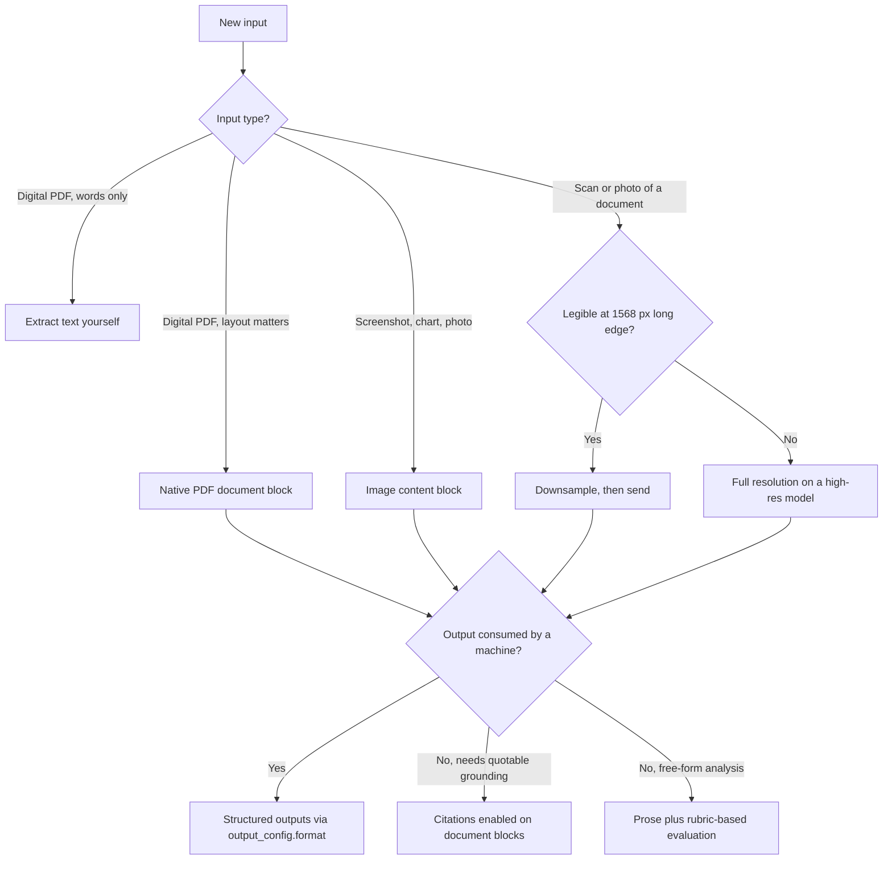

# Multimodal AI

Multimodal AI in production means feeding images and documents into a language model and getting back something a system can act on: extracted fields, grounded answers, verified descriptions. The hard part is not the API call — it is the pipeline around it. Which ingestion path preserves the information you need? What resolution do you actually pay for? How do you know the extraction is right at 12,000 documents a month instead of 12? Teams that treat vision as "text with pictures attached" ship pipelines that are 3× too expensive and fail silently on exactly the documents that mattered.

The Claude API accepts **images** (JPEG, PNG, GIF, WebP) and **PDFs** as first-class inputs. PDFs get double treatment: each page is converted to an image *and* its text is extracted, so the model reads both the pixels and the words. Everything in this skill builds on those two primitives.

**When NOT to use this:**

- **Audio or video** — the Claude API does not accept them as inputs. Transcribe audio upstream (any ASR system); after that it is a text problem, not a multimodal one.
- **Image generation** — Claude analyzes images; it never creates or edits them. Reach for a diffusion-model pipeline instead.
- **Text-only corpora** — if your PDFs are digital-native and layout carries no meaning (contracts you only need the words from, exported reports), extract the text yourself and run a plain text pipeline. Native PDF processing bills text tokens *plus* image tokens per page; don't pay for pixels you don't need.
- **Pixel-perfect precision** — exact measurement, counting hundreds of small objects, or identifying people in images. The first two are approximate by design; the third is prohibited by policy.
- **Diagnostic medical imaging** — CT/MRI interpretation is explicitly out of scope for the model. General medical images work; diagnosis does not.

## Decision Framework

Four choices determine cost, accuracy, and auditability. Make them deliberately, per input class — not once globally.

### 1. Document ingestion path

| Path | What the model sees | Typical cost per page | Choose when | You give up |
|---|---|---|---|---|
| **Native PDF document block** | Extracted text + a rendered image of each page | 1,500–3,000 text tokens + the page render's image tokens | Layout, tables, stamps, signatures, or figures carry meaning; scans and digital PDFs share one pipeline | Highest per-page cost |
| **Self-extracted text** | Text only (you run `pdftotext`/parser) | ~300–1,000 tokens | Digital-native PDFs where only the words matter | All figures, layout, handwriting, stamps |
| **Page-as-image** | Page renders you control | You set it — ~2,000 tokens at 1092 px long edge | Multimodal RAG (retrieve and send individual pages); custom resolution control | The extracted-text channel — the model reads pixels only |
| **External OCR → text** | OCR output | OCR fees + text tokens | You already run OCR for search/archival, or need a model-agnostic text store | Layout fidelity; OCR errors compound downstream |

The default is native PDF: Claude reads scans directly, so a separate OCR stage is usually a redundant error source, not a preprocessing step.

### 2. Resolution budget

Claude reads images in 28×28-pixel patches: an image costs `⌈width/28⌉ × ⌈height/28⌉` visual tokens, capped by the model's resolution tier. High-resolution support is automatic — no header, no opt-in.

| Tier | Models | Max long edge | Max visual tokens |
|---|---|---|---|
| High-resolution | Claude 4.7 and later (incl. `claude-fable-5`) | 2576 px | 4,784 |
| Standard | Older models | 1568 px | 1,568 |

Verified costs at common sizes:

| Image | Standard tier | High-res tier |
|---|---|---|
| 1000×1000 | 1,296 tokens | 1,296 tokens |
| 1920×1080 screenshot | 1,560 (downscaled) | 2,691 (native) |
| 3840×2160 (4K) | 1,560 (downscaled) | 4,784 (downscaled to 2576×1449) |

The honest trade-off: on a high-res model, the same 4K screenshot costs ~3× what it did on the standard tier. That fidelity wins on dense documents and small UI text and is wasted on product photos. Downsample client-side to ~1092 px long edge (≈1,521 tokens) as the default; escalate only when a legibility spot-check fails.

### 3. Image transport

| Transport | Strength | Weakness | Choose when |
|---|---|---|---|
| `base64` | Self-contained, works everywhere | Bytes re-sent with the full history every turn; 10 MB/image, 32 MB/request | One-shot calls |
| `url` | Small payload, no encoding | External fetch dependency; availability and privacy of the URL | Public or CDN-hosted images |
| Files API `file_id` | Upload once, reference forever; payloads stay small as history grows | Beta header (`files-api-2025-04-14`) on both upload and message | Multi-turn agents, repeated analysis, image-heavy requests |

### 4. Extraction contract

| Contract | Guarantee | Limitation | Choose when |
|---|---|---|---|
| **Structured outputs** (`output_config.format`) | Response is valid JSON matching your schema | No numeric/length constraints in the schema; **incompatible with citations (400)** | Any machine-consumed fields |
| **Citations** (`citations: {enabled: true}` on document blocks) | Every claim carries `cited_text` + 1-indexed page numbers | Output is prose blocks, not schema-shaped; incompatible with structured outputs | Compliance and human-review workflows |
| **Two-pass** | Both | Two calls, ~2× cost on that document | High-stakes extraction that must be auditable |

You cannot have schema-guaranteed JSON and citation-grounded output in the same call — the API rejects the combination. Decide per endpoint which guarantee matters, or pay for both passes.



## Process

1. **Inventory and classify inputs.** Digital PDF / scan / photo / screenshot / chart. Record the mix (%), page counts, and worst-case samples per class. Pipelines fail on the tail, not the median.
2. **Baseline the token cost.** Run `client.messages.count_tokens()` on 10 representative documents per class against the exact model you'll ship. Never price a pipeline from estimates when the metering endpoint is free.
3. **Pick an ingestion path per class** from Decision 1 and write it down as a routing rule. Mixed corpora get routed, not averaged.
4. **Set the resolution policy.** Default to 1092 px long edge; check legibility on the 5 worst samples; escalate that class to full resolution only if small text fails. Resize client-side so you control the trade, not the server's downscaler.
5. **Choose transport.** Base64 for one-shot calls; Files API the moment an image appears in more than one request.
6. **Define the extraction contract.** A JSON schema with `additionalProperties: false` on every object. The schema cannot express numeric bounds or cross-field rules — put those in a post-parse validator in code.
7. **Assemble requests correctly.** Media blocks first, question last (documented best practice — Claude attends better to images placed before text). Label multiple images `Image 1:`, `Image 2:` so you can reference them. Put a `cache_control` breakpoint on the stable system prompt.
8. **Handle failure modes explicitly.** Branch on `stop_reason` before reading content — `claude-fable-5` safety classifiers can return `"refusal"` with empty content on a 200. Handle `max_tokens` truncation and `413 request_too_large` (split the document).
9. **Build a golden set and evaluate by slice.** 50–200 documents with field-level ground truth. Score extraction per field (precision/recall per field, not per document); score free-form vision output with a vision-capable judge and a rubric. Report text-answerable and vision-dependent slices separately.
10. **Optimize, then re-measure.** Batch API for anything that can wait (50% off). Downsample. Tier models — `claude-haiku-4-5` for routine documents (note its 200K context caps PDFs at 100 pages), `claude-fable-5` for the hard tail. Re-run the golden set after every change.

## Structured Extraction from a PDF

Production shape: document block first, schema-constrained output, refusal check, code-level validation for what the schema can't express.

```python
import base64
import json
from pathlib import Path

import anthropic

client = anthropic.Anthropic()

INVOICE_SCHEMA = {
    "type": "object",
    "properties": {
        "vendor_name": {"type": "string"},
        "invoice_number": {"type": "string"},
        "invoice_date": {"type": "string", "format": "date"},
        "currency": {"type": "string", "enum": ["USD", "EUR", "GBP"]},
        "total_cents": {"type": "integer"},
        "line_items": {
            "type": "array",
            "items": {
                "type": "object",
                "properties": {
                    "description": {"type": "string"},
                    "quantity": {"type": "integer"},
                    "unit_price_cents": {"type": "integer"},
                    "amount_cents": {"type": "integer"},
                },
                "required": ["description", "quantity", "unit_price_cents", "amount_cents"],
                "additionalProperties": False,
            },
        },
    },
    "required": ["vendor_name", "invoice_number", "invoice_date", "currency",
                 "total_cents", "line_items"],
    "additionalProperties": False,
}

def extract_invoice(pdf_path: str) -> dict:
    pdf_b64 = base64.standard_b64encode(Path(pdf_path).read_bytes()).decode()

    response = client.messages.create(
        model="claude-fable-5",          # thinking is always on — no thinking param
        max_tokens=2048,
        messages=[{
            "role": "user",
            "content": [
                {   # document block BEFORE the instruction — documented best practice
                    "type": "document",
                    "source": {
                        "type": "base64",
                        "media_type": "application/pdf",
                        "data": pdf_b64,
                    },
                },
                {
                    "type": "text",
                    "text": "Extract the invoice fields. All monetary values are "
                            "integer cents. Use the totals printed on the document; "
                            "do not recompute them.",
                },
            ],
        }],
        output_config={
            "format": {"type": "json_schema", "schema": INVOICE_SCHEMA},
        },
    )

    if response.stop_reason == "refusal":
        raise RuntimeError("Request declined by safety classifiers — route to manual queue")
    if response.stop_reason == "max_tokens":
        raise RuntimeError("Truncated output — raise max_tokens and retry")

    data = json.loads(response.content[0].text)

    # The schema cannot express cross-field rules — enforce them here.
    computed = sum(item["amount_cents"] for item in data["line_items"])
    if data["line_items"] and abs(computed - data["total_cents"]) > 1:
        data["_needs_review"] = f"line items sum to {computed}, total says {data['total_cents']}"
    return data
```

Monetary values are integer cents because floats corrupt financial data, and the sum check exists because the most common real-world extraction error is a line item silently dropped from a dense table — the schema can't catch that; arithmetic can.

Three PDF-specific habits that pay for themselves:

- **Refer to logical page numbers** ("on page 12") — the numbers a PDF viewer shows are the ones the model sees, and citations return the same 1-indexed `page_location` values.
- **Rotate pages upright and keep text legible before upload** — PDF understanding rides on vision, so a sideways scan degrades exactly like a sideways photo.
- **Split large documents by section** rather than trusting the 600-page ceiling — dense pages can exhaust the context window or the 32 MB request cap long before the page limit, and smaller requests fail (and retry) more cheaply.

## Resolution Control for Images

Downsample before sending — you choose the fidelity/cost point instead of inheriting the server's cap.

```python
import base64
import io
import math

from PIL import Image

HIGH_RES_LONG_EDGE = 2576   # high-res tier cap (Claude 4.7+, incl. claude-fable-5)
DEFAULT_LONG_EDGE = 1092    # ~1,521 tokens — the cost-effective default

def visual_tokens(width: int, height: int) -> int:
    """Cost = one token per 28x28 patch."""
    return math.ceil(width / 28) * math.ceil(height / 28)

def prepare_image(path: str, long_edge: int = DEFAULT_LONG_EDGE) -> dict:
    """Resize to a target long edge and return a ready-to-send image block."""
    img = Image.open(path)
    w, h = img.size
    scale = long_edge / max(w, h)
    if scale < 1:                       # never upscale — it adds tokens, not detail
        img = img.resize((round(w * scale), round(h * scale)), Image.LANCZOS)

    buf = io.BytesIO()
    img.convert("RGB").save(buf, format="PNG")
    return {
        "type": "image",
        "source": {
            "type": "base64",
            "media_type": "image/png",
            "data": base64.standard_b64encode(buf.getvalue()).decode(),
        },
    }
```

For repeated or multi-turn use, upload once and reference by ID instead of re-sending bytes with every turn of history:

```python
# Upload once (Files API, beta) ...
with open("dashboard.png", "rb") as f:
    file_upload = client.beta.files.upload(file=("dashboard.png", f, "image/png"))

# ... reference many times. Beta header required on the message call too.
response = client.beta.messages.create(
    model="claude-fable-5",
    max_tokens=1024,
    betas=["files-api-2025-04-14"],
    messages=[{
        "role": "user",
        "content": [
            {"type": "image", "source": {"type": "file", "file_id": file_upload.id}},
            {"type": "text", "text": "Which metric regressed week-over-week?"},
        ],
    }],
)
```

## Worked Example 1: Invoice Extraction at Meridian Logistics

**Scenario.** An AP team processes 12,000 vendor invoices/month: 70% digital PDFs, 30% scans, averaging 2 pages. Target: ≥98% field accuracy on totals, overnight turnaround is acceptable.

**Decisions and rationale:**

- **Native PDF document blocks for everything** — because scans and digital PDFs then share one pipeline (PDF pages are rendered as images either way, so scans "just work"), and because invoice tables, stamps, and handwritten annotations are exactly the layout signal that self-extracted text destroys. An external OCR stage was rejected: it would add a second error source in front of a model that already reads the pixels.
- **Structured outputs, not prompt-and-parse** — because at 12,000 documents/month, even a 1% JSON parse-failure rate is 120 manual repairs. A schema guarantee turns a recurring ops cost into zero.
- **Batch API** — because invoices arrive all day but post overnight. Latency is free to give away; the discount is a permanent 50%.

**The numbers** (measured with `count_tokens` on a 10-invoice sample, then averaged):

| Component | Tokens |
|---|---|
| Extracted text, 2 pages × ~2,000 | 4,000 |
| Page renders, 2 pages × ~1,800 | 3,600 |
| Instruction + schema overhead | ~400 |
| **Input total** | **~8,000** |
| Output (JSON) | ~350 |

Per invoice on `claude-fable-5` ($10/M input, $50/M output): 8,000 × $10/M + 350 × $50/M ≈ **$0.098**. Monthly: 12,000 × $0.098 ≈ **$1,175**. Via the Batch API: ≈ **$588/month**. The team also routed the 70% digital slice to `claude-haiku-4-5` after the golden set showed no accuracy delta on clean PDFs, cutting the routine slice's cost ~10× and reserving `claude-fable-5` for scans and dispute cases — tiering by measured difficulty, not by vibes.

**Validation gate.** Line-item sums are checked against the printed total in code (see the extraction example above); mismatches route to a human queue. In the first month this caught 41 dropped-line-item extractions — errors invisible to any schema check.

## Worked Example 2: Multimodal RAG for Field-Service Manuals at Fieldbox

**Scenario.** A device maker's support assistant answers technician questions over a 900-page corpus of installation manuals. 38% of the golden-set questions depend on wiring diagrams and exploded views that text extraction reduces to captions like "Figure 12". Target: ≥85% accuracy on the diagram-dependent slice.

**Decisions and rationale:**

- **Retrieve with text, answer with pixels.** Pages are indexed by extracted text *plus* a one-time captioning pass (Claude describes each figure at ingest, ~$9 one-off for the corpus), so diagram pages become text-retrievable. At query time, the top-3 pages are sent as **page images**, not text — because the answer to "which terminal does the brown wire land on" is in the pixels, and this is what text-only RAG structurally cannot do.
- **Pages rendered at 1092 px long edge, not full 2576 px** — a legibility spot-check showed wiring labels readable at 1092 px (≈1,989 tokens for an A4-ratio page). Full resolution would cost ~4,700 tokens/page — roughly 2.4× the spend — for no measured accuracy gain on this corpus. The policy is per-corpus: a schematics library with 6-point text would earn the escalation.
- **Prompt caching on the system prompt** — the 1,200-token instruction block is byte-stable and marked with `cache_control: {"type": "ephemeral"}`, so repeat queries pay ~0.1× on it (`claude-fable-5`'s minimum cacheable prefix is 512 tokens, so it qualifies).

**The numbers, per query:** 3 pages × 1,989 ≈ 5,970 image tokens + ~120 question tokens ≈ 6,100 uncached input → $0.061; ~400 output tokens → $0.020. **≈ $0.08/query**, ~$245/month at 3,000 queries. The text-only baseline cost $0.01/query — and scored 31% on the diagram slice versus 88% for page-image generation. The 8× cost multiple bought the 38% of tickets the cheap pipeline could not answer at all.

**Evaluation.** A 60-question golden set, split into text-answerable and diagram-dependent slices, scored by a vision-capable judge against a rubric (correct terminal/part/step named). The slice split is the point: a blended score would have let the text-only baseline's 84% overall hide its 31% on the questions that motivated the project.

## Anti-Patterns

| Symptom | Why it fails | Do instead |
|---|---|---|
| OCR-ing digital PDFs before sending | Destroys layout the model reads natively; OCR errors compound | Send the PDF as a document block — each page arrives as text + image |
| Full-resolution everything on a high-res model | Up to 4,784 tokens/image, ~3× the standard tier, mostly wasted | Downsample to ~1092 px; escalate per class after a legibility check |
| Re-sending base64 images every agent turn | Bytes ride along with the whole history; payloads balloon toward the 32 MB cap | Upload once to the Files API, reference the `file_id` |
| Citations + `output_config.format` in one call | The API returns 400 — they are mutually exclusive | Pick per endpoint, or run a two-pass extract-then-ground flow |
| Question before the image | Measurably weaker image attention | Media blocks first, instruction last |
| Regex-parsing JSON out of prose | Parse failures and silent schema drift at volume | Structured outputs with a JSON schema; business rules in a post-parse validator |
| Exact-match evals on vision descriptions | Correct answers phrased differently score zero | Field-level scoring for extraction; rubric + vision judge for prose |
| Reading `response.content[0]` unconditionally | `claude-fable-5` can return `stop_reason: "refusal"` with empty content on a 200 | Branch on `stop_reason` first; route refusals to a fallback or manual queue |
| One request per giant PDF | Dense documents can exhaust the context or the 32 MB request cap before the 600-page limit | Split by section; in RAG, retrieve pages — never dump volumes |
| Expecting the model to fix bad inputs | Blurry, rotated, or sub-200px images degrade accuracy sharply | Preprocess: deskew, rotate upright, reject illegible inputs at intake |

## Checklist

```
Multimodal pipeline pre-flight
[ ] Input classes inventoried (digital PDF / scan / photo / screenshot) with % mix
[ ] count_tokens run on 10 representative samples per class, on the shipping model
[ ] Ingestion path chosen per class and written down as a routing rule
[ ] Resolution policy set (default 1092 px long edge); legibility checked on worst samples
[ ] Client-side resize in place — no reliance on server downscaling
[ ] Media blocks placed before text; multiple images labeled "Image 1:", "Image 2:"
[ ] Transport chosen: base64 one-shot, Files API for anything reused (beta header both ends)
[ ] Extraction schema has additionalProperties: false on every object
[ ] Cross-field business rules validated in code after parsing
[ ] stop_reason handled: refusal, max_tokens, plus 413 for oversized requests
[ ] Citations vs structured outputs decided per endpoint (never both in one call)
[ ] cache_control breakpoint on the stable system prompt (≥512 tokens on claude-fable-5)
[ ] Golden set built (50–200 docs) with field-level ground truth
[ ] Eval reports per-field and per-slice (text-answerable vs vision-dependent)
[ ] Batch API used for all non-interactive volume (50% discount)
[ ] Model tiering measured, not assumed (haiku-4-5 routine / fable-5 hard tail)
[ ] Monthly re-baseline scheduled — input mix and model behavior both drift
```

## 10 Rules

1. **Pixels before words.** Image and document blocks precede the question in every request — this is documented, measurable, and free.
2. **Measure, never estimate.** `count_tokens` is free and exact; pricing a pipeline from guesswork is malpractice.
3. **Downsample by default, escalate by evidence.** 1092 px until a legibility check on your worst samples fails; the high-res tier's 3× cost must be earned per input class.
4. **Digital PDFs go in as PDFs.** Never put an OCR stage in front of a model that already reads scans with layout intact.
5. **Structured outputs for machines, citations for humans** — and accept that the API forces you to choose per call.
6. **Validate in two layers.** The JSON schema guarantees shape; only code can guarantee that line items sum to the total.
7. **Batch anything that can wait an hour.** It is a permanent 50% discount with no quality trade-off.
8. **Files API the moment an image appears twice.** Re-sending base64 with every turn is the quietest cost leak in agentic pipelines.
9. **Evaluate by slice.** Text-answerable and vision-dependent questions fail differently; a blended score is where regressions hide.
10. **Every vision claim a human acts on needs a grounding path** — a citation, a page number, or a crop the reviewer can check. "The model said so" is not an audit trail.

## References

- Vision (formats, limits, token costs): platform.claude.com/docs/en/build-with-claude/vision
- PDF support (processing model, page limits): platform.claude.com/docs/en/build-with-claude/pdf-support
- Files API: platform.claude.com/docs/en/build-with-claude/files
- Structured outputs: platform.claude.com/docs/en/build-with-claude/structured-outputs
- Citations: platform.claude.com/docs/en/build-with-claude/citations
- Batch processing: platform.claude.com/docs/en/build-with-claude/batch-processing
