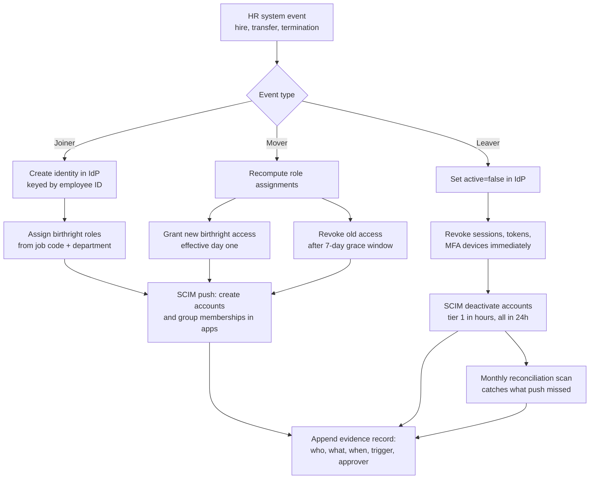

# Identity Governance

Identity governance and administration (IGA) is the discipline of answering three questions continuously and provably: **who has access to what, should they, and can you show the evidence?** Authentication (SSO, MFA) proves who someone is. IGA governs what they may touch and how that changes as they join, move roles, and leave. It is the difference between "we use Okta" and "we can demonstrate that the engineer who resigned last Tuesday lost production access within four hours, and here is the log."

Access decays toward over-privilege by default. People accumulate entitlements with every project, escalation, and re-org, and lose almost none of them. Left ungoverned, a five-year employee holds the union of every job they ever had. That decay is why terminated-but-active accounts and excessive standing privilege show up in breach post-mortems year after year, and why every major control framework — SOX ITGC, SOC 2 CC6, ISO/IEC 27001 A.5.15–A.5.18, NIST SP 800-53 AC-2/AC-5/AC-6 — demands lifecycle management, least privilege, and periodic review. IGA is the machinery that makes those demands cheap to satisfy instead of a quarterly fire drill.

**When NOT to use this:**

- **Under ~50 people and ~15 apps.** SSO with a handful of groups, a written offboarding checklist with an owner, and a quarterly spreadsheet review is proportionate. An IGA platform at this size is process theater.
- **Customer identity (CIAM).** Registration, consent, social login, and progressive profiling are a different problem with different tools. This skill governs workforce and vendor access.
- **In-app authorization engines.** How an application evaluates permissions per-request (policy engines, ACL checks) is authorization design. IGA governs who *holds* an entitlement, not how the app enforces it at runtime.
- **Machine credentials.** API keys, workload identity, and secrets rotation belong to secrets management — though service accounts still need a named human owner and appear in reviews here.

## Core Objects

Get the vocabulary precise; every table and process below depends on it.

| Term | Meaning |
|------|---------|
| Identity | The person (or service), anchored to an HR record — one per human, ever |
| Account | An identity's representation in one system (Okta user, GitHub member, AWS IAM role session) |
| Entitlement | A grantable unit of access in an app (`banking-core: wire.initiate`, GitHub team `payments-write`) |
| Role | A named bundle of entitlements mapped to a job function, with a named owner |
| Assignment | Identity → role or identity → entitlement, with grant date, grantor, and (for exceptions) expiry |
| Certification | A recorded decision by an accountable reviewer that an assignment should continue to exist |
| Orphaned account | An active account whose identity is terminated or unknown — the #1 audit finding |

## Decision Framework

### Decision 1 — Access model

| Model | How access is granted | Strength | Cost | Choose when |
|-------|----------------------|----------|------|-------------|
| Pure RBAC | Roles from job function only | Trivially certifiable; auditors love it | Role explosion — the long tail of unique needs forces 1 role per person | Stable org, uniform jobs (call centers, retail) |
| ABAC | Policy over attributes (dept, location, employment type) | No role explosion; scales with org change | "Who can access X?" requires evaluating policy; attribute quality debt is invisible until it fails | High-quality HR attributes, dynamic access needs |
| **Hybrid (default)** | Birthright roles cover ~80%; the tail is requestable entitlements with approval + expiry | Certifiable core, flexible tail | Two mechanisms to govern | Almost everyone from ~200 people up |
| Direct grants only | Per-user, ad hoc | None | Unbounded review surface; every audit is archaeology | Never past ~50 people |

**Default: hybrid.** Pure RBAC fails on the tail (see Worked Example 1 — hitting 95% coverage with roles alone tripled the role count); pure ABAC fails the "prove it" question. Birthright RBAC keyed on HR attributes *is* a constrained form of ABAC — you get the best of both.

### Decision 2 — Provisioning mechanism (per app, not one global answer)

| Mechanism | Latency | Depth | Cost | Use for |
|-----------|---------|-------|------|---------|
| SCIM push from IdP | Minutes | Create/deactivate everywhere; entitlement depth varies by app — many SCIM implementations only sync users and group memberships | Low (config) | Every app that supports it — this is the default |
| IGA platform connectors (SailPoint, Saviynt, Okta Identity Governance, Entra ID Governance) | Minutes | Deep: fine-grained entitlements, read-back for certification | High ($ + months) | 1,000+ identities, many deep tier-1 apps, heavy audit load |
| IaC / GitOps (Terraform-managed groups, cloud IAM) | PR merge | Full, reviewable, diffable | Engineering time | Cloud IAM and infra access — the PR *is* the evidence |
| Ticket + runbook + SLA | Hours–days | Whatever a human does | Ongoing toil | The tail of apps with no API — measure and shrink this set |

**Default: SCIM from the IdP for everything that supports it, IaC for cloud infrastructure, tickets with a measured SLA for the remainder.** Buy an IGA platform when certification volume or connector depth demands it, not before — the platforms amplify a good role model and embalm a bad one.

### Decision 3 — Certification strategy

| Strategy | Reviewer load | Assurance | Failure mode |
|----------|--------------|-----------|--------------|
| Full periodic campaign (everyone reviews everything quarterly) | Brutal — hundreds of line items per reviewer | Theoretical | Rubber-stamping: 99% approval in 40 minutes is a ritual, not a control |
| **Risk-tiered (default)** | Concentrated where impact is | High where it matters | Requires honest tiering of entitlements up front |
| Delta / event-triggered | Minimal — review only new and changed access, plus mover/exception events | High signal per item | Needs a trustworthy baseline certification first; auditors will ask for it |

**Default: risk-tiered with delta reviews layered on.** Privileged, SoD-relevant, and regulated-data access: quarterly, item-level. Standard requestable access: semi-annual, changed-items-only. Birthright: certified annually at the *role definition* level by the role owner — reviewers can reason about a role's 12 entitlements; they cannot reason about 460 raw user-entitlement pairs (Worked Example 2 shows what happens when you ask them to).

### Decision 4 — Source of truth for "who works here"

| Source | Verdict |
|--------|---------|
| **HR system (Workday, BambooHR, HiBob, …)** | **Correct.** Hire, transfer, and termination events originate here; everything downstream is a projection |
| The IdP | Tempting and wrong — the IdP learns of a termination only if someone tells it; that "someone" must be an HR-driven integration, not a person |
| A spreadsheet / the manager's memory | The origin story of every orphaned-account finding |

Contractors and vendors are the trap: if they are not in the HR system, put them in a system of record with a **mandatory end date** that drives the same pipeline. Identity without an authoritative source is ungovernable.

## Process

1. **Establish the authoritative source.** Wire HR → IdP (native integrations exist for the major pairs; nightly sync is the floor, event webhooks the target). Every identity carries employee ID, job code, department, manager, employment type, and end date for non-employees.
2. **Inventory apps and tier them.** Tier 1: money movement, production, regulated data, admin consoles. Tier 2: business apps with meaningful data. Tier 3: low-risk tools. Tier drives provisioning depth, certification frequency, and deprovisioning SLA.
3. **Extract current assignments.** Pull every user-entitlement pair from tier-1 and tier-2 apps into one dataset (IdP group exports + app admin APIs + CSV for the stragglers). This snapshot is the input to mining and your day-zero baseline.
4. **Mine roles.** Cluster assignments by job code + department. Entitlements held by a supermajority of a cohort become birthright candidates; validate each candidate with the function's lead, then assign a named owner per role.
5. **Define the request path for the tail.** Everything non-birthright is requestable: named approvers, maximum duration, auto-expiry. An exception without an expiry date is a permanent grant wearing a costume.
6. **Encode SoD rules as data.** Enumerate toxic combinations (initiate + approve payments, create vendor + approve invoice, deploy + approve own change, admin + audit-log admin). Evaluate at request time (preventive) and in a scheduled scan (detective).
7. **Automate the JML pipeline** (diagram below). Joiner: identity + birthright before day one. Mover: grant new access immediately, revoke old after a short grace window. Leaver: sessions and tokens in minutes, tier-1 accounts in hours, everything in 24.
8. **Stand up certifications** per Decision 3, with revocations executed automatically on decision — a review whose revocations sit in a ticket queue for six weeks is evidence against you.
9. **Reconcile and measure.** Monthly orphan scan (SQL below) as the detective net under the preventive automation. Track: time-to-deprovision, orphan count, exception count and age, certification revocation rate, birthright coverage.

## The Joiner-Mover-Leaver Pipeline



Two asymmetries are deliberate. **Movers gain fast and lose slowly** — a short grace window on old access prevents day-one paralysis in the new role while keeping the revocation automatic instead of forgotten. **Leavers lose fast, in layers** — deactivating the IdP account does not kill live sessions, OAuth refresh tokens, or app-local passwords; those are separate revocations and belong in the runbook explicitly.

## Building Blocks

### SCIM 2.0 provisioning (RFC 7643/7644)

Joiner — the IdP (or your pipeline) creates the account with the enterprise extension carrying the attributes your role logic keys on:

```http
POST /scim/v2/Users
Content-Type: application/scim+json

{
  "schemas": [
    "urn:ietf:params:scim:schemas:core:2.0:User",
    "urn:ietf:params:scim:schemas:extension:enterprise:2.0:User"
  ],
  "userName": "amara.diallo@example.com",
  "name": { "givenName": "Amara", "familyName": "Diallo" },
  "emails": [ { "value": "amara.diallo@example.com", "primary": true } ],
  "active": true,
  "urn:ietf:params:scim:schemas:extension:enterprise:2.0:User": {
    "employeeNumber": "E-10482",
    "department": "Payments Operations",
    "manager": { "value": "2819c223-7f76-453a-919d-413861904646" }
  }
}
```

Leaver — deactivate, don't delete (you want the account for forensics and the audit trail; delete on a retention schedule later):

```http
PATCH /scim/v2/Users/{id}
Content-Type: application/scim+json

{
  "schemas": ["urn:ietf:params:scim:api:messages:2.0:PatchOp"],
  "Operations": [
    { "op": "replace", "path": "active", "value": false }
  ]
}
```

Know each app's SCIM depth before you rely on it: many implementations support user create/deactivate and group membership but not fine-grained entitlements. Where that is the case, model entitlements as IdP groups so SCIM group push carries them — and treat apps whose SCIM is create-only as ticket-tail for revocation.

### Roles and SoD rules as reviewed data

Roles live in a repo; changes arrive as pull requests reviewed by the role owner. The diff *is* the change record.

```yaml
# roles/payments-operations.yaml
role: payments-operations
owner: head-of-payments            # accountable for the annual role review
birthright:
  when: { job_code: "PAY-OPS", employment_type: "employee" }
entitlements:
  - { app: banking-core, entitlement: wire.initiate }
  - { app: zendesk,      entitlement: agent }
requestable:
  - app: banking-core
    entitlement: wire.limits.raise
    approvers: [manager, head-of-payments]
    max_duration_days: 90

# sod/rules.yaml
- id: SOD-001
  description: No one both initiates and approves wire transfers
  conflict:
    - { app: banking-core, entitlement: wire.initiate }
    - { app: banking-core, entitlement: wire.approve }
  enforcement: block               # block | require-exception
- id: SOD-002
  description: Vendor creation and payment approval are separated
  conflict:
    - { app: netsuite, entitlement: vendor.create }
    - { app: netsuite, entitlement: payment.approve }
  enforcement: require-exception
  exception_approver: cfo
  max_exception_days: 30
```

### Orphan reconciliation (detective control)

Preventive automation fails silently — an expired SCIM token deprovisions nobody and raises no alarm. Run this monthly against the app-account inventory joined to the HR roster:

```sql
-- Orphaned accounts: active app accounts with no active employee behind them.
-- app_accounts: nightly export/SCIM inventory. hr_roster: the HR feed.
SELECT a.app_name, a.account_id, a.username, a.last_login_at
FROM app_accounts a
LEFT JOIN hr_roster h
  ON lower(a.email) = lower(h.work_email)
WHERE a.status = 'active'
  AND (h.employee_id IS NULL OR h.employment_status <> 'active')
ORDER BY a.last_login_at DESC NULLS LAST;   -- NULLS LAST: PostgreSQL syntax
```

Rows with recent `last_login_at` are incidents, not cleanup items.

## Worked Example 1 — Role Mining at a 420-Person Fintech

**Meridian Pay**: 420 employees, Okta + Workday, 61 SaaS apps plus AWS, SOC 2 Type II holder, pre-IPO SOX readiness starting. Symptom set: 1,340 Okta groups (214 empty, 388 single-member), onboarding modeled as "copy whatever Bob has," 380 access-request tickets/month, average 3.2 days for a new hire to become productive.

**Extraction (step 3):** 18,700 user-entitlement assignments across the 14 tier-1/tier-2 apps.

**Mining (step 4):** Clustered by `job_code + department`. **We keyed on job code, not title, because** Workday titles were free text — the spot check found 14 spellings of "Software Engineer" — while job codes were a controlled vocabulary maintained by HR comp. An entitlement became a birthright candidate when **≥70% of a cohort held it**. The threshold was tuned empirically: at 50% the roles pulled in access most of the cohort didn't need (violating least privilege in the birthright layer itself); at 90% so little qualified that the request queue would not have shrunk. 70% left a validation list the function leads could actually adjudicate.

**Result:** 34 roles covering 81% of assignments. **We stopped at 81% and made the rest requestable because** pushing role coverage to 95% required ~190 roles in modeling — at which point role certification is as meaningless as per-user certification. The 92 remaining direct grants that survived validation were converted to 90-day expiring exceptions rather than grandfathered, **because** a grandfathered grant never gets re-justified and becomes next year's finding.

**SoD scan (step 6):** 6 users in Payments Ops held both `wire.initiate` and `wire.approve` — a textbook SOD-001 hit that had existed for two years. Four (initiators by job) lost approve; two (team leads who genuinely approve) lost initiate. **We chose per-person resolution by actual job duty rather than a blanket revocation because** a blanket choice would have halted wire operations; the point of SoD is separating duties, not removing them.

**Outcomes at 90 days:** access tickets 380 → 140/month; day-one productive access for new hires in the 34 covered job codes; the empty and single-member groups deleted (each survivor mapped to a role or a requestable entitlement); zero SOD-001 violations in the weekly detective scan.

## Worked Example 2 — Certification Redesign and Leaver Automation at a 2,100-Person Health-Tech Company

**Cascade Health**: 2,100 employees, HIPAA-regulated data, SOC 2. External audit produced two findings: **47 active accounts belonging to terminated staff across 12 apps**, and a user access review the auditor declined to rely on — 96,400 line items across 212 reviewers (~455 each), 99.1% approved, median reviewer completion time 39 minutes. Nobody reviews 455 items in 39 minutes; they click approve-all.

**Certification redesign (Decision 3):** Entitlements were tiered, then each tier got its own regime:

| Tier | Contents | Regime |
|------|----------|--------|
| 1 | Admin/privileged, ePHI access, SoD-relevant | Quarterly, item-level, security co-reviews alongside the manager |
| 2 | Standard requestable | Semi-annual, **delta-only** — items new or changed since last certification |
| 3 | Birthright | Annual, certified at the role-definition level by the role owner |

**We moved birthright to role-level review because** a reviewer can reason about whether `payments-operations` should contain 12 specific entitlements; they cannot reason about item #312 of 455. **We made tier 2 delta-only because** re-approving unchanged access every cycle is precisely the training regimen that produced the 99.1% reflex — the signal is in what changed. **We kept item-level review for tier 1 because** that is where breach impact and HIPAA exposure concentrate, and the volume (about 2,900 items across 60 reviewers) is small enough to review honestly.

**Result, two cycles later:** median reviewer load 455 → 38 items; revocation rate 0.9% → 7.4% (reviews now find things — the honest signal auditors look for); 96% on-time completion; auditor accepted the program with no repeat finding.

**Leaver automation (step 7):** Workday termination event → IdP `active=false` within 15 minutes, session/refresh-token revocation immediately after, SCIM deactivation SLA of 4 business hours for tier-1 apps and 24 hours for the rest, all timestamped into the evidence log. The monthly orphan reconciliation stayed on **because** push automation fails silently — and it earned its keep in month two, catching one app whose SCIM token had expired and had been deprovisioning nobody for six weeks. Orphan count at the next audit: 47 → 0; mean tier-1 time-to-deprovision: 3.1 hours measured.

## Audit Evidence

Evidence is a by-product of automation, not a document sprint the week before fieldwork. Every pipeline action appends an immutable record: identity, action, target entitlement, trigger (HR event / request / certification decision), approver, and timestamps. If a control runs but writes no record, plan on re-performing it for the auditor.

| Framework | What it asks | IGA artifact that answers it |
|-----------|--------------|------------------------------|
| SOX ITGC (access to programs and data) | Provisioning approved, terminations timely, access reviewed for financially significant systems | JML event log with timestamps, request/approval records, certification reports with revocation follow-through |
| SOC 2 (CC6.1–CC6.3) | Logical access provisioned, modified, and removed appropriately | Same pipeline evidence plus tiering rationale and SLA measurements |
| ISO/IEC 27001:2022 (A.5.15–A.5.18) | Access control policy, identity lifecycle, authentication info, access rights review | Role model in the repo (with PR history), lifecycle records, certification records |
| NIST SP 800-53 (AC-2, AC-5, AC-6) | Account management, separation of duties, least privilege | Automated JML pipeline, SoD ruleset + scan results, birthright coverage metrics |

Auditors sample: "show me the five most recent terminations and prove access removal within SLA" is the classic ask. If answering takes a SQL query and five minutes, you have a program. If it takes three weeks of screenshots, you have a liability.

## Anti-Patterns

| Symptom | Why it fails | Do instead |
|---------|--------------|------------|
| "Set up access like Bob's" | Clones Bob's five years of accumulated privilege into every new hire | Birthright from role definitions keyed on HR attributes |
| Certification approves 98%+ in minutes | Reviewers are rubber-stamping; the control exists only on paper | Risk-tier, cut item counts, delta-only for unchanged access, track revocation rate |
| Offboarding = "disable email" | SaaS sessions, OAuth tokens, app-local passwords, and API keys all survive | Layered leaver runbook: IdP deactivate + session/token revocation + SCIM deactivation + reconciliation |
| Exceptions without expiry | Every "temporary" grant becomes permanent; the exception pile becomes the real access model | `max_duration_days` on every exception; auto-expire; re-request extends |
| One role per person (role explosion) | Certifying 400 roles for 400 people is per-user review with extra steps | Cap birthright coverage near 80%; the tail is requestable, not role-ified |
| Shared admin account "owned by the team" | No attribution, never offboarded, uncertifiable | Named accounts + PAM checkout; every service account gets one accountable human owner |
| Manager as sole reviewer of privileged access | Managers optimize for team velocity, not blast radius | Security or the system owner co-reviews tier-1 items |
| IdP treated as source of truth for employment | The IdP only knows what someone remembered to tell it | HR events drive the pipeline; contractors get a system of record with mandatory end dates |
| Trusting SCIM push with no reconciliation | Push failures (expired tokens, API changes) deprovision nobody, silently | Scheduled orphan scan joining app accounts to the HR roster |

## Checklist

```
Foundations
[ ] HR system wired to IdP; job code, department, employment type, end date synced
[ ] Contractors/vendors in a system of record with mandatory end dates
[ ] Apps inventoried and tiered (1/2/3) with a named owner per tier-1 app

Access model
[ ] Roles mined from real assignments, validated by function leads
[ ] Every role has a named owner and lives in version control
[ ] Birthright coverage measured (target ~80%); tail is requestable with approvers
[ ] Every exception and requestable grant has max duration and auto-expiry
[ ] SoD conflicts enumerated as data; evaluated at request time and on a schedule

Lifecycle
[ ] Joiner: birthright access provisioned by day one, automatically
[ ] Mover: new access day one; old access auto-revoked after a defined grace window
[ ] Leaver: sessions/tokens revoked in minutes; tier-1 accounts in hours; all in 24h
[ ] Deprovisioning SLA measured per event, not assumed

Assurance
[ ] Certifications risk-tiered; item counts per reviewer sane (<50)
[ ] Revocations from reviews executed automatically and verified
[ ] Monthly orphan reconciliation running; recent-login orphans treated as incidents
[ ] Evidence records appended automatically for every grant, revoke, and review
[ ] Metrics on a dashboard: time-to-deprovision, orphan count, exception age,
    revocation rate, birthright coverage
```

## 10 Rules

1. **HR is the source of truth for who works here; the IdP is a projection.** Any pipeline that starts anywhere else will eventually govern people who no longer exist.
2. **Deprovisioning is a security control with an SLA in hours; provisioning is a convenience with an SLA in days.** Fund and measure them in that order — most orgs do the reverse.
3. **Access is never copied from a person.** "Like Bob's" is how one over-privileged employee becomes forty.
4. **A certification that approves more than ~95% of items is a ritual, not a control.** Redesign for reviewer sanity — the revocation rate is the health metric, not the completion rate.
5. **Every exception expires.** Access without an end date is permanent access; if it's genuinely permanent, it belongs in a role where it gets a real owner and a real review.
6. **Roles describe jobs, not people.** A role with one member is a direct grant in a costume, and a role model past ~1 role per 10 employees has failed.
7. **Certify role definitions, not entitlement dumps.** Reviewers can judge whether a role should contain 12 entitlements; they cannot judge line 312 of 455.
8. **SoD rules are data in a repo, enforced at request time** — a conflict discovered during the audit is a finding; the same conflict blocked at request time is a control.
9. **Deactivate first, delete later.** Immediate deactivation kills the risk; a 30–90 day retention before deletion preserves forensics and the evidence trail.
10. **Never trust push without reconciliation.** Preventive automation fails silently; the detective scan that catches an expired SCIM token is the cheapest control in the whole program.

## References

- RFC 7643 — SCIM: Core Schema; RFC 7644 — SCIM: Protocol (ietf.org)
- NIST SP 800-53 Rev. 5 — AC-2 (Account Management), AC-5 (Separation of Duties), AC-6 (Least Privilege)
- ISO/IEC 27001:2022 — Annex A controls 5.15–5.18 (access control, identity management, authentication information, access rights)
- AICPA SOC 2 Trust Services Criteria — CC6 (logical and physical access controls)
- Verizon Data Breach Investigations Report — annual data on credential misuse as a leading breach vector
