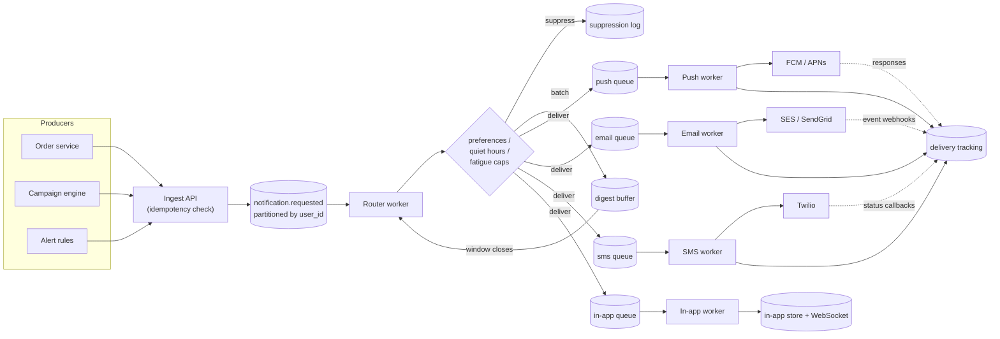

# Notification System

A notification system is the machinery between "something happened" and "the right user found out about it, once, on the channel they wanted, at a time that wasn't 3 a.m." The engineering problem is rarely the send itself — every provider has an SDK. The problem is everything around the send: fan-out from one event to N channel-specific deliveries, preference and quiet-hour evaluation, deduplication under at-least-once queues, provider rate limits, and proving delivery actually happened.

Get it wrong and the failure modes are user-visible and trust-destroying: duplicate pushes, marketing at midnight, a password-reset email stuck behind a two-million-message campaign, or "unsubscribe all" that silently kills security alerts. Get it right and notifications become a boring, observable pipeline that product teams feed events into without thinking about SMTP.

**When NOT to use this** — skip the pipeline and keep it simple when:

- **You send < ~1,000 notifications/day on one channel.** Call the provider SDK from a background job with a retry and an idempotency key. A queue-per-channel architecture at this scale is résumé-driven engineering.
- **You need a social activity feed.** "In-app notifications" that are really a timeline (likes, follows, mentions at read-time) are a feed/fan-out-on-read problem — different storage model, different skill.
- **You need millisecond real-time presence** (typing indicators, live cursors). That is WebSocket session state, not a notification pipeline.
- **You mostly send marketing campaigns.** Buy Braze, Customer.io, or Iterable — campaign segmentation, A/B testing, and deliverability reputation are their whole product. Build only the transactional layer yourself.

## Decision Framework

### Decision 1 — Build the orchestration layer, or buy it?

| Option | Choose when | Trade-off |
|---|---|---|
| **Buy** (Knock, Courier, Novu; Braze/Customer.io for marketing) | Small team, standard needs, want preferences/digests/templates on day one | Per-notification pricing at scale; preference data lives in a vendor; deep customization fights the product |
| **Build** on queues + provider APIs | Volume makes vendor pricing painful, or routing logic is genuinely custom (escalation chains, compliance rules) | You own preferences, digests, tracking, and every provider quirk — budget 2–3 engineer-months for a credible v1 |

Most teams should buy the marketing side and build the transactional side. The rest of this skill is the "build" path.

### Decision 2 — Pipeline backbone

| Option | Choose when | Trade-off |
|---|---|---|
| **Kafka topic, partitioned by `user_id`** | > ~1M/day, bursty campaigns, per-user ordering matters ("shipped" must follow "confirmed") | Operational weight (or MSK/Confluent cost); consumer-group rebalancing to learn |
| **SQS/queue per channel** | Mid-scale, AWS-native, team wants managed everything | Per-request pricing on big fan-outs; ordering needs FIFO queues (lower throughput per message group) |
| **Postgres outbox + workers** | < ~100k/day, small team, already on Postgres | Polling latency; you write the lease/retry logic — but zero new infrastructure and transactional enqueue for free |

### Decision 3 — Delivery guarantee

| Option | Choose when | Trade-off |
|---|---|---|
| **At-least-once + idempotent send** | Always, for anything a user would miss (receipts, alerts, OTPs) | You must build dedup — every retry path can double-fire without it |
| **At-most-once (fire and forget)** | Only for ephemeral, low-value signals (e.g. "someone is typing") | Silent loss is the design; never acceptable for transactional traffic |

There is no exactly-once to a phone. Pick at-least-once and make the send idempotent — that combination is what users experience as exactly-once.

### Decision 4 — Preference granularity

| Option | Choose when | Trade-off |
|---|---|---|
| **Global on/off** | Never ship this alone | One toggle forces users to choose between spam and missing receipts — they choose off, then blame you |
| **Category × channel matrix** | Default for any real product | More UI and a preferences service, but it is the industry-standard contract users expect |
| **Per-event rules** (per-monitor, per-thread mute) | Alerting and collaboration products | Preference resolution becomes a precedence chain (event > category > default) — document the precedence or debugging becomes archaeology |

Whichever you pick: transactional categories (receipts, security, legal) are **not togglable**, and marketing SMS must honor regulatory quiet hours (in the US, TCPA restricts marketing texts/calls to roughly 8 a.m.–9 p.m. recipient local time).

## Architecture

One diagram, five stages: ingest (idempotency), route (preferences/quiet hours/fatigue), batch (digests), deliver (per-channel workers with rate limits), track (receipts).



Two properties are load-bearing: the **suppression log** (every non-delivery is recorded with a reason — "why didn't the user get X?" must be answerable from a table, not from log spelunking), and the digest buffer feeding **back into the router** so digests go through the same preference and rate-limit checks as everything else.

## Process

1. **Inventory notification types.** For each: category (transactional / alert / digest / marketing), channels, urgency, and whether the user can opt out. This taxonomy drives everything downstream.
2. **Define the request contract.** One internal event shape: `event_id`, `user_id`, `category`, `template`, `variables`, `dedup_key` (optional), `priority`. Producers never talk to providers.
3. **Pick the backbone** (Decision 2) and create two priority lanes at minimum — transactional must never queue behind campaigns.
4. **Build ingest with idempotency.** Reject duplicates at the front door (code below) before they fan out into N channel deliveries.
5. **Build the preference service.** Category × channel matrix, IANA timezone per user, quiet-hour windows, and a bypass class for critical severities. Resolve to a concrete channel list per request.
6. **Add semantic dedup and collapse.** Separate from request idempotency: a collapse key groups notifications that *mean* the same thing within a window (alert storms, chat bursts).
7. **Build channel workers.** Each worker: pull → render template → provider rate-limit check → send with provider-side idempotency/collapse where offered (APNs `apns-collapse-id`, SQS FIFO `MessageDeduplicationId`) → record outcome.
8. **Wire delivery tracking.** State machine `queued → sent → delivered → opened/clicked | bounced | failed | suppressed`, fed by SES/SendGrid event webhooks, Twilio status callbacks, and FCM/APNs responses. Hard bounces and spam complaints write to a permanent suppression list.
9. **Add digests.** Buffer digest-eligible events per (user, category); flush on window close or size cap; render one summary notification.
10. **Instrument.** Per-channel dashboards: send rate, delivery rate, p95 event→delivered latency, bounce/complaint rate, suppression reasons. Alert on delivery-rate drops — that is how you find a revoked provider key before users do.

## Data Model

```sql
-- One row per logical notification request (pre-fan-out)
CREATE TABLE notification_requests (
    id              UUID PRIMARY KEY DEFAULT gen_random_uuid(),
    event_id        TEXT NOT NULL,
    user_id         UUID NOT NULL,
    category        TEXT NOT NULL,        -- 'order_lifecycle', 'security', 'marketing', ...
    template        TEXT NOT NULL,
    template_version INT NOT NULL,
    variables       JSONB NOT NULL DEFAULT '{}',
    priority        SMALLINT NOT NULL DEFAULT 1,   -- 0 = transactional lane
    dedup_key       TEXT,                 -- semantic collapse key, nullable
    created_at      TIMESTAMPTZ NOT NULL DEFAULT now(),
    UNIQUE (event_id, user_id, category)  -- DB backstop behind the Redis check
);

-- One row per channel delivery attempt (post-fan-out)
CREATE TABLE deliveries (
    id              UUID PRIMARY KEY DEFAULT gen_random_uuid(),
    request_id      UUID NOT NULL REFERENCES notification_requests(id),
    channel         TEXT NOT NULL,        -- 'push' | 'email' | 'sms' | 'in_app'
    status          TEXT NOT NULL DEFAULT 'queued',
        -- queued -> sent -> delivered -> opened/clicked
        --        -> suppressed | bounced | failed
    provider        TEXT,
    provider_message_id TEXT,             -- SES MessageId, Twilio SID, FCM name
    status_detail   TEXT,                 -- bounce type, suppression reason, error code
    sent_at         TIMESTAMPTZ,
    delivered_at    TIMESTAMPTZ,
    updated_at      TIMESTAMPTZ NOT NULL DEFAULT now()
);
CREATE INDEX ON deliveries (provider_message_id);   -- webhook lookups
CREATE INDEX ON deliveries (request_id);

-- Category x channel preference matrix
CREATE TABLE user_channel_preferences (
    user_id     UUID NOT NULL,
    category    TEXT NOT NULL,
    channel     TEXT NOT NULL,
    enabled     BOOLEAN NOT NULL DEFAULT true,
    PRIMARY KEY (user_id, category, channel)
);

-- Quiet hours live on the user, in the user's own timezone
CREATE TABLE user_notification_settings (
    user_id      UUID PRIMARY KEY,
    timezone     TEXT NOT NULL DEFAULT 'UTC',   -- IANA name, e.g. 'America/Chicago'
    quiet_start  TIME,                          -- e.g. '22:00'
    quiet_end    TIME                           -- e.g. '08:00'
);

-- Permanent do-not-send list (hard bounces, complaints, carrier opt-outs)
CREATE TABLE suppressions (
    address     TEXT NOT NULL,            -- email addr, E.164 number, or device token
    channel     TEXT NOT NULL,
    reason      TEXT NOT NULL,            -- 'hard_bounce' | 'complaint' | 'stop_reply'
    created_at  TIMESTAMPTZ NOT NULL DEFAULT now(),
    PRIMARY KEY (address, channel)
);
```

## Idempotency and Dedup — Two Different Layers

Layer 1 is **request idempotency**: the same producer event, retried, must not create a second request. Layer 2 is **semantic collapse**: different events that mean the same thing to the user within a window become one notification. Teams that conflate them get either duplicates (only layer 2) or alert storms (only layer 1).

```python
import hashlib
import redis

r = redis.Redis()  # host/port/auth from env or config — never hardcoded

IDEMPOTENCY_TTL = 24 * 3600   # outlive every upstream retry horizon
COLLAPSE_WINDOW = 120         # seconds

def accept_request(event: dict) -> bool:
    """Layer 1 — reject exact duplicates at ingest. Returns False if seen before."""
    key = "notif:idem:" + hashlib.sha256(
        f"{event['event_id']}:{event['user_id']}:{event['category']}".encode()
    ).hexdigest()
    # SET NX is atomic: exactly one caller wins for a given key
    return bool(r.set(key, b"1", nx=True, ex=IDEMPOTENCY_TTL))
    # The UNIQUE constraint on notification_requests is the backstop
    # for the day Redis loses this key at exactly the wrong moment.

def collapse(event: dict) -> str | None:
    """Layer 2 — group same-meaning events. Returns the collapse group leader's
    id, or None if this event starts a new group (and should render)."""
    if not event.get("dedup_key"):
        return None
    key = f"notif:collapse:{event['user_id']}:{event['dedup_key']}"
    leader = r.set(key, event["event_id"], nx=True, ex=COLLAPSE_WINDOW)
    if leader:
        return None                       # first in window: deliver it
    r.incr(key + ":count")                # follower: bump the counter,
    return r.get(key).decode()            # attach to the leader's group
```

At the provider edge, use native collapse where it exists: APNs `apns-collapse-id` and FCM's `collapse_key` replace an undelivered push instead of stacking a second one; SQS FIFO deduplicates on `MessageDeduplicationId` within its 5-minute window.

## Quiet Hours

Evaluate in the **recipient's** timezone at send time, and handle windows that cross midnight — most do.

```python
from datetime import datetime
from zoneinfo import ZoneInfo

BYPASS_CATEGORIES = {"security", "critical_alert"}   # small, explicit, audited

def in_quiet_hours(settings, category: str, now_utc: datetime) -> bool:
    if category in BYPASS_CATEGORIES or not settings.quiet_start:
        return False
    local = now_utc.astimezone(ZoneInfo(settings.timezone)).time()
    start, end = settings.quiet_start, settings.quiet_end
    if start <= end:                      # e.g. 13:00-15:00 (same day)
        return start <= local < end
    return local >= start or local < end  # e.g. 22:00-08:00 (crosses midnight)
```

A quiet-hours hit is not a drop: hold the notification and release it at `quiet_end` (unless a fresher event superseded it via the collapse key), and log it to the suppression/deferral log either way.

## Provider Rate Limiting

Two limits, two mechanisms. **Provider throughput** (SES grants a messages-per-second quota; Twilio queues beyond your number's throughput) is enforced per worker fleet with a shared counter. **User fatigue** (max N non-critical notifications per user per day) is enforced in the router.

```python
import time

def acquire_send_slot(provider: str, limit_per_s: int) -> bool:
    """Fixed 1-second window counter in Redis. At per-second granularity the
    fixed-window boundary error is negligible and the code stays trivial."""
    bucket = f"notif:rate:{provider}:{int(time.time())}"
    n = r.incr(bucket)
    if n == 1:
        r.expire(bucket, 2)
    return n <= limit_per_s

# Worker loop: on a full bucket, sleep briefly and retry — never drop.
# Size limit_per_s at ~90% of the provider quota so webhook retries,
# other services, and clock skew don't push you into provider 429s.
```

## Template Management

Templates are versioned content, deployed and rolled back like code but not *as* code. Each template declares its per-channel renderings and required variables; the ingest API validates variables against the pinned version so a missing `{{eta_date}}` fails loudly at enqueue, not silently at 2 a.m. in a worker.

```yaml
# templates/order_shipped/template.yaml
template: order_shipped
version: 7
category: order_lifecycle
required_vars: [order_number, item_count, eta_date, order_id]
channels:
  email:
    subject: "Your order {{order_number}} has shipped"
    body_html: v7/email.html.j2        # rendered with a sandboxed Jinja2 env
  push:
    title: "Order shipped"
    body: "{{item_count}} item(s) on the way — arriving {{eta_date}}"
    collapse_id: "order-{{order_id}}"  # maps to apns-collapse-id / FCM collapse_key
  sms:
    body: "Order {{order_number}} shipped. Track: {{short_link}}"
  in_app:
    body: "Order {{order_number}} is on its way"
locales: [en, de, ja]                  # each locale supplies its own strings
```

Rules that pay for themselves: requests pin `template@version` at enqueue (a mid-flight template edit never changes an already-queued message); every version keeps a rendered preview with sample variables for review; rendering uses a sandboxed template engine (never `eval`, never string-format on raw user content).

### Optional: AI-written digest lines

If you summarize digest contents with a model, treat the model as an unreliable dependency: short timeout, hard length cap, and a deterministic fallback — a notification pipeline never blocks on an LLM.

```python
import json
from anthropic import Anthropic

client = Anthropic()  # credentials from ANTHROPIC_API_KEY or an `ant auth login` profile

def digest_summary(items: list[dict]) -> str:
    fallback = f"You have {len(items)} new updates"
    try:
        response = client.messages.create(
            model="claude-fable-5",
            max_tokens=200,  # deliberately short: one sentence out
            system=(
                "You write one-sentence notification digest summaries. "
                "Plain text, under 140 characters, no preamble, no emoji."
            ),
            messages=[{"role": "user", "content": json.dumps(items[:50])}],
        )
        if response.stop_reason == "refusal":   # classifier declined — content still ships
            return fallback
        return response.content[0].text.strip()[:140]
    except Exception:
        return fallback
```

## Worked Example 1 — "Cartwheel", an e-commerce marketplace

**Context:** 1.2M monthly buyers, ~250k orders/day generating ~1M transactional notifications/day (confirmed, shipped, delivered, seller messages), plus marketing campaigns that fan out up to 2M emails in an hour. Six-engineer platform team.

**Decisions and rationale:**

- **Backbone: Kafka (MSK), one `notification.requested` topic, 64 partitions keyed by `user_id`.** We chose Kafka over SQS for two reasons: partition-keying gives per-user ordering for free ("shipped" arriving before "confirmed" is a support ticket every time), and a 2M-message campaign burst is a non-event for a partitioned log but a cost and lag spike on per-request-priced queues. Honest caveat recorded in the ADR: at a tenth of this scale, SQS would have been the right call and Kafka would be overhead.
- **Two priority lanes:** transactional requests (`priority=0`) go to a dedicated consumer group and dedicated SES configuration set; campaigns drain separately. During the Black Friday campaign test, transactional p95 event→delivered stayed at 11s while 2M campaign emails drained behind it — the lane split is why.
- **Provider limits:** the SES account started at a 14 msg/s production quota; we requested 200/s and set `limit_per_s=180` (90%). Campaign drain at 180/s ≈ 3.1 hours for 2M — product accepted that instead of paying for a dedicated-IP tier, because campaigns are not latency-sensitive. Transactional email was moved to a separate subdomain (`mail.cartwheel.com` vs `promo.cartwheel.com`) so campaign complaint rates can never poison receipt deliverability.
- **Idempotency:** ingest key `sha256(event_id:user_id:category)` in Redis, 24h TTL, DB unique constraint as backstop. Before this existed, an order-service retry storm double-sent 40k "order confirmed" pushes in one afternoon — that incident is the reason the check is at ingest, not in the workers.
- **Digests:** seller chat messages collapse per (buyer, seller) on a 15-minute window: 7 messages from 3 sellers → one push, "3 sellers replied to you (7 new messages)". Chat push volume dropped 71% with no measurable drop in open-to-reply conversion.
- **Preferences:** category × channel matrix. Order lifecycle email is locked on (it carries the receipt); push and SMS for the same category are optional. Marketing defaults respect the signup jurisdiction (opt-in for EU, opt-out for US).

**Measured outcome (90 days):** transactional p95 event→delivered 9–14s; email delivery rate 99.2%; duplicate-send rate below 1 in 10^6; campaign sends fully isolated from the transactional lane.

## Worked Example 2 — "Gridwatch", B2B infrastructure alerting

**Context:** 400 customer orgs, ~60k notifications/day baseline — but incidents produce storms: one us-east-1 outage generated 1,800 alert events in 4 minutes for a single org. Four engineers. Missing a page is a churn event; over-paging is *also* a churn event.

**Decisions and rationale:**

- **Backbone: Postgres transactional outbox + SQS standard queues per channel.** We chose boring on purpose: 60k/day is ~0.7 msg/s, three orders of magnitude below where Kafka earns its ops load, and the outbox gives transactional enqueue (alert row + notification request commit atomically — an alert that exists but never notified is the worst bug this product can have).
- **Collapse key `(org_id, monitor_group, severity)`, 120s window.** The 1,800-event storm became 9 notifications, e.g. "CRITICAL: CPU alerts firing on 214 hosts in cluster us-east-1 (and counting)". First event in a window delivers immediately — a storm must not add latency to the first page; followers increment the counter and update the in-app item in place.
- **Escalation chain on top of delivery tracking:** page via push → no ack in 5 min → SMS via Twilio → no ack in 10 min → voice call to the secondary on-call. The chain is driven by the `deliveries` state machine plus an `acknowledged_at` column — Twilio status callbacks (`sent`/`delivered`/`undelivered`/`failed`) feed it, so an `undelivered` SMS (dead number) escalates immediately instead of waiting out the 10-minute timer. That distinction — escalate on *provider-confirmed failure*, not just timeout — cut mean time-to-human by 4 minutes.
- **Quiet hours bypass is severity-scoped, not product-scoped.** CRITICAL bypasses quiet hours; WARNING respects them and lands in the morning digest. We rejected a customer request for a global "always page me" because the fatigue data was unambiguous: orgs receiving > 60 pages/hour ack rates collapsed. Instead: per-org cap of 60 pages/hour, overflow folds into a single rolling "storm summary" notification.
- **At-least-once everywhere, dedup at delivery.** SQS standard redelivers; the send path checks `notif:idem:` before every provider call so a redelivered message can't double-page. We measured the alternative (FIFO queues) and rejected it: per-message-group throughput limits interact badly with per-org storms, and delivery-side idempotency was 30 lines.

**Measured outcome:** storm compression ~200:1 at peak; zero missed CRITICAL pages in 12 months (tracked as "alert row with no delivered/acked notification"); pages per org-incident down 88% after collapse + caps shipped.

## Anti-Patterns

| Symptom | Why it fails | Do instead |
|---|---|---|
| Sending from the request handler | Provider outage or latency takes checkout down with it | Enqueue at ingest; send from workers |
| Retries without idempotency keys | Every timeout risks a duplicate push/SMS | Idempotency at ingest **and** before each provider call |
| One global on/off toggle | Users kill everything to stop marketing, then miss OTPs and receipts | Category × channel matrix; transactional not togglable |
| Quiet hours in server time | Half your users get 3 a.m. pushes | Store IANA timezone per user; evaluate at send time; handle midnight-crossing windows |
| Marketing and transactional share a lane | Campaigns starve password resets; complaint rates poison receipt deliverability | Separate queues, rate budgets, and sending domains/configuration sets |
| Only tracking "sent" | You claim delivery you cannot prove; bounces go unnoticed for weeks | Full state machine fed by provider webhooks/callbacks |
| Retrying hard bounces | Provider reputation damage, then blocklisting of *all* your mail | Classify errors; permanent suppression list for hard bounces, complaints, and STOP replies |
| Digest via cron over the whole table | Full scans, duplicate digests on overlap, drifting windows | Per-(user, category) buffer keyed by window; flush on close or size cap |
| Templates hardcoded in worker code | A typo fix is a deploy; no preview, no audit, no rollback | Versioned template registry; requests pin `template@version` at enqueue |
| Alert events forwarded 1:1 to humans | Alert storms train users to ignore or mute everything | Collapse keys with a window + per-user/org fatigue caps |

## Checklist

```
Contract & pipeline
[ ] Single internal request shape (event_id, user_id, category, template, variables, priority)
[ ] Producers never call providers directly
[ ] Transactional and marketing in separate lanes (queue, rate budget, sending identity)
[ ] Idempotency check at ingest (Redis SET NX) + DB unique constraint backstop
[ ] Idempotency check again immediately before each provider call

Preferences & timing
[ ] Category x channel preference matrix; transactional categories locked on
[ ] IANA timezone stored per user; quiet hours evaluated in recipient's local time
[ ] Quiet-hours window handles crossing midnight; deferred sends released at window end
[ ] Explicit, audited bypass list for genuine emergencies only
[ ] Marketing SMS constrained to lawful hours (e.g. TCPA ~8am-9pm recipient local time)

Batching & rate limits
[ ] Collapse keys + window for same-meaning events; first event delivers immediately
[ ] Digest buffers keyed per (user, category, window), flushed through the router
[ ] Provider throughput limiter set at ~90% of quota
[ ] Per-user/org fatigue cap with overflow folded into a summary

Delivery & tracking
[ ] deliveries state machine: queued -> sent -> delivered -> opened | bounced | failed | suppressed
[ ] Provider webhooks wired: SES/SendGrid events, Twilio status callbacks, FCM/APNs responses
[ ] Hard bounces, complaints, STOP replies -> permanent suppression list
[ ] Dashboard: delivery rate, p95 event->delivered latency, bounce/complaint rate per channel
[ ] Alert on delivery-rate drop (catches revoked keys and provider incidents)

Templates
[ ] Versioned registry; requests pin template@version at enqueue
[ ] Required variables validated at ingest, not at render
[ ] Sandboxed rendering; previews per version; per-locale strings
```

## 10 Rules

1. **Nothing sends synchronously from a request path.** The provider's p99 is not your product's problem to inherit.
2. **Exactly-once is a lie; at-least-once plus idempotent send is the truth.** Key the send at ingest and again at the provider edge.
3. **Transactional and marketing never share anything** — not a queue, not a rate budget, not a sending domain. One late OTP costs more trust than a whole campaign earns.
4. **Quiet hours belong to the recipient's clock**, and the bypass list should be short enough to read aloud in a review.
5. **"Unsubscribe all" must still deliver receipts and security notices.** If your preference model can't express that, the model is wrong, not the requirement.
6. **Collapse before you deliver.** Two notifications that say the same thing inside a window are one notification with a counter.
7. **Rate limit twice** — once for the provider's quota, once for the human's attention. The second limit is the one product teams forget and users punish.
8. **"Sent" is a claim, "delivered" is evidence.** If you aren't consuming provider receipts, your delivery dashboard is fiction.
9. **A hard bounce is forever** until the address is re-verified. Retrying it burns the reputation that every other message depends on.
10. **Every non-delivery gets a recorded reason.** The support question is always "why didn't they get it?" — the answer must be a row in a table, not a shrug.
