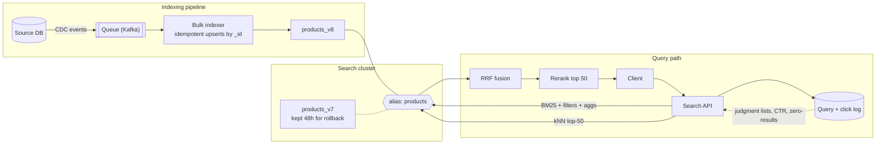

# Search Architecture

Search is the one system where "it works" and "it's good" are different claims. A search box that returns *something* is a day of work; a search box that returns the *right thing* in the top three results, 200ms after keypress, while the catalog updates underneath it, is an architecture. The parts that matter are mostly invisible in a demo: how documents get into the index and back out during a reindex, how relevance is measured rather than eyeballed, and how the cluster behaves when a shard relocates at peak traffic.

Design the retrieval model and the measurement loop before touching cluster settings. Teams that start with "how many shards?" ship fast search that finds the wrong things; teams that start with "how will we know result #1 is right?" can tune everything else later.

**When NOT to use this:**

- **Under ~100k rows with simple matching needs** — Postgres full-text search (`tsvector`/`tsquery` + GIN index) or SQLite FTS5 inside your existing database beats operating a search cluster. Add the cluster when you need relevance tuning, facets, or typo tolerance at scale, not before.
- **Exact-match lookup** — finding a record by SKU, email, or ID is a database index, not search. Don't route it through a search engine.
- **You want vector search because it's fashionable** — if your users type keyword-ish queries against structured data (product names, part numbers), BM25 alone will beat a pure-embedding stack and cost a tenth as much to run. Add vectors when measurement shows lexical recall failing on paraphrases.
- **A managed product fits** — Algolia, Typesense Cloud, or Meilisearch cover small-to-mid catalogs with excellent latency and near-zero ops. This skill is for when you own the stack: Elasticsearch/OpenSearch scale, custom relevance, or data that can't leave your infrastructure.

## Decision Framework

Four choices determine 90% of the architecture. Make them explicitly, in this order.

### 1. Retrieval model

| Model | How it works | Wins at | Loses at | Run cost |
|---|---|---|---|---|
| **Lexical (BM25)** | Inverted index: term → posting list; scored by term rarity (IDF), frequency, and field length | Exact terms, codes, names, filters; explainable scores; zero ML infra | Synonyms, paraphrase, cross-lingual ("laptop won't boot" vs "notebook fails to start") | Lowest — CPU + disk only |
| **Vector (kNN)** | Embed docs and queries into dense vectors; approximate nearest-neighbor search (HNSW) | Paraphrase, semantic similarity, natural-language questions | Exact identifiers, rare tokens, negation; scores are opaque; embedding drift on model swap | RAM for the HNSW graph + embedding inference on every write and query |
| **Hybrid (BM25 + kNN, fused)** | Run both, merge ranked lists — Reciprocal Rank Fusion is the robust default | Best measured relevance on mixed query traffic; degrades gracefully when one side fails | Two pipelines to operate; fusion adds a tuning surface | Sum of both |

**Default: start lexical, measure, add vectors where the data says lexical fails.** Hybrid is the end-state for natural-language query traffic; it is rarely the right first sprint.

### 2. Engine

| Engine | Choose when | Honest downside |
|---|---|---|
| Postgres FTS / SQLite FTS5 | Corpus is small, search is a feature not a product | Relevance tooling is primitive; no facet/agg ergonomics |
| **Elasticsearch / OpenSearch** | You need facets, custom analyzers, relevance control, horizontal scale, or hybrid retrieval in one system | You now operate a distributed system; shard/heap/GC literacy required |
| Managed SaaS (Algolia, Typesense) | Instant-search UX matters more than tuning depth | Per-record/per-op pricing scales painfully; relevance is a black box at the edges |
| Dedicated vector DB | Vectors are the product (recommendation retrieval, RAG at large scale) and you have no lexical/facet needs | You'll re-add a lexical engine the first time users search for an error code |

### 3. Freshness model

| Model | Latency to searchable | Fits | Cost |
|---|---|---|---|
| Near-real-time (CDC → indexer, refresh 1–5s) | Seconds | Inventory, marketplaces, anything users just edited | Constant segment churn; more merge I/O |
| Micro-batch (queue drained every 1–15 min) | Minutes | Content, docs, catalogs with editorial cadence | Cheapest steady state |
| Nightly rebuild | Hours | Analytics-derived fields, small corpora | Simplest; unacceptable for user-generated data |

### 4. Relevance stack (add tiers only when measurement demands)

1. **BM25 + field boosts** — covers most keyword traffic.
2. **+ business signals** — `rank_feature`/`function_score` on popularity, freshness, margin.
3. **+ hybrid retrieval (RRF)** — when zero-results and paraphrase misses show up in analytics.
4. **+ semantic rerank of top-k** — cross-encoder for interactive latency; LLM rerank for high-value, seconds-tolerant flows.

Each tier roughly doubles system complexity. Skipping measurement and jumping to tier 4 is the most expensive mistake in this domain.

## Architecture



Two invariants in this picture: **clients only ever address the alias**, never a physical index (that's what makes reindexing a non-event), and **every query and click is logged** (that's what makes relevance an engineering loop instead of a taste debate).

## Cluster Design Quick Numbers (Elasticsearch / OpenSearch)

- **Shard size 10–50 GB.** Below 10 GB per shard you're paying fan-out overhead for nothing; above 50 GB, recovery and relocation get slow. A small index wants **one primary shard** — parallelism you don't need is pure overhead.
- **Replicas buy read throughput and availability; primaries buy write parallelism and capacity.** Scale QPS with replicas, corpus size with primaries.
- **Heap = 50% of node RAM, capped at ~31 GB** so compressed object pointers stay enabled. The other half of RAM is the OS page cache — that's what actually serves your index; a node whose hot index fits in page cache is a fast node.
- **Three dedicated master-eligible nodes** once you pass roughly six data nodes; before that, shared roles are fine. Always an odd master-eligible count.
- **Time-series data** (logs, events) gets rollover + lifecycle tiers (ILM in Elasticsearch, ISM in OpenSearch): hot on fast NVMe, warm/cold on cheap disks. Catalog/content search usually doesn't need tiers.
- **Bulk loads:** set `refresh_interval: -1` and `number_of_replicas: 0` during backfill, restore after. Routinely a 2–3× throughput difference.

## Process

1. **Quantify the workload.** Document count, average doc size, growth rate, peak QPS, update rate, latency SLO (p95, not average), and the top 200 real queries if any exist. No design without these numbers.
2. **Choose the retrieval model and engine** from the decision tables. Write the choice and its rejected alternatives down — retrieval-model changes later are full reindexes.
3. **Design mappings explicitly.** `dynamic: "strict"`, one analyzer decision per text field, `keyword` for anything filtered or faceted, no field you can't name a query for. Mappings are append-only in place; changes mean reindex — design like it.
4. **Size the cluster** from the quick numbers above; validate with a rally-style load test on one node before multiplying.
5. **Build the indexing pipeline.** CDC or event stream → queue → bulk indexer. `_id` = source primary key so replays are idempotent upserts. Partial updates for hot fields (price, stock). Dead-letter queue for poison documents.
6. **Version every index and swap via alias** (`products_v7` → alias `products`). This is the reindex strategy — build the habit on day one, not during the first schema migration.
7. **Implement the query pipeline:** query normalization → filters (in `filter` context — cached, unscored) → retrieval → facets via aggregations with `post_filter` for multi-select → pagination via `search_after` (never deep `from`, which is capped at 10,000 by `index.max_result_window`).
8. **Stand up measurement before tuning:** log queries, result counts, clicks with positions; compute zero-results rate, CTR@k, MRR; build a judgment list (graded query→doc labels) for offline nDCG.
9. **Tune relevance in the loop:** change one thing (boost, analyzer, fusion weight), run the offline judgment set, then confirm online. Never ship a boost you didn't measure.
10. **Add autocomplete and operational alarms** (query latency p95, indexing lag, cluster status, disk watermarks, zero-results spike).

## Worked Example 1 — E-commerce Catalog (Kestrel Outfitters)

**Inputs:** 2.4M SKUs, ~3.5 KB/doc ≈ **8.4 GB** primary data. Peak **450 QPS**, p95 SLO **120 ms**. ~40k price/stock updates per hour. Query traffic is short keyword queries ("trail running shoes gtx"), heavy facet use (brand, category, price, in-stock).

**Decisions and rationale:**

- **BM25 only, no vectors** — because query logs from the old system show 92% of queries are ≤3 keyword terms hitting title/brand vocabulary. Vectors would add embedding inference on 40k updates/hour for no measured gap. Revisit if zero-results rate says otherwise.
- **1 primary shard, 2 replicas, 3 data nodes** (16 GB RAM / 8 GB heap each) — because 8.4 GB is far below the 10–50 GB shard band; splitting it would multiply per-query fan-out. Every node holds a full copy, so the 450 QPS spreads across 3 servable copies and the whole index sits in each node's page cache.
- **`refresh_interval: 5s`** — because merchandising accepts stock visibility lagging 5 seconds, and it cuts segment churn from the 40k/hour update stream versus the 1s default.
- **Partial updates for price/stock** via `_bulk` `update` actions — because reindexing a full doc for a price change wastes analysis work on unchanged text fields.
- **`rank_feature` on 30-day units sold** rather than `function_score` scripting — because it's cheaper at query time and saturates naturally (a 100k-seller shouldn't bury relevant niche items; saturation caps the effect).

**Mapping (`products_v7`):**

```json
PUT products_v7
{
  "settings": {
    "number_of_shards": 1,
    "number_of_replicas": 2,
    "refresh_interval": "5s",
    "analysis": {
      "filter": {
        "edge_2_15": { "type": "edge_ngram", "min_gram": 2, "max_gram": 15 }
      },
      "analyzer": {
        "autocomplete_index": {
          "type": "custom",
          "tokenizer": "standard",
          "filter": ["lowercase", "edge_2_15"]
        }
      }
    }
  },
  "mappings": {
    "dynamic": "strict",
    "properties": {
      "title": {
        "type": "text", "analyzer": "english",
        "fields": {
          "auto": {
            "type": "text",
            "analyzer": "autocomplete_index",
            "search_analyzer": "standard"
          }
        }
      },
      "brand":       { "type": "keyword" },
      "category":    { "type": "keyword" },
      "description": { "type": "text", "analyzer": "english" },
      "price":       { "type": "scaled_float", "scaling_factor": 100 },
      "in_stock":    { "type": "boolean" },
      "popularity":  { "type": "rank_feature" },
      "updated_at":  { "type": "date" }
    }
  }
}
```

Autocomplete rationale: **edge n-gram subfield over the completion suggester** — because Kestrel needs suggestions filtered to in-stock items in the shopper's region, and the completion suggester's FST can't apply arbitrary filters; an ordinary filtered query on `title.auto` can. `search_analyzer: standard` on the subfield is load-bearing: without it the *query* is also n-grammed and "sho" matches everything containing "s".

**Query (search endpoint, after the shopper checked two brand facets):**

```json
GET products/_search
{
  "size": 24,
  "query": {
    "bool": {
      "must": {
        "multi_match": {
          "query": "trail running shoes",
          "type": "most_fields",
          "fields": ["title^3", "brand^2", "description"]
        }
      },
      "should": [
        { "rank_feature": { "field": "popularity", "saturation": {}, "boost": 1.5 } }
      ],
      "filter": [
        { "term": { "in_stock": true } }
      ]
    }
  },
  "post_filter": { "terms": { "brand": ["Salomon", "Hoka"] } },
  "aggs": {
    "brands":     { "terms": { "field": "brand", "size": 30 } },
    "categories": { "terms": { "field": "category", "size": 20 } }
  }
}
```

Why `post_filter` for the brand selection: facet counts must reflect the query *without* the brand filter (so the shopper still sees "Altra (41)" and can switch), while the hit list respects it. For full multi-select behavior, each facet's aggregation is additionally wrapped in a `filter` agg carrying the *other* facets' selections. Why `title^3`: on the judgment list, title matches were correct 4× more often than description-only matches; the boost encodes a measured prior, not a hunch.

**Reindex runbook (analyzer change shipping in `products_v8`):**

1. Create `products_v8` with the new settings; leave the alias on `v7`.
2. Backfill by **replaying from the source of truth** (DB snapshot + CDC replay from the snapshot's offset) — preferred over `_reindex` here because the analyzer change means re-analysis anyway, and the source has fields `v7` never stored. Use `_reindex` when the change is mapping-compatible and source replay is expensive.
3. Keep live CDC updates dual-writing to both indices during backfill.
4. Validate: doc count parity (±0), spot-check 50 judgment-list queries against `v8` directly.
5. Atomic swap — clients see `v7` on one request and `v8` on the next, never neither:

```json
POST _aliases
{
  "actions": [
    { "remove": { "index": "products_v7", "alias": "products" } },
    { "add":    { "index": "products_v8", "alias": "products" } }
  ]
}
```

6. Keep `v7` (writes still dual-flowing) for 48 hours; rollback is the same swap reversed. Then drop it.

**Outcome:** p95 held at 96 ms at 450 QPS; the popularity `rank_feature` lifted search→add-to-cart CTR from 11.2% to 13.6% on the interleaved test.

## Worked Example 2 — Support Knowledge Base with Hybrid Retrieval (Ledgerline)

**Inputs:** B2B accounting SaaS. 60k help articles, chunked to **480k passages** (~300 tokens each). 6 QPS peak — this is a relevance problem, not a throughput problem. Queries are natural language ("why does my VAT report disagree with the ledger") mixed with exact error codes ("ERR-4132"). Baseline BM25 metrics: **nDCG@10 = 0.58**, **zero-results rate = 14%**.

**Decisions and rationale:**

- **Hybrid, not vector-only** — because error-code queries are 22% of traffic and pure kNN reliably fumbles rare exact tokens, while pure BM25 caused most of the 14% zero-results (paraphrase misses). Each side covers the other's failure mode.
- **1024-dim open-weight embedder (BGE-M3 / E5-large class), normalized vectors, inner product** — self-hosted because support content can't go to a third-party embedding API under Ledgerline's DPA. Memory check before committing: HNSW footprint ≈ `1.1 × (4 × dim + 8 × m)` bytes/vector = 1.1 × (4096 + 128) ≈ 4.6 KB × 480k ≈ **2.2 GB** — fits comfortably beside the lexical index on one 32 GB node pair.
- **RRF fusion, client-side** — because BM25 scores and cosine similarities live on incomparable scales; rank-based fusion needs no score normalization and no tuning to start. Engines also offer native paths (Elasticsearch's `rrf` retriever; OpenSearch's `hybrid` query with a normalization search pipeline) — use them if already committed, but ten portable lines are hard to beat:

```python
def rrf(rankings: list[list[str]], k: int = 60) -> list[str]:
    """Reciprocal Rank Fusion (Cormack et al., SIGIR 2009). k=60 is the standard constant."""
    scores: dict[str, float] = {}
    for ranking in rankings:
        for rank, doc_id in enumerate(ranking, start=1):
            scores[doc_id] = scores.get(doc_id, 0.0) + 1.0 / (k + rank)
    return sorted(scores, key=scores.get, reverse=True)
```

**Vector index (OpenSearch):**

```json
PUT kb_passages_v3
{
  "settings": { "index.knn": true },
  "mappings": {
    "properties": {
      "article_id": { "type": "keyword" },
      "content":    { "type": "text", "analyzer": "english" },
      "embedding": {
        "type": "knn_vector",
        "dimension": 1024,
        "method": {
          "name": "hnsw",
          "engine": "faiss",
          "space_type": "innerproduct",
          "parameters": { "m": 16, "ef_construction": 128 }
        }
      }
    }
  }
}
```

`m: 16, ef_construction: 128` are the sane defaults: raising them buys recall at build-time and RAM cost; Ledgerline measured recall@50 = 0.97 against exact kNN on a 5k sample and stopped there. (On Elasticsearch the equivalent is a `dense_vector` field queried with `knn`.) Query side retrieves top-50 from each leg:

```json
GET kb_passages/_search
{ "size": 50, "query": { "knn": { "embedding": { "vector": [ /* 1024 floats */ ], "k": 50 } } } }
```

- **LLM rerank of the fused top-50, gated** — a cross-encoder was the default candidate, but Ledgerline's "Ask support" flow already tolerates a 3-second answer budget and the team runs no GPU inference. An LLM rerank via the Claude API costs latency but zero new infrastructure; it runs **only when the fusion is unsure** (top-2 RRF scores within 15% of each other — about a third of queries), so the median query never pays for it:

```python
import json
from anthropic import Anthropic

client = Anthropic()  # reads ANTHROPIC_API_KEY or an `ant auth login` profile

def llm_rerank(query: str, candidates: list[dict], top_n: int = 10) -> list[str]:
    """Listwise rerank of fused candidates. candidates: [{"id", "title", "snippet"}]."""
    docs = "\n".join(
        f'[{c["id"]}] {c["title"]} — {c["snippet"][:300]}' for c in candidates
    )
    response = client.messages.create(
        model="claude-fable-5",
        max_tokens=1024,
        output_config={"effort": "low"},  # routine ranking work; keep latency down
        messages=[{
            "role": "user",
            "content": (
                "Rank these support articles by how well they answer the query.\n"
                f"Query: {query}\n\nArticles:\n{docs}\n\n"
                f"Return a JSON array of the {top_n} best article ids, best first. "
                "Output the JSON array only."
            ),
        }],
    )
    if response.stop_reason == "refusal":
        return [c["id"] for c in candidates[:top_n]]  # fall back to RRF order
    ranked = json.loads(response.content[0].text)
    valid = {c["id"] for c in candidates}
    return [r for r in ranked if r in valid][:top_n]
```

The `stop_reason` guard and the validity filter are not decoration: the fallback keeps search up if the model declines, and the filter drops any hallucinated id before it reaches the UI. For interactive-latency products, swap this stage for a hosted or open-weight cross-encoder reranker (tens of milliseconds for 50 pairs) — the pipeline shape is identical.

**Measured outcome (5-week rollout, 600-query judgment list, graded 0–3):**

| Stage | nDCG@10 | Zero-results | Ticket deflection |
|---|---|---|---|
| BM25 baseline | 0.58 | 14% | 31% |
| + hybrid RRF | 0.66 | 6% | 36% |
| + gated LLM rerank | 0.74 | 6% | 41% |

The rerank moved nDCG, not zero-results — exactly what the tiering predicts: retrieval breadth fixes misses, reranking fixes ordering. Knowing which lever moves which metric is the point of measuring per stage.

## Search Analytics — the Loop That Makes Tuning Possible

Log per query: normalized query text, filters, result count, latency, session id; per click: doc id and **position**. From this derive:

- **Zero-results rate** — the cheapest high-signal metric; spikes reveal vocabulary gaps and analyzer bugs.
- **CTR@k and MRR from clicks** — correct for position bias before trusting them (users click rank 1 because it's rank 1).
- **Abandonment** — query issued, no click, no reformulation: quiet failure.
- **Judgment lists** — 300–1000 real queries with graded relevance labels (humans, or clicks as weak labels). This is your offline nDCG harness; no relevance change ships without a run against it.
- **Query-class breakdown** — segment metrics by head/torso/tail and by query type (code-like vs natural language). Averages hide the segment you're failing.

## Anti-Patterns

| Symptom | Why it fails | Do instead |
|---|---|---|
| Many primary shards on a small index "for parallelism" | Every query fans out to every shard; overhead with no data to parallelize over | 1 primary until the 10–50 GB/shard band demands more |
| Mapping change applied by delete-and-recreate in place | Search is down for the whole rebuild; no rollback | Versioned index + atomic alias swap (Example 1 runbook) |
| Deep pagination with `from: 9600` | Each shard must materialize and sort 9624 docs; hard-capped at 10k by `max_result_window` | `search_after` with a point-in-time for stable deep scans |
| Facet counts computed app-side by looping results | Only sees the returned page; wrong counts, O(n) latency | `terms` aggregations; `post_filter` for multi-select |
| Leading-wildcard queries (`*4132`) | Inverted indexes match prefixes; leading wildcards scan the whole term dictionary | Index a reversed or n-grammed subfield for contains/suffix needs |
| Boosts tuned because an executive searched their pet query | Optimizes one anecdote, silently degrades the distribution | Judgment list + offline nDCG before/after every change |
| Embeddings-only search after a RAG demo | Exact identifiers, negations, and rare terms degrade; nobody can explain a ranking | Hybrid with RRF; keep the lexical leg |
| Default 1s refresh during a bulk backfill | Constant tiny segments + merge storms; backfill crawls | `refresh_interval: -1`, `replicas: 0` during load; restore after |
| Dynamic mapping in production | First doc's shape wins; a numeric string becomes `long` and breaks every later doc | `dynamic: "strict"` and explicit mappings |
| Autocomplete via full `match` query per keystroke | Analysis + scoring the entire index at typing speed | Edge n-gram or `search_as_you_type` field, client debounce, tight `size` |

## Checklist

```
Workload & design
[ ] Doc count, doc size, growth, peak QPS, update rate, p95 SLO written down
[ ] Retrieval model chosen from measurement or stated hypothesis (revisit trigger defined)
[ ] Explicit mappings, dynamic: strict, analyzer decision per text field
[ ] Every filtered/faceted field is keyword; every scored field is text

Cluster
[ ] Shards sized 10–50 GB; small index = 1 primary
[ ] Replicas sized for peak QPS + one node loss
[ ] Heap = 50% RAM, ≤ ~31 GB; hot index fits node page cache
[ ] Disk watermarks, cluster status, and indexing-lag alerts wired

Indexing pipeline
[ ] _id = source primary key (idempotent upserts)
[ ] Partial updates for hot fields; dead-letter queue for poison docs
[ ] Bulk-load mode (refresh -1, replicas 0) scripted, restore scripted
[ ] Index versioned (name_vN); clients address the alias only

Query pipeline
[ ] Filters in filter context; multi-select facets via post_filter
[ ] Pagination via search_after; no from > a few hundred
[ ] Autocomplete on a dedicated field, not the main match query

Relevance & analytics
[ ] Query + click logging with positions live before any tuning
[ ] Judgment list (300+ queries) and offline nDCG harness exist
[ ] Zero-results rate, CTR@k, abandonment on a dashboard
[ ] Reindex runbook rehearsed once before it's needed in anger
```

## 10 Rules

1. **Clients never address a physical index.** The alias is the API; the day you skip this is the day before your first in-place migration outage.
2. **No relevance change without a judgment list.** If you can't say what nDCG did, you didn't tune — you gambled with the default ranking.
3. **One primary shard until the data forces more.** Oversharding is the most common self-inflicted latency problem in small clusters.
4. **BM25 first, vectors second, always measured in between.** Hybrid earns its complexity only against a demonstrated lexical failure mode.
5. **RRF over score blending.** Rank fusion needs no normalization and no per-corpus tuning; weighted score sums break the moment one leg's score distribution shifts.
6. **The zero-results rate is your smoke alarm.** It's free to compute, moves before revenue metrics do, and points directly at vocabulary and analyzer gaps.
7. **Filters are not queries.** Anything yes/no belongs in filter context — cached, unscored, and off the relevance surface.
8. **Design mappings as if they're immutable, because they effectively are.** Every "small mapping tweak" is a reindex; version from day one.
9. **Rerank the top 50, not the top 1000.** Rerankers fix ordering, not recall — if the right doc isn't in the candidate set, no reranker can save you; fix retrieval instead.
10. **Rehearse the reindex before you need it.** A reindex runbook executed for the first time during an incident is not a runbook; it's improvisation with an audience.

## References

- Cormack, Clarke & Buettcher, *Reciprocal Rank Fusion Outperforms Condorcet and Individual Rank Learning Methods* (SIGIR 2009) — the RRF paper; three pages, worth reading.
- Turnbull & Berryman, *Relevant Search* (Manning) — still the best treatment of the relevance-engineering loop.
- Grainger, Turnbull & Irwin, *AI-Powered Search* (Manning) — hybrid retrieval, LTR, and semantic search in production.
- Elasticsearch docs: "Size your shards" and "Tune for search speed" — the sizing guidance above tracks these.
- OpenSearch docs: k-NN index and approximate search — HNSW parameters and the memory-estimation formula used in Example 2.
