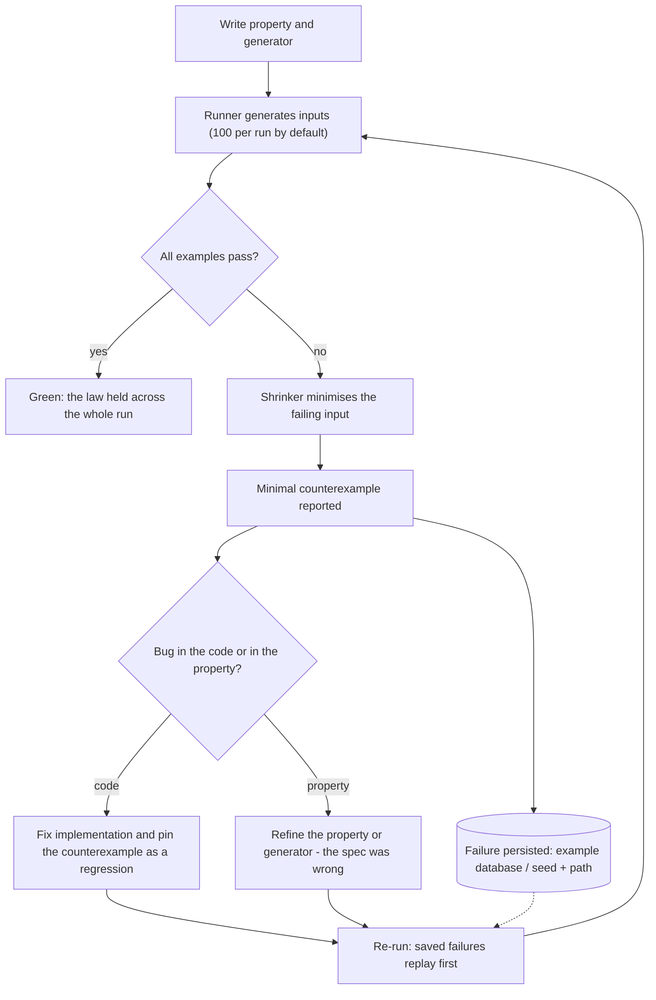

# Property-Based Testing

An example-based test checks one input you thought of. A property-based test states a law that must hold for *every* input — "decoding an encoded value returns the original", "the allocated cents always sum to the invoice total" — and then a framework generates hundreds of adversarial inputs trying to break that law. When one succeeds, the framework **shrinks** it: it repeatedly simplifies the failing input until it finds a minimal counterexample, which is usually so small it reads like a bug report written by the machine.

The practice pays off twice. First, it finds the edge cases you didn't think to write examples for — empty collections, duplicate keys, Unicode, boundary integers, interleavings. Second, and more valuable long-term, it forces you to articulate what your code actually guarantees. A function whose invariants you cannot state in one sentence is a function you do not fully understand yet.

## When NOT to Use This

Property-based testing amplifies whatever it touches — including cost and flakiness. Skip it when:

- **The code has no interesting input domain.** CRUD glue, config wiring, and framework plumbing have one happy path; a single example test documents them better than a degenerate property.
- **The behavior IS a specific scenario.** "Gold-tier customers get free shipping over $50" is an example by nature. Properties complement scenario tests; they do not replace the ones that encode business intent.
- **The path is non-deterministic or I/O-bound and you cannot inject fakes.** A property runs the body 100–1000 times; a 2% flake rate or a 300ms network call becomes a guaranteed red build. Wrap the I/O boundary in a fake first, or stay with examples.
- **You cannot state any invariant.** Falling back to "it doesn't crash" is legitimate for parsers of untrusted input (that is fuzzing's home turf), but weak for business logic — do the thinking first.

## The Five Property Shapes

Almost every useful property is one of these. Reach for them in this order — the earlier ones need no reference implementation.

| Shape | Law | Best for | Canonical example |
|---|---|---|---|
| **Round-trip** | `decode(encode(x)) == x` | Serializers, parsers, codecs, migrations | JSON, protobuf, URL encoding |
| **Invariant** | `P(f(x))` always holds | Anything with a postcondition | sort output is ordered; allocation sums to total |
| **Idempotence / metamorphic** | relation between `f(x)` and `f(g(x))` | Normalizers, search, filters | `normalize(normalize(x)) == normalize(x)`; adding a filter never grows a result set |
| **Oracle** | `fast(x) == simple(x)` | Optimized code with a naive twin | binary search vs. linear scan; new pricing engine vs. old |
| **Model-based (stateful)** | real system agrees with a simplified model after any command sequence | Caches, queues, DBs, state machines | LRU cache vs. a Map + recency list |

The round-trip shape in eight lines of Hypothesis — note floats are excluded deliberately, because `NaN != NaN` would fail the law for reasons that are not bugs:

```python
import json
from hypothesis import given, strategies as st

json_values = st.recursive(
    st.none() | st.booleans() | st.integers() | st.text(),
    lambda children: st.lists(children)
    | st.dictionaries(st.text(), children),
    max_leaves=25,
)

@given(json_values)
def test_json_round_trip(value):
    assert json.loads(json.dumps(value)) == value
```

## Decision Framework

### Choice 1 — Example test or property?

| Situation | Prefer | Why |
|---|---|---|
| Documented business scenario, named stakeholders | Example | The specific case is the spec; a property obscures it |
| Rich input domain (numbers, strings, collections, trees) | Property | You cannot enumerate the edge cases by hand |
| Regression for a production bug | Both | Pin the exact input as an example, then ask what law it broke and write that property |
| Pure transformation with a statable law | Property | One property subsumes dozens of examples |

### Choice 2 — Stateless property or stateful model?

| Signal | Stateless property | Stateful / model-based |
|---|---|---|
| Bug depends only on the input value | Yes | Overkill |
| Bug depends on the *order* of operations | Cannot express it | Yes — the framework generates command sequences and shrinks them |
| Cost | Cheap to write and run | 3–5x the setup; you must write a model |
| Trade-off | Fast feedback, narrow reach | Finds interleaving bugs nothing else finds, but a wrong model reports phantom failures |

Rule of thumb: start stateless. Escalate to model-based the moment a bug report contains the words "only happens after".

### Choice 3 — Property tests or coverage-guided fuzzing?

These are cousins, not competitors — same idea (machine-generated inputs), different operating points.

| Dimension | Property-based testing | Coverage-guided fuzzing (libFuzzer, AFL++, Atheris, Jazzer.js) |
|---|---|---|
| Runs in | Your unit suite, seconds per test | A dedicated fuzz job, hours to days |
| Inputs | Typed, structured, from generators you design | Byte buffers mutated using coverage feedback |
| Finds | Logic and spec violations | Crashes, hangs, memory unsafety in parsers of untrusted input |
| Failure output | Shrunk minimal counterexample | A crashing input file in a corpus |

They compose: any Hypothesis test exposes `test_fn.hypothesis.fuzz_one_input`, a bytes-in entry point you can hand to Atheris so a coverage-guided engine drives your typed property; HypoFuzz does the same for a whole Hypothesis suite as a service. If you accept untrusted input (file formats, network protocols), do both: properties in CI for semantics, a fuzz job for crashes.

## The Feedback Loop



The "bug in the property?" branch is not a failure mode — it is half the value. Roughly a third of first-draft property failures reveal that your mental spec was wrong, which is a cheaper place to learn that than production.

## Process

1. **Pick the target.** Deterministic core logic with a rich input domain: money math, parsers, diffing, merging, caching, anything with the word "algorithm" in the PR description.
2. **State the law in one sentence** before writing code, and put that sentence in the test name or docstring. If you need "and" twice, split it into two properties.
3. **Build the generator to match the real domain.** Constraints go *inside* the generator (`st.integers(min_value=1)`, `fc.integer({ min: 1 })`), never in `assume()`/`.filter()` afterthoughts — filtering discards work and skews the distribution.
4. **Start with the cheapest assertion** (returns the right shape, doesn't crash), run it, then strengthen toward the full law. Each strengthening step that fails teaches you something.
5. **Read every shrunk counterexample before touching code.** Decide: implementation bug, or wrong property? Fix accordingly.
6. **Pin the regression.** Add `@example(...)` in Hypothesis or a `fc.assert` seed/path replay in fast-check so the exact failure runs forever, even after generator changes.
7. **Profile for the environment.** Fast and randomized locally; deterministic and thorough on PR CI; deep and randomized nightly (settings below).
8. **Escalate where signals warrant.** Sequence-dependent bugs → stateful testing. Untrusted-input parsers → wire `fuzz_one_input` to a fuzzer.
9. **Audit the input distribution.** Use Hypothesis `event()` + `--hypothesis-show-statistics`, or `fc.statistics()`, to confirm interesting regions (empty lists, duplicates, boundary sizes) actually occur. A green property over a toothless generator is false confidence.

## Generator Craft

The property is only as strong as its inputs. Two production patterns:

**Force collisions with a small key pool** (Python). Independent random keys almost never collide, so duplicate-handling code goes untested. Draw the pool first, then sample from it:

```python
from hypothesis import strategies as st

@st.composite
def order_lines(draw):
    sku_pool = draw(st.lists(
        st.from_regex(r"[A-Z]{2}\d{4}", fullmatch=True),
        min_size=1, max_size=5, unique=True,
    ))
    skus = draw(st.lists(st.sampled_from(sku_pool), min_size=1, max_size=20))
    return [
        {"sku": sku, "qty": draw(st.integers(min_value=1, max_value=99))}
        for sku in skus  # duplicate SKUs across lines occur by design
    ]
```

**Model the domain, not the type** (TypeScript). `fc.record` composes arbitraries into realistic aggregates; regex- and format-aware arbitraries keep inputs valid-but-adversarial:

```typescript
import fc from "fast-check";

const orderArb = fc.record({
  id: fc.uuid(),
  lines: fc.array(
    fc.record({
      sku: fc.stringMatching(/^[A-Z]{2}\d{4}$/),
      qty: fc.integer({ min: 1, max: 99 }),
    }),
    { minLength: 1, maxLength: 20 },
  ),
  placedAt: fc.date({
    min: new Date("2020-01-01"),
    max: new Date("2030-01-01"),
  }),
});
```

## Worked Example 1 — Invoice Allocation (Python, Hypothesis)

**Scenario.** A billing service splits an invoice total across line items proportionally to weights (seat counts per team). Finance requires: allocations are integer cents, sum exactly to the total, and no line deviates from its exact proportional share by a full cent.

**Decisions and rationale.** We chose **integer cents** because floats cannot represent 0.01 exactly and rounding drift is a finance incident, not a bug. We chose the **conservation invariant** (`sum(parts) == total`) as the primary property because there is no reference implementation to use as an oracle — conservation laws are the strongest oracle-free property for money. We bounded totals at $100k and weights at 1000 because that covers the real domain with headroom; unbounded inputs would only re-test Python's bignum arithmetic.

```python
# test_allocation.py — requires: pip install hypothesis (v6.x)
from fractions import Fraction
from hypothesis import example, given, strategies as st
from billing.allocation import allocate

totals = st.integers(min_value=0, max_value=10_000_000)  # cents, up to $100k
weights = st.lists(st.integers(min_value=1, max_value=1_000),
                   min_size=1, max_size=20)

@given(total=totals, weights=weights)
@example(total=1, weights=[1, 1])  # pinned regression, see below
def test_allocation_conserves_total(total, weights):
    parts = allocate(total, weights)
    assert sum(parts) == total                     # conservation
    assert len(parts) == len(weights)              # shape
    assert all(p >= 0 for p in parts)              # no negative line items

@given(total=totals, weights=weights)
def test_allocation_is_fair(total, weights):
    parts = allocate(total, weights)
    total_weight = sum(weights)
    for part, w in zip(parts, weights):
        exact = Fraction(total * w, total_weight)  # exact share, no float error
        assert abs(part - exact) < 1               # within one cent of exact
```

Note the fairness check uses `Fraction`, not float division: the *test's* arithmetic must be exact, or tolerance fudge in the oracle hides real off-by-one-cent bugs.

**The run.** The first implementation was the obvious one: `[round(total * w / total_weight) for w in weights]`. Hypothesis broke it in under a second and shrank the failure to the smallest possible case:

```
Falsifying example: test_allocation_conserves_total(
    total=1,
    weights=[1, 1],
)
```

Diagnosis: `round(0.5)` is banker's rounding in Python, so both lines round to 0 and the cent evaporates — `sum(parts) == 0 != 1`. Independent per-line rounding can never guarantee conservation. The fix is the **largest-remainder method**: floor every share, then distribute the leftover cents to the lines with the largest fractional remainders:

```python
def allocate(total_cents: int, weights: list[int]) -> list[int]:
    total_weight = sum(weights)
    base = [total_cents * w // total_weight for w in weights]
    leftover = total_cents - sum(base)
    by_remainder = sorted(
        range(len(weights)),
        key=lambda i: (total_cents * weights[i]) % total_weight,
        reverse=True,
    )
    for i in by_remainder[:leftover]:
        base[i] += 1
    return base
```

Both properties now pass 500 examples each, and the `@example(total=1, weights=[1, 1])` pin guarantees the original counterexample is re-checked on every run forever — even if someone later narrows the generators.

## Worked Example 2 — LRU Cache Model Test (TypeScript, fast-check)

**Scenario.** A Node service caches rendered fragments in a hand-rolled LRU cache (capacity in the hundreds; capacity 2 in tests). A prod incident showed hot keys being evicted. Stateless properties passed, because the bug only appears after a particular *sequence* of operations.

**Decisions and rationale.** We chose **model-based testing** because "least recently used" is a claim about operation ordering — no single-input property can express it. The model is a plain `Map` plus the knowledge that JS `Map` preserves insertion order, so recency is modeled by delete-then-set. We chose a **3-key pool** (`a`, `b`, `c`) against capacity 2 because with random long keys, evictions and re-reads of the same key would almost never collide — the small pool makes every run a stress test of eviction.

```typescript
// lru-cache.model.test.ts — requires: npm i -D fast-check vitest (fast-check v4)
import { test, expect } from "vitest";
import fc from "fast-check";
import { LRUCache } from "../src/lru-cache";

type Model = { entries: Map<string, number>; capacity: number };
type Real = LRUCache<string, number>;

class SetCmd implements fc.Command<Model, Real> {
  constructor(readonly key: string, readonly value: number) {}
  check = () => true;
  run(m: Model, real: Real): void {
    real.set(this.key, this.value);
    m.entries.delete(this.key);            // delete+set = most recent
    m.entries.set(this.key, this.value);
    if (m.entries.size > m.capacity) {
      m.entries.delete(m.entries.keys().next().value!);  // evict oldest
    }
  }
  toString = () => `set(${this.key},${this.value})`;     // readable shrink output
}

class GetCmd implements fc.Command<Model, Real> {
  constructor(readonly key: string) {}
  check = () => true;
  run(m: Model, real: Real): void {
    const expected = m.entries.get(this.key);
    expect(real.get(this.key)).toBe(expected);
    if (expected !== undefined) {          // a read refreshes recency
      m.entries.delete(this.key);
      m.entries.set(this.key, expected);
    }
  }
  toString = () => `get(${this.key})`;
}

const key = fc.constantFrom("a", "b", "c"); // small pool forces evictions

test("LRU cache agrees with its model under any command sequence", () => {
  fc.assert(
    fc.property(
      fc.commands([
        fc.tuple(key, fc.integer()).map(([k, v]) => new SetCmd(k, v)),
        key.map((k) => new GetCmd(k)),
      ]),
      (cmds) => {
        fc.modelRun(
          () => ({
            model: { entries: new Map<string, number>(), capacity: 2 },
            real: new LRUCache<string, number>(2),
          }),
          cmds,
        );
      },
    ),
  );
});
```

**The run.** The buggy implementation refreshed recency on `set` but not on `get`. fast-check generated ~50-command sequences, found a failure, and shrank it to five commands:

```
Property failed after 38 tests
{ seed: 1735021438, path: "37:5:3:2:1", endOnFailure: true }
Counterexample: [set(a,0),set(b,0),get(a),set(c,0),get(a)]
```

Read it like a story: after `get(a)`, key `a` is the most recently used, so `set(c,0)` must evict `b` — but the real cache still ranked `a` oldest and evicted it, so the final `get(a)` returned `undefined` where the model expected `0`. The one-line fix makes `get` delete-and-reinsert the key. To replay the exact failure while fixing, feed the reported values back: `fc.assert(prop, { seed: 1735021438, path: "37:5:3:2:1", endOnFailure: true })`.

The Python equivalent uses `hypothesis.stateful.RuleBasedStateMachine` — `@rule(...)` methods mutate real and model together, `@invariant()` methods assert agreement, and `TestCache = CacheMachine.TestCase` hands it to pytest.

## CI Integration

**Hypothesis — profiles per environment** (in `conftest.py`):

```python
import os
from hypothesis import settings

settings.register_profile("dev", max_examples=50)
settings.register_profile("ci", max_examples=500, derandomize=True)
settings.register_profile("nightly", max_examples=10_000, deadline=None)
settings.load_profile(os.environ.get("HYPOTHESIS_PROFILE", "dev"))
```

`derandomize=True` on PR CI is a deliberate trade: reproducible builds, no "flaky" reds from a fresh seed on an unrelated PR — at the cost of exploring the same inputs every run. The randomized nightly profile restores exploration. Cache the `.hypothesis` example database directory between CI runs so previously-found failures always replay first.

**fast-check — global configuration** (in your test setup file):

```typescript
import fc from "fast-check";

fc.configureGlobal({
  numRuns: process.env.CI ? 500 : 100,
  interruptAfterTimeLimit: 120_000,  // hard stop: no runaway suites
  markInterruptAsFailure: true,
});
```

Every fast-check failure prints its `seed` and `path`; treat those two values as part of the bug report and commit the replay into the test until the fix lands.

## Anti-Patterns

| Symptom | Why it fails | Do instead |
|---|---|---|
| Property re-implements the function under test | A copy-pasted oracle proves the code agrees with itself | Use a *naive-but-obviously-correct* twin, or an oracle-free shape (round-trip, invariant) |
| `assume()` / `.filter()` rejecting most inputs | Hypothesis raises `FailedHealthCheck`; distribution skews toward whatever survives | Build the constraint into the generator itself |
| Exact float equality in assertions | Legitimate rounding fails the law; you then "fix" it with fudge | Test money as integer cents; use `Fraction`/exact math in the oracle; `math.isclose` only for genuinely approximate code |
| Network, DB, or `sleep` inside a property | 100–1000 iterations turn 200ms into minutes and 1% flake into certain failure | Keep properties in-process against fakes; test the I/O boundary with examples or contract tests |
| `suppress_health_check=list(HealthCheck)` | Silences the framework's diagnosis of a broken generator | Fix the strategy the health check is pointing at |
| One mega-property asserting everything | The shrunk counterexample no longer says *which* law broke | One named property per law |
| Hidden time/randomness inside the SUT | Failures don't reproduce; shrinking chases a moving target | Inject clock and RNG as parameters; generate them as inputs |
| Deleting a failing seed to green the build | The bug ships; the framework will just find it again later | Pin it with `@example` / seed replay, then fix the code |
| Trusting green without checking the distribution | Generators quietly produce only trivial inputs | Audit with `event()` + statistics / `fc.statistics()` before trusting a pass |

## Checklist

```
Property-Based Testing Checklist
[ ] Target is deterministic core logic with a rich input domain
[ ] Each property's law stated in one sentence in its name/docstring
[ ] Property shape chosen deliberately (round-trip / invariant /
    metamorphic / oracle / model-based)
[ ] Constraints live in generators, not assume()/filter()
[ ] Generators audited: collisions, empties, and boundaries actually occur
[ ] Money and counts as integers; no float equality anywhere
[ ] No I/O, sleeps, or hidden clock/RNG inside any property
[ ] Every past counterexample pinned (@example / seed+path replay)
[ ] Example database cached between CI runs (.hypothesis directory)
[ ] Profiles set: fast dev, deterministic PR CI, deep randomized nightly
[ ] Sequence-dependent components covered by stateful/model tests
[ ] Untrusted-input parsers additionally wired to a fuzzer
    (fuzz_one_input -> Atheris, or HypoFuzz for the whole suite)
[ ] Scenario-documenting example tests kept alongside properties
```

## 10 Rules

1. **A property you can't state in one sentence is two properties.** Split it until each failure message names exactly one broken law.
2. **Constraints belong in the generator, never in `assume`.** Filtering after generation is paying for inputs you throw away — and it warps the distribution you think you're testing.
3. **The shrunk counterexample is the deliverable. Read it before touching code.** About a third of the time it convicts your spec, not your implementation — that is the cheapest spec review you will ever get.
4. **No oracle? Use a conservation law.** "Nothing is created or destroyed" (totals, element multisets, byte counts) is the strongest property you can state without a reference implementation.
5. **Make rare events common.** Shrink the key space, not the test: three keys against capacity two finds eviction bugs that a million random UUIDs never will.
6. **Sequence bugs need stateful tests.** The moment a bug report says "only happens after…", stop torturing stateless properties and write the model.
7. **Every production bug becomes a pinned example AND a property.** The example replays the incident; the property asks which law the incident broke and guards the whole class.
8. **Deterministic PR CI, randomized nightly.** Reproducibility and exploration are both non-negotiable; you get both by not demanding them from the same job.
9. **A property replaces twenty example tests — but not the three that document intent.** Delete the redundant examples; keep the ones a product manager could read.
10. **Never trust a green property you haven't seen fail.** Break the code on purpose once (mutate an operator) and confirm the suite catches it; a property that can't fail is a comment with a runtime cost.

## References

- Claessen & Hughes, *QuickCheck: A Lightweight Tool for Random Testing of Haskell Programs* (ICFP 2000) — the original paper; every modern framework descends from it.
- John Hughes, *How to Specify It! A Guide to Writing Properties of Pure Functions* (2019) — the best treatment of the five property shapes.
- Hypothesis documentation — https://hypothesis.readthedocs.io (strategies, stateful testing, `fuzz_one_input`, CI profiles).
- fast-check documentation — https://fast-check.dev (arbitraries, model-based testing, runner configuration).
- Fred Hebert, *Property-Based Testing with PropEr, Erlang, and Elixir* (Pragmatic Bookshelf, 2019) — deepest book-length treatment of stateful properties.
- HypoFuzz — https://hypofuzz.com — coverage-guided fuzzing for entire Hypothesis suites.
- Atheris — https://github.com/google/atheris — Google's coverage-guided Python fuzzer; pairs with `fuzz_one_input`.
