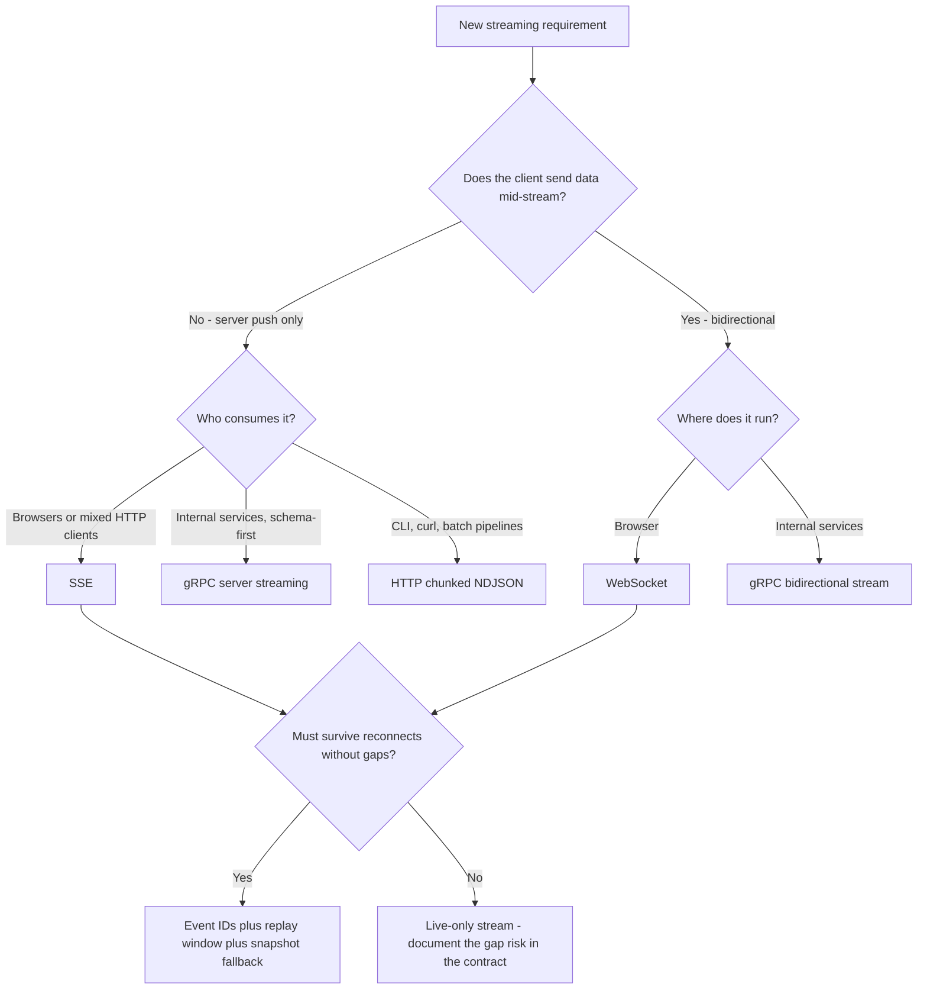

# Streaming APIs

A streaming API delivers data to the client as it becomes available instead of waiting for a complete response. Done well, it turns a 20-second blank wait into sub-second perceived latency and replaces polling storms with a single held connection. Done badly, it is the hardest class of API to operate: connections outlive load-balancer timeouts, auth tokens expire mid-stream, one slow client can exhaust a server's memory, and a single misconfigured proxy silently converts your "stream" into one buffered burst at the end.

The core discipline is that a stream is a **contract over time**, not just a response format. You must decide — explicitly, before v1 — what happens when the connection drops, when the client is slower than the producer, and when credentials expire while bytes are still flowing. Retrofit of any of these is a protocol break for every deployed client.

## When NOT to Use Streaming

Premium skills state their limits. Do not reach for a streaming API when:

- **The response is small and fast.** If the full payload is ready in under ~1 second, a plain request/response is simpler, cacheable, and easier to retry. Streaming a 4 KB JSON object is complexity with no payoff.
- **Polling every 30–60 s is acceptable.** A cron-style dashboard refresh does not justify 100k held connections. Polling with `ETag`/`If-None-Match` is boring and boring is good.
- **Clients need random access, not a feed.** "Give me page 7" is pagination (see cursor patterns in `api-design`), not a stream.
- **Delivery must be durable and audited per-consumer.** That is a message queue (Kafka, SQS) consumed server-side — a browser-facing stream is a delivery surface, not a system of record.
- **You cannot control the network path.** If most of your clients sit behind buffering middleboxes you cannot influence and you cannot ship a fallback, long-polling will produce fewer support tickets.

## Decision Framework

### Choice 1 — Transport protocol

| Protocol | Direction | Best for | What it costs you | Avoid when |
|---|---|---|---|---|
| **SSE** (`text/event-stream`) | Server → client | Browser-facing feeds: LLM tokens, notifications, job progress, live scores | Text-only (UTF-8); native `EventSource` is GET-only and can't set headers; HTTP/1.1 browsers cap ~6 connections per origin | Client must send data mid-stream; binary payloads dominate |
| **WebSocket** (RFC 6455) | Bidirectional | Chat, collaborative editing, subscription management, telemetry with client control | Upgrade handshake breaks naive proxies; no built-in reconnect/resume — you build all semantics (heartbeat, auth, replay) yourself | The flow is one-way — you pay WebSocket's operational cost for nothing |
| **HTTP chunked / NDJSON** | Server → client | CLI tools, `curl` pipelines, service-to-service bulk export | No event IDs, no reconnect semantics, no browser auto-retry; HTTP/1.1 framing detail (HTTP/2 streams bodies natively instead) | Browser clients need reconnection or event identity |
| **gRPC streams** | Server, client, or bidirectional | Internal service-to-service: schema-first, HTTP/2 flow control gives free backpressure | Requires HTTP/2-capable path end to end (Envoy/nginx gRPC); browsers need grpc-web, which supports **server streaming only**; L4 LBs pin long-lived HTTP/2 connections to one backend | Public browser APIs; edge infrastructure you don't control |

The honest default: **SSE for anything browser-facing and one-way, gRPC for anything internal, WebSocket only when the client genuinely talks back mid-stream.** WebSocket is the most requested and least needed of the four.



### Choice 2 — Resume strategy

Decide this before v1. It defines your event envelope and your server-side state.

| Strategy | Server keeps | Client does on reconnect | Trade-off |
|---|---|---|---|
| **Monotonic event ID + replay window** (SSE `id:` / `Last-Event-ID`) | Ring buffer of last N seconds/events | Sends last seen ID; server replays the gap | Simple and native to SSE; replay window bounds memory but old clients fall off the edge |
| **Per-key sequence + snapshot fallback** | Latest state per key + short per-key history | Sends `{key: lastSeq}`; server replays or sends fresh snapshot | Best for state feeds (prices, presence); more bookkeeping, but reconnects never require full refetch |
| **Opaque resume token** (server-encoded cursor) | Nothing per-connection — cursor encodes position in durable log | Presents token; server seeks the log | Scales horizontally (any node can resume); ties you to a durable log (Kafka/stream store) behind the API |
| **No resume (live-only)** | Nothing | Reconnects and misses whatever happened | Legitimate for ephemeral data (typing indicators, cursors) — but say so in the contract |

### Choice 3 — Backpressure policy

When the producer outruns the consumer, something must give. Choose per stream class; never leave it implicit.

| Policy | How it works | Fits | Trade-off |
|---|---|---|---|
| **Conflate** (latest value wins per key) | Pending map keyed by symbol/entity; flush on a timer | State feeds — dashboards, prices, presence | Loses intermediate values by design; wrong for event logs |
| **Bounded buffer, then disconnect** | Per-connection queue with a byte/message cap; over cap → close with a "slow consumer" code | Event feeds where every event matters | Punishes slow clients, but protects the fleet — one client can cost at most the cap |
| **Pull-based credit** (client acks a window) | Server sends only up to N unacked messages | High-value delivery where the client controls pace | Most complex; effectively rebuilding what gRPC/HTTP/2 flow control gives you free |
| **Rely on TCP alone** | `write()` blocks/buffers until the kernel drains | Single-consumer relays (one human reading one LLM stream) | Fine at n=1; at fan-out scale, unbounded userspace buffers above TCP will OOM you |

### Choice 4 — Auth for long-lived connections

Two separate problems: authenticating the **connect**, and surviving **expiry mid-stream**.

| Connect mechanism | Works with | Notes |
|---|---|---|
| Cookie (same-origin session) | `EventSource`, browser WebSocket | Simplest when the stream lives on your app origin; CSRF-protect the endpoints that mutate |
| **One-time ticket**: `POST /stream-tickets` → opaque, single-use, ~30 s TTL, passed in query | `EventSource`, browser WebSocket | The recommended pattern for cross-origin: nothing long-lived lands in access logs |
| `Authorization` header | fetch-based SSE, native/mobile clients, gRPC metadata | Native `EventSource` and browser `WebSocket` **cannot set headers** — this is why the ticket pattern exists |
| First-message auth (WS) | WebSocket | Accept the socket, require an auth frame within ~5 s, else close. Beware: you've already spent the handshake on an anonymous peer |

For mid-stream expiry, prefer **close-and-reconnect**: when the credential expires, the server closes with an application code (e.g. WS `4401`, or an SSE `event: reauth` followed by end-of-stream). The client refreshes its token and reconnects *with its resume token* — you reuse the reconnect path you already built instead of maintaining an in-band re-auth state machine. Smuggling tokens through `Sec-WebSocket-Protocol` is common in the wild; it abuses a negotiation header and confuses intermediaries — use tickets instead.

## SSE Wire Format (30-second reference)

```
HTTP/1.1 200 OK
Content-Type: text/event-stream
Cache-Control: no-cache

id: 42
event: price
data: {"symbol":"ACME","bid":101.25}

: keepalive

id: 43
event: price
data: {"symbol":"ACME","bid":101.30}
```

- Events are blocks of `field: value` lines terminated by a **blank line**. Fields: `id:`, `event:`, `data:` (repeatable — joined with `\n`), `retry:` (reconnect delay hint, ms).
- Lines starting with `:` are comments — the standard heartbeat (`: keepalive\n\n`).
- `EventSource` auto-reconnects and sends the `Last-Event-ID` request header with the last `id:` it saw. This is the cheapest resume mechanism in the industry — set `id:` on every event even if you do nothing with it yet.
- Serve over HTTP/2 where possible: HTTP/1.1 browsers cap ~6 connections per origin, so a few open SSE tabs can starve the app.

## Process

1. **Characterize the flow.** Direction, update rate (steady vs bursty), payload size, ordering requirements, and whether every event matters or only the latest state per key.
2. **Pick the transport** with the Choice 1 table — and write down why, because the runner-up will be proposed again in six months.
3. **Define the event contract.** An envelope (`id`, `event` type, `data`), the full set of event types, and — non-negotiable — an explicit **terminal event** so clients can distinguish "done" from "died".
4. **Design resume** (Choice 2): what the cursor is, how long replay is retained, and the snapshot fallback for clients beyond the window.
5. **Choose the backpressure policy** (Choice 3) per stream class, with concrete caps: max buffered bytes, conflation interval, disconnect code.
6. **Design auth** (Choice 4): connect mechanism plus the mid-stream expiry story.
7. **Configure the path.** Every proxy, LB, and CDN hop: buffering off, idle timeouts above heartbeat interval, upgrade headers forwarded, compression not buffering.
8. **Add heartbeats both ways.** Server emits keepalives; client runs a dead-man's timer (no bytes in 2× heartbeat interval → reconnect with jitter).
9. **Instrument.** Concurrent connections, per-connection queue depth, delivery lag (producer timestamp → client write), reconnect rate, and terminal-event ratio (done vs error vs silent drop).
10. **Load-test the ugly cases.** Slow-reader clients (throttled to 1 KB/s), mass reconnect after a deploy (thundering herd), and a proxy chain identical to production — localhost proves nothing about streaming.

## Worked Example 1: LLM Token Streaming — Claude Relay

**Scenario.** "Helply", a support product, adds an AI assistant. Answers average 900 output tokens. Non-streaming, the measured full-response wall time was p50 14 s / p95 31 s — users assumed the app was broken and re-clicked, doubling load. The team streams tokens to the browser instead.

**Decisions and rationale:**

- **SSE-shaped relay, not WebSocket** — because token flow is strictly server→client. The browser's only upstream message is the initial question, which is an ordinary POST. WebSocket would add an upgrade path through every proxy for zero benefit.
- **Relay through our backend, never browser→Claude direct** — because the Claude API key must not ship to the client, and the relay is where we enforce per-user rate limits and log usage.
- **POST + fetch-streaming instead of native `EventSource`** — because the request carries a JSON body and an `Authorization` header, and `EventSource` supports neither. The client reads the SSE frames off `response.body` (a `ReadableStream`); the wire format is still standard SSE so server tooling and proxies treat it identically.
- **No mid-generation resume** — a deliberate "no" on Choice 2. A half-finished generation is cheap to restart relative to building replay buffers for in-flight model output. Completed messages are persisted; on reconnect the client refetches history and re-asks if needed. We chose to document the gap rather than engineer it away.
- **15 s heartbeat** — because nginx `proxy_read_timeout` and ALB idle timeout both default to 60 s, and Claude Fable 5 thinks before emitting its first visible token, so seconds can pass with zero body bytes. 15 s gives 4× margin against every default timeout in the path.

**The upstream side** — the Claude API streams responses as SSE itself. The event sequence you consume:

```
event: message_start
data: {"type":"message_start","message":{"id":"msg_...","type":"message",...}}

event: content_block_start
data: {"type":"content_block_start","index":0,"content_block":{"type":"text","text":""}}

event: content_block_delta
data: {"type":"content_block_delta","index":0,"delta":{"type":"text_delta","text":"Hello"}}

event: content_block_stop
data: {"type":"content_block_stop","index":0}

event: message_delta
data: {"type":"message_delta","delta":{"stop_reason":"end_turn"},"usage":{"output_tokens":12}}

event: message_stop
data: {"type":"message_stop"}
```

Deltas also carry `thinking_delta` and `input_json_delta` types, and the stream may interleave `ping` events — always switch on the delta type and ignore event types you don't handle, rather than assuming everything is text.

**The relay** (Node + Express, official SDK — the SDK parses upstream SSE; we re-emit our own):

```typescript
import express from "express";
import Anthropic from "@anthropic-ai/sdk";

const app = express();
app.use(express.json());
const anthropic = new Anthropic(); // credentials from env / profile — never hardcoded

app.post("/v1/chat/stream", async (req, res) => {
  res.writeHead(200, {
    "Content-Type": "text/event-stream",
    "Cache-Control": "no-cache",
    "X-Accel-Buffering": "no", // per-response nginx buffering opt-out
  });

  const heartbeat = setInterval(() => res.write(": keepalive\n\n"), 15_000);
  const abort = new AbortController();
  req.on("close", () => abort.abort()); // user closed the tab — stop paying for tokens

  let seq = 0;
  const send = (event: string, data: unknown) =>
    res.write(`id: ${++seq}\nevent: ${event}\ndata: ${JSON.stringify(data)}\n\n`);

  try {
    const stream = anthropic.messages.stream(
      {
        model: "claude-fable-5",
        max_tokens: 64000, // Fable 5 thinks by default; the cap covers thinking + answer
        messages: req.body.messages,
      },
      { signal: abort.signal },
    );

    for await (const event of stream) {
      if (event.type === "content_block_delta" && event.delta.type === "text_delta") {
        send("token", { text: event.delta.text });
      }
    }

    const final = await stream.finalMessage();
    if (final.stop_reason === "refusal") {
      send("error", { code: "refused" }); // Fable 5 safety classifiers can decline mid-stream
    } else {
      send("done", {
        stop_reason: final.stop_reason, // "max_tokens" here = truncated, and the client must say so
        output_tokens: final.usage.output_tokens,
      });
    }
  } catch (err) {
    if (!abort.signal.aborted) send("error", { code: "upstream_failed" });
  } finally {
    clearInterval(heartbeat);
    res.end();
  }
});
```

Three details are load-bearing. The **terminal `done`/`error` event** is the contract: a client that sees the socket close without one treats the answer as failed, not complete — this is how truncation and mid-stream refusals stop being silently shipped as finished answers. The **abort wiring** means an abandoned tab cancels the upstream generation — in Helply's load test this cut token spend 11% (users navigating away mid-answer). And `stop_reason` is forwarded because `"max_tokens"` and `"end_turn"` look identical if all you watch is the token flow.

**Result.** Time-to-first-token p50 1.9 s / p95 4.6 s (dominated by model thinking time); perceived latency dropped from 14 s to under 2 s; re-click rate fell to near zero. One incident during rollout: staging worked, production "streamed" everything in a single burst — nginx buffering, fixed by the `X-Accel-Buffering: no` header above (see the pitfalls table).

## Worked Example 2: Market-Data Dashboard over WebSocket

**Scenario.** "Tickerdeck" serves a live-price dashboard: 12,000 concurrent browser clients, ~300 instruments, upstream feed peaking at 2,000 updates/sec aggregate. Each client watches ~20 symbols and can add/remove subscriptions at any time.

**Decisions and rationale:**

- **WebSocket, not SSE** — because clients genuinely send data mid-stream: subscription changes and per-symbol resume sequences. Doing that over SSE would mean side-channel POSTs racing the stream — real bidirectionality is the one case WebSocket earns its cost.
- **Conflation, not buffering** (Choice 3) — because a price feed is *state*, not an event log: nobody needs the 40 intermediate quotes their laptop was too slow to render, they need the current price. We conflate to a 500 ms flush (max 2 updates/sec/symbol), which caps any client at ~40 msg/s × ~150 bytes ≈ 6 KB/s regardless of upstream burst rate. Buffering every tick for the slowest client would have required unbounded queues.
- **Bounded buffer as the backstop** — conflation bounds the *rate*, `bufferedAmount` bounds the *bytes*: if a connection holds > 1 MB unsent for 10 s (mobile client in a tunnel), we close with app code `4008 slow_consumer`. The client's normal reconnect+resume path recovers it. One slow client can now cost the fleet at most 1 MB.
- **Per-symbol sequence + snapshot fallback** (Choice 2) — resume tokens are `{symbol: lastSeq}`. Each gateway keeps a 60 s per-symbol ring buffer fed from Redis pub/sub, so *any* node can serve a resume — no sticky sessions, and reconnects after a deploy don't stampede the origin. Beyond 60 s the server sends a fresh snapshot instead; the client applies it idempotently. We chose per-symbol sequences over exposing Kafka offsets because the internal log is an implementation detail we reserve the right to change.
- **Ticket auth + close-on-expiry** (Choice 4) — browser `WebSocket` can't send headers, so the client POSTs for a 30 s single-use ticket and connects with `wss://…/ws?ticket=…`. Sessions are 15 min; at expiry the server closes with `4401`; the client refreshes and reconnects with its resume map. Rationale: one recovery path (reconnect) handles network drops, deploys, slow-consumer kicks, *and* auth expiry.

**Server core** (Node, `ws`):

```typescript
import { WebSocketServer, WebSocket } from "ws";

const CONFLATE_MS = 500;
const MAX_BUFFERED_BYTES = 1_000_000;
const SLOW_GRACE_MS = 10_000;

interface Tick { symbol: string; seq: number; bid: number; ask: number; ts: number; }
interface Conn { ws: WebSocket; subs: Set<string>; pending: Map<string, Tick>;
                 slowSince: number | null; alive: boolean; }

const conns = new Set<Conn>();

// Feed handler (Redis pub/sub, ~2,000 msg/s peak): conflate, never send inline
export function onTick(tick: Tick) {
  for (const c of conns) {
    if (c.subs.has(tick.symbol)) c.pending.set(tick.symbol, tick); // latest wins
  }
}

setInterval(() => {
  const now = Date.now();
  for (const c of conns) {
    if (c.ws.bufferedAmount > MAX_BUFFERED_BYTES) {
      c.slowSince ??= now;
      if (now - c.slowSince > SLOW_GRACE_MS) c.ws.close(4008, "slow_consumer");
      continue; // skip flush; conflation keeps only the latest values anyway
    }
    c.slowSince = null;
    if (c.pending.size > 0) {
      c.ws.send(JSON.stringify({ type: "ticks", data: [...c.pending.values()] }));
      c.pending.clear();
    }
  }
}, CONFLATE_MS);

// Liveness: ping every 30 s, drop peers that miss a pong cycle
setInterval(() => {
  for (const c of conns) {
    if (!c.alive) { c.ws.terminate(); continue; }
    c.alive = false;
    c.ws.ping();
  }
}, 30_000);

new WebSocketServer({ port: 8080 }).on("connection", (ws, req) => {
  // validateTicket consumes the single-use ticket minted by POST /stream-tickets
  const session = validateTicket(new URL(req.url!, "ws://x").searchParams.get("ticket"));
  if (!session) return ws.close(4401, "auth_required");

  const conn: Conn = { ws, subs: new Set(), pending: new Map(), slowSince: null, alive: true };
  conns.add(conn);
  ws.on("pong", () => { conn.alive = true; });
  ws.on("close", () => conns.delete(conn));

  ws.on("message", (raw) => {
    const msg = JSON.parse(raw.toString());
    if (msg.type === "subscribe") {
      for (const s of msg.symbols) conn.subs.add(s);
      // Resume: replay from the 60s ring buffer where seq is fresh, else snapshot
      ws.send(JSON.stringify(resumeOrSnapshot(msg.symbols, msg.since ?? {})));
    }
    if (msg.type === "unsubscribe") for (const s of msg.symbols) conn.subs.delete(s);
  });
});
```

**Result.** Per-gateway egress peaks at ~24 MB/s across 4,000 connections (3 gateways), flat regardless of upstream burstiness — conflation absorbs the variance. A rolling deploy reconnects 12k clients over ~90 s with client-side jitter; because any node serves any resume, the reconnect storm hits Redis-backed ring buffers, not the pricing origin. The `4008` kick fires on ~0.3% of connections/day, almost all mobile — those clients resume within seconds instead of degrading a gateway.

## Proxies and Load Balancers: Where Streams Go to Die

| Layer | Pitfall | Fix |
|---|---|---|
| nginx (default) | Buffers upstream responses — deltas arrive as one burst at the end | `proxy_buffering off;` for stream routes, or send `X-Accel-Buffering: no` per response |
| nginx / ALB idle timeout | 60 s of no bytes → connection killed; client may not notice for minutes | Heartbeat at < ½ the timeout; raise the timeout on stream routes; client dead-man's timer |
| Any L7 proxy | WebSocket upgrade dropped (missing `Upgrade`/`Connection` headers, HTTP/1.0 upstream) → 400/426 | `proxy_http_version 1.1;` + forward `Upgrade` and `Connection: upgrade` |
| Compression middleware | gzip buffers output to compress it — silently defeats streaming | Disable compression for `text/event-stream`; for WS use permessage-deflate deliberately (it costs memory per connection) |
| Browser + HTTP/1.1 | ~6 connections per origin — a few SSE tabs starve all other requests | Serve streams over HTTP/2 |
| L4 LB + gRPC | Long-lived HTTP/2 connections pin to one backend; scale-out does nothing | L7/gRPC-aware LB (Envoy), or server-side `MAX_CONNECTION_AGE` to force periodic re-balance |
| Multi-node fleets | Reconnect lands on a node without the client's replay state | Externalize replay buffers (Redis/log) so any node can resume — never rely on stickiness for correctness |
| Corporate middleboxes | Some proxies/AV buffer or strip streaming entirely | Client-side stall detection (no bytes in 2× heartbeat → reconnect); offer a long-poll fallback if this audience matters |

```nginx
# Stream-safe nginx reverse proxy
location /v1/chat/stream {
    proxy_pass http://app;
    proxy_http_version 1.1;
    proxy_set_header Connection "";
    proxy_buffering off;           # deltas flow immediately
    proxy_cache off;
    proxy_read_timeout 300s;       # > any expected quiet period
    gzip off;                      # compression buffers; disable on stream routes
}

location /ws/ {
    proxy_pass http://app;
    proxy_http_version 1.1;
    proxy_set_header Upgrade $http_upgrade;
    proxy_set_header Connection "upgrade";
    proxy_read_timeout 120s;       # > heartbeat interval (30s) with margin
}
```

## Anti-Patterns

| Symptom | Why it fails | Do instead |
|---|---|---|
| "Streaming" endpoint delivers everything in one burst at the end | A proxy hop is buffering; you shipped streaming that has streaming's cost and polling's UX | Test through the production proxy chain; `proxy_buffering off` / `X-Accel-Buffering: no`; disable gzip on stream routes |
| WebSocket for a one-way feed | You pay upgrade handling, custom heartbeats, and custom reconnect for a flow SSE gives you natively | SSE with `id:` + `Last-Event-ID`; reserve WS for genuine bidirectionality |
| Unbounded per-client send queues | One slow client (mobile, tunnel, hostile) grows a queue until the gateway OOMs — a single peer takes down thousands | Conflate state feeds; cap buffered bytes and disconnect with an app close code; the client's resume path recovers |
| No heartbeats in either direction | Idle timeout kills the connection; TCP won't tell the client for minutes — a "connected" screen showing stale data | Server keepalive < ½ the smallest timeout in the path; client dead-man's timer at 2× heartbeat |
| No event IDs / no resume design | Every reconnect is a coin-flip between gaps and full refetch; a deploy triggers a thundering herd of snapshot requests | IDs on every event from day one; replay window + snapshot fallback; idempotent client apply |
| Long-lived bearer token in the query string | URLs land in access logs, proxy logs, and browser history — you've written credentials to disk fleet-wide | One-time short-TTL tickets in the query, or cookies, or headers on fetch-based clients |
| Ignoring the terminal event in LLM streams | `max_tokens` truncation and mid-stream refusals render as a normal-looking answer that just… stops | Emit explicit `done`/`error` with `stop_reason`; clients treat close-without-terminal as failure |
| Auth checked only at connect | A revoked or expired user keeps a live feed for hours because nothing re-evaluates | Bind stream lifetime to credential lifetime: close with an app code at expiry, reconnect re-authenticates |
| Client reconnects immediately in a tight loop | An outage becomes a self-inflicted DDoS the moment the service returns | Exponential backoff with jitter, honoring SSE `retry:` / server hints |

## Checklist

Copy into the PR description or design doc:

```
Streaming API review — [service/endpoint]

Contract
[ ] Protocol chosen via decision table; runner-up and reason recorded
[ ] Event envelope defined: id, type, payload schema
[ ] Explicit terminal event ("done" vs "error") — close-without-terminal = failure
[ ] Every event carries a monotonic id / sequence

Resilience
[ ] Resume strategy chosen (replay window / snapshot / documented live-only)
[ ] Replay retention sized and stated (e.g. 60 s)
[ ] Client reconnect: exponential backoff + jitter, resends cursor
[ ] Client apply is idempotent (replay overlap is harmless)

Flow control
[ ] Backpressure policy explicit per stream class (conflate / bounded+kick / credit)
[ ] Per-connection byte cap and slow-consumer close code defined
[ ] Server heartbeat interval < ½ smallest timeout in the path
[ ] Client dead-man's timer at 2× heartbeat

Auth
[ ] Connect mechanism (cookie / ticket / header) — no long-lived tokens in URLs
[ ] Mid-stream expiry behavior defined (close code + reconnect)
[ ] Upstream provider keys never reach the client (relay pattern)

Path
[ ] Proxy buffering disabled on stream routes; compression off or per-message
[ ] LB idle timeouts raised; WS upgrade headers forwarded end to end
[ ] Any-node resume works (replay state externalized) — no stickiness for correctness
[ ] Load-tested: slow readers, mass reconnect, production-identical proxy chain

Observability
[ ] Metrics: concurrent connections, queue depth, delivery lag, reconnect rate
[ ] Terminal-event ratio tracked (done vs error vs silent drop)
```

## 10 Rules

1. **Default to SSE. Justify WebSocket, not the other way around.** If the client never sends data mid-stream, WebSocket is pure operational overhead wearing a fashionable name.
2. **A stream without a terminal event is a bug factory.** "Done" and "died" must be distinguishable by contract, not inferred from silence.
3. **Design resume before v1.** Event IDs cost one line now; retrofitting them is a breaking change for every client you've ever shipped.
4. **Backpressure is a product decision.** "Drop, conflate, or disconnect" changes what users see — make the call explicitly per stream, never let the default (unbounded buffer) decide for you.
5. **A slow client may cost you a bounded number of bytes, then nothing.** Any design where one peer's slowness grows server memory without limit is an outage on a timer.
6. **Heartbeat both ways.** Server keepalives defeat middlebox timeouts; the client's dead-man's timer defeats the connections that die without a FIN.
7. **Reconnect is the universal recovery path — route everything through it.** Network drops, deploys, slow-consumer kicks, and auth expiry should all resolve as "reconnect with resume token", not four bespoke mechanisms.
8. **Test through the real proxy chain.** Streaming is the one API class where localhost success is close to meaningless — buffering, timeouts, and upgrade handling only exist in the full path.
9. **Never let a provider API key reach the client.** LLM and data-feed streams are always relayed; the relay is also where cancellation, rate limiting, and usage logging live.
10. **Idempotent apply beats exactly-once delivery.** You will not get exactly-once over the public internet; a client that can safely re-apply an overlapping replay makes at-least-once good enough.

## References

- WHATWG HTML Living Standard — Server-sent events (`EventSource`, wire format, `Last-Event-ID`)
- RFC 6455 — The WebSocket Protocol (handshake, frames, close codes, ping/pong)
- gRPC documentation — streaming RPCs, keepalive, and load-balancing guidance (grpc.io)
- Anthropic Claude API — Messages streaming reference: `https://platform.claude.com/docs/en/build-with-claude/streaming`
- nginx documentation — `proxy_buffering`, `proxy_read_timeout`, WebSocket proxying
