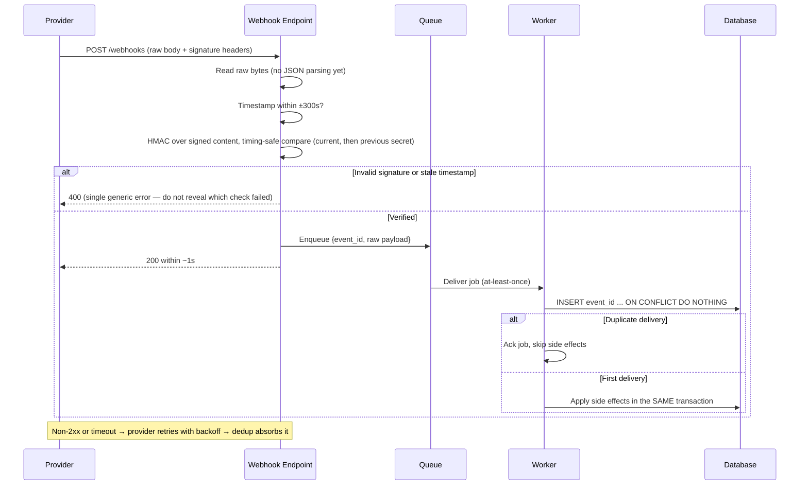

# Webhook Security

A webhook endpoint is a door into your system that anyone on the internet can knock on. The provider you integrated is one of billions of possible callers; everyone else is an attacker until proven otherwise. Webhook security is the discipline of proving otherwise on every single request: authenticate the sender cryptographically, bound the request in time, deduplicate deliveries, and acknowledge fast so the provider's retry machinery works *for* you instead of against you.

The stakes are concrete. An unverified `payment_intent.succeeded` webhook ships goods that were never paid for. A replayed `subscription.created` provisions two accounts. A handler that does 3 seconds of work inline times out, triggers provider retries, and turns one event into five duplicate side effects. Every one of these is a routine production incident, and every one is preventable with the patterns below.

**When NOT to use this skill:**

- **Sending webhooks** — this skill covers the receiving side. If you are the provider, adopt the [Standard Webhooks](https://www.standardwebhooks.com/) spec on the sending side and this skill's verifier becomes your customers' documentation.
- **Internal service-to-service calls inside a private network** — use mTLS or a service mesh; webhook signature schemes exist because the public internet has no other trust anchor.
- **Polling integrations** — if you call the provider's API on a schedule, there is no inbound surface to defend. Polling is often the right answer for low-volume, non-latency-sensitive syncs; don't build a webhook endpoint you don't need.
- **Browser-originated callbacks (OAuth redirects, payment return URLs)** — those are user-agent flows with their own defenses (state parameters, PKCE), not machine-to-machine webhooks.

## Decision Framework

Four choices determine the shape of every webhook receiver. Make them explicitly.

### 1. How do you authenticate the sender?

| Option | How it works | Choose when | Honest trade-offs |
|---|---|---|---|
| **Provider-native HMAC** (Stripe, GitHub, Slack, Shopify) | Provider signs raw body (sometimes + timestamp) with a shared secret; you recompute and compare | The provider signs — always use it when offered | Every provider invents its own headers and signed-content format; you maintain one verifier per provider |
| **Standard Webhooks** (`webhook-id` / `webhook-timestamp` / `webhook-signature`) | Spec-defined HMAC-SHA256 over `{id}.{timestamp}.{body}`, base64 signatures | Provider advertises spec compliance (Svix-powered senders and a growing list) | One verifier covers all compliant senders; adoption is real but far from universal |
| **Asymmetric signatures** (Standard Webhooks `v1a` uses ed25519) | Provider signs with a private key; you verify with a published public key | Payloads transit third parties, or you must verify without holding a secret that could sign | Nothing to leak on your side; fewer libraries, and you must pin/refresh the public key |
| **URL secret + verify-API callback** | Random capability token in the URL; treat the payload as an untrusted hint and fetch authoritative state from the provider's API | Provider cannot sign at all (legacy systems, bare-bones SaaS) | The URL becomes a bearer credential — it leaks via logs and misconfigured proxies; the verify call adds latency and API quota cost |

### 2. What is your replay defense?

| Option | Blocks | Misses | Verdict |
|---|---|---|---|
| Timestamp tolerance only (e.g. 300s) | Old captured payloads | Replays *inside* the window; providers with no timestamp in the signature (GitHub) | Never sufficient alone |
| Event-ID dedup only | Exact duplicates forever (within retention) | Nothing — but requires state and a retention policy | Sufficient, but unbounded without a TTL |
| **Both (recommended)** | Everything above | — | Tolerance bounds how long dedup records must live: retention = tolerance + provider max retry horizon |

### 3. Where does dedup state live?

| Store | Pros | Cons | Choose when |
|---|---|---|---|
| Redis `SET NX` + TTL | Fast, trivial to add | Not atomic with your side effects; eviction under memory pressure silently drops dedup | Side effects are re-runnable (cache refresh, notification) |
| **DB unique constraint, same transaction as side effects** | Dedup and effects commit or roll back together — true exactly-once effects | One extra insert per event on your primary DB | Side effects are financial or otherwise irreversible |
| Natural-key dedup (no event ID from provider) | Works when the provider sends none | You must design the key; risk of over- or under-deduping | Unsigned/legacy providers only |

### 4. Inline or queue-backed processing?

| Model | Choose when | Trade-offs |
|---|---|---|
| Inline (verify → process → 2xx) | Handler is <500ms p99 *including spikes*, and effects are idempotent | Simplest; one slow dependency turns provider retries into a duplicate storm |
| **Queue-backed (verify → enqueue → 2xx)** | Anything touching payments, email, fulfillment, or another API | Requires a queue and worker, and the worker must dedup — the queue itself is at-least-once |

## Provider Signature Schemes — Field Reference

| Provider | Header(s) | Signed content | Encoding | Timestamp | Retry behavior |
|---|---|---|---|---|---|
| Stripe | `Stripe-Signature: t=<ts>,v1=<sig>[,v1=<sig>]` | `{t}.{raw_body}` | hex | In header and signed content | Retries with exponential backoff for up to 3 days (live mode) |
| GitHub | `X-Hub-Signature-256: sha256=<sig>` (plus `X-GitHub-Delivery` GUID) | raw body only | hex | **None** — dedup by delivery GUID is your only replay defense | No automatic retries; 10-second response timeout; manual redelivery via UI/API |
| Slack | `X-Slack-Signature: v0=<sig>` + `X-Slack-Request-Timestamp` | `v0:{ts}:{raw_body}` | hex | Separate header, in signed content | 3 retries; sustained failures can disable the event subscription |
| Standard Webhooks | `webhook-id`, `webhook-timestamp`, `webhook-signature: v1,<sig>` | `{id}.{ts}.{raw_body}` | base64 | Header, in signed content | Sender-defined |

Notes that bite in practice: Stripe's secret (`whsec_...`) is used **as-is** as the HMAC key; Standard Webhooks secrets strip the `whsec_` prefix and **base64-decode** the remainder to get key bytes. Stripe may send multiple `v1` entries during its rotation grace window — accept if *any* matches. GitHub's legacy `X-Hub-Signature` is SHA-1; ignore it when the SHA-256 header is present.

## Process

1. **Capture the raw body before anything parses it.** Signature verification must run over the exact bytes the provider sent. Configure the framework route for raw bytes (`express.raw()`, FastAPI's `await request.body()`) — a re-serialized parsed body will never match.
2. **Verify the signature with a timing-safe compare.** Recompute the HMAC per the provider's scheme; compare with `hmac.compare_digest` / `crypto.timingSafeEqual`. Check against the current secret and, during rotation windows, the previous one.
3. **Enforce timestamp tolerance.** Reject signed timestamps outside ±300 seconds (the tolerance both Stripe's SDKs and Standard Webhooks recommend). Skip only when the scheme has no timestamp — then dedup carries the full load.
4. **Return 2xx fast; enqueue the raw payload.** Parse JSON only after verification, do schema validation, drop the event on a queue, and respond within ~1 second. Providers time out slow endpoints (GitHub: 10s) and treat timeouts as failures.
5. **Deduplicate in the worker, atomically with side effects.** Insert the event ID into a dedup table with a unique constraint inside the same transaction as the side effects. The queue is at-least-once; the HTTP layer is at-least-once; only this makes effects once-only.
6. **Handle out-of-order delivery.** Providers do not guarantee ordering. Never apply state transitions blindly — compare against current state, or fetch the authoritative object from the provider's API before acting.
7. **Plan secret rotation before you need it.** Two secret slots (`CURRENT`, `PREVIOUS`), a documented rotation runbook, and a calendar entry. Rotation you've never rehearsed is rotation you'll botch during an incident.
8. **Add operational guards.** Per-source rate limiting, payload size caps (reject >1 MB unless the provider documents larger), alerting on verification-failure spikes (attack or an unannounced provider change) and on dead-letter queue depth.

## The Verified Delivery Path



## Signature Verification — Production Code

### Raw-body discipline (the #1 cause of "signatures never match")

```typescript
// Express: the raw body MUST reach the verifier untouched.
// WRONG: app.use(express.json()) globally — the raw bytes are gone by the
// time your handler runs, and JSON.stringify(req.body) differs from the
// wire bytes in key order, whitespace, and unicode escaping.
app.post(
  "/webhooks/orders",
  express.raw({ type: "application/json" }), // req.body is a Buffer
  handleOrderWebhook,
);
```

### Stripe (`t=`/`v1=` scheme) and GitHub (`X-Hub-Signature-256`) — Python

```python
import hashlib
import hmac
import os
import time

TOLERANCE_SECONDS = 300

# Injected by the secrets manager at deploy time. PREVIOUS is set only
# during a rotation window; empty slots are filtered out.
def load_secrets(prefix: str) -> list[str]:
    return [s for s in (os.environ.get(f"{prefix}_CURRENT", ""),
                        os.environ.get(f"{prefix}_PREVIOUS", "")) if s]

def verify_stripe(payload: bytes, sig_header: str, secrets: list[str]) -> bool:
    """Stripe-Signature: t=<unix_ts>,v1=<hex>[,v1=<hex>,v0=...]
    Signed content is '{t}.{raw_body}'; key is the whsec_ string as-is."""
    try:
        pairs = [p.split("=", 1) for p in sig_header.split(",")]
        timestamp = int(next(v for k, v in pairs if k == "t"))
        candidates = [v for k, v in pairs if k == "v1"]
    except (StopIteration, ValueError):
        return False
    if not candidates or abs(time.time() - timestamp) > TOLERANCE_SECONDS:
        return False
    signed = f"{timestamp}.".encode() + payload
    for secret in secrets:  # dual-secret rotation window
        expected = hmac.new(secret.encode(), signed, hashlib.sha256).hexdigest()
        if any(hmac.compare_digest(expected, c) for c in candidates):
            return True
    return False

def verify_github(payload: bytes, sig_header: str, secrets: list[str]) -> bool:
    """X-Hub-Signature-256: sha256=<hex>. Body-only signature — GitHub sends
    no timestamp, so replay defense MUST come from X-GitHub-Delivery dedup."""
    if not sig_header.startswith("sha256="):
        return False
    received = sig_header.removeprefix("sha256=")
    for secret in secrets:
        expected = hmac.new(secret.encode(), payload, hashlib.sha256).hexdigest()
        if hmac.compare_digest(expected, received):
            return True
    return False
```

### Standard Webhooks — TypeScript

```typescript
import { createHmac, timingSafeEqual } from "node:crypto";

const TOLERANCE_SECONDS = 300;

export function verifyStandardWebhook(
  rawBody: Buffer,
  headers: { id?: string; timestamp?: string; signature?: string },
  secrets: string[], // ["whsec_..."]; current first, previous during rotation
): boolean {
  const { id, timestamp, signature } = headers;
  if (!id || !timestamp || !signature) return false;

  const ts = Number(timestamp);
  if (!Number.isInteger(ts)) return false;
  if (Math.abs(Date.now() / 1000 - ts) > TOLERANCE_SECONDS) return false;

  // Signed content: "{webhook-id}.{webhook-timestamp}.{raw body}"
  const signedContent = Buffer.concat([
    Buffer.from(`${id}.${ts}.`, "utf8"),
    rawBody,
  ]);

  // Header is space-delimited: "v1,<base64> v1,<base64> ..." (v1a = ed25519)
  const candidates = signature
    .split(" ")
    .map((entry) => entry.split(",", 2))
    .filter(([version, sig]) => version === "v1" && Boolean(sig))
    .map(([, sig]) => sig);

  for (const secret of secrets) {
    // Spec: strip the whsec_ prefix, base64-decode to raw key bytes.
    const key = Buffer.from(secret.replace(/^whsec_/, ""), "base64");
    const expected = createHmac("sha256", key).update(signedContent).digest();
    for (const candidate of candidates) {
      const received = Buffer.from(candidate, "base64");
      if (received.length === expected.length && timingSafeEqual(received, expected)) {
        return true;
      }
    }
  }
  return false;
}
```

### 2xx-fast endpoint + transactional dedup worker — Python/FastAPI

```python
import json
from fastapi import FastAPI, HTTPException, Request

app = FastAPI()
STRIPE_SECRETS = load_secrets("STRIPE_WHSEC")

@app.post("/webhooks/stripe")
async def stripe_webhook(request: Request):
    payload = await request.body()  # raw bytes, before any parsing
    header = request.headers.get("stripe-signature", "")
    if not verify_stripe(payload, header, STRIPE_SECRETS):
        raise HTTPException(status_code=400, detail="invalid signature")
    event = json.loads(payload)  # parse only AFTER verification
    await queue.enqueue("stripe_event", event_id=event["id"], raw=payload.decode())
    return {"received": True}  # 2xx in milliseconds; real work happens in the worker

# Worker side. Schema:
#   CREATE TABLE webhook_events (
#     event_id    text PRIMARY KEY,
#     received_at timestamptz NOT NULL DEFAULT now()
#   );
async def process_stripe_event(event_id: str, raw: str) -> None:
    event = json.loads(raw)
    async with db.transaction():
        inserted = await db.execute(
            "INSERT INTO webhook_events (event_id) VALUES ($1) ON CONFLICT DO NOTHING",
            event_id,
        )
        if inserted == 0:
            return  # duplicate delivery (HTTP retry or queue redelivery) — drop it
        # Side effects commit atomically with the dedup record: if this
        # transaction rolls back, the dedup row rolls back too, and the
        # queue's retry gets a clean second attempt.
        await apply_side_effects(event)
```

## Secret Rotation — the Dual-Secret Window

Rotation fails when it's designed as a single atomic swap: in-flight deliveries signed with the old secret arrive after you've switched, verification fails, and the provider's retries hammer a "broken" endpoint. The fix is two slots and a window:

1. Generate/roll the secret on the provider side. Stripe's dashboard rolls the endpoint secret while keeping the old one valid for a grace period you choose (up to 24 hours) — during that window it emits both `v1` signatures. Standard Webhooks handles the same case with multiple space-delimited signatures.
2. Set `*_PREVIOUS` to the old secret, `*_CURRENT` to the new one; deploy. Your verifier already accepts either.
3. After the window (old-secret retry horizon + provider grace, typically 24–72 h), clear `*_PREVIOUS`.
4. Rehearse this on a schedule (quarterly is a sane default) so the incident-day rotation — after a secret leaks into a log or a departed laptop — is muscle memory, not a first attempt.

## IP Allowlisting — Realism

IP allowlists are defense-in-depth, never the primary control. The honest assessment:

- **What it buys you:** pre-auth noise reduction — scanners and drive-by junk never reach your verifier — plus a cheap tripwire (any request from an unlisted IP is worth an alert).
- **Why it can't be primary:** published ranges change (Stripe publishes its webhook source IPs; GitHub exposes hook ranges under the `hooks` key of its `/meta` API — both update), and a stale allowlist silently drops legitimate events. Providers on shared cloud egress can't offer stable IPs at all. And an allowlist authenticates a *network*, not a *payload* — it does nothing against replay or against a compromised host inside the provider's range.
- **When it genuinely helps:** legacy/on-prem senders with a handful of static egress IPs and no signing ability — there, allowlist + capability URL is most of what you have (see Worked Example 2). Automate the range refresh; a manual allowlist is an outage on a timer.

## Unsigned Webhooks — Mitigation Patterns

Some providers cannot sign. Layer these, in order of value:

1. **Capability URL (URL secret).** Issue `https://hooks.example.com/wh/inbound/<32-byte-random-token>` per provider (per tenant if multi-tenant). Compare the token with a timing-safe compare against a stored hash. The URL is now a bearer credential: never log it whole, mask the token in access logs, and rotate by issuing a new URL and retiring the old after cutover.
2. **Verify-API callback.** Treat the payload as an untrusted *hint*: extract only the resource ID, then fetch the authoritative object from the provider's API over your authenticated client. An attacker who has the URL can now only make you re-fetch truth — they cannot inject state. This is the strongest unsigned-provider defense and also fixes out-of-order delivery for free.
3. **Natural-key dedup.** No event ID means you design one: hash of `(resource_id, status, provider_timestamp)` with a unique constraint. Over-deduping (two real identical events) is usually safer than under-deduping for state-sync workloads.
4. **Tight blast radius.** Aggressive rate limits, small payload caps, and an allowlist if the sender has static IPs. Assume the URL will eventually leak; design so that leak is an annoyance, not an incident.

## Worked Example 1: Meridian Commerce — Stripe Payments at 40k Events/Day

**Scenario:** an e-commerce platform receives ~40,000 Stripe events/day (~0.5/s average, 50/s spikes during flash sales). The handler kicks off fulfillment, sends a confirmation email, and writes a revenue-ledger row — p95 1.4 s of work. Duplicate charges or double-shipments are unacceptable.

| Decision | Choice | Rationale |
|---|---|---|
| Processing model | Queue-backed (SQS), endpoint enqueues raw payload | 1.4 s p95 inline work at 50/s spike guarantees timeouts → retry storms. After the change, endpoint p99 dropped from 2.9 s to 38 ms |
| Replay defense | 300 s tolerance **and** event-ID dedup | Tolerance matches Stripe's SDK default; dedup is mandatory anyway because SQS standard queues are at-least-once |
| Dedup store | Postgres `webhook_events` PK, same transaction as the ledger write | The ledger is financial — Redis eviction losing a dedup record means double revenue recognition. We chose the DB constraint because it makes dedup and effects atomic |
| Dedup retention | 30-day sweep job | Stripe retries up to 3 days; 30 days gives 10× margin and keeps the table at ~1.2 M rows — negligible |
| Rotation | Quarterly; `STRIPE_WHSEC_CURRENT`/`_PREVIOUS`, 24 h window | First rehearsal caught that a canary region read secrets at boot only — a restart step was added to the runbook. That's what rehearsals are for |
| Ordering | Handlers compare event `created` + object state; `charge.refunded` fetches the Charge via API before ledger reversal | Stripe doesn't guarantee order; a refund arriving before its charge event must not create a negative-balance row |

**Measured outcome:** 0.3% of deliveries were duplicates absorbed by the dedup constraint (mostly deploy-window 503s triggering Stripe retries); verification-failure alerting caught one misconfigured staging URL pointed at production within 4 minutes.

## Worked Example 2: Northwind Logistics — an Unsigned Legacy Carrier Feed

**Scenario:** a freight platform receives ~12,000 shipment-status webhooks/day from a legacy carrier TMS that can only POST plain JSON to a fixed URL — no signatures, no custom headers, no event IDs. Status updates drive customer notifications and ETA recalculation.

| Decision | Choice | Rationale |
|---|---|---|
| Sender auth | Capability URL: 32-byte token (43-char base64url) in the path, stored as a SHA-256 hash, timing-safe compare | Only auth mechanism the sender supports. Hashing the stored token means a read-only DB leak doesn't yield a usable URL |
| Payload trust | Verify-API callback: extract `shipment_id` only, then GET the carrier's REST API for authoritative status (~120 ms, well inside quota at 12 k/day) | We chose fetch-the-truth because the payload is unauthenticated — an attacker with the URL can cause API reads, never state injection. Also collapses the carrier's frequent out-of-order deliveries |
| Replay/dedup | Natural key: unique constraint on `sha256(shipment_id ‖ status ‖ carrier_timestamp)` | No event ID exists. Duplicate real transitions are no-ops here, so over-deduping is safe |
| Network guard | Allowlist of the carrier's 4 static egress IPs, auto-alerting on off-list hits; 64 KB payload cap; 5 req/s rate limit | Realistic here *only* because the sender is on-prem with static IPs — the allowlist is the tripwire, the verify-API call is the actual control |
| URL rotation | New capability URL issued semi-annually or on suspicion; old URL kept live but alert-only for 7 days, then 410 | The carrier's change process takes days; a hard cutover would drop events. Alert-only overlap shows exactly when they've migrated |
| Logging | Access logs mask the token (`/wh/inbound/nw_****`); payloads logged as `shipment_id` + status only | The URL is a credential; full-URL logs would put it in every log aggregator and S3 archive |

**Measured outcome:** the off-list-IP tripwire fired twice in six months — both carrier NAT changes, caught before events dropped. Zero spoofed-state incidents possible by construction: state only ever comes from the authenticated API fetch.

## Anti-Patterns

| Symptom | Why it fails | Do instead |
|---|---|---|
| Verifying HMAC over `JSON.stringify(req.body)` | Re-serialization changes key order/whitespace/escapes — signature never matches, and the "fix" people reach for is disabling verification | Route-level raw body capture; verify the wire bytes |
| `expected == received` string compare | Early-exit comparison leaks match length via response timing — signatures become brute-forceable | `hmac.compare_digest` / `crypto.timingSafeEqual` (equal-length check first in Node) |
| Timestamp check only, no dedup | Replays inside the tolerance window sail through; GitHub-style schemes have no timestamp at all | Event-ID (or natural-key) dedup with a unique constraint, always |
| Redis-only dedup for financial side effects | Eviction or TTL expiry silently forgets an event was processed → double ledger entries | Dedup row + side effects in one DB transaction |
| Doing real work before responding | Slow dependency → provider timeout → retry → duplicates; GitHub cuts you off at 10 s | Verify, enqueue, 2xx in under a second |
| Returning 200 on invalid signatures "to stop retries" | You've silenced your only signal that verification is broken or you're under attack | 400 on bad signatures; alert on failure-rate spikes |
| IP allowlist as the only control | Ranges rotate, allowlists go stale, and an IP authenticates nothing about the payload | Signatures primary; allowlist as tripwire |
| One secret slot, big-bang rotation | In-flight old-secret deliveries fail during the swap; retries pile onto a "broken" endpoint | Dual-secret window; clear the previous slot after the retry horizon |
| Applying status transitions in arrival order | Webhooks are unordered; `shipped` → `packed` regressions corrupt state machines | Compare timestamps/state, or fetch the authoritative object |
| Logging full payloads and capability URLs | PII and bearer credentials end up in log aggregators with 90-day retention and broad read access | Log event ID + type; mask URL tokens |

## Checklist

```
Webhook receiver — pre-production checklist

Signature & transport
[ ] Raw body captured before any parsing middleware
[ ] Provider-correct signed content (Stripe: t.body | GitHub: body | SW: id.ts.body)
[ ] Timing-safe comparison (compare_digest / timingSafeEqual)
[ ] Multiple provider signatures accepted (Stripe multi-v1, SW space-delimited)
[ ] HTTPS only; secrets injected from a secrets manager, never committed

Replay & idempotency
[ ] Timestamp tolerance enforced (±300 s) where the scheme includes one
[ ] Event-ID dedup with unique constraint; retention > provider retry horizon
[ ] Dedup insert and side effects in the same DB transaction (irreversible effects)
[ ] Out-of-order delivery handled (state compare or authoritative fetch)

Operations
[ ] 2xx returned < 1 s; processing queued; worker also dedups
[ ] 400 (not 200) on verification failure; alert on failure-rate spike
[ ] Payload size cap and per-source rate limit
[ ] Dead-letter queue with depth alerting
[ ] Dual-secret slots wired; rotation runbook written and rehearsed
[ ] Logs carry event ID/type only — no full payloads, no unmasked URL tokens

Unsigned providers only
[ ] Capability URL token ≥ 32 random bytes, stored hashed
[ ] Payload treated as hint; state fetched from provider API
[ ] Natural-key dedup constraint defined
[ ] IP allowlist (if sender IPs are static) with off-list alerting
```

## 10 Rules

1. **The raw bytes or nothing.** If your framework parsed the body before your verifier saw it, you are not verifying the webhook — you're verifying your JSON library's opinion of it.
2. **No signature, no side effects.** Verification is the first line of the handler, before logging the payload, before metrics, before anything that touches the content.
3. **Timing-safe compares are non-negotiable.** `==` on signatures is a vulnerability, not a style issue.
4. **Assume every delivery arrives twice and out of order** — because the provider's contract says it may. At-least-once is the spec, not the failure mode.
5. **Dedup where the money is.** If a duplicate costs money, the dedup record and the side effect commit in the same database transaction. Redis TTLs are for effects you can afford to repeat.
6. **The webhook is the doorbell, not the package.** For anything critical — and for anything unsigned — fetch the authoritative state from the provider's API instead of trusting the payload.
7. **Two seconds is your budget.** Verify, enqueue, 2xx. A webhook handler with a slow dependency inline is a duplicate-generation machine.
8. **Rotate secrets like you'll do it under fire — because you will.** Dual-secret slots, a written runbook, and a rehearsal on the calendar.
9. **Never return 200 to a forgery.** A quiet endpoint that swallows bad signatures has blinded its own intrusion detection to make a dashboard green.
10. **An IP allowlist is a tripwire, not a lock.** It reduces noise and flags anomalies; the HMAC is what keeps attackers out.

## References

- Standard Webhooks specification — https://www.standardwebhooks.com/
- Stripe webhook signature verification (`Stripe-Signature`, `t=`/`v1=`) — https://docs.stripe.com/webhooks
- GitHub webhook delivery validation (`X-Hub-Signature-256`) — https://docs.github.com/en/webhooks/using-webhooks/validating-webhook-deliveries
- Slack request signing (`X-Slack-Signature`) — https://api.slack.com/authentication/verifying-requests-from-slack
- OWASP Web Security Testing Guide — business logic / replay considerations — https://owasp.org/www-project-web-security-testing-guide/
