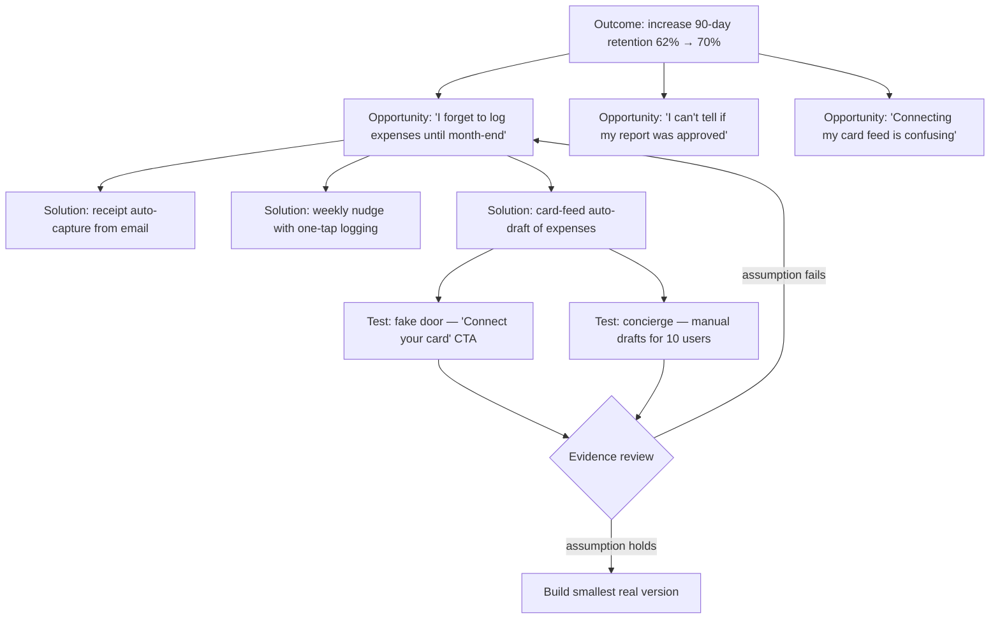

# Product Discovery

Product discovery is the work of deciding *what* to build, done with the same rigor most teams reserve for deciding *how* to build it. It replaces "the roadmap says so" with a continuous loop: talk to customers weekly, map their unmet needs, generate multiple solutions per need, surface the assumptions each solution depends on, and test the riskiest assumptions with the cheapest experiment that could kill them.

The stakes are not theoretical. Ronny Kohavi's experimentation research at Microsoft found that only about one third of well-designed ideas actually improved the metrics they were built to improve; Pendo's 2019 feature-adoption analysis found that roughly 80% of features in the average software product are rarely or never used. Delivery excellence cannot save you from building the wrong thing — discovery is the only defense. The modern practice is defined largely by Teresa Torres (*Continuous Discovery Habits*: weekly customer touchpoints, the product trio, opportunity-solution trees) and Marty Cagan (*Inspired*: the four risks — value, usability, feasibility, business viability), with assumption mapping from David J. Bland and Alex Osterwalder (*Testing Business Ideas*) and interview technique from Rob Fitzpatrick (*The Mom Test*).

**When NOT to use this:**

- **Compliance, security, and contractual work.** If regulation or a signed contract requires it, the decision is made. Discovery can shape the *how* (usability of the flow), but running desirability tests on GDPR export is theater.
- **Cheap, reversible changes.** If building and instrumenting the real thing costs less than a week, ship it behind a flag and measure. The test *is* the feature. Discovery earns its cost only when building is expensive or the decision is hard to reverse.
- **When the decision is already made.** If leadership has committed and no evidence would change the outcome, do not run "validation discovery" to bless it. Fake discovery destroys the team's trust in real discovery. Say "this is a bet, not a validated decision" and instrument it honestly instead.
- **Pure bug fixes and performance debt.** There is no demand question to answer. Go fix it.

## Decision Framework

Three choices shape every discovery effort. Make them explicitly before interviewing anyone.

### Choice 1: Discovery cadence — project or habit

| | Project-based (discovery sprint) | Continuous (weekly habits) |
|---|---|---|
| Shape | 2–6 week research phase before a build phase | 1–3 customer touchpoints every week, forever |
| Best for | New product / new market, one-off big bets, teams with zero discovery muscle | Established product teams making weekly prioritization decisions |
| Strength | Focused, fundable, easy to staff | Evidence is always fresh; small decisions get evidence too |
| Honest downside | Evidence goes stale the day the sprint ends; invites "discovery phase is done, stop talking to users" | Requires automated recruiting and real calendar protection or it silently dies |
| Failure mode | Waterfall with a research veneer | Interviews happen but never change a decision |

Default to continuous. Use a sprint only to bootstrap the habit or to open a genuinely new problem space — and end every sprint by scheduling the next week's interviews.

### Choice 2: Evidence type — what people say vs. what they do

| | Attitudinal (interviews, surveys) | Behavioral (tests, analytics, prototypes) |
|---|---|---|
| Answers | *Why* — context, motivation, unmet needs | *Whether* — will they actually do it |
| Best for | Mapping the opportunity space; understanding failed tests | Testing demand, usability, willingness to pay |
| Honest downside | People misreport future behavior; stated intent inflates 3–10× vs. observed action | Tells you what happened, never why; easy to misread without qualitative follow-up |
| Trap | Treating "I would totally use that" as evidence | Shipping a fake door and guessing at why nobody clicked |

You need both, in sequence: interviews to find opportunities and generate hypotheses, behavioral tests to confirm them, interviews again to explain surprising results. Neither substitutes for the other.

### Choice 3: Entry point — opportunity-first or solution-first

| | Opportunity-first (build the tree) | Solution-first (assumption-test the idea) |
|---|---|---|
| Start from | A desired outcome; map customer needs before ideating | An existing idea (exec request, sales ask, your own conviction) |
| Best for | Owning an outcome with freedom to choose the path | Ideas that arrive pre-formed — most of real life |
| Strength | Compares multiple solutions against a need; avoids first-idea lock-in | Fast; meets the organization where it is |
| Honest downside | Slower to first test; can become mapping theater | Never questions whether the underlying need exists — so add "the target customer has this problem" as assumption #1 |

Solution-first is legitimate. The discipline is refusing to let the solution skip the assumption map.

## The Discovery Loop



This is Teresa Torres's opportunity-solution tree: one outcome at the root, opportunities (needs, pain points, desires heard in interviews) beneath it, at least three candidate solutions per targeted opportunity, and assumption tests beneath the solutions. Failed tests are not failures — they route you back up the tree before you have spent a build cycle.

## Process

1. **Anchor on one outcome.** A measurable change in customer behavior that drives a business result — "increase 90-day retention from 62% to 70%," not "ship the mobile app." If you cannot name the outcome, you are not ready to discover; you are browsing.
2. **Set up the trio and the interview engine.** Discovery is done by the product trio — PM, designer, engineer — together, not by a research team that hands over reports. Automate recruiting so interviews happen without weekly heroics: in-app intercepts ("Got 20 minutes this week? $50 gift card"), a standing calendar block, CRM-triggered invites after key events (churned, upgraded, hit an error 3×).
3. **Interview weekly for stories, not opinions.** Ask about specific past instances, never hypotheticals: "Tell me about the last time you filed expenses" beats "Would you use auto-capture?" (Fitzpatrick's Mom Test: talk about their life, not your idea; past behavior, not future promises). After each interview, write a one-page snapshot: memorable quote, pains observed, opportunities heard.
4. **Build the opportunity-solution tree.** Cluster interview pains under the outcome. Keep opportunities phrased as customer needs in customer language ("I forget until month-end"), never as features in disguise ("needs reminders").
5. **Prioritize one target opportunity.** Score candidates on opportunity sizing (how many customers, how often, how painful), market factors, and company factors. Pick one. Depth beats breadth.
6. **Generate at least three solutions for it.** One idea is a trap — you will fall in love with it. Three forces comparison and exposes which assumptions are shared versus solution-specific.
7. **Map assumptions for the leading solutions.** For each solution list what must be true across five categories (Torres, extending Cagan's four risks): desirability (they want it), viability (it works for the business), feasibility (we can build it), usability (they can use it), ethical (no harm if it works exactly as designed). Phrase each as a falsifiable statement.
8. **Prioritize on the assumption map.** Plot each assumption on a 2×2 (Bland & Osterwalder): importance to the solution vs. strength of existing evidence. The riskiest assumptions — important and unevidenced — get tested first. This is the riskiest-assumption-test discipline (a framing popularized by Rik Higham as a corrective to "MVP" meaning "launch a small product"): test the load-bearing belief, not the whole idea.
9. **Design the smallest test that could kill it.** Match test fidelity to the assumption:

   | Assumption type | Cheapest honest test |
   |---|---|
   | They have this problem | Story-based interviews; support-ticket and search-log mining |
   | They want this solution | Fake door / painted door; landing page with a real CTA |
   | They will pay / commit | Pre-order with deposit; signed LOI; pricing page with checkout start |
   | They can use it | Prototype test with 5 users per round (Nielsen: small rounds surface most usability problems; iterate between rounds) |
   | It works operationally | Concierge (do it manually) or Wizard of Oz (fake the automation) |
   | It moves the metric | A/B test on the built slice |

   Write a test card *before* running: hypothesis, test, metric, pass threshold. Setting the threshold after seeing data is how teams lie to themselves.
10. **Synthesize evidence and decide.** Weigh evidence by strength: behavior with money > behavior > stated intent > opinion. Record the decision — build, iterate, or kill — with the evidence and rationale in a one-page decision record. Then return to step 3; the loop does not end.

## Core Techniques

### Interview technique: the question rewrite table

The difference between useful and useless interviews is almost entirely question construction. Every hypothetical invites politeness; every story reveals behavior.

| You want to know | Do not ask | Ask instead | Why the rewrite works |
|---|---|---|---|
| Whether the problem exists | "Is expense tracking painful for you?" | "Walk me through your last month-end close, start to finish." | A leading yes/no question invites polite agreement; a story shows pain — or its absence — unprompted |
| How much it matters | "Would this save you time?" | "What have you tried to fix this? What did that cost you?" | Investment in workarounds is the honest measure of pain; zero workarounds usually means zero demand |
| Willingness to pay | "Would you pay $50/month for this?" | "What do you spend on this today — tools, hours, late fees, all-in?" | Current spend is observable fact; hypothetical price acceptance is theater |
| Whether they would switch | "Would you switch from your current tool?" | "When did you last actually switch a tool like this? What forced it?" | Switching stories reveal the real activation energy, which is always higher than people claim |
| Reaction to a design | "Do you like this screen?" | (Give a task) "Show me how you'd file yesterday's taxi ride." | Watching beats asking; "like" is unfalsifiable and compliments are free |

Close every promising interview by asking for a commitment in one of Fitzpatrick's three currencies — time (a follow-up session), reputation (an intro to their boss or peers), or money (a pilot, a deposit). Advancement is evidence; enthusiasm is not.

### Prototype testing without leading the witness

- **Match fidelity to the question.** Sketches and lo-fi flows test the concept and sequence; clickable prototypes test navigation and comprehension; realistic data (real-looking amounts, names, dates) is required the moment you are testing *trust* — nobody can judge "would you confirm this auto-draft?" against lorem ipsum.
- **Tasks, not tours.** Never demo. Give a goal — "you spent $34 on a taxi yesterday; get it submitted" — then be silent. Every hint you give is a defect you will not find.
- **Think-aloud, then probe afterward.** Ask users to narrate; save "what did you expect to happen there?" for after the task, so you observe behavior before you contaminate it.
- **Five users per round, multiple rounds.** Nielsen's finding: small rounds surface most usability problems, with steeply diminishing returns after five. Fix the top problems, then run the next round — three rounds of five beats one round of fifteen.
- **Score behavior, not applause.** Record task completion, wrong turns, time, and verbatim confusion. Ignore "this looks great" — prototype praise is the cheapest currency in software.

### Evidence synthesis: weighing what you learned

| Rank | Evidence class | Examples | How to treat it |
|---|---|---|---|
| 1 | Committed behavior | Paid deposit, signed LOI, card connected, data migrated | Decision-grade; small n acceptable |
| 2 | Observed behavior in real context | Funnel analytics, concierge usage, support-ticket volume | Strong; explains *what*, never *why* |
| 3 | Observed behavior in test context | Prototype task completion, fake-door clicks | Directional; inflated vs. real life |
| 4 | Stated past behavior | Interview stories, described workarounds | Good for opportunity mapping; memory distorts details |
| 5 | Stated intent and opinion | "I would definitely use this," survey intent, NPS verbatims | Hypothesis fuel only; never decision-grade |

Three synthesis disciplines keep teams honest:

- **Conflicts resolve upward, then get investigated.** When rank-5 enthusiasm contradicts rank-1 behavior (TrailKit: 9.7% checkout starts, 0.4% deposits), behavior wins the decision — but the gap itself is the next research question.
- **Report counts, not fake percentages.** Nine interviews find patterns, not proportions. Write "7 of 9," never "78% of users." Qualitative work earns conviction about *existence and shape* of a problem; only quantitative work earns conviction about *prevalence*.
- **Triangulate before big bets.** One method's finding is a hypothesis until a second method corroborates it. Meridian's build decision rested on interviews (rank 4) + fake door (rank 3) + concierge (rank 2) agreeing — no single instrument would have justified two quarters of engineering.

## Worked Example 1: Meridian — continuous discovery in an existing product

**Context.** Meridian is a B2B expense-management SaaS, 4,200 customers, $11M ARR. 90-day logo retention is 62%; the company needs 70% to hit its growth model. The exec instinct is "build a mobile app." The trio (PM Dana, designer Yusuf, engineer Priya) runs discovery instead.

**Interviews (weeks 1–3).** Nine interviews with recently churned and at-risk admins, recruited via a CRM trigger on downgrade events. Story prompt: "Walk me through the last expense cycle at your company, start to finish." Snapshot themes with counts:

- 7 of 9: employees forget to log expenses until month-end close, creating a painful crunch ("I spend the 30th chasing receipts like a debt collector").
- 4 of 9: no visibility into approval status.
- 3 of 9: card-feed setup confusing during onboarding.

**Tree and target.** The tree above is Meridian's actual tree. They target the forgetting/crunch opportunity — highest frequency (monthly, every customer), highest emotional charge, and directly tied to the churn interviews ("we left because month-end was chaos"). The mobile app never appears as an opportunity: no interviewee's story blocked on device type. **Rationale: opportunities come from customer stories, not from stakeholder solutions — the app was a solution searching for a need.**

**Three solutions.** (a) Receipt auto-capture from a forwarding email address, (b) weekly nudge with one-tap logging, (c) card-feed auto-draft: transactions appear as pre-filled draft expenses the employee confirms. They lean toward (c) — it removes the memory burden entirely rather than sharing it — but it is also the most expensive (~2 quarters) and most assumption-laden.

**Assumption map for auto-draft (excerpt).**

| # | Assumption | Category | Importance | Evidence | Priority |
|---|---|---|---|---|---|
| A1 | Employees will connect their corporate card to Meridian | Desirability | High | None | **Test first** |
| A2 | Auto-drafts will be accurate enough that confirming beats typing | Usability | High | None | **Test second** |
| A3 | Card networks' APIs give us transaction data within 24h | Feasibility | High | Vendor docs say yes | Spike, don't test |
| A4 | Fewer manual entries won't reduce per-seat pricing power | Viability | Medium | Pricing is per-seat, not per-entry | Accept |

**Tests (weeks 4–7).**

- *A1 — fake door.* A "Connect your card — coming soon" card in the expense screen, shown to 2,000 active users. Test card threshold set in advance: ≥25% click within two weeks, because a feature meant to fix the #1 churn driver needs broad appeal, not a niche. **Result: 41% clicked**, 68% of clickers left their email for early access. A1 holds — and commitment (email) was measured, not just clicks, because clicks alone overstate intent.
- *A2 — concierge.* For 10 volunteer companies, Priya exports card feeds nightly and Dana hand-creates draft expenses, testing whether "confirm a draft" actually beats "type an entry" before writing any matching code. **Result:** median time-to-log fell from 3m 40s to 25s; but 31% of drafts had a wrong category, and users who hit two bad categories in a row stopped trusting all drafts and reverted to manual entry. **Rationale for concierge over building: the risky question was the experience threshold ("how accurate is accurate enough?"), and manual operation answered it in two weeks for roughly the cost of one engineer-week — versus two quarters to learn the same lesson in production.**

**Decision (decision record, week 8).** Build auto-draft, scoped to draft creation with *no* auto-categorization in v1 (user picks category from three suggestions instead) because the concierge showed trust collapses on wrong guesses but survives on suggestions. Ship to the 10 concierge accounts first. Kill the mobile app from the roadmap this cycle: zero supporting evidence across nine interviews and two tests. Six months later: pilot cohort's month-end submission crunch (entries filed in the last 3 days) fell from 71% to 34%, and 90-day retention in the cohort reached 69%.

## Worked Example 2: TrailKit — riskiest assumption test for a new product

**Context.** Two founders want to build TrailKit, a rental marketplace for high-end backcountry ski gear ($1,400 setups renting at ~$85/day). Solution-first entry point — the idea arrived pre-formed — so per the framework, assumption #1 is the need itself.

**Assumption map (top of the stack).**

| # | Assumption | Category | Importance | Evidence | Priority |
|---|---|---|---|---|---|
| B1 | Intermediate skiers will rent premium gear instead of buying mid-range | Desirability | Critical | Anecdotes only | **Test first** |
| B2 | They will book and pay days ahead, not walk into a shop day-of | Desirability | Critical | None | **Test first** (same test) |
| B3 | Gear owners will list $1,400 equipment with strangers | Viability | Critical | None | Test second — pointless if B1 fails |
| B4 | Insurance for P2P gear damage is obtainable at viable cost | Viability | High | None | Parallel desk research |

**Rationale for sequencing: B1/B2 gate everything — a two-sided marketplace with no demand side is dead regardless of supply — and they are testable with one instrument in two weeks, while B3 requires demand evidence to even recruit owners honestly.**

**Test 1 — landing page with a real deposit.** A landing page offering three concrete setups with dates and prices, real checkout, and a genuine **$20 reserved-booking deposit** (refundable, clearly disclosed as early access after payment). Thresholds pre-registered on the test card: ≥5% of targeted visitors start checkout, ≥2% pay the deposit. **Rationale: a deposit, not a waitlist, because stated intent inflates several-fold — $20 of someone's money is the cheapest honest demand signal; and paid search on high-intent terms ("demo ski rental," "DPS rental") for 1,200 visitors at $210, because organic traffic would have measured the founders' Twitter following, not the market.**

**Result:** 9.7% started checkout — but only 0.4% (5 people) paid. Interest without commitment: the pre-registered read is *fail*.

**Instead of killing, they asked why.** Numbers say what happened, never why — so they emailed the 111 checkout abandoners offering a $25 card for a 15-minute call; 9 accepted. Finding: 7 of 9 abandoned over *fit risk*, not price or the rental concept — "if the boot doesn't fit at the trailhead, my ski day is dead." The riskiest assumption was mis-specified: it was never "will they rent?" but "will they trust fit, sight unseen?"

**Test 2 — reframed offer, same instrument.** Same page plus a fit guarantee: ship 5 days early, free exchange, full refund at handoff if fit fails. New cohort of 1,100 comparable paid visitors. Same thresholds. **Result: 2.6% paid deposits (29 people).** Passes. B1/B2 hold *conditional on the fit guarantee* — which rewrites the business model: early shipping and exchange logistics move into cost of goods, cutting modeled contribution margin per rental from $31 to $19. That flows straight into B4/viability rather than being quietly ignored.

**Decision.** Proceed to a concierge pilot — 15 manual rentals, founders' own gear, hand-managed shipping — to test the operational assumptions (damage rates, turnaround time) before writing marketplace code. **Rationale: the demand evidence is real but thin (n=34 deposits), and the next riskiest assumptions are now operational, which no landing page can test — while a concierge pilot tests them for the cost of a spreadsheet and some duct tape.**

## Templates

### Interview guide (filled in — Meridian churn interviews)

```markdown
# Interview Guide: Expense-cycle stories — churned/at-risk admins
Goal: understand the last expense cycle end-to-end. NOT to pitch auto-draft.
Recruit: admins from accounts that downgraded/churned in past 90 days. 30 min, $50 card.

Opening (2 min)
- "I'm not here to sell anything and there are no wrong answers. I want to
  learn how expenses actually work at your company — the messy version."

Story spine (20 min) — one real instance, past tense, follow the thread
- "Walk me through your most recent month-end expense close, start to finish."
- "What happened right before that?" / "Then what did you do?"
- "You said 'chasing receipts' — what did that actually look like, hour by hour?"
- "What did you try to fix that? What happened?"  (past workarounds = real demand)
- "Who else was involved? What did they do?"

Probes (5 min)
- "When was the last time this cost you real time or money? How much?"
- "If nothing changes, what happens?"

Close (3 min)
- "Who else deals with this that I should talk to?"  (referral = mild commitment signal)

Banned questions — rewrite on sight
- "Would you use X?" → "Tell me about the last time you needed X-shaped help."
- "How much would you pay?" → "What do you spend on this today, all-in?"
- "Do you like our product?" → compliments are not data (Fitzpatrick).
```

### Test card (filled in — TrailKit Test 1)

```markdown
# Test Card: TK-01 — Demand deposit test
Assumption (falsifiable): Intermediate skiers will pay in advance to rent
  premium setups at ~$85/day rather than buying or renting shop gear.
Test: Landing page, 3 real setups w/ dates + prices, live checkout,
  $20 refundable reserved-booking deposit. 1,200 paid-search visitors.
Metric: (a) checkout-start rate  (b) paid-deposit rate
Pass thresholds (set BEFORE launch): (a) ≥ 5%   (b) ≥ 2%
Duration / budget: 14 days, $250 total
Owner: Sam    Decision this informs: pursue TrailKit vs. return to day jobs
Result: (a) 9.7%  (b) 0.4% → FAIL → follow-up interviews before kill/pivot call
```

### Learning card (filled in — Meridian concierge test)

```markdown
# Learning Card: Concierge — auto-draft trust threshold (weeks 5–6)
We believed: confirming a pre-filled draft beats typing an entry from scratch.
We observed: median time-to-log 3m40s → 25s (10 accounts, 214 drafts), BUT
  31% of drafts miscategorized; after 2 consecutive wrong categories, 6 of 10
  pilot users reverted to fully manual entry for the rest of that week.
We learned: the speed win is real; trust is the binding constraint — it breaks
  on confident wrong guesses but survives when the system merely suggests.
Therefore we will: ship v1 with 3 suggested categories and no auto-assign;
  revisit auto-assign only when suggestion-acceptance exceeds 85%.
```

The believed/observed/learned/therefore structure is Bland & Osterwalder's learning card — the test card's mandatory counterpart. A test without a learning card written afterward is an expense, not an experiment.

### Decision record (one page, per discovery decision)

```markdown
# Decision: Build card-feed auto-draft (v1: suggested categories, no auto-assign)
Date: 2025-11-14   Trio: Dana / Yusuf / Priya   Outcome served: 90-day retention 62% → 70%
Options considered: auto-draft / weekly nudge / receipt email capture / mobile app
Evidence (strongest first):
  - Concierge, 10 accounts: time-to-log 3m40s → 25s; trust collapsed after 2 miscategorizations
  - Fake door, n=2,000: 41% CTR, 68% of clickers gave email
  - Interviews, n=9: 7/9 month-end crunch; 0/9 blocked on mobile
Decision + rationale: Auto-draft attacks the forgetting root cause; concierge
  showed suggestions preserve trust where auto-assign destroys it.
Explicitly rejected: mobile app — no supporting evidence in any interview or test.
Revisit when: pilot-cohort crunch metric fails to drop below 50% within 60 days.
```

## Anti-Patterns

| Symptom | Why it fails | Do instead |
|---|---|---|
| "Would you use this?" interviews | People are polite and terrible at predicting their own behavior; yes is free | Ask for stories of specific past instances; count workarounds and money spent |
| Pitching disguised as research | You get compliments, which are worthless as evidence | Never show the solution in a problem interview; separate demo calls from discovery calls |
| Validation theater | Tests designed to pass ("would you like saving time?") bless a pre-made decision | Pre-register a pass threshold that could realistically fail; write it on the test card first |
| One solution per opportunity | First-idea lock-in; every assumption test becomes an ego test | Generate three-plus solutions before mapping assumptions |
| MVP as first test | Months of build to learn what a fake door teaches in a week | Test the riskiest assumption with the cheapest instrument; build last |
| Waitlist signups as demand proof | Free "yes"; waitlists routinely convert in low single digits | Ask for money, time, or reputation — deposits, LOIs, calendar time |
| Interviewing only happy users | Fans confirm; churned and near-miss users explain | Recruit churned users, abandoners, and evaluators who chose a competitor |
| Research team hands trio a report | Second-hand insight doesn't change minds; nuance dies in the summary | The trio attends interviews itself; snapshots within 24 hours |
| Averaging quotes into consensus | "Users want simplicity" — segments with opposite needs cancel out | Cluster by segment and job; keep counts and verbatims attached to claims |
| Discovery as a gate phase | Evidence stales; team stops learning the day the phase ends | Weekly touchpoints as a standing habit with automated recruiting |
| Ignoring evidence that complicates the model | TrailKit's fit guarantee cut margin 40% — pretending otherwise ships a broken business | Route every test result into the viability assumptions, not just the feature spec |

## Checklist

```markdown
## Product Discovery Checklist
Setup
- [ ] One measurable outcome anchors the work (metric, baseline, target)
- [ ] Product trio (PM + design + eng) owns discovery together
- [ ] Recruiting automated (in-app intercept / CRM trigger); weekly slot protected
Opportunity space
- [ ] ≥5 story-based interviews with target segment (incl. churned/lost users)
- [ ] Snapshot per interview within 24h (quote, pains, opportunities)
- [ ] Opportunity-solution tree current; opportunities in customer language
- [ ] One target opportunity chosen, with sizing rationale written down
Solutions & assumptions
- [ ] ≥3 candidate solutions for the target opportunity
- [ ] Assumptions mapped: desirability / viability / feasibility / usability / ethical
- [ ] Assumptions plotted importance × evidence; riskiest identified
Testing
- [ ] Test card per test: falsifiable hypothesis, metric, PRE-SET pass threshold
- [ ] Cheapest honest instrument chosen (fake door / concierge / prototype / deposit)
- [ ] Commitment measured (money, time, data) — not clicks or kind words
- [ ] Surprising quantitative results followed up with interviews (the "why")
Decision
- [ ] Evidence weighed by strength: paid behavior > behavior > intent > opinion
- [ ] Decision record written: options, evidence, rationale, rejected paths, revisit trigger
- [ ] Business-model impacts of findings fed back into viability assumptions
- [ ] Next week's interviews already scheduled (the loop continues)
```

## 10 Rules

1. **Stories beat opinions, always.** A user's account of last Tuesday outranks their prediction about next month, their feature request, and their rating of your mockup — in that order.
2. **If a test cannot fail, it is not a test.** Pre-register the threshold. A "test" whose every outcome supports building is a press release with extra steps.
3. **Charge something.** Money is the only compliment that isn't free. A $20 deposit from 29 strangers outweighs a 4,000-person waitlist.
4. **Test assumptions, not ideas.** Ideas are packages of assumptions; whole-idea tests fail without telling you why. TrailKit's landing page "failed" — the assumption underneath (fit trust) was the real finding.
5. **The trio does its own interviews.** Outsourced discovery produces reports; first-hand discovery produces changed minds. Only the second changes roadmaps.
6. **Three solutions minimum, or you're not comparing — you're rationalizing.** The first idea's job is to be beaten.
7. **Concierge before code.** If a human can fake the feature for ten customers, that is two weeks of truth versus two quarters of hope. Scale problems are a privilege you earn later.
8. **Follow every surprising number with a conversation.** Quantitative tells you *what*, qualitative tells you *why*; acting on *what* alone is how the fit-guarantee insights of the world get missed.
9. **Feed findings into the business model, not just the backlog.** A passing test that cuts margin 40% is a viability event. Discovery that only ever updates the feature spec is half a practice.
10. **Discovery never finishes.** The day you stop interviewing is the day your evidence starts rotting at roughly the speed your market moves. Schedule next week's interview before you close this file.

## References

- Teresa Torres, *Continuous Discovery Habits* (2021) — weekly touchpoints, product trio, opportunity-solution trees, interview snapshots
- Marty Cagan, *Inspired* (2nd ed., 2018) — the four big risks: value, usability, feasibility, business viability
- Rob Fitzpatrick, *The Mom Test* (2013) — interview technique; past behavior over hypotheticals; commitment and advancement
- David J. Bland & Alex Osterwalder, *Testing Business Ideas* (2019) — assumption mapping, test cards, 44 experiment types
- Eric Ries, *The Lean Startup* (2011) — build-measure-learn, concierge and Wizard of Oz patterns
- Ron Kohavi, Diane Tang & Ya Xu, *Trustworthy Online Controlled Experiments* (2020) — experiment design and the base rate of winning ideas
- Erika Hall, *Just Enough Research* (2nd ed., 2019) — right-sizing research rigor
