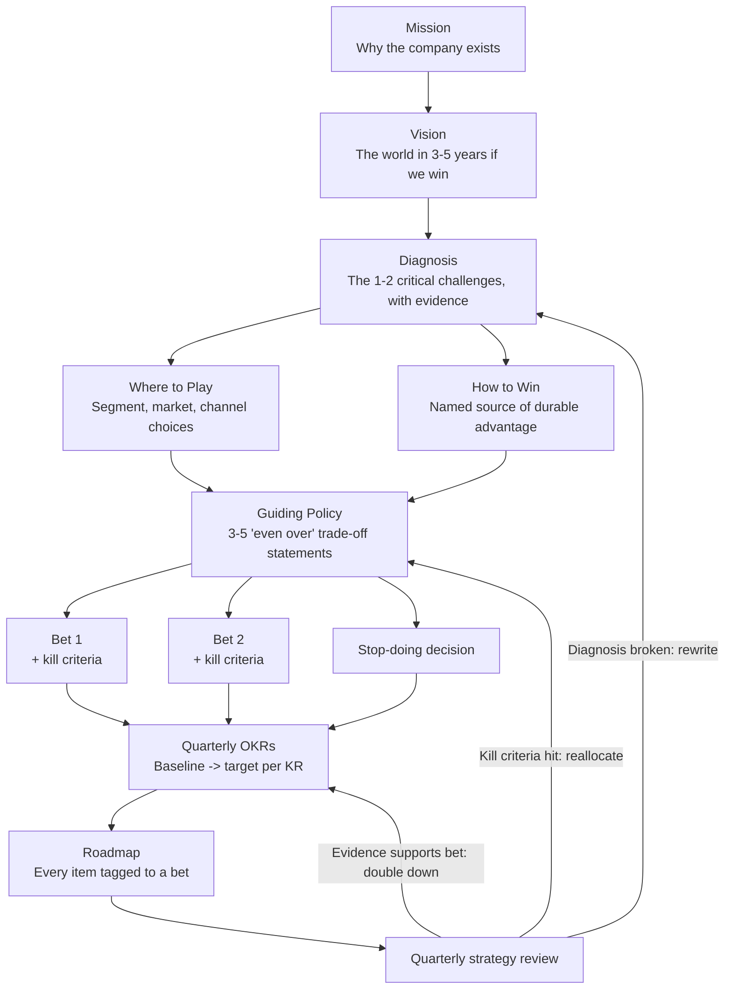

# Product Strategy

A product strategy is an integrated set of choices about where you will compete and how you will win there — choices that reinforce each other and that explicitly exclude alternatives. It is not a vision statement, not a list of goals, and not a roadmap. Richard Rumelt (*Good Strategy Bad Strategy*, 2011) calls the most common failure "mistaking goals for strategy": "grow ARR 3×" is an ambition, not a strategy. A strategy tells you *why you will win* and therefore *what to stop doing*. Michael Porter put the test bluntly in "What Is Strategy?" (HBR, 1996): "The essence of strategy is choosing what not to do." If your strategy document would look sensible with the choices reversed — "we will target the enterprise" vs "we will target SMB" — and nothing else in the document would have to change, you have written a goals memo, not a strategy.

Good product strategy matters because every downstream artifact inherits its quality. Prioritisation frameworks (RICE, WSJF) can only rank options against a value definition — strategy is what defines value. Without it, the roadmap becomes a stack-ranked queue of stakeholder requests, sales-driven one-offs win every trade-off, and the team ships fast in no particular direction.

## When NOT to Use This

Premium strategy work has prerequisites. Skip or defer a formal strategy when:

- **You are pre-product-market-fit with fewer than ~20 paying customers.** You do not yet have the evidence a diagnosis requires. A written strategy will ossify guesses. Run discovery, write a one-page positioning hypothesis, and revisit when retention data exists.
- **Leadership is using "strategy work" to avoid a decision.** If the real blocker is that two executives disagree about the target segment, a 30-page deck launders the conflict instead of resolving it. Force the decision; then document it.
- **The company strategy is genuinely absent.** Product strategy cascades from company strategy. If there is none, your first deliverable is a forcing function for the executive team — not a product-level document that invents company direction by stealth.
- **You are a single-product, single-segment team under ~15 people with a founder who is the strategy.** Write the one-pager to make the implicit explicit; do not run the full quarterly apparatus below.

## Strategy vs Vision vs Roadmap

These three are conflated constantly. They answer different questions, change at different speeds, and fail in different ways.

| Artifact | Question it answers | Horizon | Changes when | Failure mode when confused |
|---|---|---|---|---|
| Vision | What does the world look like if we succeed? | 3–10 years | Rarely; near-pivot events only | "Vision" used as strategy → inspiring, undecidable |
| Strategy | Where do we play, and why will we win there? | 1–3 years | When evidence breaks the diagnosis | Strategy used as roadmap → dated feature promises |
| OKRs | Is the strategy working this quarter? | Quarterly | Every quarter | OKRs invented bottom-up → measurement without direction |
| Roadmap | What are we building, in what order? | Rolling 1–4 quarters | Every planning cycle | Roadmap used as strategy → a queue with a narrative |

A roadmap without a strategy is a queue. A strategy without a roadmap is an essay. The cascade section below shows how to keep them connected.

## The Decision Framework: Three Choices That Are the Strategy

The structure comes from *Playing to Win* (A.G. Lafley & Roger L. Martin, 2013), whose strategy cascade is five linked choices: winning aspiration → where to play → how to win → capabilities required → management systems. The middle two — where to play and how to win — are the heart. A third choice, portfolio shape, governs how much you spend defending the core versus finding the next one.

### Choice 1 — Where to Play

| Posture | Choose when | Honest trade-off |
|---|---|---|
| Beachhead: dominate one narrow segment | Pre-~$10M ARR; contested market; evidence of one segment with outlier retention or win rate | TAM story looks small; sales must decline real revenue outside the beachhead |
| Broad horizontal | Product is genuinely general-purpose AND you hold a distribution advantage (PLG motion, platform, brand) | Shallow differentiation everywhere; collision with the biggest incumbents |
| Adjacent expansion | Core segment > 50–60% penetrated, or NRR flattening with high logo retention | Splits focus; usually needs a new GTM motion, not just new features |
| Move upmarket / downmarket | Unit economics broken in the current tier (CAC payback, support load) | Effectively a re-founding: repricing, repackaging, new sales motion, 12–24 months |

The most common error is refusing the choice — "our segment is SMBs and mid-market and enterprise" is not a where-to-play. Geoffrey Moore's beachhead logic (*Crossing the Chasm*, 1991) applies beyond early-stage: dominance of a narrow segment creates references, repeatable sales plays, and pricing power that thin coverage of a broad market never does.

### Choice 2 — How to Win

Your how-to-win must name a durable source of advantage, not a feature list. Hamilton Helmer's *7 Powers* (2016) is the sharpest catalogue: scale economies, network economies, counter-positioning, switching costs, branding, cornered resource, process power. For product strategy, four dominate:

| Winning logic | Works when | Honest trade-off |
|---|---|---|
| Counter-positioning | The incumbent's business model (channel, margin structure, cannibalisation risk) blocks it from copying you | The window closes: win before the incumbent's cost of copying falls below its cost of losing |
| Switching costs / workflow depth | Your product becomes the system of record or embeds in daily workflow | Slow initial land; value compounds late; requires patient capital and low early churn |
| Network economies | Value genuinely rises with each participant (cross-side or same-side) | Cold-start problem; winner-take-most dynamics punish the #2 |
| Cost / scale economies | Unit costs fall meaningfully with volume and price is a top-2 buying criterion | A race to the bottom for everyone who is not the scale leader |

If you cannot state which power you are building and why competitors cannot cheaply neutralise it, you have differentiation-of-the-month, not a how-to-win.

### Choice 3 — Portfolio Shape (Bets)

How is investment split between defending the core and finding the next curve? Nagji & Tuff ("Managing Your Innovation Portfolio," HBR, May 2012) found outperforming firms allocate roughly 70% core / 20% adjacent / 10% transformational — a starting anchor, not a law.

| Portfolio posture | Choose when | Honest trade-off |
|---|---|---|
| Core-heavy (85/10/5) | Core NRR strong and market growing; strategy is share capture | Vulnerable to disruption; growth ceiling is the segment's ceiling |
| Balanced (70/20/10) | Core healthy but its S-curve visible; adjacent evidence exists | 10% transformational is real money that will mostly "fail" — leadership must pre-commit to that |
| Bet-the-company (50/20/30) | Core is structurally declining or being commoditised | Existential; only with board alignment and 18+ months of runway |

Every non-core bet gets explicit kill criteria at funding time (see below). A bet without kill criteria is a permanent department in waiting.

## The Strategy Kernel (Rumelt)

Rumelt's kernel is the minimum viable structure for the document itself:

1. **Diagnosis** — the one or two critical challenges, stated with evidence, that explain the situation. Not a SWOT dump: a judgment about what matters most.
2. **Guiding policy** — the overall approach to the challenge: your where-to-play and how-to-win, expressed as trade-offs. A useful device is the "even over" statement: "Depth in segment X *even over* breadth of integrations." Each one names what you will sacrifice.
3. **Coherent actions** — the 3–5 strategic bets, resourced and sequenced, that implement the policy. Coherent means they reinforce each other; a list of every team's top ask is not coherent action.

Rumelt's signs of bad strategy are a usable review lint: fluff (buzzwords restating the obvious), failure to face the challenge (no honest diagnosis), mistaking goals for strategy, and bad strategic objectives (a dozen "priorities"). Run your draft against all four before sharing it.

## Process

1. **Write the diagnosis first.** Pull retention, NRR, win/loss, and segment-level economics. Interview 5–10 recent wins and losses. Name the 1–2 challenges that explain the data. One page maximum.
2. **Segment on behaviour and economics, not firmographics alone.** Cut the customer base by retention, NRR, expansion, and use-case intensity. The strategy-relevant segment is where retention and willingness to pay are outliers.
3. **Choose where to play.** One primary segment/market. Write down the segments you are explicitly not serving and what revenue that forgoes.
4. **Choose how to win.** Name the power (Helmer) you are building and why the specific competitors in that segment cannot cheaply copy it.
5. **Write the positioning.** Use April Dunford's components (*Obviously Awesome*, 2019): competitive alternatives (what buyers use today, often a spreadsheet), unique attributes, value with proof, best-fit customer characteristics, market category.
6. **Draft 3–5 "even over" guiding-policy statements.** Each must be reversible-sounding — if no sane person would choose the reverse, it is fluff, not a trade-off.
7. **Define the strategic bets.** For each: hypothesis, resourcing, review date, and kill criteria (a measurable state by a date). Include at least one explicit stop-doing.
8. **Cascade to OKRs.** Each objective traces to a bet or to the guiding policy; each KR is a measure of the strategy working, with baseline and target. Nothing on the OKR list that the strategy cannot explain.
9. **Connect the roadmap.** Tag every roadmap item with the bet it funds. Items that fund no bet are either keep-the-lights-on (capped, e.g. ≤ 20–30% of capacity) or cut.
10. **Communicate on a drumbeat and review quarterly.** One-pager, not a deck, as the canonical artifact. Quarterly: check each bet against its kill criteria; annually or on diagnosis-breaking evidence: rewrite.

## The Strategy Cascade



## Output Format: The Strategy One-Pager

```markdown
# Product Strategy — [Product/Company] — [Year–Year]
**Owner:** [Head of Product]  **Status:** Draft / Ratified [date]  **Next review:** [quarter]

## Diagnosis (the challenge)
[3–6 sentences. The 1–2 critical challenges, each anchored to evidence:
retention/NRR by segment, win-loss data, market shift. No SWOT dumps.]

## Where We Play
- **Primary segment:** [specific: size band, vertical, geography, channel]
- **Explicitly not serving:** [segments declined, and the revenue forgone]

## How We Win
- **Advantage:** [the named power and its mechanism]
- **Why competitors cannot cheaply copy it:** [1–2 sentences per key competitor]

## Positioning (Dunford)
| Component | Statement |
|---|---|
| Competitive alternative | [what best-fit buyers use today] |
| Unique attributes | [2–3, tied to the advantage] |
| Value + proof | [quantified outcome + evidence] |
| Best-fit customer | [observable characteristics] |
| Market category | [the frame of reference] |

## Guiding Policy — even-over statements
1. [X] even over [Y]
2. [X] even over [Y]
3. [X] even over [Y]

## Strategic Bets
| Bet | Hypothesis | Resourcing | Kill criteria (state + date) | Review |
|---|---|---|---|---|
| 1. [name] | If we [action], then [measurable outcome] | [teams, %] | Kill if [metric] < [threshold] by [date] | [Qx] |
| 2. [name] | ... | ... | ... | ... |
| Stop: [name] | We stop [activity] to fund the above | frees [capacity] | n/a | [Qx] |

## Cascade to OKRs ([quarter])
- **O:** [objective traceable to a bet]
  - KR1: [metric] from [baseline] to [target]
  - KR2: [metric] from [baseline] to [target]

## What would change our mind
[2–3 observations that would invalidate the diagnosis and trigger a rewrite]
```

## Worked Example 1: Ledgerly — Series A, Choosing a Beachhead

**Situation.** Ledgerly is a fictional 42-person Series A company selling invoicing and AP automation to SMBs. ARR $3.4M, growing 6% month-over-month but decelerating; monthly logo churn 3.1%; sales cycle 68 days; win rate 14% in deals where the buyer compares against the dominant SMB accounting ecosystem's add-ons.

**Diagnosis.** Segment analysis (step 2) showed the averages were hiding the strategy. Multi-channel e-commerce merchants — selling on Shopify plus at least one marketplace — were 22% of customers but 41% of revenue, with 0.9% monthly churn (vs 3.1% blended) and 128% NRR (vs 96% blended). Win/loss interviews explained why: these merchants drown in marketplace settlement data (fees, reserves, refunds across channels), and incumbent tooling reconciles it in batch, weeks later, usually via an accountant. The critical challenge: *Ledgerly is spending a generalist's CAC to lose generalist deals, while accidentally winning a segment it does not name, package, or price for.*

**Where to play.** Multi-channel e-commerce merchants, $1M–$20M GMV, US, acquired primarily through the Shopify App Store. **Rationale:** this is the only segment where the data showed outlier retention *and* a structural reason for it — not a segment chosen because it sounded large. Explicitly not serving: services SMBs and single-channel sellers. Sales was directed to disqualify them, walking away from roughly $400K of active pipeline. That number went in the strategy doc deliberately: a where-to-play that costs nothing excludes nothing (Porter's test).

**How to win.** Counter-positioning (Helmer). Ledgerly's real-time settlement ledger ingests channel APIs directly and recognises revenue continuously. The incumbents distribute through an accountant channel whose revenue comes partly from manual reconciliation work; automating it in real time would cannibalise the channel that sells them. **Rationale:** the team chose counter-positioning over "more features" because features are copyable in quarters, while the incumbent's channel conflict is a business-model constraint that buys Ledgerly an estimated 2–3 year window. The one-pager stated the window honestly: "This advantage decays; we must own the segment before it does."

**Guiding policy (even-over statements).**
1. Depth in Shopify and Amazon settlement data *even over* breadth of integrations (declining 40+ integration requests in the backlog).
2. Merchant self-serve *even over* accountant channel partnerships (the reverse was genuinely arguable — accountants drive SMB software adoption — which is what made it a real trade-off).
3. Accuracy and trust in the ledger *even over* new module velocity.

**Bets and kill criteria.**

| Bet | Hypothesis | Kill criteria |
|---|---|---|
| Real-time settlement ledger as hero capability | Merchants connecting 2+ channels in trial convert and retain at outlier rates | Kill if < 40% of new e-commerce trials connect a second channel within 14 days, measured at end of Q2 |
| Shopify App Store as primary acquisition channel | Marketplace-led CAC payback beats outbound | Kill if CAC payback > 18 months after two full quarters |
| Stop: outbound selling to generalist SMBs | Frees 3 AEs and $30K/mo spend to fund the above | n/a — a stop-doing, reviewed for regret at Q3 |

**Cascade to OKRs (two quarters).** O: Become the default finance stack for multi-channel merchants. KR1: e-commerce segment ARR $1.4M → $2.6M. KR2: win rate against the real competitive alternative — spreadsheets plus a bookkeeper, per Dunford's analysis, not the incumbent suite — from 31% → 50%. KR3: segment NRR 128% → 135%. Note KR2: positioning work revealed most best-fit buyers were not choosing between Ledgerly and the incumbent at all; the OKR was rewritten to measure the fight Ledgerly was actually in.

## Worked Example 2: Fieldstone — Growth-Stage, Escaping Commoditisation

**Situation.** Fieldstone is a fictional field-service management (FSM) platform: $28M ARR, 240 people, Series C. Annual growth decelerated 72% → 31% → 19% across three years. Three funded competitors discount 25–30% in mid-market deals; blended NRR slid from 112% to 104%.

**Diagnosis.** Horizontal mid-market FSM had commoditised — feature parity across four vendors, procurement-led deals, price as the tiebreaker. But trades contractors (HVAC, plumbing, electrical) — 34% of the base — showed 119% NRR, used 2.3× more workflows per account, and cited permitting/compliance needs in 71% of their expansion conversations. Critical challenge: *Fieldstone is fighting a price war on a battlefield where it has no structural advantage, while sitting on a defensible position it has not fortified.*

**The where-to-play decision — three options, two rejected.**

| Option | Evidence | Decision and rationale |
|---|---|---|
| Move upmarket to enterprise | 1 win in 9 enterprise pursuits; 9-month cycles; suite-class incumbents attached to CRM platforms own the segment | Rejected — no how-to-win existed; "upmarket" was an aspiration wearing a strategy costume |
| Horizontal platform / app marketplace | Only 11 of 62 integrations exceeded 5% attach; no evidence of cross-side network effects | Rejected — network economies require demand for the network, and the data showed none |
| Verticalise on trades contractors | 119% NRR, 2.3× workflow depth, compliance pain no horizontal rival serves | **Chosen** — the only option where existing evidence, not hope, showed both retention and a copyable-only-slowly moat |

**How to win.** Switching costs (Helmer), deepened by a compounding content asset: jurisdiction-specific permitting and compliance libraries built per city and county. **Rationale:** the team chose switching costs over price or brand because the compliance library gets harder to replicate every quarter it grows — a horizontal competitor would need years of jurisdiction-by-jurisdiction work that its broad roadmap cannot justify. This reframed engineering priorities: the "boring" permitting-data pipeline outranked two flashier AI features in the next two planning cycles, because it fed the moat and they did not.

**Portfolio shape.** Balanced 70/20/10: 70% core FSM (defend mid-market cash flow — the vertical bet is funded by not losing it), 20% trades verticalisation, 10% one transformational bet: **Fieldstone Capital**, embedded lending for contractor equipment purchases.

**A kill criterion firing.** Fieldstone Capital's funding memo specified: kill if < $2M originated volume or loss rate > 4% by end of Q3. Q3 actual: $1.1M originated, 6.2% losses. The bet was killed on schedule and six engineers moved to the compliance-library team. **Rationale for pre-committing:** the exec sponsor was the CEO, exactly the situation where a struggling bet normally survives on seniority. Writing the kill criteria at funding time — Annie Duke's "states and dates" formulation (*Quit*, 2022) — converted a political fight into a calendar event. The kill was announced at all-hands as the strategy *working*, not failing.

**Communicating the strategy.** The canonical artifact was a one-pager, not the 40-slide offsite deck. Every PM spec and quarterly review opened by naming which bet the work funded. A baseline survey found 31% of product staff could state the where-to-play; after two quarters of repetition at all-hands, sprint reviews, and onboarding, 85% could. Fieldstone treated that comprehension number as a leading indicator: a strategy the team cannot recite is a strategy the roadmap will quietly ignore.

## Connecting Strategy to OKRs and Roadmaps

The cascade only works if traceability is enforced in both directions:

- **Downward:** every objective names its bet; every KR has a baseline and target; every roadmap item carries a bet tag. Untagged work is either keep-the-lights-on (explicitly capped — 20–30% of capacity is typical) or it is cut.
- **Upward:** quarterly reviews score the bets, not just the KRs. A green KR on a dying bet (activity without validation) and a red KR that taught you the diagnosis was wrong (a productive miss) must be distinguishable — Grove-lineage OKRs (popularised by John Doerr, *Measure What Matters*, 2018) are a measurement system for the strategy, not a substitute for one.
- **Kill criteria are the hinge.** Format: *state + date* — "kill if [metric] below [threshold] by [date]," written at funding time, reviewed on the calendar, with a named decision-owner. Criteria invented at review time will be negotiated to fit the result.

## Anti-Patterns

| Symptom | Why it fails | Do instead |
|---|---|---|
| "Our strategy is to grow 3× and delight customers" | Goals and fluff, not choices — nothing is excluded, so nothing is decided | Write the diagnosis and the even-over trade-offs first |
| Where-to-play lists every segment | A market description, not a choice; sales optimises locally and the product blurs | One primary segment, plus a written not-serving list with forgone revenue |
| How-to-win is a feature list | Features are copied in quarters; no durable advantage is named | Name the power (Helmer) and why rivals structurally cannot copy it |
| Strategy deck refreshed annually, never consulted | Artifact theater; the real strategy is whatever the roadmap does | One-pager as canonical; bet tags on every roadmap item; quarterly bet reviews |
| Bets without kill criteria | Failing bets survive on sunk cost and sponsor seniority | States-and-dates kill criteria written at funding time |
| Strategy set by extrapolating the roadmap | Direction becomes an artifact of last year's backlog | Cascade top-down: diagnosis → policy → bets → roadmap |
| OKRs written bottom-up, then "aligned" | Teams measure what they were already doing; strategy becomes decoration | Objectives derive from bets; KRs measure strategy progress with baselines |
| Twelve "strategic priorities" | Rumelt's bad strategic objectives — priority spread is priority absence | 3–5 bets maximum; everything else is explicitly deferred |
| Strategy known only to leadership | Teams cannot apply trade-offs they have never heard | One-pager, drumbeat repetition, and measure comprehension |

## Checklist

```markdown
## Product Strategy Review Checklist

### Diagnosis
- [ ] Names 1–2 critical challenges (not a SWOT dump)
- [ ] Every claim anchored to evidence: retention/NRR by segment, win-loss, market data
- [ ] Passes Rumelt's lint: no fluff, faces the real challenge, goals ≠ strategy

### Choices
- [ ] Where-to-play names one primary segment AND what is explicitly not served
- [ ] The not-serving list has a real cost attached (forgone revenue/pipeline)
- [ ] How-to-win names a durable power and why each key rival cannot cheaply copy it
- [ ] Positioning covers Dunford's components incl. the true competitive alternative
- [ ] 3–5 even-over statements; each has a genuinely arguable reverse

### Bets
- [ ] 3–5 bets, each with hypothesis, resourcing, and review date
- [ ] Every bet has kill criteria in state + date form, written at funding time
- [ ] At least one explicit stop-doing decision
- [ ] Portfolio shape (core/adjacent/transformational) is deliberate, not accidental

### Cascade
- [ ] Every OKR objective traces to a bet; every KR has baseline → target
- [ ] Every roadmap item carries a bet tag; untagged capacity is capped
- [ ] Quarterly review scheduled; kill criteria owned by a named decider

### Communication
- [ ] Canonical artifact is a one-pager, ratified and dated
- [ ] "What would change our mind" section exists
- [ ] Comprehension is checked: can teams state where-to-play and how-to-win?
```

## 10 Rules

1. **Diagnosis before direction — always.** A strategy written before the diagnosis is a preference with formatting.
2. **If reversing the choice changes nothing else in the document, it was never a choice.** Real strategy propagates: flip the segment and the positioning, bets, and roadmap must all break.
3. **The not-serving list is the strategy.** Budget for it to hurt — a where-to-play that costs no revenue excluded nothing.
4. **Name the power or admit you don't have one.** "Better UX" is not a moat; "their channel economics punish them for copying us" is.
5. **Write kill criteria when the bet is funded, never at review time.** Criteria written after the results exist will be written to fit the results.
6. **Celebrate a clean kill louder than a mediocre launch.** The first killed bet sets the price of intellectual honesty for every bet after it.
7. **One page, ratified and dated, beats forty slides.** Decks are performed once; one-pagers are consulted. The canonical artifact must fit in working memory.
8. **The roadmap is downstream of strategy or it is the strategy.** Untagged roadmap items are votes against your own document.
9. **Position against what buyers actually use today.** Per Dunford, the competitive alternative is usually a spreadsheet, an intern, or nothing — not your feature-matrix rival.
10. **A strategy the team cannot recite does not exist.** Repeat it past the point of your own boredom, and measure comprehension like any other leading indicator.

## References

- Richard Rumelt, *Good Strategy Bad Strategy* (2011) — the kernel: diagnosis, guiding policy, coherent action; the four signs of bad strategy.
- A.G. Lafley & Roger L. Martin, *Playing to Win* (2013) — the five-choice strategy cascade; where-to-play / how-to-win.
- Michael E. Porter, "What Is Strategy?", *Harvard Business Review* (1996) — strategy as trade-offs and fit; choosing what not to do.
- Hamilton Helmer, *7 Powers* (2016) — the taxonomy of durable competitive advantage.
- April Dunford, *Obviously Awesome* (2019) — positioning components, starting from the true competitive alternative.
- Geoffrey A. Moore, *Crossing the Chasm* (1991) — beachhead segment logic.
- Bansi Nagji & Geoff Tuff, "Managing Your Innovation Portfolio", *Harvard Business Review* (May 2012) — the 70/20/10 portfolio finding.
- John Doerr, *Measure What Matters* (2018) — OKRs as practised from Andy Grove's Intel lineage.
- Annie Duke, *Quit* (2022) — kill criteria as "states and dates"; pre-commitment against sunk cost.
