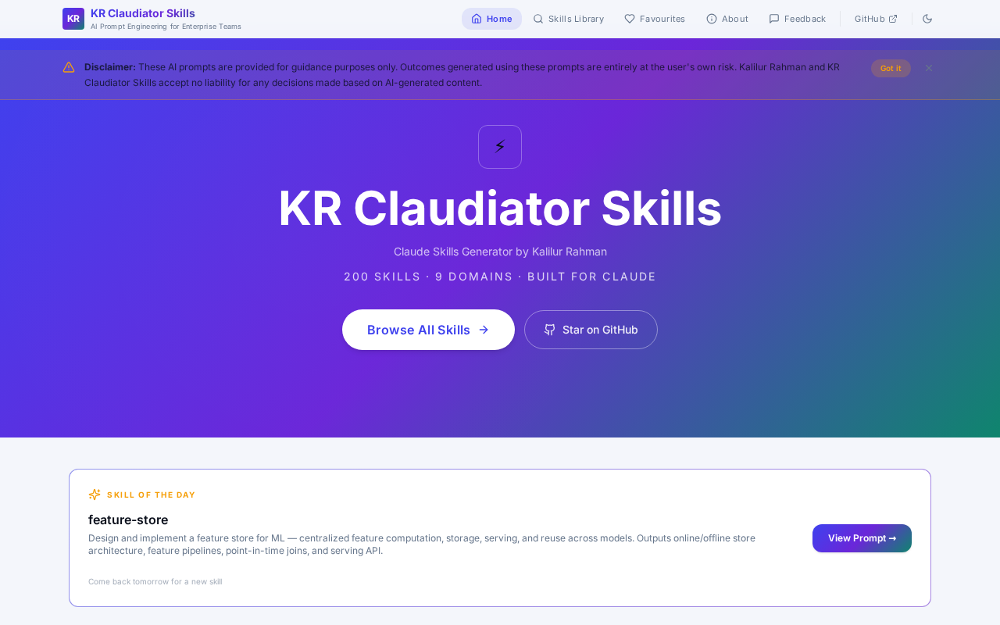
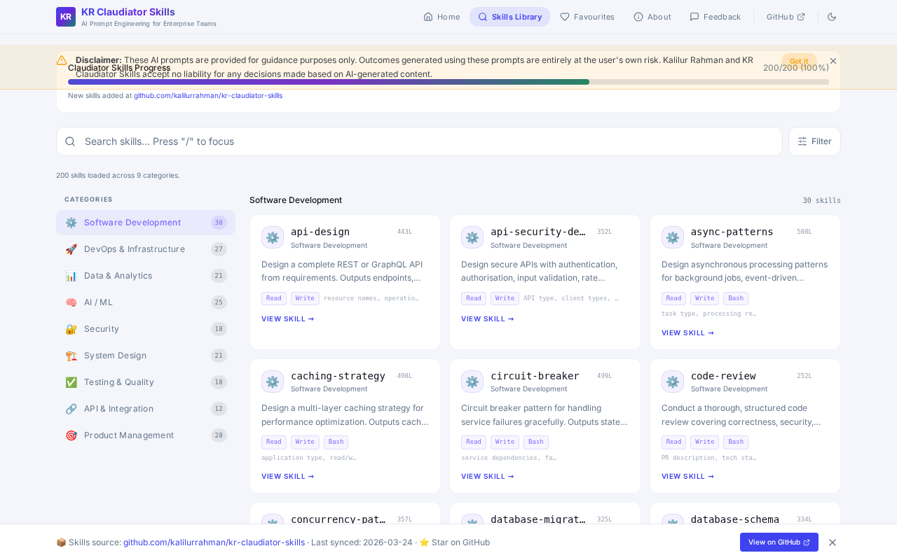
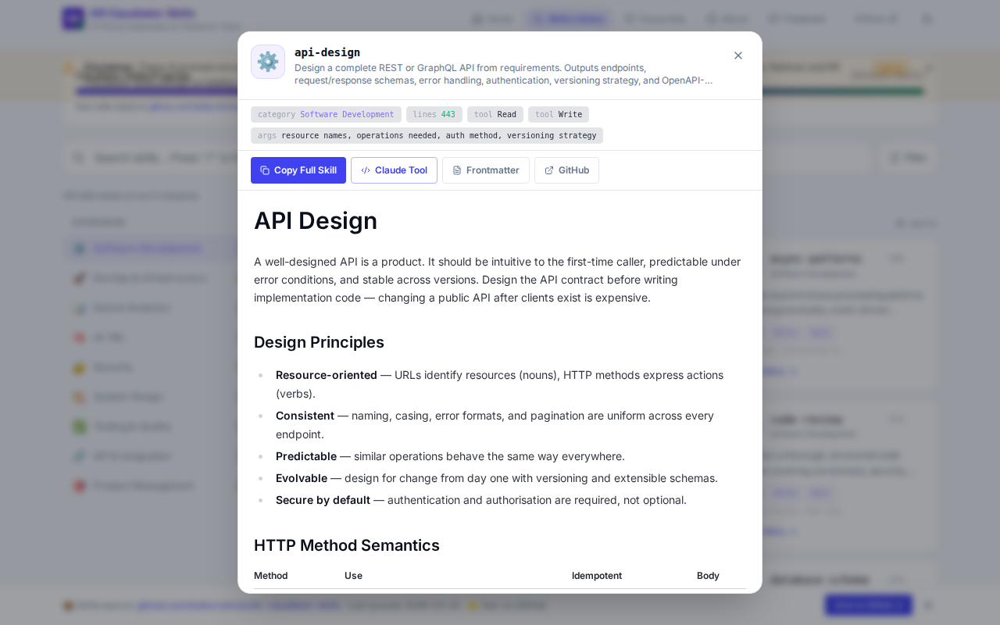
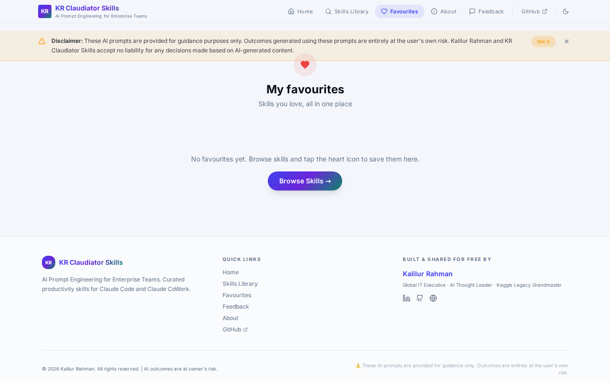
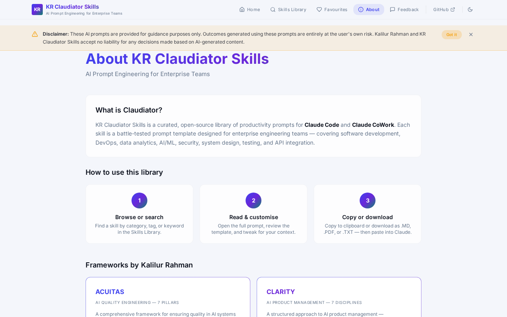
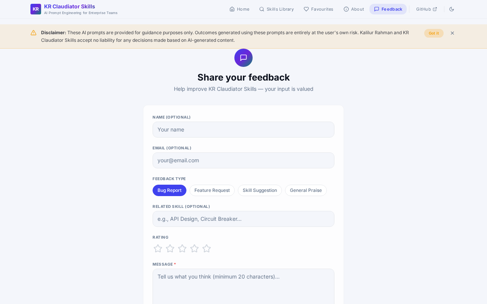

# KR Claudiator Skills

Welcome to **KR Claudiator Skills** — a comprehensive collection of 129 production-grade AI productivity prompts tailored for enterprise engineering teams. These skills are designed for seamless integration with **Claude Code** and **Claude CoWork**.

Experience the live app here: [https://kr-claudiator-skills.lovable.app/](https://kr-claudiator-skills.lovable.app/)

## 📸 Application Screenshots

Here is a quick look at the KR Claudiator Skills application interfaces and features:

### Home Page

*The main landing page featuring an overview, quick search, and easy access to skill categories.*

### Skills Library

*Browse through 129 curated skills organized into 9 major technical categories.*

### Skill Details & Interacting

*Detailed view of a skill, complete with design principles, rules, template outputs, and copy-to-clipboard functionality.*

### Favourites

*Easily save and access your most frequently used prompts via the Favourites page.*

### About

*Learn more about KR Claudiator Skills, its mission, and the frameworks behind the curated prompts.*

### Feedback

*Share your feedback, suggest new skills, or report issues directly through the application.*

---

## 📂 Categories Overview

The 129 `SKILL.md` files are organized into the following disciplines:

| # | Category | Number of Skills | Avg Lines per Skill |
|---|----------|------------------|---------------------|
| **01** | [Software Development](./01-software-dev/) | 19 | ~430 |
| **02** | [DevOps & Infrastructure](./02-devops-infra/) | 16 | ~540 |
| **03** | [Data & Analytics](./03-data-analytics/) | 13 | ~470 |
| **04** | [AI / ML](./04-ai-ml/) | 16 | ~490 |
| **05** | [Security](./05-security/) | 11 | ~420 |
| **06** | [System Design](./06-system-design/) | 14 | ~500 |
| **07** | [Testing & Quality](./07-testing-quality/) | 10 | ~480 |
| **08** | [API & Integration](./08-api-integration/) | 6 | ~550 |
| **09** | [Product Management](./09-product-management/) | 20 | ~230 |
| | **Total** | **129** | |

## 🚀 Usage

You can browse the library visually using the web application, or you can integrate the underlying markdown files directly into your AI workflows.

To use with Claude Code or Claude CoWork locally:
1. Place a desired skill directory (e.g., `01-software-dev/api-design`) under your local `/mnt/skills/` (or equivalent) path.
2. Reference it in your Claude system prompt or tool configuration.

### What is inside a SKILL.md?
Each `SKILL.md` is meticulously structured and includes:
- **Frontmatter**: Name, description, argument hints, and allowed tools.
- **Process**: Step-by-step instructions for the AI.
- **Templates**: Production-ready output structures with working code examples.
- **Worked Examples**: Realistic scenarios to guide the AI's understanding.
- **Anti-patterns**: A table of common mistakes the AI should avoid.
- **Rules**: 10 strict guidelines ensuring high-quality outputs.

## 🛠️ Local Development

This repository contains the source code for the front-end web application (built with React, Vite, Tailwind CSS, and shadcn/ui) that hosts the Skills Library.

### Prerequisites
- Node.js (v18+)
- npm

### Running the App
1. Install dependencies:
   ```bash
   npm install
   ```
2. Start the development server:
   ```bash
   npm run dev
   ```
3. Open `http://localhost:8080` in your browser.

### Building for Production
```bash
npm run build
```

---

*Disclaimer: These AI prompts are provided for guidance purposes only. Outcomes generated using these prompts are entirely at the user's own risk.*
